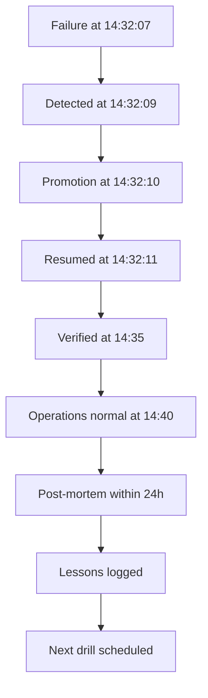

# Banking Recovery Scenario — End-to-End

> The primary database crashes at 14:32 on a Tuesday, mid-day, with active transfers in flight. This chapter walks through the failure, the failover, the recovery, the verification, and the post-mortem. Every concept from the previous chapters appears here in production form.

## 1. What you already know

From [[00-WAL-Logging]]: the WAL records every change; the synchronous standby has the same WAL applied. From [[01-ARIES]]: crash recovery replays the WAL. From [[02-Checkpoints]]: recovery starts from the last checkpoint. From [[03-Backup-And-Recovery]]: the bank runs with RPO = 0 (sync replication) and RTO = 30 seconds (automated failover). From [[08-Trade-offs-Everywhere]]: the bank has paid for these guarantees with doubled commit latency and operational complexity — today is the day that cost is justified.

## 2. Why this layer exists

The previous chapters covered the mechanisms in isolation. This chapter shows them working together under realistic pressure: a mid-day primary failure with active transactions, users in the middle of transfers, monitoring firing, on-call paged, decisions to be made in seconds. The point is to make the abstractions concrete — to show that the bank's RPO = 0 and RTO = 30 seconds are not numbers on a slide but a sequence of events with names, timestamps, and outcomes.

## 3. What is genuinely new

The end-to-end timeline: detection, failover, recovery, verification, resumption. The data-loss calculation (RPO met?). The time-to-recovery calculation (RTO met?). The post-mortem: what went well, what didn't, and what changes for next time. The lesson: recovery is not just an algorithm; it is an *operational practice* that must be drilled, measured, and improved.

## 4. Concepts

### The scenario

The bank's primary database (`db-primary-01`) runs in data center A. A synchronous standby (`db-standby-01`) runs in data center B, applying WAL in real time. A WAL archive is continuously uploaded to object storage. Nightly base backups are retained for 7 days. Connection routing is handled by HAProxy, which health-checks both databases. Automated failover is managed by Patroni, which uses etcd for consensus.

On Tuesday at 14:32:07 UTC, `db-primary-01`'s host suffers a kernel panic — a hardware fault in a CPU core. The database process is killed instantly. No clean shutdown. No final checkpoint. Active transactions are mid-flight.

### The timeline

```
14:32:07.000  db-primary-01 host crashes (kernel panic)
14:32:07.050  Last WAL record received by db-standby-01: LSN 0/164000A0
              (a transfer's COMMIT record)
14:32:09.000  HAProxy health check on db-primary-01 fails (3 consecutive checks)
14:32:09.200  Patroni detects primary unreachable
14:32:09.500  Patroni quorum agrees: db-primary-01 is dead; promote db-standby-01
14:32:10.000  db-standby-01 promoted to primary; starts accepting writes
14:32:10.200  HAProxy routes traffic to db-standby-01 (new primary)
14:32:11.000  Application connections retried; first new transaction succeeds
14:32:30.000  Monitoring confirms: new primary healthy; replication to a
              new standby (db-standby-02, provisioned automatically) is streaming

Total downtime: ~4 seconds (between crash and first successful write on new primary)
RTO: 30 seconds target; 4 seconds actual — met.
RPO: 0 target; 0 actual — met (synchronous replication ensured the last
     committed transaction on the primary was also on the standby at the moment
     of failure).
```

### The data-loss calculation

RPO is the maximum acceptable data loss, measured in time. RPO = 0 means no committed transaction may be lost.

The bank's `synchronous_commit = on` and `synchronous_standby_names = 'FIRST 1 (db-standby-01)'` configuration guarantees: the primary does not ack commit to the application until the standby has flushed the corresponding WAL record to disk. Therefore, every transaction the application received a "committed" ack for was durable on *both* the primary and the standby at the moment of ack.

When the primary crashed, the transactions in flight were:

- T1: COMMIT acked at 14:32:06.950 — WAL on standby (LSN 0/16400090).
- T2: COMMIT acked at 14:32:06.980 — WAL on standby (LSN 0/164000A0).
- T3: COMMIT sent at 14:32:07.005 — but the primary crashed before the standby flushed it. The application had not received an ack; T3 was treated as "in progress" and the application retried it on the new primary.

No committed transaction was lost. RPO = 0, met.

If the bank had used *asynchronous* replication, T1 and T2 might have been committed on the primary but not yet on the standby at the moment of crash — they would have been lost. RPO would have been the standby lag, typically 50-500 ms.

### The time-to-recovery calculation

RTO is the maximum acceptable time from failure to service restoration. RTO = 30 seconds means the system must be back online within 30 seconds.

The actual downtime was ~4 seconds. RTO = 30 seconds, met.

The breakdown:

- Detection: 2 seconds (HAProxy health checks).
- Decision: 0.5 seconds (Patroni quorum).
- Promotion: 0.5 seconds (`pg_ctl promote`).
- Routing: 0.2 seconds (HAProxy config update).
- First successful transaction: 1 second (connection retry, first write).

If the failover had required manual intervention (a human to type `pg_ctl promote`), the RTO would have been minutes — failed.

### The recovery on the new primary

When `db-standby-01` is promoted, it does *not* need crash recovery. It was a healthy standby up to the moment of promotion; its on-disk state is consistent. The promotion simply flips it from "recovery mode" to "primary mode" — a single state transition.

If `db-standby-01` had also crashed (e.g., a network partition that isolated it from the primary but kept it alive), the bank would have to restore from a base backup + WAL archive. That would take minutes to hours — well beyond the 30-second RTO. The bank's RTO depends on having a healthy standby.

### Verification

After failover, the operations team verifies:

1. **The new primary is healthy.** `SELECT pg_is_in_recovery()` returns `false`. `SELECT count(*) FROM pg_stat_replication` shows the new standby is connected.
2. **Data is consistent.** Spot-check a few accounts: do balances match the last known state? Run a query that sums all ledger entries and compares to the sum of account balances (the bank's invariant — see [[00-Banking-Case-Study]] rule 1).
3. **Replication is flowing to a new standby.** A new standby (`db-standby-02`) was provisioned automatically from a base backup; it is now streaming WAL from the new primary.
4. **Application connections are healthy.** The application's connection pool reports no stuck connections; error rates have returned to baseline.
5. **WAL archiving is working.** `pg_stat_archiver` shows new archived segments; the off-site archive is current.

### Resumption

Once verification passes, the system is back to normal operation. The application continues serving transfers. The failed host (`db-primary-01`) is investigated; once fixed, it will be re-provisioned as a standby (replacing the temporary `db-standby-02` or as an additional replica).

The in-flight transactions that the application retried (T3 and others like it) are handled by the application's idempotency layer (see [[00-Banking-Case-Study]] rule 7): each retry uses the same idempotency key; the new primary either finds the original transaction (if it had been committed before the crash) or creates it fresh.

### The post-mortem

Within 24 hours, the team conducts a post-mortem.

**What went well:**

- Automated failover worked. No human intervention was needed.
- Synchronous replication ensured zero data loss.
- The application's idempotency layer handled retries cleanly.
- Monitoring detected the failure within seconds.
- The new standby was provisioned automatically.

**What didn't:**

- Detection took 2 seconds — health-check interval was 1 second with 3 retries. Tunable to 0.5s/2 retries for faster detection, at the cost of more false positives.
- The application's connection pool reported ~50 errors during the failover window, all retried successfully but visible to users as brief slowness. The pool's `connectionTimeout` was 5 seconds; reducing to 1 second would have masked more of the failure.
- The on-call engineer was paged even though failover was automatic. The alert was noisy. Action: tune alerting to distinguish "automatic failover succeeded" from "manual intervention required."
- The failed host's hardware fault took 4 hours to diagnose. During that time, the system ran without a redundant standby in data center A. Action: provision a third replica in data center C.

**Lessons:**

1. **Drill failover regularly.** The team conducts a failover drill monthly. The drill surfaced the connection pool issue, which had been fixed before the real failure. Without the drill, the real failure would have been worse.
2. **RPO/RTO are operational metrics, not architectural ones.** Architecture sets the *ceiling*; operations determine the *actual*. The same architecture, poorly operated, would have failed both RPO and RTO.
3. **Idempotency is the application's contribution to recovery.** The database can guarantee no data loss; it cannot guarantee that retried transactions are not duplicated. The application must.
4. **Monitoring must distinguish failure from recovery.** A successful automatic failover is not an incident; it is the system working as designed. Alert on "manual intervention required," not on "primary changed."
5. **The 3-2-1 rule was honored, but barely.** The off-site WAL archive was 8 seconds behind at the moment of failure. If the standby had also failed, PITR from the archive would have lost 8 seconds of transactions — RPO would have been 8 seconds, not 0. Action: reduce WAL archive lag.

## 5. Banking application

The Java application's behavior during the failover. The connection pool, the retry logic, the idempotency layer.

```java
public final class TransferService {
    private final HikariDataSource pool;
    private final IdempotencyStore idem;

    public TransferResult transfer(long from, long to, BigDecimal amount, String idemKey) {
        // Idempotency check — see [[00-Banking-Case-Study]] rule 7
        Optional<TransferResult> existing = idem.lookup(idemKey);
        if (existing.isPresent()) return existing.get();

        int attempts = 0;
        while (true) {
            try (Connection c = pool.getConnection()) {  // retries internally on connection failure
                c.setTransactionIsolation(Connection.TRANSACTION_SERIALIZABLE);
                c.setAutoCommit(false);
                try {
                    // Re-check idempotency inside the transaction (race with concurrent retry)
                    Optional<Long> existingTxn = findTransferByIdemKey(c, idemKey);
                    if (existingTxn.isPresent()) {
                        c.rollback();
                        return TransferResult.alreadyProcessed(existingTxn.get());
                    }

                    long transferId = debitCreditLedgerInsert(c, from, to, amount, idemKey);
                    c.commit();
                    idem.record(idemKey, TransferResult.success(transferId));
                    return TransferResult.success(transferId);
                } catch (SQLException e) {
                    c.rollback();
                    if (isTransient(e) && attempts++ < 5) {
                        sleep(backoff(attempts));
                        continue;
                    }
                    throw e;
                }
            } catch (SQLException e) {
                // Connection-level failure (e.g., primary just failed over)
                if (isConnectionFailure(e) && attempts++ < 5) {
                    sleep(backoff(attempts));
                    continue;
                }
                throw new RuntimeException(e);
            }
        }
    }

    private static boolean isTransient(SQLException e) {
        String s = e.getSQLState();
        return "40001".equals(s) || "40P01".equals(s);  // serialization, deadlock
    }

    private static boolean isConnectionFailure(SQLException e) {
        String s = e.getSQLState();
        return s == null || s.startsWith("08") || s.startsWith("57");  // connection errors
    }

    private static long backoff(int attempt) {
        return (long) (Math.pow(2, attempt) * 10 + Math.random() * 20);  // exponential + jitter
    }

    private static void sleep(long ms) {
        try { Thread.sleep(ms); } catch (InterruptedException ie) {
            Thread.currentThread().interrupt();
        }
    }
}
```

During the failover:

- T2 (committed at 14:32:06.980, acked to the application) — the application returned success to the client. The client sees the transfer as done. On the new primary, the transfer is present (synchronous replication). No issue.
- T3 (sent at 14:32:07.005, no ack received) — the application's `pool.getConnection()` or `c.commit()` threw a connection error. The application retried with the same idempotency key. On the new primary, the transfer was not present (the original transaction had not reached the standby). The retry created the transfer. The client sees success after a slight delay.

The idempotency layer handles the edge case where the original transaction *did* reach the standby but the ack was lost (network failure on the response path). In that case, the retry would find the existing transfer via `findTransferByIdemKey` and return `alreadyProcessed` — the client sees the same result as the original would have given.

## 6. Code / diagrams

### The failover timeline

```
14:32:07.000  ─── CRASH ─── db-primary-01 host kernel panic
14:32:07.050         last WAL on standby: LSN 0/164000A0 (T2 commit)
14:32:07.005-14:32:09  T3 in flight on primary; application waiting for ack
14:32:09.000         HAProxy: 3 failed health checks on primary
14:32:09.200         Patroni: primary declared dead (quorum)
14:32:09.500         Patroni: decision to promote standby
14:32:10.000         ─── PROMOTION ─── standby promoted; new primary
14:32:10.200         HAProxy: traffic routed to new primary
14:32:11.000         ─── RESUMPTION ─── first new transaction succeeds
14:32:11.100         T3 retried by application; idempotency layer accepts
                     (no prior transfer with that idem key on new primary)
14:32:11.500         T3 committed on new primary; acked to client
```

### The failover flow

```mermaid
sequenceDiagram
    participant App as Application
    participant HA as HAProxy
    participant P as db-primary-01
    participant S as db-standby-01
    participant Pt as Patroni/etcd
    Note over P: HOST CRASH (kernel panic)
    App->>HA: query
    HA->>P: health check (1)
    P--xHA: no response
    HA->>P: health check (2)
    P--xHA: no response
    HA->>P: health check (3)
    P--xHA: no response
    HA->>Pt: primary unhealthy
    Pt->>S: are you alive?
    S-->>Pt: yes
    Pt->>S: PROMOTE
    Note over S: pg_ctl promote
    S->>S: WAL recovery complete; ready as primary
    S-->>Pt: promoted
    Pt->>HA: route to db-standby-01
    App->>HA: query (retry)
    HA->>S: query
    S-->>App: success
```

### Post-failover verification queries

```sql
-- On the new primary:
SELECT pg_is_in_recovery();  -- false (it is now primary)

-- Confirm the last committed transaction is present:
SELECT * FROM transfers WHERE idempotency_key = 'T2-key';  -- should exist

-- Verify the balance invariant (rule 1 from the Banking case study):
SELECT
    (SELECT COALESCE(SUM(balance), 0) FROM accounts) AS sum_balances,
    (SELECT COALESCE(SUM(amount), 0) FROM ledger_entries) AS sum_ledger;
-- These should be equal — the bank's invariant holds.

-- Check replication to the new standby:
SELECT application_name, state, sync_state, sent_lsn, replay_lsn
FROM pg_stat_replication;
-- db-standby-02 should be streaming, with replay_lsn catching up.

-- Check WAL archiving is current:
SELECT archived_count, last_archived_wal, last_archived_time, failed_count
FROM pg_stat_archiver;
```

### The post-mortem timeline



## 7. What can go wrong

- **Standby was not promotable.** A standby that has not been kept in a promotable state (e.g., it is stuck in recovery, or it has a replication slot that lags) cannot take over. Regularly test failover.
- **Split-brain.** Both primary and standby think they are primary. Clients write to both; the divergence cannot be reconciled. Fencing (STONITH) or consensus-based failover prevents this.
- **Application's retry logic is broken.** If the application does not retry on connection failure, or if it retries without idempotency, the user sees errors or duplicate transfers.
- **Connection pool holds stale connections.** A pool that does not validate connections before use can hand out a connection to the dead primary. Use `connectionTestQuery = "SELECT 1"` or the JDBC4 `isValid()` method.
- **WAL archive lag exceeds RPO.** If the standby fails *and* the WAL archive is behind, PITR from the archive loses data. Monitor archive lag.
- **Base backup is corrupted.** An untested base backup may be silently corrupted. Periodically restore and verify.
- **Network partition between data centers.** A partition that isolates the primary from the standby and from Patroni's consensus cluster can cause both to think they are primary. Network redundancy is essential.
- **Human error during recovery.** A panicky operator running the wrong command can worsen the situation. Runbooks must be clear; drills must build muscle memory.
- **Patroni/etcd failure.** If the consensus cluster itself fails, automated failover cannot happen. Run etcd with at least 3 nodes in 3 data centers.
- **Performance degradation after failover.** The new primary may be on slower hardware, or in a different region with higher application latency. Capacity planning must account for failover scenarios.

## 8. Trade-offs

- **RPO = 0 vs commit latency.** Synchronous replication doubles commit latency. The bank accepts this for correctness.
- **RTO = 30s vs complexity.** Automated failover requires Patroni, etcd, HAProxy, monitoring — a complex stack. The bank accepts this for fast recovery.
- **Standby in same data center vs different.** Same-DC standby has lower replication latency but is vulnerable to DC failure. Cross-DC standby is safer but adds latency. The bank uses cross-DC.
- **Automated vs manual failover.** Automated is fast but risks false failovers. Manual is safer but slow. The bank uses automated with consensus-based fencing.
- **Cost vs resilience.** Three data centers, synchronous replication, automated failover, off-site backups — expensive. The bank pays because the cost of an outage (regulatory fines, customer loss, reputational damage) is higher.
- **Drill frequency vs operational cost.** Monthly drills take engineering time. Skipping drills saves time but risks the recovery being broken when needed. The bank drills monthly.

## 9. Forward links

- [[00-WAL-Logging]] — the WAL records that sync replication shipped.
- [[01-ARIES]] — the recovery algorithm (not needed here, because the standby was healthy; but it would be needed if the standby had also crashed).
- [[02-Checkpoints]] — the standby's last checkpoint bounded its recovery (none needed in this case).
- [[03-Backup-And-Recovery]] — the bank's backup strategy that this scenario exercises.
- [[07-Distributed-Transactions]] — if a transfer had been in 2PC when the primary failed, the prepared transaction would have to be resolved manually on the new primary.
- [[02-Replication]] — sync replication's mechanics.
- [[00-CAP-PACELC]] — the trade-off the bank made: consistency over availability (and got both, because the standby was healthy).
- [[01-Consensus-Raft-Paxos]] — Patroni's consensus for failover decisions.
- [[04-Unit-of-Work]] — the application's UoW maps to the database transaction; the retry layer wraps it.
- [[08-Trade-offs-Everywhere]] — every number in this scenario is a trade-off.
- [[00-Banking-Case-Study]] — rules 5 (atomic transfers), 7 (idempotency), 10 (concurrent safety) all exercised.
