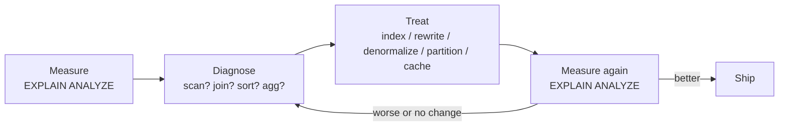
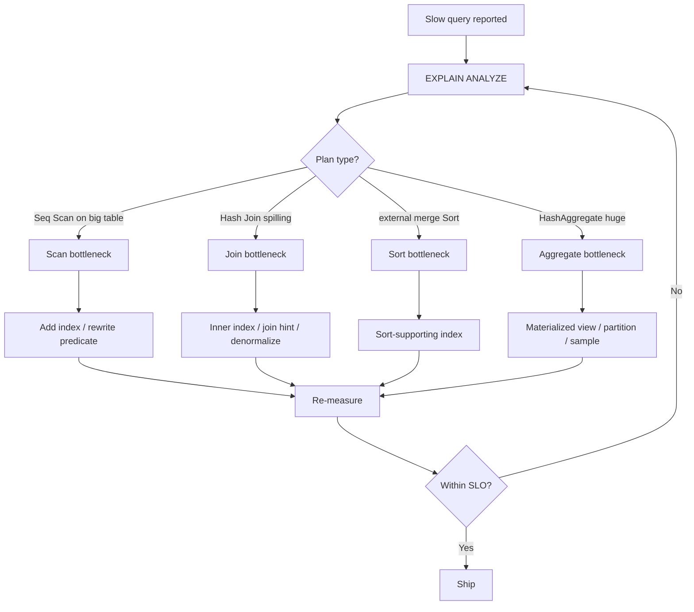

# Query Optimization Strategy

> Performance is not a feature you add at the end. It is a discipline you practice continuously, *measured* in data, *directed* by bottlenecks, and *verified* after every change.

## What you already know

From [[08-Trade-offs-Everywhere]]: every decision is a trade-off, and the worst trade-off is the one you make without realizing it. From [[07-Cost-Based-Optimizer]] and [[08-Reading-EXPLAIN]]: the database already chooses a plan for every query — your job is to read that plan, understand its costs, and either give it better data (indexes, statistics) or rewrite the query so a better plan becomes possible. From [[06-Coupling-and-Cohesion]]: a slow query is usually a *cohesion problem* — the query asks one table for a fact that lives in another.

## Why this layer exists

The earlier chapters built correctness: the schema is normalized, the constraints hold, the transactions are ACID, the recovery plan survives a crash. None of that guarantees the system is *fast*. Performance is a separate axis, and it is the axis users actually feel. A correct system that takes nine seconds to render a statement is, in practice, an incorrect system — users will refresh, retry, and pile up load until it falls over.

Optimization exists because:

1. **Requirements drift.** A schema designed for ten thousand accounts is queried by a system that now has ten million.
2. **Data is uneven.** A plan that is fast on test data (10 rows) is catastrophic on production data (10M rows).
3. **Access patterns evolve.** The dashboard query added last quarter was never in the original workload.
4. **Indexes decay.** An index built when the data was small may now be useless — or worse, may be chosen by the planner when it should not be.

Optimization is the discipline of *responding* to these forces. It is not a one-time tuning exercise.

## What is genuinely new here

The strategy itself:

> **Measure → Diagnose → Treat → Measure again.**

Everything else in this chapter is vocabulary for executing that loop. The loop is the concept. The biggest mistake in performance work is to skip step 1 (measure) or step 4 (measure again). Skipping step 1 produces cargo-cult tuning. Skipping step 4 produces optimizations that look right but are not.

## Concepts

### The four bottleneck families

Almost every slow query is slow for one of four reasons. Naming them tells you where to look.

| Bottleneck | Symptom in `EXPLAIN` | Typical cause | Typical fix |
|---|---|---|---|
| **Scan** | `Seq Scan` on a large table | No usable index, or predicate not indexable | Add an index, or rewrite predicate |
| **Join** | `Hash Join` spilling to disk; `Nested Loop` over large outer | Wrong join order, missing inner index | Add inner-side index, force join order, denormalize |
| **Sort** | `Sort` with high cost; `Sort Method: external merge` | `ORDER BY` / `DISTINCT` / `GROUP BY` without supporting index | Add a sort-supporting index, or pre-sort |
| **Aggregate** | `HashAggregate` with high memory; long planning time | Computing a rollup over millions of rows | Precompute (materialized view), partition, or sample |

If you cannot name which of the four is the bottleneck, you are guessing.

### The optimization loop



### Anti-patterns

These are the things teams do when they skip the loop:

- **Premature optimization.** Indexing a query that has not been measured. The index adds write cost to *every* insert, in exchange for an unmeasured, possibly nonexistent, read benefit.
- **Cargo-cult indexes.** "Let's add an index on every column we filter by." Produces a write-heavy table where the planner is confused by too many similar indexes and picks a bad one.
- **"The ORM is slow."** Maybe. But before rewriting the ORM, run `EXPLAIN ANALYZE` on the generated SQL. The ORM generates SQL; the database plans it. Most "ORM slowness" is actually missing indexes or N+1 queries (see [[03-N-plus-1-Problem]]).
- **Index-and-pray.** Adding an index without checking the planner actually uses it. Indexes can be unused (dead) or, worse, chosen when they shouldn't be.
- **Tuning in dev.** Dev has 1,000 rows; prod has 100,000,000. A `Seq Scan` is fine on 1,000 rows and fatal on 100M. Always measure on production-shaped data.
- **Rewriting the query without re-measuring.** A clever rewrite may be *slower* — the planner may have already been doing the right thing in the original form.

### The rule

> **Optimization is iterative and data-driven. You do not optimize a query; you optimize a workload.**

A workload is a set of queries with frequencies. A query that runs once a day at 1ms is not worth optimizing. A query that runs a thousand times a second at 1ms is. The cost of a query is `runtime × frequency`. Always think in workload terms.

## Banking application

The Banking system (see [[00-Banking-Case-Study]]) has several naturally heavy queries. The most common slow one is **statement generation**:

```sql
-- Statement for an account over a date range
SELECT le.id, le.occurred_at, le.amount, le.description, le.counterparty_iban
FROM ledger_entries le
WHERE le.account_id = $1
  AND le.occurred_at >= $2
  AND le.occurred_at <  $3
ORDER BY le.occurred_at DESC, le.id DESC;
```

Step 1 — Measure. Run `EXPLAIN (ANALYZE, BUFFERS)`:

```text
Sort  (cost=215000.00..217000.00 rows=800000 width=80) (actual time=1834.221..1912.440 rows=8123 loops=1)
  Sort Key: occurred_at DESC, id DESC
  Sort Method: external merge  Disk: 12480kB
  Buffers: shared hit=158234, temp read=1560 written=1568
  ->  Gather  (cost=1000.00..190000.00 rows=800000 width=80) (actual time=0.412..1240.012 rows=8123 loops=1)
        Workers Planned: 2
        Workers Launched: 2
        ->  Parallel Seq Scan on ledger_entries le  (cost=0.00..189000.00 rows=333333 width=80) (actual time=820.001..1500.213 rows=2707 loops=3)
              Filter: (account_id = 123) AND (occurred_at >= '2024-01-01') AND (occurred_at < '2024-02-01')
              Rows Removed by Filter: 250000
Planning Time: 0.182 ms
Execution Time: 1912.553 ms
```

Step 2 — Diagnose. Two bottlenecks:

- **Scan**: `Parallel Seq Scan on ledger_entries` — the planner is reading the entire multi-million-row table.
- **Sort**: `Sort Method: external merge  Disk: 12480kB` — the sort spilled to disk.

Step 3 — Treat. Add a composite index that supports both the filter and the sort order (see [[01-Indexing-Strategy]] for the column-order rule):

```sql
CREATE INDEX idx_ledger_account_time
  ON ledger_entries (account_id, occurred_at DESC, id DESC)
  INCLUDE (amount, description, counterparty_iban);
```

The `INCLUDE` columns make this a *covering* index — the planner can satisfy the query entirely from the index without touching the heap (PostgreSQL's "index-only scan").

Step 4 — Measure again:

```text
Index Scan using idx_ledger_account_time on ledger_entries le
  (cost=0.56..210.40 rows=8123 width=80) (actual time=0.035..3.142 rows=8123 loops=1)
  Index Cond: (account_id = 123) AND (occurred_at >= '2024-01-01') AND (occurred_at < '2024-02-01')
Planning Time: 0.184 ms
Execution Time: 3.298 ms
```

From 1.9 seconds to 3 milliseconds. Same query, same data, same hardware. The only thing that changed was that the planner now has a structure that matches the question.

## Code / diagrams

### A reusable optimization checklist (Java + SQL)

```java
public final class QueryDiagnostics {

    /**
     * Wraps a slow query with EXPLAIN ANALYZE output capture.
     * Call this on a slow path, log the output, then file a ticket.
     */
    public static String explain(Connection c, String sql, Object... args) throws SQLException {
        try (PreparedStatement ps = c.prepareStatement("EXPLAIN (ANALYZE, BUFFERS, VERBOSE) " + sql)) {
            for (int i = 0; i < args.length; i++) ps.setObject(i + 1, args[i]);
            StringBuilder sb = new StringBuilder();
            try (ResultSet rs = ps.executeQuery()) {
                while (rs.next()) sb.append(rs.getString(1)).append('\n');
            }
            return sb.toString();
        }
    }
}
```



## What can go wrong

- **Planner statistics are stale.** `ANALYZE` (the maintenance command, not the `EXPLAIN` keyword) refreshes statistics. If the planner chose a bad plan, run `ANALYZE ledger_entries;` and re-measure.
- **Parameter sniffing.** The plan cached for one parameter value (e.g., a small account) is reused for another (a huge account). PostgreSQL mitigates this with generic plans; Hibernate does not. Watch for it.
- **Index bloat.** Heavy update tables accumulate dead tuples; indexes grow large and slow. Run `VACUUM` / `REINDEX` periodically.
- **Index used in dev, not in prod.** Different data distributions on prod may make the planner pick a `Seq Scan` even when an index exists. Always measure on prod-shaped data.
- **Over-indexed tables.** A table with fifteen indexes writes fifteen index entries per insert. Insert throughput collapses; the "fix" of "add another index" makes it worse.
- **The query was never the bottleneck.** Sometimes the slow part is the network round-trip, the ORM hydration, or the application processing — not the SQL. `EXPLAIN ANALYZE` only tells you the database side. Use distributed tracing to see the rest.

## Trade-offs

- **Index count vs write throughput.** Every index is a write tax (see [[01-Indexing-Strategy]]). A table that needs fast writes can afford only a few indexes.
- **Plan stability vs plan quality.** Forcing a plan (e.g., `SET enable_seqscan = off`) gives stability but blocks the planner from choosing a better plan when data changes.
- **Denormalization vs correctness.** A materialized view makes reads fast and writes eventually-consistent. The balance is the topic of [[02-Denormalization-For-Reads]].
- **Query latency vs developer clarity.** A clever rewrite may be faster but harder to read. Reserve cleverness for the small set of queries that actually need it.
- **Tuning effort vs SLO.** A 2ms query that meets the SLO does not need to be a 0.2ms query. Stop optimizing when the SLO is met.

## Forward links

- [[01-Indexing-Strategy]] — the most common fix in this loop.
- [[02-Denormalization-For-Reads]] — when index + rewrite is not enough.
- [[03-Caching]] — when the database itself is the wrong place to answer.
- [[04-Partitioning-And-Sharding]] — when one database cannot hold the data.
- [[05-Banking-Performance-Tuning]] — the full Banking tuning walkthrough.
- [[08-Reading-EXPLAIN]] — the prerequisite skill.
- [[10-Normalization-Trade-offs]] — why a normalized schema can be slow to read.
- [[08-Trade-offs-Everywhere]] — every fix is a trade-off; name it.
