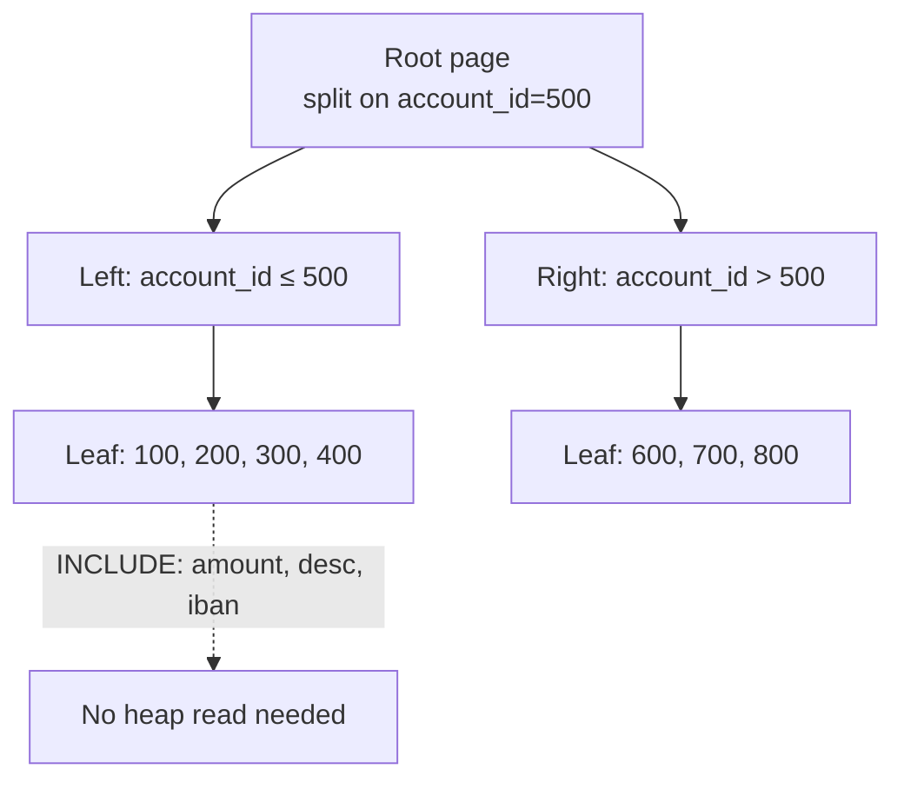

# Indexing Strategy

> Indexes are the database's oldest and most powerful performance tool. They are also its most abused. An index is a *promise to the planner* that a particular access pattern is worth paying a write-time tax for. Get the promise right, and queries fly. Get it wrong, and writes crawl while the planner picks the wrong plan anyway.

## What you already know

From [[03-B-Tree-Indexes]]: a B-tree is a sorted structure that turns a `WHERE col = ?` from an O(n) scan into an O(log n) lookup. From [[08-Reading-EXPLAIN]]: the planner picks an index only when its estimated cost is lower than a sequential scan. From [[00-Query-Optimization-Strategy]]: optimization is `measure → diagnose → treat → measure again`, and indexes are the most common treatment. From [[08-Trade-offs-Everywhere]]: an index is a trade-off — fast reads in exchange for slower writes and more storage.

## Why this layer exists

Without an index, the database can answer only one question quickly: "give me everything." With an index, it can answer "give me the rows where X holds" in time proportional to the *answer size*, not the *table size*. That is the difference between a 3ms query and a 3-second query on a million-row table.

But an index is not free. Each index:

- Adds CPU and I/O cost to every `INSERT`, `UPDATE`, and `DELETE` on the indexed table (write amplification).
- Consumes disk space — sometimes more than the table itself.
- Adds a candidate plan the optimizer must consider (planner confusion when many similar indexes exist).
- Must be maintained (vacuum, reindex) — otherwise it bloats and slows.

A good indexing strategy chooses *the smallest set of indexes that covers the access patterns that actually matter*. It is not about maximizing coverage; it is about maximizing *coverage per unit of write cost*.

## What is genuinely new here

Two ideas:

1. **Index types** are not interchangeable. B-tree, hash, GIN, GiST, BRIN, partial, expression, covering — each fits a different shape of predicate. Picking the wrong type gives you an index the planner will never use.
2. **Column order in composite indexes is a contract with the query.** The rule — *equality columns first, then sort, then range* — is the single most useful indexing heuristic you will ever learn.

## Concepts

### Index types in PostgreSQL

| Type | Fits | Does not fit | Example |
|---|---|---|---|
| **B-tree** | Equality, range, sort, `IN` | Full-text, JSON, arrays | `WHERE iban = ?`, `WHERE occurred_at BETWEEN ...` |
| **Hash** | Pure equality only | Range, sort, anything ordered | `WHERE id = ?` (rare; B-tree is usually fine) |
| **GIN** | Multiple keys per row: arrays, full-text, JSONB | Point lookups on a scalar | `WHERE tags @> ARRAY['urgent']`, `WHERE body @@ to_tsquery(...)` |
| **GiST** | Geometric, range, nearest-neighbor | Equality on scalars | `WHERE location <@ box`, `WHERE tsrange && ...` |
| **BRIN** | Huge, naturally-ordered tables (time-series) | Small or unordered tables | `WHERE occurred_at >= ...` on a 10B-row append-only log |
| **Partial** | A small, hot subset of a large table | When the predicate varies | `WHERE status = 'PENDING'` on a 100M-row queue table |
| **Expression** | When the query filters on a function of a column | When you also need plain column lookups | `WHERE LOWER(email) = ?` |
| **Covering (`INCLUDE`)** | When the query needs extra columns not in the predicate | When the included columns change often | `INDEX (account_id) INCLUDE (amount, occurred_at)` |

### Composite index column order — the rule

For a composite index `(a, b, c, d)`:

> **Equality columns first, then the sort column, then range columns.**

A B-tree is sorted left-to-right. The index can be used efficiently only when the query constrains columns from the left. So:

- `WHERE a = ? AND b = ? ORDER BY c` → index `(a, b, c)` is perfect.
- `WHERE a = ? AND c > ? ORDER BY b` → index `(a, b, c)` uses `a` for equality, `b` for sort, `c` for range. Still good.
- `WHERE b = ? AND c > ?` (no `a`) → index `(a, b, c)` is *useless*. The planner cannot seek on `b` without `a`.

This is why "index on every column" does not work — composite indexes have a *direction*, and that direction must match the query.

### Covering indexes (`INCLUDE`)

A covering index stores extra columns at the leaf level so the query can be answered *without touching the heap* (PostgreSQL calls this an "index-only scan"). The `INCLUDE` columns are not part of the sort key, so they don't affect the index's seek behavior — they only affect what data is available at the leaf.

```sql
CREATE INDEX idx_ledger_account_time
  ON ledger_entries (account_id, occurred_at DESC)
  INCLUDE (amount, description, counterparty_iban);
```

The query `SELECT amount, description, counterparty_iban FROM ledger_entries WHERE account_id = ? AND occurred_at >= ?` becomes an index-only scan — no heap access at all. Often a 10x speedup over the non-covering variant.

### Partial indexes

A partial index restricts itself to rows matching a `WHERE` clause. The index is much smaller, and the planner will use it whenever the query's predicate *implies* the index's predicate.

```sql
CREATE INDEX idx_kyc_pending ON kyc_reviews (customer_id) WHERE status = 'PENDING';
```

If 99% of `kyc_reviews` are `COMPLETED`, this index is 100x smaller than a full index — and the "pending KYC queue" query is 100x faster.

### Expression indexes

When queries filter on a *function* of a column, a plain index on the column is useless. You need an index on the function result.

```sql
CREATE INDEX idx_customers_lower_email ON customers (LOWER(email));
-- Now:  SELECT * FROM customers WHERE LOWER(email) = 'alice@bank.com';
```

Without this, `LOWER(email) = ?` is a `Seq Scan` — the function is not "transparent" to the index.

### The cost of indexes

| Cost | What it means | When it bites |
|---|---|---|
| Write amplification | Every `INSERT/UPDATE/DELETE` updates every index | High-write tables (the ledger) |
| Storage | Indexes can be larger than the table | Wide rows + many indexes |
| Planner confusion | Too many similar indexes → bad plan choice | Tables with 10+ indexes |
| Maintenance | Bloat, dead tuples, fragmentation | High-churn tables |
| Cache pressure | Index pages compete with table pages in buffer pool | Many indexes on hot tables |

### The rule of thumb

> **Index for the queries you have, not the queries you imagine.**

Every index should have a named query (or workload) that it serves. If you cannot write down the SQL that uses the index, do not add it. If the query is later removed, *remove the index*. Indexes are not a library — they are a tax.

## Banking application

Three concrete indexes for the Banking system (see [[00-Banking-Case-Study]]):

### 1. The ledger query index

The most common query: "give me this account's ledger entries in a date range, newest first."

```sql
CREATE INDEX idx_ledger_account_time
  ON ledger_entries (account_id, occurred_at DESC, id DESC)
  INCLUDE (amount, description, counterparty_iban);
```

Why this order: `account_id` is equality (the account we want), `occurred_at DESC` is the sort we need, `id DESC` is the tiebreaker (ensures deterministic ordering). The `INCLUDE` columns make it an index-only scan.

### 2. The IBAN lookup index

```sql
CREATE UNIQUE INDEX idx_accounts_iban ON accounts (iban);
```

`UNIQUE` because IBAN is the logical identity (see [[05-Identity-State-Lifecycle]]). This index serves every "find account by IBAN" lookup, which is every external API call.

### 3. The KYC queue partial index

```sql
CREATE INDEX idx_kyc_queue_pending ON kyc_reviews (created_at) WHERE status = 'PENDING';
```

The KYC review queue query is `SELECT * FROM kyc_reviews WHERE status = 'PENDING' ORDER BY created_at LIMIT 50`. If 99.9% of reviews are `COMPLETED`, the partial index is tiny, and the query is a fast index-only scan over the hot subset.

## Code / diagrams

### Visualizing the B-tree seek



### Index audit query (PostgreSQL)

Find unused indexes — candidates for removal:

```sql
SELECT schemaname, relname, indexrelname, idx_scan, idx_tup_read, idx_tup_fetch
FROM pg_stat_user_indexes
WHERE idx_scan = 0
  AND indexrelname NOT LIKE '%_pkey'
ORDER BY pg_relation_size(indexrelid) DESC;
```

`idx_scan = 0` since the last stats reset means the index has never been used by the planner. If it's been a month and the index has never been used, drop it. (Caveat: rare monthly batch jobs may legitimately use it — verify before dropping.)

### Java repository that hints at index usage

```java
public final class LedgerRepository {

    private final JdbcTemplate jdbc;

    public List<LedgerEntry> findForStatement(long accountId, Instant from, Instant to) {
        // The ORDER BY mirrors the index (account_id, occurred_at DESC, id DESC),
        // so the planner can satisfy both filter and sort from the index.
        return jdbc.query(
            """
            SELECT id, occurred_at, amount, description, counterparty_iban
              FROM ledger_entries
             WHERE account_id = ?
               AND occurred_at >= ?
               AND occurred_at <  ?
             ORDER BY occurred_at DESC, id DESC
            """,
            (rs, n) -> new LedgerEntry(
                rs.getLong("id"),
                rs.getObject("occurred_at", OffsetDateTime.class).toInstant(),
                rs.getBigDecimal("amount"),
                rs.getString("description"),
                rs.getString("counterparty_iban")
            ),
            accountId, from, to
        );
    }
}
```

Notice the `ORDER BY` matches the index exactly — the planner sees that and uses the index for both filter and sort, no separate `Sort` node.

## What can go wrong

- **Index built but never used.** The query's predicate doesn't match the index's leftmost columns. The index sits there taxing writes for no benefit. Run `pg_stat_user_indexes` regularly.
- **Index chosen when a Seq Scan would be faster.** For small tables or large fractions of the table, a sequential scan wins because it's sequential I/O. The planner usually knows this; bad statistics can fool it.
- **Index bloat on high-churn tables.** `UPDATE`-heavy tables (e.g., `accounts.current_balance`) accumulate dead index entries. Schedule `REINDEX CONCURRENTLY` or use autovacuum tuning.
- **Over-indexing.** A table with 15 indexes can take 10x longer to insert into than the same table with 3. Every index is a candidate plan; more candidates means more planning time and more risk of a bad choice.
- **Composite order is wrong.** Index `(occurred_at, account_id)` is useless for `WHERE account_id = ?` queries. The order is the contract.
- **Expression indexes forgotten.** `WHERE LOWER(email) = ?` without an index on `LOWER(email)` is a `Seq Scan` even if there's an index on `email`.
- **Partial index predicate not implied.** A query `WHERE status IN ('PENDING', 'REVIEW')` cannot use the partial index `WHERE status = 'PENDING'`. The partial index only helps queries whose predicate is *at least as restrictive*.

## Trade-offs

- **Write speed vs read speed.** Every index trades write throughput for read latency. The trade is only worth it if the read is hot.
- **Index size vs coverage.** `INCLUDE` columns speed up specific queries but grow the index. Cover only the columns a hot query actually selects.
- **Partial vs full index.** Partial indexes are smaller and faster but only help queries matching the predicate.
- **B-tree vs BRIN on huge tables.** BRIN is 1000x smaller but only gives "block range" filtering — not point lookup. For time-series append-only tables (see [[04-Partitioning-And-Sharding]]), BRIN is often the right call.
- **Planner hints vs planner autonomy.** Forcing a plan (`SET enable_seqscan = off`) gives you a guaranteed plan but blocks the planner from adapting. Use only as a debugging tool, not in production.

## Forward links

- [[00-Query-Optimization-Strategy]] — the loop that index changes live inside.
- [[02-Denormalization-For-Reads]] — when even the perfect index is not enough.
- [[03-Caching]] — when the right answer is to not run the query at all.
- [[04-Partitioning-And-Sharding]] — partitioning + indexing interact; local indexes per partition are often better than one global index.
- [[03-B-Tree-Indexes]] — the internals of how a B-tree seeks.
- [[07-Cost-Based-Optimizer]] — how the planner decides between two indexes.
- [[08-Reading-EXPLAIN]] — how to verify the planner actually used your index.
- [[10-Normalization-Trade-offs]] — normalization makes more tables, which makes more indexes, which makes more write cost. The chain is real.
- [[08-Trade-offs-Everywhere]] — every index is a trade-off; write it down.
