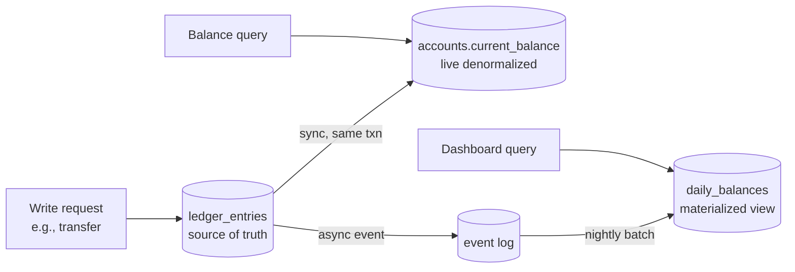

# Denormalization For Reads

> Normalization is the source of truth. Denormalization is the read model. The same data, modeled twice — once for correctness, once for speed.

## What you already know

From [[10-Normalization-Trade-offs]]: normalization eliminates redundancy by ensuring each fact lives in exactly one place. From [[04-Abstraction-and-Models]]: an abstraction is *selective forgetting for a purpose* — there is no "correct" abstraction, only a useful one for a question. From [[07-Views-Materialized-Views]]: a view is a virtual relation; a materialized view is a real relation computed from other relations. From [[08-Trade-offs-Everywhere]]: every denormalization is a trade — fast reads for slow writes, simplicity for staleness.

## Why this layer exists

A fully normalized schema is correct, compact, and unambiguous. It is also, frequently, slow to read. The reason is structural: normalization distributes facts across many tables to avoid redundancy, and reading a complete fact requires joining them back together. When the fact you need is the result of a six-table join across a billion-row table, even perfect indexes cannot save you.

Consider the Banking dashboard. It wants to show: "the customer's name, account IBANs, current balance, last deposit amount, and 30-day transaction count — for every account the customer owns." In a normalized schema, that query joins `customers`, `accounts`, `ledger_entries`, and a subquery aggregate. On 50 accounts per customer, with millions of ledger entries each, this query is fast enough for a single customer but catastrophic for the dashboard that renders it for every employee simultaneously.

Denormalization exists because *read workloads are not the same as write workloads*. The source-of-truth schema is optimized for writes: one fact, one place, no redundancy, transactional updates. The read model is optimized for reads: one query, one row, no joins. The two cannot both be the same table without compromise. So we keep them separate.

## What is genuinely new here

> **Normalize the source of truth. Denormalize the read models. Keep the boundary explicit.**

The boundary is the new idea. A denormalized column or table is not "less correct" — it is a *projection* of the source of truth, with a defined refresh policy and a defined staleness window. The skill is making the boundary explicit, so the system can answer "is this stale?" by checking the policy, not by guessing.

## Concepts

### Techniques

| Technique | What it is | When it fits |
|---|---|---|
| **Redundant column** | Copy a column from one table to another (e.g., `customer_name` on `accounts`) | The column rarely changes and is read constantly |
| **Summary table** | A separate table holding aggregates (e.g., `daily_balances`) | Periodic reporting, dashboards |
| **Materialized view** | A view whose result is stored and refreshed | Complex queries that change slowly |
| **Counter / precomputed aggregate** | A column holding `COUNT` / `SUM` (e.g., `accounts.transaction_count`) | Counts that are read constantly and updated per-event |
| **Wide read table** | A denormalized table assembled by a batch job | Analytics, reporting, OLAP workloads |
| **CQRS read model** | A separate database (often NoSQL) updated by events | High-scale read/write separation (see [[04-Enterprise-Patterns]]) |

### Refresh strategies

A denormalized value is a *cache* of a computation. Like any cache (see [[03-Caching]]), it has a refresh policy:

- **Synchronous**: updated in the same transaction as the source. Always consistent, but adds write cost (the original reason we normalized).
- **Trigger-based**: a trigger on the source table updates the denormalized value. Decouples application code from the denormalization, but triggers are hard to reason about (see [[03-Triggers-As-Constraints]]).
- **Scheduled (batch)**: a job refreshes the materialized view on a schedule. Stale within the schedule window; cheap.
- **Event-driven**: an event handler updates the read model asynchronously. Eventual consistency; scales well.

### The staleness contract

Every denormalized read model carries a *staleness contract*:

> "This value is at most N minutes old, and it is correct as of the last successful refresh."

Without this contract, callers do not know whether to trust the value. With it, they can decide: a balance display can tolerate 5 minutes of staleness; a transfer authorization cannot.

## Banking application

The Banking system (see [[00-Banking-Case-Study]]) has two natural read models that benefit from denormalization:

### The live balance (denormalized column)

The `accounts` table holds a `current_balance` column. The *source of truth* for the balance is:

```sql
SELECT SUM(amount) FROM ledger_entries WHERE account_id = $1;
```

But running this on every read of the account is catastrophic. So `current_balance` is a denormalized column, updated synchronously in the same transaction as every ledger entry:

```sql
BEGIN;
  INSERT INTO ledger_entries (account_id, amount, ...) VALUES (123, -100.00, ...);
  UPDATE accounts SET current_balance = current_balance + (-100.00) WHERE id = 123;
COMMIT;
```

This is *synchronous denormalization*. The `current_balance` is always consistent with `SUM(ledger_entries.amount)` because both updates happen in the same transaction. The trade-off: writes are slightly more expensive (two updates, not one), but reads are O(1). For a balance, this trade is correct — the balance invariant (`balance == SUM(entries)`) must always hold (see [[00-ACID]]).

### The daily balances dashboard (materialized view)

The dashboard wants to show a customer's balance trend over the last 90 days. Computing this from `ledger_entries` requires a `GROUP BY date` over potentially millions of rows per account. So we materialize:

```sql
CREATE MATERIALIZED VIEW daily_balances AS
SELECT
  a.id           AS account_id,
  a.customer_id  AS customer_id,
  date_trunc('day', le.occurred_at) AS day,
  SUM(le.amount) AS day_change,
  SUM(SUM(le.amount)) OVER (
    PARTITION BY a.id
    ORDER BY date_trunc('day', le.occurred_at)
  ) AS cumulative_balance
FROM accounts a
JOIN ledger_entries le ON le.account_id = a.id
GROUP BY a.id, a.customer_id, date_trunc('day', le.occurred_at);

CREATE UNIQUE INDEX ON daily_balances (account_id, day);
```

Refresh policy: nightly, via `REFRESH MATERIALIZED VIEW CONCURRENTLY daily_balances;`. The dashboard reads `daily_balances` — fast even for 10 years of history. The trade-off: the dashboard shows *yesterday's* balance, not today's. That's the staleness contract: "at most 24 hours old, correct as of last night's refresh."

### Architecture



The diagram shows the boundary clearly: the source of truth is `ledger_entries`. The live balance (`accounts.current_balance`) is updated synchronously — same transaction, no staleness. The dashboard (`daily_balances`) is updated asynchronously by a nightly batch — staleness up to 24h. Different read paths use different read models, depending on what staleness they can tolerate.

## Code / diagrams

### Refreshing the materialized view (Java scheduled job)

```java
@Component
public class DailyBalanceRefresher {

    private final JdbcTemplate jdbc;

    @Scheduled(cron = "0 0 2 * * *")  // 02:00 daily
    public void refresh() {
        // CONCURRENTLY requires a UNIQUE index; we created one above.
        jdbc.execute("REFRESH MATERIALIZED VIEW CONCURRENTLY daily_balances");
    }
}
```

### The same data, three ways

```sql
-- Source of truth (slow, always correct):
SELECT SUM(amount) FROM ledger_entries WHERE account_id = 123;

-- Live denormalized (fast, always correct, updated in-tx):
SELECT current_balance FROM accounts WHERE id = 123;

-- Daily snapshot (fast, correct as of last night):
SELECT cumulative_balance FROM daily_balances
 WHERE account_id = 123 AND day = '2024-01-15';
```

Three abstractions of the same fact (see [[04-Abstraction-and-Models]]). Which one to use depends on the *question being asked* — that is the entire point.

## What can go wrong

- **Drift between source and read model.** Synchronous denormalization can drift if a transaction partially commits (e.g., a trigger that fails silently). Periodic reconciliation jobs (`SELECT id FROM accounts WHERE current_balance != (SELECT SUM(amount) FROM ledger_entries ...)`) catch this.
- **Stale reads used for decisions.** A dashboard balance used to authorize a transfer is a bug. The staleness contract must be enforced by the application, not assumed.
- **Materialized view refresh failure.** A long-running `REFRESH` blocks reads (non-concurrent) or consumes resources (concurrent). Schedule for low-traffic windows; alert on failure.
- **Write amplification.** A denormalized counter (`accounts.transaction_count`) updated on every ledger entry doubles the write cost of every entry. Often the source of mysterious insert slowdowns.
- **Trigger-based updates hidden from developers.** A trigger that maintains `current_balance` is invisible in the application code. New developers will assume the column is "magical" — until they bypass the trigger with a direct insert and break the invariant. Document triggers; prefer explicit application-level updates where possible.
- **Read model schema drift.** When the source schema changes, the materialized view definition must change too. CI should compile views on every migration.
- **"Let's just denormalize everything."** Denormalization is a treatment for slow reads, not a default architecture. Premature denormalization produces a system where every write updates ten places, and one of them is always wrong.

## Trade-offs

- **Read speed vs write cost.** Every denormalized value adds write cost. The trade is only worth it when the read is hot.
- **Consistency vs availability.** A read model that is always consistent requires synchronous updates, which limits write throughput. An eventually-consistent read model scales but is stale.
- **Simplicity vs performance.** One table is simple to reason about; five read models with five refresh policies is complex. Complexity is a real cost — bugs live in the gaps.
- **Source of truth vs source of speed.** Always know which is which. The source of truth is the normalized schema; the source of speed is the read model. When they disagree, the source of truth wins, and the read model is rebuilt.
- **Trigger vs application code.** Triggers keep the source of truth honest even when bypassed by direct SQL, but they are invisible. Application code is visible but easy to bypass. Pick one and document it.

## Forward links

- [[00-Query-Optimization-Strategy]] — denormalization is a treatment within the loop.
- [[03-Caching]] — caching is *ephemeral* denormalization; materialized views are *persistent* denormalization. Same shape.
- [[04-Partitioning-And-Sharding]] — partitioning can be seen as denormalization by physical layout.
- [[07-Views-Materialized-Views]] — the SQL mechanism.
- [[10-Normalization-Trade-offs]] — the other half of the trade-off.
- [[11-Banking-Normalization-Walkthrough]] — how the source of truth was built.
- [[04-Enterprise-Patterns]] — CQRS is denormalization at the architecture level.
- [[00-ACID]] — synchronous denormalization only works inside a transaction.
- [[08-Trade-offs-Everywhere]] — name the trade; write it down.
