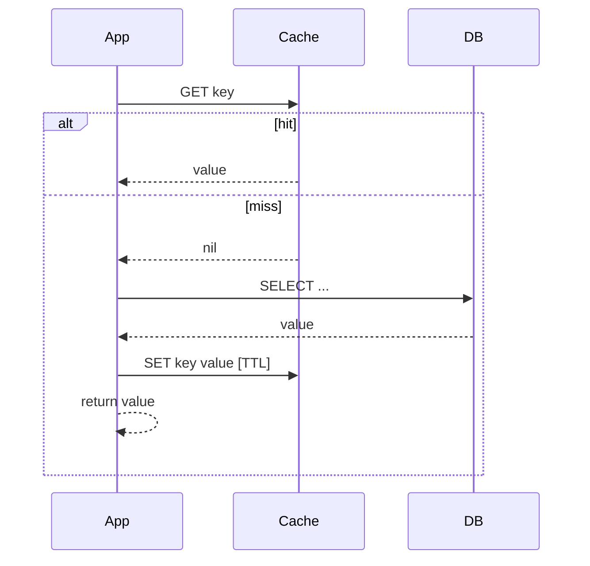
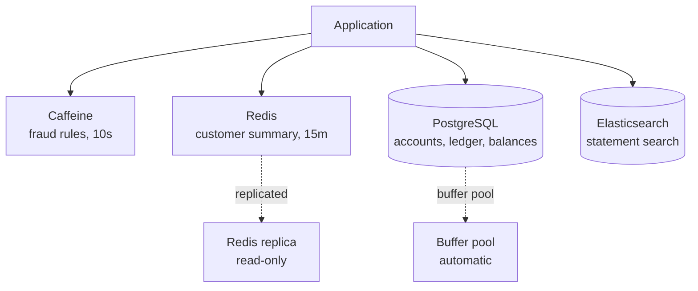
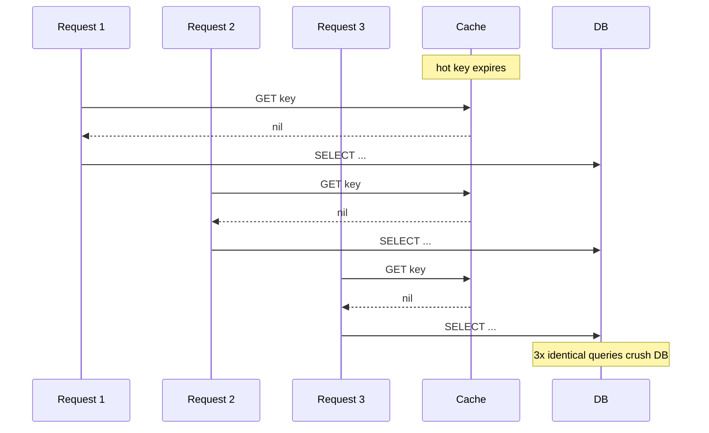

# Caching

> Caching is the act of remembering an answer so you do not have to compute it twice. It is the second-hardest problem in computer science — not because caching itself is hard, but because *knowing when the cached answer is no longer correct* is hard.

## What you already know

From [[02-Denormalization-For-Reads]]: a denormalized column or materialized view is, in effect, a cache — a stored answer to a query, with a refresh policy. From [[02-Buffer-Pool]]: the database's own buffer pool is a cache — recently accessed pages stay in RAM so the next access does not hit disk. From [[04-Abstraction-and-Models]]: a cache is an abstraction that hides "where the answer comes from." From [[08-Trade-offs-Everywhere]]: caching trades consistency for speed; the trade is only worth it if the answer is expensive to compute and rarely changes.

## Why this layer exists

Every layer of a modern system caches something:

- The CPU has L1/L2/L3 caches.
- The OS has a page cache.
- The database has a buffer pool (see [[02-Buffer-Pool]]).
- The application has in-process caches (Caffeine, Guava).
- A distributed cache (Redis, Memcached) sits between the application and the database.
- A CDN caches static assets at the network edge.

Each layer exists because the layer below it is *too slow*. The CPU caches memory because main memory is slow. The page cache exists because disks are slow. Redis exists because the database is slow. The CDN exists because the network is slow.

Caching is the universal response to "the layer below me is too slow." It is the most effective and the most dangerous optimization: effective because a cache hit is essentially free; dangerous because a stale cache *looks* correct.

## What is genuinely new here

Three ideas:

1. **The cache-aside pattern** is the default. Read cache; on miss, read source; fill cache. Everything else is a variation.
2. **Invalidation is the hard problem.** Deciding *when* to evict a cache entry is harder than deciding *what* to cache. The thundering herd problem is the symptom of getting it wrong.
3. **The rule: cache only what is expensive to compute and rarely changes.** Everything else is overhead.

## Concepts

### Cache layers

| Layer | Scope | Speed | When to use |
|---|---|---|---|
| In-process (Caffeine, HashMap) | One JVM | ~100ns | Per-instance hot reads; small, immutable data |
| Distributed (Redis, Memcached) | Cluster | ~1ms | Shared hot reads; session state; rate-limit counters |
| Database buffer pool | One DB instance | ~microseconds | The DB's own page cache — automatic, tuned, not application-visible |
| CDN | Global edge | ~50ms (network) | Static assets, public read-only API responses |
| HTTP cache (browser/proxy) | Per-client | ~0ms | Client-side caching of HTTP responses |

### The cache-aside pattern

The default pattern. The application asks the cache; if the cache does not know, the application asks the source and *teaches* the cache.



### Write-through vs write-behind

When the application writes, what does it do with the cache?

| Pattern | On write | Pros | Cons |
|---|---|---|---|
| **Cache-aside (write-around)** | Update DB; invalidate cache entry; next read repopulates | Simple; correct on next read | Next read pays a miss |
| **Write-through** | Update DB and cache together | Cache always fresh | Double write cost |
| **Write-behind (write-back)** | Update cache; async write to DB | Fast writes | Cache is *source of truth* until flushed — dangerous if cache dies |

For Banking, write-through or cache-aside is the only acceptable pattern. Write-behind is for analytics ingestion, not for transactions.

### Cache invalidation

> "There are only two hard problems in computer science: cache invalidation and naming things." — Phil Karlton (apocryphal)

The strategies:

- **TTL (time-to-live).** Each entry has an expiration. Simple. Always eventually consistent. Wastes capacity on entries that haven't changed.
- **Explicit invalidation.** The application deletes the cache entry when the source changes. Requires the application to know *which* entries to evict — non-trivial when the cached value is a function of multiple source rows.
- **Versioning.** The cache key includes a version (e.g., `account:123:v7`). When the source changes, increment the version. Old keys naturally expire; new reads miss and repopulate. Excellent for write-heavy hot data.
- **Tag-based invalidation.** Cache entries are tagged with the source rows they depend on; a row update evicts all tagged entries (used by some Redis extensions). Powerful, complex.

### The thundering herd

If a hot cache entry expires and 1000 requests arrive simultaneously, all 1000 miss the cache, all 1000 query the source, all 1000 try to repopulate. The source is crushed under a load that was supposed to be cached.

Cures:

- **Lock on miss.** The first request that misses acquires a lock; others wait. The lock-holder queries the source and populates the cache; others then read the cache. (Caffeine supports this natively via `Cache.get(key, loader)`.)
- **Stale-while-revalidate.** Serve the stale value while a background job refreshes. The user sees stale data briefly; the cache is never empty.
- **Probabilistic early expiration.** Entries expire slightly before their TTL, randomly distributed, so misses are spread out.

### The rule

> **Cache only what is expensive to compute and rarely changes.**

If a query is fast (sub-millisecond), caching it adds overhead (the cache lookup itself is ~1ms across the network to Redis). If a value changes constantly (the balance), the cache is always stale and always invalid. The two conditions together — *expensive to compute* AND *rarely changes* — define the cacheable surface.

## Banking application

What is cacheable in the Banking system (see [[00-Banking-Case-Study]])?

| Data | Cacheable? | Why |
|---|---|---|
| Customer name, address, contact | Yes | Rarely changes; read on every screen |
| Account IBAN, type, currency | Yes | Rarely changes |
| Customer's accounts list | Yes (short TTL) | Changes when account opened/closed — infrequent |
| Account current balance | **No** | Changes on every transaction; cache would be stale immediately |
| Ledger entries | No (per query) | Each query is specific; better solved with index |
| Rate-limit counters | Yes (in Redis) | Counters are write-heavy; Redis is the right tool |
| Recent transfers (last 5) | Yes (short TTL) | "Recent activity" widget; 30s staleness is fine |
| Customer session | Yes (in Redis) | Per-customer state; hot read on every request |
| Fraud rules | Yes (long TTL) | Rule changes are batch and rare |
| Statement PDF | Yes (long TTL) | Computed once, read many times; cache the rendered PDF |

The contrast between "customer name" and "current balance" is the whole lesson:

- Customer name is **expensive to fetch** (joins customer, address, contact) and **rarely changes** (months between updates). Perfect cache candidate.
- Current balance is **cheap to fetch** (one indexed read) and **changes constantly** (every transaction). Caching it is pure overhead — every transaction would have to invalidate the cache, and the read is already fast without a cache.

### Cache-aside implementation (Java + Redis)

```java
@Component
public class CachedCustomerLookup {

    private final RedisTemplate<String, CustomerSummary> redis;
    private final CustomerRepository repo;

    public CustomerSummary find(long customerId) {
        String key = "customer:" + customerId + ":summary";
        CustomerSummary cached = redis.opsForValue().get(key);
        if (cached != null) return cached;

        // Miss — load from DB and populate cache
        CustomerSummary fresh = repo.loadSummary(customerId);
        redis.opsForValue().set(key, fresh, Duration.ofMinutes(15));
        return fresh;
    }

    // Called whenever the customer is updated
    public void invalidate(long customerId) {
        redis.delete("customer:" + customerId + ":summary");
    }
}
```

### Caffeine (in-process) for fraud rules

```java
@Component
public class FraudRuleCache {

    private final Cache<Long, List<FraudRule>> cache = Caffeine.newBuilder()
        .expireAfterWrite(Duration.ofMinutes(10))
        .maximumSize(10_000)
        .build();

    public List<FraudRule> rulesForAccount(long accountId) {
        // get(key, loader) handles the thundering herd automatically:
        // only one thread loads; others wait on the same key.
        return cache.get(accountId, this::loadRulesFromDb);
    }
}
```

## Code / diagrams

### Cache layering in the Banking system



Different caches for different shapes of data — each chosen because of the *access pattern*, not as a default.

### The thundering herd



The fix: a per-key lock (Caffeine's `get(key, loader)` handles this).

## What can go wrong

- **Stale data served for a decision.** A cached balance used to authorize a transfer is a bug. Cache only what the caller can tolerate being stale.
- **Cache stampede (thundering herd).** A hot key expires and the source is crushed. Always use a loader that locks on miss.
- **Cache as a single point of failure.** If the application cannot function without Redis, Redis is a critical dependency. Design for "cache down → degrade gracefully" (serve stale, or fall back to DB at reduced throughput).
- **Cache poisoning.** A bug writes a wrong value to the cache. Every subsequent read returns the wrong answer until TTL expires. Mitigation: version the keys, or include a checksum.
- **Memory exhaustion.** Unbounded caches grow until OOM. Always set `maximumSize` (Caffeine) or `maxmemory-policy` (Redis).
- **Network round-trip overhead.** A 0.5ms DB query cached in Redis (1ms round-trip) is *slower* than reading the DB. Cache only what is more expensive than the cache lookup.
- **Cross-service cache inconsistency.** Service A invalidates its cache; service B does not. They serve different answers. The cure is to centralize cache invalidation (events) — see [[04-Domain-Events]].
- **TTL too long, TTL too short.** Too long → stale data; too short → low hit rate. Tune based on observed change frequency.

## Trade-offs

- **Speed vs consistency.** Every cache is a trade of consistency for speed. The trade is only worth it for read-heavy, change-rare data.
- **Latency vs complexity.** A two-layer cache (in-process + Redis) is faster but harder to invalidate correctly than a single layer.
- **Cache size vs hit rate.** Larger caches hit more but cost more memory. The hit-rate curve usually has a knee — find it and stop.
- **TTL vs invalidation.** TTL is simple but wasteful; invalidation is precise but complex. Most systems need both.
- **Cache availability vs source availability.** A cache that is required for the system to function is a new failure mode. Decide explicitly: is the cache a *performance optimization* (system works without it, just slower) or a *capacity component* (system fails without it)?

## Forward links

- [[00-Query-Optimization-Strategy]] — caching is a treatment when the query cannot be made fast enough.
- [[02-Denormalization-For-Reads]] — denormalization is persistent caching; this is ephemeral caching.
- [[04-Eventual-Consistency]] — every cache is eventually consistent; the question is *how eventually*.
- [[02-Key-Value-Stores]] — Redis is the canonical distributed cache.
- [[04-Domain-Events]] — events are the most reliable cache invalidation signal.
- [[02-Buffer-Pool]] — the database's own cache; not application-visible, but it follows the same laws.
- [[00-CAP-PACELC]] — a distributed cache is a distributed system; it has a CAP position.
- [[08-Trade-offs-Everywhere]] — caching is the clearest trade-off in the vault.
