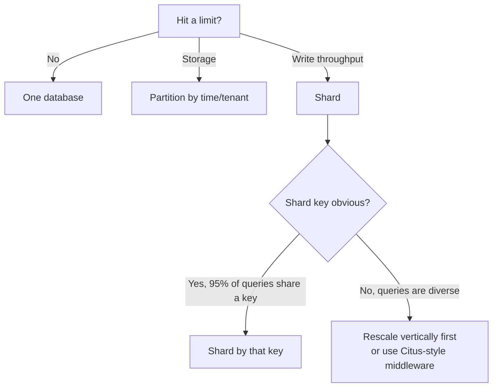

# Partitioning And Sharding

> When one database is too much — too much data, too many writes, too long a scan — you split it. *Partitioning* splits a table inside one database. *Sharding* splits the data across multiple databases. Same idea, different blast radius.

## What you already know

From [[01-Pages-And-Files]] and [[03-B-Tree-Indexes]]: indexes work because they shrink the search space from "every row" to "the rows matching the predicate." Partitioning extends that idea to the *physical storage* — the planner can skip entire partitions if the predicate excludes them. From [[03-Dependency-As-Root-Concept]]: a dependency that crosses a shard boundary is fundamentally more expensive than one that doesn't. From [[08-Trade-offs-Everywhere]]: sharding is the canonical "trade simplicity for scale" decision — and it is mostly irreversible.

## Why this layer exists

There are three limits a single database hits:

1. **Storage limit.** A single table cannot grow forever — at hundreds of billions of rows, even metadata operations (`VACUUM`, index rebuild, schema migration) become impractical.
2. **Write throughput limit.** A single primary can only accept so many writes per second. Beyond that, replication lag grows, locks contend, and the queue backs up.
3. **Query latency limit.** Even with perfect indexes, scanning a 10B-row table for an aggregate is slow. The data has to physically shrink.

Partitioning addresses (1) and (3) within one database. Sharding addresses (2) and (1) by splitting the database itself.

The two are related but distinct. Partitioning is a *physical* decision: the database manages the partitions; the application sees one logical table. Sharding is an *architectural* decision: the application (or a sharding middleware) routes each request to the right database; there is no single "the database."

## What is genuinely new here

- **Partitioning is invisible to the application.** You write the same SQL; the planner picks partitions.
- **Sharding is visible to the application.** Either you route explicitly, or you use middleware (Vitess, Citus) that does it for you. Either way, the abstraction leaks — cross-shard queries, joins, and transactions become real concerns.
- **The rule: shard only when you must, and shard along the access pattern.** Sharding is a one-way door (see [[08-Trade-offs-Everywhere]]). Most systems that shard did so because they had no choice — and most systems that shard *without need* regret it.

## Concepts

### Partitioning in PostgreSQL

PostgreSQL supports *declarative partitioning* since version 10. You declare the partitioning rule; the database manages the partitions.

```sql
CREATE TABLE ledger_entries (
    id          BIGSERIAL,
    account_id  BIGINT NOT NULL,
    amount      NUMERIC(18,2) NOT NULL,
    occurred_at TIMESTAMPTZ NOT NULL,
    description TEXT
) PARTITION BY RANGE (occurred_at);

CREATE TABLE ledger_entries_2024_01 PARTITION OF ledger_entries
    FOR VALUES FROM ('2024-01-01') TO ('2024-02-01');
CREATE TABLE ledger_entries_2024_02 PARTITION OF ledger_entries
    FOR VALUES FROM ('2024-02-01') TO ('2024-03-01');
-- ... one partition per month
```

The three partitioning strategies:

| Strategy | Partition key | When it fits |
|---|---|---|
| **RANGE** | A contiguous range (date, numeric) | Time-series; archival by month/year |
| **LIST** | A discrete value (region, category) | Multi-tenant by tenant_id; regional data |
| **HASH** | Hash of a column | Even distribution; no natural range |

### Partition pruning

When a query's predicate excludes a partition, the planner skips it entirely. This is *partition pruning*, and it is the whole point.

```sql
-- This query only scans the 2024-01 partition, not all partitions:
SELECT * FROM ledger_entries
WHERE occurred_at >= '2024-01-15' AND occurred_at < '2024-01-20';
```

`EXPLAIN` shows `Seq Scan on ledger_entries_2024_01` — not `ledger_entries`. The other partitions are not even opened.

### Partitioning trade-offs

- **Pros**: smaller per-partition tables → faster scans, faster `VACUUM`, faster index rebuilds; partition pruning → query only the relevant partitions; archival → drop old partitions instead of deleting rows (`DROP TABLE ledger_entries_2019_01` is instant; `DELETE FROM ledger_entries WHERE occurred_at < '2019-02-01'` is catastrophic).
- **Cons**: cross-partition queries are slower; unique constraints must include the partition key (so global uniqueness across partitions is impossible without the key); inserts have routing overhead; partition count has a soft limit (~hundreds, not thousands).

### Sharding strategies

When one database is not enough, you shard. The shard key determines how data is distributed.

| Strategy | How it works | When it fits |
|---|---|---|
| **Range-based** | Shards by a range (e.g., customers A-M on shard 1, N-Z on shard 2) | Range queries are common; risk of hot shards |
| **Hash-based** | `hash(key) % N` | Even distribution; range queries must fan out |
| **Directory-based** | A lookup table maps each key to a shard | Flexible; the lookup table is a bottleneck |
| **Geo-based** | Each region's data in its region's shard | Data residency, latency |

### Cross-shard problems

The moment you shard, these become real:

- **Cross-shard transactions.** A transfer from account A (shard 1) to account B (shard 2) requires a distributed transaction. 2PC is slow and brittle; sagas are eventual and complex (see [[07-Distributed-Transactions]], [[08-Two-Phase-Commit]]).
- **Cross-shard joins.** Most sharded systems forbid them. The application must do two queries and join in memory, or denormalize so the join is unnecessary.
- **Cross-shard aggregations.** `SELECT SUM(amount) FROM ledger_entries` becomes a fan-out to every shard, with a merge step. Doable, but slow and complex.
- **Rebalancing.** Adding a shard means re-hashing and moving data. With hash-based sharding, this can require moving half the data — *consistent hashing* (see [[02-Replication]] and consistent-hash rings) reduces the movement.
- **Schema migrations.** Every shard needs the migration. Coordinating this is operationally significant.

### Sharding architectures

| Pattern | What it is | Examples |
|---|---|---|
| **Application-level sharding** | The application routes each query to the right shard based on the shard key | Custom-built; most flexible; most work |
| **Middleware sharding** | A proxy routes queries; the application talks to one logical DB | Vitess (MySQL), Citus (PostgreSQL), Cassandra's internal sharding |
| **Database-native sharding** | The database shards itself transparently | MongoDB sharded clusters, Cassandra, Spanner |

### The rule

> **Shard only when you must, and shard along the access pattern.**

"Must" means: you have hit a hard limit (write throughput, storage) that vertical scaling (bigger machine) cannot solve. "Along the access pattern" means: the shard key should match the most common query's filter, so most queries hit a single shard.

If 95% of your queries are `WHERE customer_id = ?`, shard by `customer_id`. Most queries hit one shard. The other 5% (e.g., "sum of all balances") fan out, but they are rare.

If you shard by the wrong key (e.g., by `account_id` when most queries are by `customer_id`), every query fans out. You have built a slower, more complex single database.

## Banking application

The Banking system (see [[00-Banking-Case-Study]]) has two natural partitioning/sharding decisions:

### Partition `ledger_entries` by month (RANGE on `occurred_at`)

```sql
CREATE TABLE ledger_entries (
    id          BIGSERIAL,
    account_id  BIGINT NOT NULL,
    amount      NUMERIC(18,2) NOT NULL,
    occurred_at TIMESTAMPTZ NOT NULL,
    description TEXT,
    counterparty_iban TEXT
) PARTITION BY RANGE (occurred_at);

-- Monthly partitions, created automatically by a job:
CREATE TABLE ledger_entries_2024_01 PARTITION OF ledger_entries
    FOR VALUES FROM ('2024-01-01') TO ('2024-02-01');

-- Local index on each partition:
CREATE INDEX ON ledger_entries_2024_01 (account_id, occurred_at DESC);
```

Why: `ledger_entries` is append-only and grows by ~100M rows/year. Partitioning by month means:

- A statement query for January 2024 scans only `ledger_entries_2024_01` — not the full table.
- Archival is `DROP TABLE ledger_entries_2015_01` (instant) instead of a multi-billion-row `DELETE`.
- `VACUUM` runs on each partition independently; small, fast, no global lock.

### Shard `accounts` by `customer_id` hash

When the customer base reaches 50M+, a single `accounts` table cannot accept the write load. Shard by `customer_id`:

```mermaid
flowchart LR
    APP[Application] --> ROUTER[Shard router<br/>hash(customer_id) % N]
    ROUTER --> S1[(Shard 1<br/>customer hash % 4 == 0)]
    ROUTER --> S2[(Shard 2<br/>customer hash % 4 == 1)]
    ROUTER --> S3[(Shard 3<br/>customer hash % 4 == 2)]
    ROUTER --> S4[(Shard 4<br/>customer hash % 4 == 3)]
```

The router (Citus, a custom layer, or the application itself) routes each `accounts` query to one shard. Most queries (`WHERE customer_id = ?`) hit one shard — fast.

But: a transfer from `customer A` (shard 1) to `customer B` (shard 3) is a *cross-shard transaction*. The Banking system handles this via a saga pattern (see [[07-Distributed-Transactions]]): the transfer is split into two local transactions, with a compensating entry on failure. This is the price of sharding.

## Code / diagrams

### Partition maintenance job (Java)

```java
@Component
public class PartitionManager {

    private final JdbcTemplate jdbc;

    // Create the next month's partition before the month starts.
    @Scheduled(cron = "0 0 3 28 * *")  // 28th of each month at 03:00
    public void createNextMonthPartition() {
        YearMonth next = YearMonth.now().plusMonths(1);
        String name = "ledger_entries_" + next.toString().replace("-", "_");
        String start = next.atDay(1).toString();
        String end   = next.plusMonths(1).atDay(1).toString();
        jdbc.execute(String.format(
            "CREATE TABLE IF NOT EXISTS %s PARTITION OF ledger_entries "
          + "FOR VALUES FROM ('%s') TO ('%s')", name, start, end));
        jdbc.execute(String.format(
            "CREATE INDEX ON %s (account_id, occurred_at DESC)", name));
    }

    // Drop partitions older than retention (7 years).
    @Scheduled(cron = "0 0 4 1 * *")
    public void dropOldPartitions() {
        YearMonth cutoff = YearMonth.now().minusYears(7);
        // List partitions, drop those older than cutoff.
        // DETACH first (so the table still exists if needed), then DROP.
    }
}
```

### The sharding decision tree



## What can go wrong

- **Wrong shard key.** Sharding by `account_id` when queries are by `customer_id` fans out every query. The system is slower than the unsharded version.
- **Hot shard.** Hash sharding by `customer_id` is even — until one customer (e.g., a major corporation) generates 30% of the traffic. That shard melts. Use a directory shard or split the hot tenant out.
- **Cross-shard transactions.** Once you need them, you need 2PC or sagas. Both are complex (see [[07-Distributed-Transactions]]).
- **Rebalancing pain.** Adding a shard with hash-based sharding moves half the data. Consistent hashing reduces this but adds complexity.
- **Global uniqueness lost.** With partitioning, `UNIQUE` constraints must include the partition key. With sharding, global uniqueness is impossible — you need a separate id-generation service (e.g., Snowflake IDs).
- **Schema drift.** Migrations must hit every shard. A migration that succeeds on shard 1 but fails on shard 2 leaves the system inconsistent. Use migration tools that wrap all shards in one operation.
- **Too many partitions.** PostgreSQL has a soft limit; planning time grows with partition count. A few hundred partitions is fine; tens of thousands is not.
- **Drop, don't DELETE.** With partitioning, `DROP TABLE partition_old` is instant. `DELETE FROM big_table WHERE date < ...` is a sequential scan + WAL storm. Use partitions for archival, not deletes.

## Trade-offs

- **Simplicity vs scale.** One database is simple. A sharded cluster is complex. Shard only when simplicity is no longer affordable.
- **Local vs global.** Local indexes (one per partition) are smaller and faster to maintain but cannot enforce global uniqueness. Global indexes (PostgreSQL 11+) enforce uniqueness but are slower.
- **Read scalability vs write scalability.** Read replicas scale reads without sharding. Sharding scales writes. Pick the right tool for the bottleneck.
- **Strong vs eventual consistency for cross-shard.** 2PC gives strong but slow; sagas give eventual but fast. The transfer flow usually needs eventual + idempotency.
- **Middleware vs application-level.** Citus/Vitess reduce application complexity but add a new component to operate. Application-level sharding is more work but more transparent.
- **Reversibility.** Partitioning is reversible (merge partitions back). Sharding is not — once data is distributed, returning to a single database requires a multi-month migration.

## Forward links

- [[00-Query-Optimization-Strategy]] — partitioning is a treatment when indexes alone are not enough.
- [[03-Sharding-Revisited]] — the distributed-systems view of sharding.
- [[02-Replication]] — read replicas are the alternative to sharding for read scale.
- [[07-Distributed-Transactions]] — what cross-shard transactions require.
- [[08-Two-Phase-Commit]] — the strong-consistency cross-shard option.
- [[04-Eventual-Consistency]] — the eventual-consistency cross-shard option.
- [[03-Dependency-As-Root-Concept]] — a cross-shard dependency is the most expensive kind.
- [[00-Banking-Case-Study]] — the transfer flow's two accounts may live on different shards.
- [[08-Trade-offs-Everywhere]] — sharding is the canonical irreversible trade.
