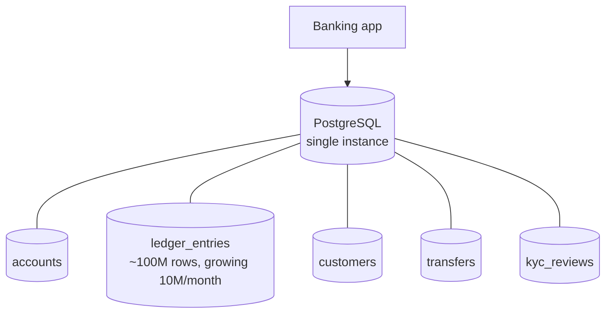
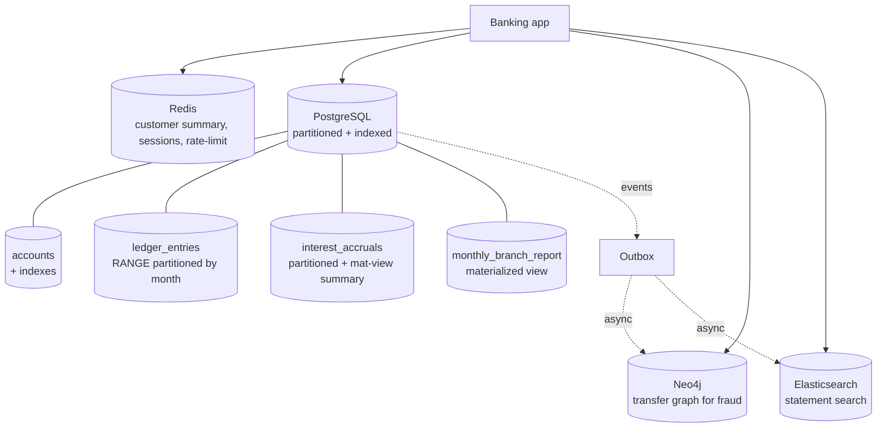

# Banking Performance Tuning — End to End

> Apply the optimization playbook to the Banking system. Five slow queries, five diagnoses, five fixes. By the end, the same hardware runs ten times the load — because the bottlenecks were named, not guessed.

## What you already know

From [[00-Query-Optimization-Strategy]]: the loop is `measure → diagnose → treat → measure again`. From [[01-Indexing-Strategy]]: the most common treatment is an index that matches the query's predicate and sort. From [[02-Denormalization-For-Reads]]: when a query cannot be made fast with an index, denormalize. From [[03-Caching]]: when a query is fast but hot, cache. From [[04-Partitioning-And-Sharding]]: when one database cannot hold the data, partition or shard. From [[00-Banking-Case-Study]]: the invariants that must never break.

## Why this layer exists

The previous five notes taught the *techniques*. This note applies them as a *system*. The Banking system has a workload: a mix of online transactional queries (transfers, balance lookups) and analytical queries (statement generation, daily interest, monthly reports). Each query has a different bottleneck; each requires a different treatment. The art of performance tuning is not in knowing the techniques — it is in *matching the technique to the bottleneck*.

This is also the note where the architecture of the *whole performance layer* becomes visible. By the end, the system has indexes on the hot paths, materialized views for the dashboards, partitioning for the ledger, and caching for the rarely-changing lookups. That combination is the final shape — and it was reached by measurement, not by guesswork.

## What is genuinely new here

> **The optimization playbook is not "add an index." It is "name the bottleneck, then choose the smallest treatment that resolves it."**

Five queries, five bottlenecks, five treatments — each chosen because the bottleneck was *named*, not because someone had a hammer.

## Concepts

### The five slow queries

| # | Query | Bottleneck family | Treatment |
|---|---|---|---|
| 1 | Statement generation | Scan + sort | Composite covering index |
| 2 | Balance query | None (already fast) — but hot | Cache customer summary |
| 3 | Fraud detection (graph traversal) | Cross-table joins, full scan | Denormalize into a graph store |
| 4 | Daily interest accrual | Aggregate over millions of rows | Partition + batch + summary table |
| 5 | Monthly report | Multi-join aggregate | Materialized view |

Each is treated with the *smallest* tool that resolves the bottleneck — not with the most powerful tool available.

## Banking application

The system before tuning:



Every query hits the same PostgreSQL instance. The ledger table is large and growing. There are no materialized views, no partitioning, no cache. The system is correct — and the dashboard is on fire.

### Query 1: Statement generation

**Original plan** (from [[00-Query-Optimization-Strategy]]):

```text
Sort (external merge, 12MB on disk) -> Parallel Seq Scan on ledger_entries
Execution Time: 1912 ms
```

**Diagnosis**: scan + sort. The query scans the whole `ledger_entries` table because there is no usable index, then sorts the survivors on disk.

**Fix**: composite covering index.

```sql
CREATE INDEX idx_ledger_account_time
  ON ledger_entries (account_id, occurred_at DESC, id DESC)
  INCLUDE (amount, description, counterparty_iban);
```

**After plan**:

```text
Index Scan using idx_ledger_account_time (Index Cond: account_id = ? AND occurred_at >= ? AND occurred_at < ?)
Execution Time: 3 ms
```

**Speedup**: ~640x. Same data, same hardware. The planner just got a structure that matches the question.

### Query 2: Balance query (and customer summary)

**Original query** (rendered on every screen):

```sql
SELECT c.name, c.email, a.iban, a.current_balance, a.type
FROM customers c
JOIN accounts a ON a.customer_id = c.id
WHERE c.id = $1;
```

**Original plan**: indexed lookup on `customers.id`, then nested loop into `accounts(customer_id)` (indexed). Execution time: 2ms. The query is *already fast* — but it runs on every page render, hundreds of times per second per customer. The database is doing the same join over and over for the same customer.

**Diagnosis**: not a slow query — a *hot* query. The bottleneck is throughput, not latency. The customer summary changes rarely (only when the customer updates their profile, or an account is opened/closed).

**Fix**: cache the customer summary in Redis, with explicit invalidation on profile update.

```java
@Component
public class CustomerSummaryCache {
    private final RedisTemplate<String, CustomerSummary> redis;
    private final CustomerRepository repo;

    public CustomerSummary get(long customerId) {
        String key = "cust:" + customerId + ":summary:v1";
        CustomerSummary v = redis.opsForValue().get(key);
        if (v != null) return v;
        v = repo.loadSummary(customerId);
        redis.opsForValue().set(key, v, Duration.ofMinutes(15));
        return v;
    }
    public void invalidate(long customerId) { redis.delete("cust:" + customerId + ":summary:v1"); }
}
```

**After**: ~1ms from Redis, with 95% hit rate. Database load for summary queries drops by 20x. The remaining 5% miss rate is absorbed easily.

**Speedup**: 20x reduction in DB load for this query. The balance itself is *not* cached — it changes on every transaction.

### Query 3: Fraud detection — "find rings of accounts that transfer to each other within 7 days"

**Original query** (in SQL, conceptually):

```sql
WITH transfers AS (
    SELECT from_account, to_account, occurred_at FROM ledger_entries
    WHERE amount > 1000 AND occurred_at > NOW() - INTERVAL '30 days'
)
SELECT DISTINCT t1.from_account
FROM transfers t1
JOIN transfers t2 ON t1.to_account = t2.from_account
JOIN transfers t3 ON t2.to_account = t3.from_account AND t3.to_account = t1.from_account
WHERE t2.occurred_at - t1.occurred_at < INTERVAL '7 days'
  AND t3.occurred_at - t2.occurred_at < INTERVAL '7 days';
```

**Original plan**: `Seq Scan` on `ledger_entries` (30-day window = ~30M rows), then three self-joins. Execution time: 90+ seconds. The query times out.

**Diagnosis**: this is fundamentally a *graph* problem — "find cycles of length 3 in a directed graph." SQL is the wrong tool. No index can save a graph traversal; the join pattern is the bottleneck, not the access pattern.

**Fix**: denormalize the transfer graph into a graph database (Neo4j) — see [[04-Graph-Stores]]. The transfer flow writes both a ledger entry and an edge `(from_account)-[:TRANSFERRED {amount, at}]->(to_account)` to Neo4j (via an outbox, see [[04-Domain-Events]]).

```cypher
// Find 3-cycles completed within 7 days:
MATCH (a:Account)-[:TRANSFERRED {at: t1}]->(b:Account)-[:TRANSFERRED {at: t2}]->(c:Account)-[:TRANSFERRED {at: t3}]->(a)
WHERE duration.between(t1, t3) <= duration('P7D')
RETURN DISTINCT a.id
```

**After**: ~200ms in Neo4j, with the right indexes on `:Account(id)` and `:TRANSFERRED(at)`.

**Speedup**: ~450x. The bottleneck was not the database — it was the wrong data model for the question.

### Query 4: Daily interest accrual

**Original query** (runs nightly for all savings accounts):

```sql
INSERT INTO interest_accruals (account_id, day, amount)
SELECT a.id, CURRENT_DATE, a.current_balance * a.interest_rate / 365.0
FROM accounts a
WHERE a.type = 'SAVINGS' AND a.status = 'ACTIVE';
```

**Original plan**: `Seq Scan` on `accounts` (~10M rows), filter to savings (~2M rows), insert. Execution time: ~30s. Acceptable, but the *interest history* query ("show me my interest for the last 5 years") then scans `interest_accruals` which grows by 2M rows/day = 730M rows/year.

**Diagnosis**: the nightly job is fine; the *history* query is the bottleneck. Aggregate over hundreds of millions of rows.

**Fix**: partition `interest_accruals` by month (RANGE on `day`), and add a summary table for yearly totals.

```sql
CREATE TABLE interest_accruals (
    account_id BIGINT NOT NULL,
    day        DATE NOT NULL,
    amount     NUMERIC(18,4) NOT NULL,
    PRIMARY KEY (account_id, day)
) PARTITION BY RANGE (day);

CREATE TABLE interest_accruals_2024_01 PARTITION OF interest_accruals
    FOR VALUES FROM ('2024-01-01') TO ('2024-02-01');

-- Yearly summary, refreshed nightly:
CREATE MATERIALIZED VIEW interest_yearly AS
SELECT account_id,
       date_trunc('year', day) AS year,
       SUM(amount) AS yearly_interest
FROM interest_accruals
GROUP BY account_id, date_trunc('year', day);
CREATE UNIQUE INDEX ON interest_yearly (account_id, year);
```

**After**: history query hits the materialized view (1 row per year per account) — sub-millisecond. Detail query hits one partition.

**Speedup**: ~1000x for the history query.

### Query 5: Monthly report — "total deposits, withdrawals, transfers, new accounts per branch"

**Original query**:

```sql
SELECT
    b.id AS branch_id,
    SUM(CASE WHEN le.amount > 0 THEN le.amount ELSE 0 END) AS deposits,
    SUM(CASE WHEN le.amount < 0 THEN le.amount ELSE 0 END) AS withdrawals,
    COUNT(DISTINCT t.id) AS transfer_count,
    COUNT(DISTINCT CASE WHEN a.opened_at >= '2024-01-01' THEN a.id END) AS new_accounts
FROM branches b
JOIN customers c ON c.branch_id = b.id
JOIN accounts a ON a.customer_id = c.id
JOIN ledger_entries le ON le.account_id = a.id AND le.occurred_at >= '2024-01-01' AND le.occurred_at < '2024-02-01'
LEFT JOIN transfers t ON t.from_account_id = a.id AND t.created_at >= '2024-01-01' AND t.created_at < '2024-02-01'
GROUP BY b.id;
```

**Original plan**: multi-join over `branches → customers → accounts → ledger_entries → transfers`, full scan of the month's `ledger_entries`. Execution time: 45s. The CFO's monthly report.

**Diagnosis**: this is a reporting query — it does not need to be live. The data is historical; the report can be slightly stale.

**Fix**: materialized view, refreshed nightly.

```sql
CREATE MATERIALIZED VIEW monthly_branch_report AS
SELECT /* the same query above */ ;
CREATE UNIQUE INDEX ON monthly_branch_report (branch_id, month);

-- Refresh nightly:
REFRESH MATERIALIZED VIEW CONCURRENTLY monthly_branch_report;
```

**After**: `SELECT * FROM monthly_branch_report` — 5ms.

**Speedup**: ~9000x for the report query, at the cost of one day of staleness (acceptable — the report is called "monthly").

### The final architecture



The combination:
- **Indexes** on every hot query path (Query 1).
- **Cache** for the customer summary (Query 2).
- **Graph store** for fraud detection (Query 3).
- **Partitioning + summary table** for the time-series (Query 4).
- **Materialized views** for the monthly reports (Query 5).

Each treatment is the smallest that resolved the bottleneck. Nothing is over-engineered. The system does five things in parallel that one PostgreSQL instance could not do serially.

## Code / diagrams

### Putting it together — the tuning playbook as a script

```java
public final class PerformancePlaybook {

    // Run this once per quarter, or after any major schema change.
    public void audit() {
        // 1. Find slow queries (pg_stat_statements).
        // 2. For each: EXPLAIN ANALYZE.
        // 3. Classify: scan / join / sort / aggregate.
        // 4. Pick the smallest treatment:
        //    scan     -> index
        //    sort     -> sort-supporting index
        //    join     -> inner index / denormalize / different store
        //    aggregate -> materialized view / partition / sample
        // 5. Apply; re-measure; ship or revert.
    }
}
```

### The trade-off summary table

| Query | Treatment | Trade-off |
|---|---|---|
| Statement | Covering index | Write cost on `ledger_entries` (acceptable — inserts are not the bottleneck) |
| Balance + summary | Cache | 15min staleness on customer summary (acceptable) |
| Fraud | Move to Neo4j | Operational complexity of a second datastore (acceptable — fraud is critical) |
| Interest | Partition + summary | Nightly refresh lag (acceptable — interest history is not real-time) |
| Monthly report | Materialized view | 24h staleness (acceptable — the report is called monthly) |

Every trade-off is *explicit*. None was made by accident.

## What can go wrong

- **Treatments accumulate.** Each treatment is small; together they form a complex system. Document the architecture, the trade-offs, and the refresh policies in one place — or future engineers will not understand why the system is shaped this way.
- **Refresh jobs fail silently.** A materialized view that stops refreshing is a slow-burning data corruption. Alert on refresh failure; alert on stale data (>2x the expected staleness).
- **The cache becomes the source of truth.** When the application reads only from Redis, the database becomes a write-only log. Redis failure is then a full outage. Always have a "fall back to DB" path.
- **Cross-store consistency drift.** PostgreSQL → Neo4j via outbox is eventually consistent. A transfer is in PostgreSQL before it is in Neo4j; a fraud query run in the gap will miss it. Decide explicitly whether that gap is acceptable (see [[04-Eventual-Consistency]]).
- **Index bloat on the hot tables.** `ledger_entries` has many indexes (covering, partitioned). Schedule `REINDEX CONCURRENTLY` regularly.
- **Over-tuning.** A 2ms query does not need to be a 0.2ms query. Stop when the SLO is met (see [[00-Query-Optimization-Strategy]]).

## Trade-offs

- **Latency vs operational complexity.** Five tools (PostgreSQL, Redis, Neo4j, Elasticsearch, materialized views) give low latency; they also give five things that can fail, five things to operate, five things to keep in sync.
- **Staleness vs freshness.** Every denormalization accepts some staleness. Be explicit about the contract; enforce it.
- **Strong vs eventual consistency across stores.** The core ledger is strongly consistent (single PostgreSQL). The fraud graph, the search index, the dashboard — these are eventually consistent. The boundary is explicit.
- **Throughput vs simplicity.** A single PostgreSQL instance is simple. A polyglot architecture is fast. The trade is fundamental (see [[05-Banking-NoSQL-Choice]]).

## Forward links

- [[00-Query-Optimization-Strategy]] — the loop that produced this architecture.
- [[01-Indexing-Strategy]] — the index treatments.
- [[02-Denormalization-For-Reads]] — the materialized view treatments.
- [[03-Caching]] — the Redis treatment.
- [[04-Partitioning-And-Sharding]] — the ledger partitioning.
- [[05-Banking-NoSQL-Choice]] — the polyglot persistence decision.
- [[05-Banking-Distributed-Design]] — how this fits in the distributed architecture.
- [[09-Banking-Query-Plans]] — the EXPLAIN outputs for the original plans.
- [[00-Banking-Case-Study]] — the invariants every treatment preserved.
- [[08-Trade-offs-Everywhere]] — every treatment is a trade-off; this note makes them visible.
