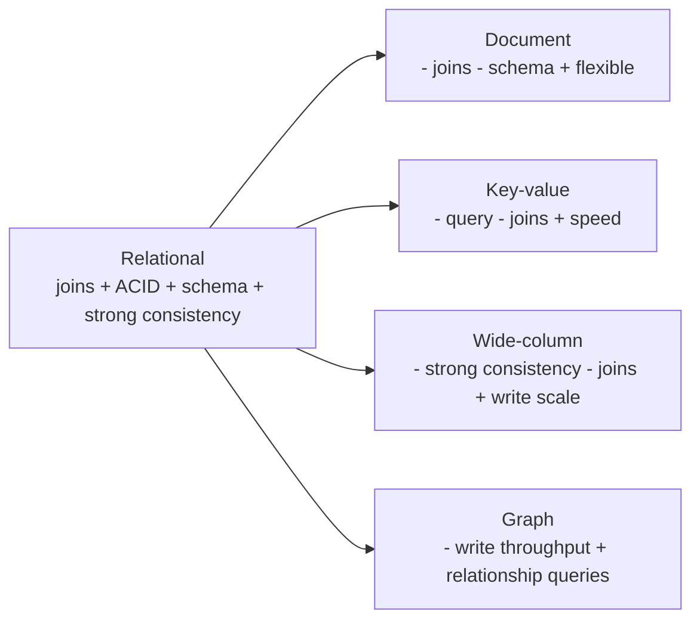
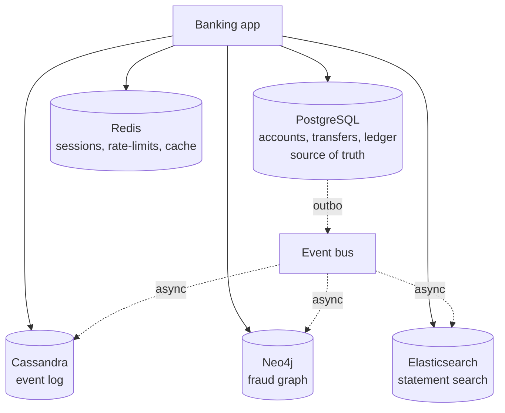
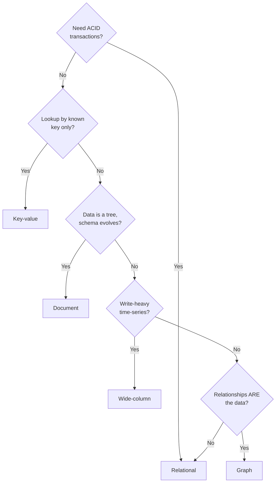

# When Relational Strains

> NoSQL did not replace relational databases. It gave us a *second tool* for the problems relational databases were never good at — and a vocabulary for the trade-offs we were already making silently.

## What you already know

From [[00-Relational-Model]]: the relational model is sets of tuples, queried by algebra, constrained by keys and normalization. From [[00-ACID]]: relational databases guarantee atomic, consistent, isolated, durable transactions. From [[04-Abstraction-and-Models]]: an abstraction is *selective forgetting for a purpose* — every model throws away some detail to be useful for a question. From [[08-Trade-offs-Everywhere]]: every choice trades one thing for another; the question is *which trade fits the problem*.

## Why this layer exists

Relational databases are extraordinary. They give you:

- A mathematical foundation (relational algebra, normalization).
- A declarative query language (SQL) that separates *what* from *how*.
- ACID transactions, so a group of operations either all happen or none do.
- Strong consistency, so every read sees the latest committed write.
- A mature ecosystem of tools, ORMs, operators, and best practices.

For most business applications, this is exactly right. The Banking system (see [[00-Banking-Case-Study]]) lives entirely in PostgreSQL because every one of those guarantees is essential.

But relational databases have *costs* — costs that become painful at the extremes:

- **Scale cost.** A single relational database has a write-throughput ceiling. Vertical scaling (bigger machine) gets you so far; then you hit the ceiling, and the next step is sharding — which relational databases do awkwardly (see [[04-Partitioning-And-Sharding]]).
- **Schema rigidity cost.** Every column is typed; every change is a migration. For data whose shape evolves rapidly (events, logs, content), this is friction.
- **Impedance mismatch cost.** Objects do not map cleanly to tables (see [[00-ORM-Impedance-Mismatch]]). Polymorphism, inheritance, embedded aggregates — all require awkward workarounds in pure relational.
- **Join cost at scale.** A six-table join on a billion-row table is slow even with perfect indexes. For some access patterns (graph traversals, full-text search), the relational model is structurally the wrong fit.
- **Consistency cost.** Strong consistency requires coordination. Coordination is slow under partition (see [[00-CAP-PACELC]]). For workloads where eventual consistency is acceptable, paying for strong consistency is overkill.

NoSQL exists because for *some* workloads, one or more of these costs is the dominant constraint — and the relational answer is to swallow the cost, even when the workload does not need the guarantee that the cost buys.

## What is genuinely new here

> **NoSQL gives up something (joins, transactions, consistency, schema) for something else (scale, flexibility, performance). The decision is which guarantee the workload does not need — and which NoSQL family gives that up at the right place.**

NoSQL is not a single thing. It is four families, each of which gives up a *different* guarantee. Picking NoSQL is not "modern." It is a trade-off — and like all trade-offs, it must be made explicitly.

## Concepts

### The four NoSQL families

| Family | Model | Gives up | Keeps | Examples |
|---|---|---|---|---|
| **Document** | JSON-like documents, nested | Joins, schema | Flexible schema, embedded aggregates | MongoDB, Couchbase, PostgreSQL JSONB |
| **Key-value** | `get/put/delete` by key | Query, range, joins | Extreme performance, simplicity | Redis, Memcached, DynamoDB |
| **Wide-column** | Partition key + clustering + columns | Strong consistency, joins | Massive write scale, time-series | Cassandra, HBase, ScyllaDB |
| **Graph** | Nodes + edges + properties | High write throughput, simple KV | Relationship queries, traversals | Neo4j, TigerGraph, Neptune |

Each family is the answer to a different question:

- *Document*: "What if my data is naturally a tree, not a flat tuple?"
- *Key-value*: "What if I only ever look things up by a known key?"
- *Wide-column*: "What if I write far more than I read, and I write across many partitions?"
- *Graph*: "What if the relationships *are* the data?"

### The trade-off axis

For each family, the trade-off is explicit:



### When relational is the wrong fit

| Symptom | Likely cause | Candidate NoSQL |
|---|---|---|
| Petabyte+ data, single DB cannot hold it | Storage ceiling | Wide-column (Cassandra) |
| Write throughput exceeds single DB | Coordination cost | Wide-column, or KV sharded |
| Semi-structured data, schema evolves weekly | Schema rigidity | Document |
| Object model is a deep tree; joins are awkward | Impedance mismatch | Document |
| Access is always by a known key | You don't need query | Key-value |
| The relationships *are* the data | Joins on joins on joins | Graph |
| Full-text search with ranking | SQL `LIKE` is wrong | Elasticsearch (search-engine, related) |

### When relational is the right fit (don't migrate prematurely)

- **Transactional correctness is required.** Financial balances, inventory, orders — anything where "wrong" costs money. Relational's ACID is the right default (see [[00-ACID]]).
- **Complex queries across multiple entities.** Ad-hoc reporting, joins across many tables, aggregations — relational is structurally built for this.
- **The schema is stable.** If the data shape has not changed in years, schema rigidity is a feature, not a cost.
- **Strong consistency is required.** No eventual staleness is acceptable.
- **The workload is small enough.** A 100GB database with 1000 writes/sec is well within any relational database's comfort zone.

The Banking system fits all five. It should stay in PostgreSQL.

### Polyglot persistence

Most real systems do not pick *one* store. They pick a *primary* store for the source of truth, and *secondary* stores for specific access patterns:

- PostgreSQL for the core ledger (transactions, ACID).
- Redis for caching and rate-limiting.
- Elasticsearch for full-text search.
- Cassandra for the event log (time-series).
- Neo4j for fraud detection.

This is *polyglot persistence* — each store is chosen for the question it answers best. The trade-off is operational complexity (see [[05-Banking-NoSQL-Choice]]).

### The rule

> **Pick NoSQL when relational cannot meet the requirement, not because it's "modern."**

The decision is driven by *a specific requirement that relational fails to meet*, not by fashion. If you cannot name the requirement, do not migrate. If you can name it, the right NoSQL family is usually obvious from the table above.

## Banking application

The Banking system (see [[00-Banking-Case-Study]]) is overwhelmingly relational — but it has subsystems where relational strains:

| Subsystem | Why relational strains | Candidate NoSQL |
|---|---|---|
| Audit log | Append-only, semi-structured (different event types), huge | Document (PostgreSQL JSONB) |
| Event log | Append-only, time-series, massive write rate | Wide-column (Cassandra) |
| Customer session | Per-customer, ephemeral, lookup by key | Key-value (Redis) |
| Rate-limit counters | Write-heavy, lookup by key | Key-value (Redis) |
| Statement search | Full-text, ranking, fuzzy | Elasticsearch |
| Fraud detection | Graph traversal (cycles, rings) | Graph (Neo4j) |
| Customer profile photos | Binary blobs, content-addressed | Object storage (S3) |

Notice that the *core* — accounts, transfers, ledger, balances — is *not* on this list. The core stays in PostgreSQL. NoSQL is the *secondary* layer, used where the access pattern demands it.

### The polyglot architecture



PostgreSQL remains the source of truth. The other stores are *projections* — populated from events emitted by PostgreSQL, eventually consistent with it. This is the CQRS pattern (see [[04-Enterprise-Patterns]]).

## Code / diagrams

### Deciding the store — a decision tree



### The same fact, modeled four ways

A customer's profile, modeled in each NoSQL family:

```javascript
// Document (MongoDB):
db.customers.insertOne({
  _id: 123,
  name: "Alice",
  accounts: [
    { iban: "DE...", type: "checking", balance: 1000 },
    { iban: "DE...", type: "savings",  balance: 5000 }
  ]
});

// Key-value (Redis):
SET customer:123:profile '{"name":"Alice",...}'

// Wide-column (Cassandra):
INSERT INTO customers (customer_id, name, account_count) VALUES (123, 'Alice', 2);

// Graph (Neo4j):
CREATE (c:Customer {id: 123, name: 'Alice'})
CREATE (a1:Account {iban: 'DE...', type: 'checking'})
CREATE (a2:Account {iban: 'DE...', type: 'savings'})
CREATE (c)-[:OWNS]->(a1)
CREATE (c)-[:OWNS]->(a2)
```

The *fact* is the same. The *abstraction* differs because the *question* differs — document for "give me the whole profile," KV for "give me this key," wide-column for "give me the customer row," graph for "find accounts owned by this customer's friends."

## What can go wrong

- **Cargo-cult NoSQL.** "MongoDB is web-scale." Picking NoSQL without naming the requirement produces a system that is slower, less consistent, and more operationally complex than the relational version it replaced.
- **Losing transactions.** Many NoSQL stores do not have multi-object transactions. A transfer modeled in MongoDB loses the "either both sides happen or neither does" guarantee. This is *not acceptable* for finance.
- **Losing joins.** A reporting query that joins five tables in SQL becomes five application-level queries in NoSQL, plus an in-memory join. Often *slower* than the relational version.
- **Losing schema enforcement.** Document stores let any field be any type. A typo in one insert can break every consumer of that collection. Use schema validation where available (MongoDB validators, JSONB `CHECK` constraints).
- **Operational sprawl.** Each store is a new thing to deploy, monitor, back up, and recover. Five stores = five times the operational surface.
- **Data sync drift.** When the same fact lives in PostgreSQL and Neo4j, the two can disagree. The system must have a way to detect and recover from drift (reconciliation jobs, see [[02-Denormalization-For-Reads]]).
- **Vendor lock-in.** NoSQL query languages are not standardized (Cypher, Gremlin, CQL, MongoDB's query language). Migrating between vendors is expensive.
- **"We'll add joins in the application."** This works for two tables. For five, you have rebuilt a slow, buggy relational database in application code.

## Trade-offs

- **Consistency vs scale.** NoSQL often chooses eventual consistency to scale. Acceptable for notifications; not acceptable for balances.
- **Schema vs flexibility.** Schema is a guardrail; flexibility is freedom. Most data benefits from guardrails.
- **Joins vs performance.** NoSQL stores are fast because they precompute or denormalize. The cost is paid at write time, in code complexity.
- **Maturity vs novelty.** Relational databases have 50 years of tooling. NoSQL has 15. Both are mature enough for production — but relational's ecosystem is deeper.
- **Operational simplicity vs polyglot power.** One database is simpler to operate. Five databases are more powerful per workload. The trade is real.
- **Reversibility.** Going from relational to NoSQL is a migration. Going back is a bigger one. Treat as a one-way door (see [[08-Trade-offs-Everywhere]]).

## Forward links

- [[01-Document-Stores]] — the family for tree-shaped data.
- [[02-Key-Value-Stores]] — the family for known-key access.
- [[03-Wide-Column-Stores]] — the family for massive write scale.
- [[04-Graph-Stores]] — the family for relationship-first data.
- [[05-Banking-NoSQL-Choice]] — the full Banking polyglot architecture.
- [[00-Relational-Model]] — the model we are contrasting.
- [[00-ACID]] — the guarantee some NoSQL stores relax.
- [[00-CAP-PACELC]] — the formal version of the consistency-availability trade.
- [[04-Abstraction-and-Models]] — each NoSQL family is a different abstraction of the same data.
- [[08-Trade-offs-Everywhere]] — NoSQL is the clearest trade-off in the vault.
