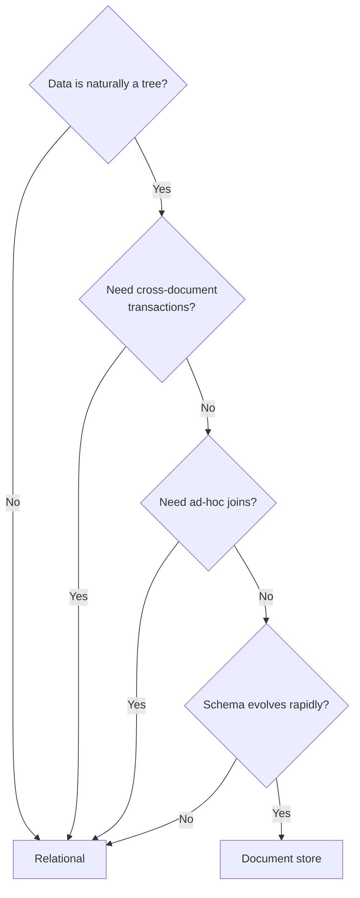
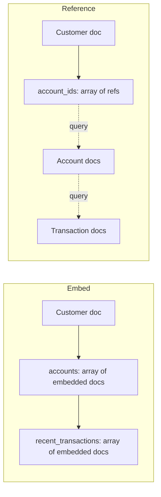

# Document Stores

> A document store models data as a tree (nested objects), not a flat tuple. It is the right answer when your data is naturally hierarchical and the schema evolves often — and the wrong answer when you need cross-document transactions or ad-hoc joins.

## What you already know

From [[00-When-Relational-Strains]]: NoSQL gives up something for something else. Document stores give up joins and schema enforcement for flexibility. From [[04-Abstraction-and-Models]]: an abstraction is selective forgetting for a purpose. A document forgets "rows are flat"; it remembers "objects are trees." From [[00-ORM-Impedance-Mismatch]]: the impedance mismatch between objects and tables is the source of much ORM complexity. From [[07-Composition-vs-Inheritance]]: composition produces trees of objects, which tables store awkwardly.

## Why this layer exists

Relational tables are *flat*. A row is a tuple of columns. To represent nested data — a customer with their accounts, with each account's recent transactions — you need three tables and two joins. The same data, in JSON, is one document:

```javascript
{
  "id": 123,
  "name": "Alice",
  "accounts": [
    {
      "iban": "DE89...",
      "type": "checking",
      "balance": 1000,
      "recent_transactions": [
        { "amount": -100, "at": "2024-01-15T10:30:00Z" },
        { "amount": +500, "at": "2024-01-14T09:00:00Z" }
      ]
    }
  ]
}
```

The document *is* the aggregate. No joins needed. The application's view of the data and the database's view of the data are the same shape — that is the impedance mismatch inverted.

This layer exists because some data is naturally a document:

- **Content management** — an article with embedded paragraphs, images, metadata.
- **Catalogs** — a product with variants, attributes, images, reviews.
- **User profiles** — flexible attributes that vary per user.
- **Event logs** — each event has a different shape, but a common envelope.
- **Configuration** — nested, schema-light, evolving.

For these, the relational model's rigidity (every column typed, every change a migration) is the cost; the document model's flexibility (any field, any type, no migration) is the benefit.

## What is genuinely new here

> **A document store inverts the impedance mismatch: objects map directly to documents, no ORM translation layer required. The cost is that joins, transactions, and schema enforcement move from the database to the application.**

The trade is explicit: the database stops being the source of structural truth, and the application takes over that role.

## Concepts

### The model

- **Document** — a self-contained record, usually JSON or BSON. Has a unique ID.
- **Collection** — a group of documents; analogous to a table, but documents in a collection can have completely different shapes.
- **Embedded subdocument** — a nested object inside a document (e.g., the `accounts` array above).
- **Reference** — a document ID pointing to another document, used when embedding would duplicate or bloat.

### Embedding vs referencing

The fundamental design decision in document stores:

| Pattern | When to use | Trade-off |
|---|---|---|
| **Embed** | "One-to-few" relationship; child is read with parent; child has no independent life | Document grows; large documents are slow to load; updating one child rewrites the whole document |
| **Reference** | "One-to-many" or "many-to-many"; child has an independent life; child is shared | Requires a second query (or a `$lookup` join); loses the "one document" advantage |

Embedding is the *advantage* of document stores. Referencing is the *fallback* that makes them look like a slower relational database.

### The query model

Document stores support:

- **Field equality** — `db.customers.find({"name": "Alice"})`.
- **Field path** — `db.customers.find({"accounts.type": "checking"})`.
- **Range** — `db.customers.find({"accounts.balance": {"$gt": 500}})`.
- **Array membership** — `db.customers.find({"tags": "vip"})`.
- **Aggregation pipelines** — `db.ledger.aggregate([{$match:...}, {$group:...}])`.

But they do *not* support arbitrary joins. The `$lookup` operator exists in MongoDB but is slow and discouraged — if you need joins, you probably want a relational database.

### Schema flexibility — and its costs

Documents in the same collection can have different fields. This is a feature when the schema evolves; it is a bug when a typo produces an inconsistent document.

Most document stores now support *schema validation*:

- MongoDB validators (JSON Schema).
- Couchbase full-text + schema enforcement.
- PostgreSQL JSONB with `CHECK` constraints.

Use them. Flexibility without validation is a foot-gun.

### PostgreSQL JSONB — the hybrid

PostgreSQL's `JSONB` type gives you document storage inside a relational database. You get:

- SQL queries over JSON paths (`WHERE data->>'name' = 'Alice'`).
- GIN indexes on JSONB for fast lookup (`CREATE INDEX ON customers USING GIN (data)`).
- Transactions across JSONB and relational columns.
- Joins between a JSONB document and a relational table.

This is the "best of both worlds" pattern: relational for the parts that need transactions and joins; document for the parts that need flexibility.

## Banking application

The Banking system (see [[00-Banking-Case-Study]]) has one natural document use case: the **audit log**.

Every state change — a transfer, a KYC approval, a freeze, a closure — produces an audit record. Different events have different shapes:

```json
// A transfer event
{
  "event_id": "evt_001",
  "type": "TRANSFER",
  "at": "2024-01-15T10:30:00Z",
  "actor": { "user_id": 42, "ip": "1.2.3.4" },
  "transfer": { "from": "DE...", "to": "DE...", "amount": 100.00, "currency": "EUR" },
  "result": "SUCCESS"
}

// A KYC event
{
  "event_id": "evt_002",
  "type": "KYC_DECISION",
  "at": "2024-01-15T11:00:00Z",
  "actor": { "user_id": 7, "role": "COMPLIANCE_OFFICER" },
  "kyc": { "customer_id": 123, "decision": "APPROVED", "score": 0.92 },
  "result": "SUCCESS"
}

// A freeze event
{
  "event_id": "evt_003",
  "type": "ACCOUNT_FROZEN",
  "at": "2024-01-15T12:00:00Z",
  "actor": { "system": "fraud-service" },
  "account": { "id": 999, "reason": "SUSPECTED_FRAUD" },
  "result": "SUCCESS"
}
```

Modeling this in pure relational requires either:

- A wide table with many nullable columns (one per event type) — sparse, ugly.
- A table-per-event-type — many tables, no common query.
- An entity-attribute-value (EAV) table — flexible but query-hostile.

Modeling it as JSONB in PostgreSQL gives the best of all worlds:

```sql
CREATE TABLE audit_log (
    id          BIGSERIAL PRIMARY KEY,
    event_id    TEXT UNIQUE NOT NULL,
    event_type  TEXT NOT NULL,
    occurred_at TIMESTAMPTZ NOT NULL,
    actor       JSONB NOT NULL,
    payload     JSONB NOT NULL,
    result      TEXT NOT NULL
);

CREATE INDEX idx_audit_type_time ON audit_log (event_type, occurred_at DESC);
CREATE INDEX idx_audit_payload   ON audit_log USING GIN (payload);
```

Now:

- "All events for customer 123" — `WHERE payload @> '{"customer_id": 123}'` (GIN-accelerated).
- "All TRANSFER events in the last hour" — `WHERE event_type = 'TRANSFER' AND occurred_at > NOW() - INTERVAL '1 hour'`.
- "All events from user 42" — `WHERE actor @> '{"user_id": 42}'`.

The relational columns (`event_type`, `occurred_at`) handle the hot queries; the JSONB `payload` handles the flexible, event-specific data.

This is *polyglot persistence within one database* — the relational model for the structured core, the document model for the flexible periphery. The same approach works for many "log" or "event" tables.

## Code / diagrams

### Storing an audit event (Java + JDBC)

```java
public final class AuditLogRepository {

    private final JdbcTemplate jdbc;

    public void append(AuditEvent event) {
        String sql = """
            INSERT INTO audit_log (event_id, event_type, occurred_at, actor, payload, result)
            VALUES (?, ?, ?, ?::jsonb, ?::jsonb, ?)
            """;
        jdbc.update(sql,
            event.eventId(),
            event.type(),
            Timestamp.from(event.at()),
            toJson(event.actor()),
            toJson(event.payload()),
            event.result()
        );
    }

    public List<AuditEvent> findByCustomer(long customerId, Instant from, Instant to) {
        String sql = """
            SELECT * FROM audit_log
             WHERE payload @> ?::jsonb
               AND occurred_at >= ?
               AND occurred_at <  ?
             ORDER BY occurred_at DESC
             LIMIT 500
            """;
        String filter = String.format("{\"customer_id\":%d}", customerId);
        return jdbc.query(sql, AuditLogRepository::map, filter, from, to);
    }

    private static String toJson(Object o) {
        try { return new ObjectMapper().writeValueAsString(o); }
        catch (JsonProcessingException e) { throw new UncheckedIOException(new IOException(e)); }
    }
}
```

### Document vs relational — the decision



### The embedding trade-off



Embedding is faster to read; referencing is more flexible and avoids bloat. Choose per relationship, not per system.

## What can go wrong

- **Unbounded document growth.** Embedding recent transactions in a customer document is fine — until the customer has 50,000 transactions and the document is 5MB. Every read loads all of it. Cap embedded arrays; move history to a separate collection when it grows.
- **No transaction across documents.** A transfer modeled as two document updates (debit account A's doc, credit account B's doc) is not atomic. Use a relational database for this, or accept eventual consistency with a saga.
- **Schema drift.** Different documents in the same collection have different field names (`name` vs `fullName` vs `customer_name`). Use validators from day one; otherwise the dataset becomes unqueriable.
- **$lookup is slow.** If you find yourself using `$lookup` (the MongoDB join) regularly, you have a relational problem dressed up as a document problem.
- **Index explosion.** GIN indexes on JSONB are powerful but large. Index only the paths you query.
- **Update amplification.** Updating one embedded array element rewrites the whole document. For write-heavy embedded arrays, use a separate collection.
- **Migration pain.** Adding a field is easy (just write it). Migrating existing documents to a new shape requires a script that scans the collection — slow, error-prone.
- **Consistency between documents.** If two documents share derived data (e.g., customer name appears in account docs), keeping them in sync is application code, not database constraint.

## Trade-offs

- **Flexibility vs schema safety.** Schemaless means "any bug becomes a schema." Validate.
- **Read speed vs update cost.** Embedding makes reads fast and updates expensive.
- **Document size vs query speed.** Large documents are slow to load and slow to update. Cap them.
- **Polyglot complexity vs single-store simplicity.** JSONB-in-PostgreSQL gives document flexibility with relational safety — at the cost of being neither pure document nor pure relational.
- **Transactions vs scale.** Pure document stores scale well by giving up transactions. If you need transactions, you don't get the scale benefit.
- **Query expressiveness vs performance.** MongoDB's aggregation pipeline is powerful but slower than SQL for complex joins.

## Forward links

- [[00-When-Relational-Strains]] — when document fits and when it doesn't.
- [[02-Key-Value-Stores]] — documents are often looked up by ID; KV is the simpler case.
- [[05-Banking-NoSQL-Choice]] — the audit log is the Banking document use case.
- [[00-ORM-Impedance-Mismatch]] — document stores invert the mismatch.
- [[07-Composition-vs-Inheritance]] — composition produces trees, which documents model naturally.
- [[07-Views-Materialized-Views]] — materialized views are a relational way to precompute document-like shapes.
- [[03-Triggers-As-Constraints]] — schema validation in document stores plays the role triggers play in relational.
- [[08-Trade-offs-Everywhere]] — embedding vs referencing is a classic trade-off.
