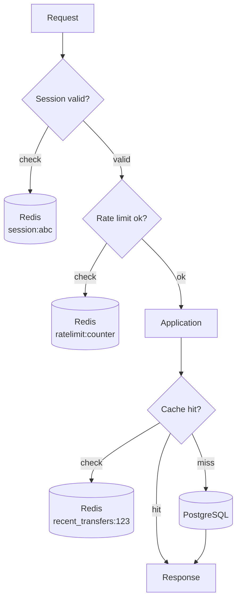

# Key-Value Stores

> The simplest possible data model: a key, a value, three operations (`get`, `put`, `delete`). Out of that simplicity comes extreme performance — and a clear limit on what you can ask.

## What you already know

From [[00-When-Relational-Strains]]: NoSQL gives up something for something else. Key-value stores give up *query* for *speed*. From [[03-Caching]]: a cache is a stored answer with a refresh policy. Redis, the most popular key-value store, is also the most popular cache. From [[04-Abstraction-and-Models]]: an abstraction is selective forgetting for a purpose. A key-value store forgets "rows have columns"; it remembers "this key has this value." From [[05-Identity-State-Lifecycle]]: looking things up by a known identifier is the most common access pattern — and key-value stores are the simplest expression of that.

## Why this layer exists

Almost every request a web application handles is, at its core, "give me the value for this key":

- "Show me the session for session-id X."
- "Show me the customer record for customer-id X."
- "Show me the product for product-id X."
- "How many requests has user X made in the last minute?" (a counter)
- "What is the current bid on auction X?" (a single value)

When you look at the workload this way, the database is doing enormous work to answer trivial questions. It parses the SQL, plans the query, walks a B-tree, fetches a page, extracts one row, marshals the columns. For a hot key accessed a thousand times per second, this is overkill — what you actually need is a hash table.

A key-value store is a hash table distributed across a network. It does *one* thing: map a key to a value. It does that one thing extraordinarily fast — typically sub-millisecond for in-memory stores (Redis, Memcached), low single-digit milliseconds for disk-backed stores (DynamoDB).

The key-value model exists because the relational model is overkill for these workloads. The simplicity is not a limitation; it is the *point*. By refusing to support query, joins, range scans, and transactions, the store can focus every cycle on `get` and `put` throughput.

## What is genuinely new here

> **A key-value store is a hash table with a network API. Its power is its simplicity; its limit is the absence of query. Use it for access-by-known-key — and only for that.**

## Concepts

### The model

Three operations:

- `GET key` → value (or "not found")
- `PUT key value [TTL]` → stores value, optionally with expiration
- `DELETE key` → removes

That's it. No `WHERE`, no `JOIN`, no `ORDER BY`, no `GROUP BY`. If you need those, you need a different store.

### Variants

| Variant | What it adds | Example |
|---|---|---|
| **In-memory only** | Sub-millisecond latency; data lost on restart (or on failover if no persistence) | Memcached |
| **In-memory + persistence** | Speed of memory with optional disk persistence (RDB snapshots, AOF log) | Redis |
| **Disk-backed, distributed** | Durability, automatic sharding, scale to petabytes; latency in single-digit ms | DynamoDB, Riak KV |
| **Strongly consistent KV** | Linearizable reads and writes; usually a single-region cost | DynamoDB (strong reads), etcd |

### Data types — Redis's extension

Redis is technically a *data-structure store*, not a pure key-value store. Each value can be:

- **String** — the basic value (text, binary, serialized JSON).
- **List** — ordered, push/pop from either end.
- **Set** — unordered unique elements.
- **Hash** — a map of fields to values (nested key-value).
- **Sorted set** — elements with scores, ordered by score. The basis for leaderboards.
- **Stream** — append-only log with consumer groups (a lightweight Kafka).
- **HyperLogLog** — approximate cardinality (count distinct in constant memory).
- **Bitmap** — bit-level operations for feature flags and presence.

This makes Redis far more capable than a pure KV store — but the *access pattern* is still by key. You address a list by its key; you address a hash by its key; you address a sorted set by its key.

### When it fits

| Pattern | Why KV is right |
|---|---|
| **Session storage** | Lookup by session ID; ephemeral; hot |
| **Caching** | The canonical KV use case (see [[03-Caching]]) |
| **Rate limiting** | Counter per user, with TTL window |
| **Leaderboards** | Sorted set, score = ranking value |
| **Real-time counters** | "Likes", "views", "active users" — atomic increments |
| **Distributed locks** | SET NX (set-if-not-exists) + TTL |
| **Pub/sub** | Redis pub/sub channels (not strictly KV, but in the same store) |
| **Feature flags** | Keyed by flag name; value is JSON config |

### When it fails

| Pattern | Why KV is wrong |
|---|---|
| **Range scans** ("all users created last week") | No way to scan; you'd need a separate sorted index |
| **Joins** ("customer and all their accounts") | Each is a separate GET; you do the join in application code |
| **Ad-hoc queries** | No query language; if you can't name the key, you can't find it |
| **Multi-key transactions** | Most KV stores don't support them; Redis has weak multi-key ops |
| **Aggregations** | No `SUM`, no `GROUP BY`; you maintain counters manually |
| **Complex filtering** | No `WHERE`; you maintain secondary indexes manually |

The general rule: if you can't pre-name the keys, KV is the wrong store.

## Banking application

The Banking system (see [[00-Banking-Case-Study]]) uses Redis for three purposes:

### 1. Customer session

After login, the customer's session is stored in Redis:

```
SET session:abc123 '{"customer_id":123,"name":"Alice","roles":["CUSTOMER"],"expires_at":"..."}' EX 3600
```

Every request from the customer includes `session:abc123`; the application does `GET session:abc123`. If found, the customer is authenticated. The TTL ensures the session expires automatically after one hour.

Why KV: the lookup is by a known key (the session ID); the data is small; the access is hot; ephemeral data is fine.

### 2. Rate-limit counters

Each API endpoint has a per-customer rate limit: 100 requests per minute. Redis maintains a sliding window counter:

```
INCR ratelimit:customer:123:transfer:2024-01-15T10:30
EXPIRE ratelimit:customer:123:transfer:2024-01-15T10:30 120
```

Per-minute counters; the application checks `GET ratelimit:customer:123:transfer:<minute>` before allowing the request. If the count exceeds 100, the request is rejected with HTTP 429.

Why KV: write-heavy (increment on every request), lookup by known key (customer ID + endpoint + minute), ephemeral (old minutes age out via TTL).

### 3. Recent-transfers cache

The "recent activity" widget on the dashboard shows the customer's last 5 transfers. Computing this from PostgreSQL on every dashboard load is wasteful — the data changes slowly (a transfer every few minutes, not seconds).

```
SET recent_transfers:customer:123 '[
  {"id":"t_001","amount":-100,"at":"..."},
  {"id":"t_002","amount":+500,"at":"..."},
  ...
]' EX 30
```

30-second TTL. On a cache miss, the application queries PostgreSQL and populates. The customer sees up-to-30-second-stale data — acceptable for a dashboard widget.

Why KV: hot read, change-rare data, known key (customer ID), small payload (5 entries).

### What stays in PostgreSQL

- The current balance. KV would be stale on every transaction.
- The ledger entries. The query patterns are range scans, not key lookups.
- The customer's full profile (only the summary is cached, see [[03-Caching]]).

The boundary is explicit: Redis holds *projections* and *ephemeral state*; PostgreSQL holds the *source of truth*.

## Code / diagrams

### Session lookup (Java + Redis)

```java
@Component
public class SessionStore {

    private final RedisTemplate<String, String> redis;

    public Optional<Session> find(String sessionId) {
        String key = "session:" + sessionId;
        String json = redis.opsForValue().get(key);
        if (json == null) return Optional.empty();
        // Refresh TTL on access (sliding expiration):
        redis.expire(key, Duration.ofHours(1));
        return Optional.of(parse(json));
    }

    public void save(String sessionId, Session session) {
        redis.opsForValue().set(
            "session:" + sessionId,
            toJson(session),
            Duration.ofHours(1)
        );
    }

    public void delete(String sessionId) {
        redis.delete("session:" + sessionId);
    }
}
```

### Rate limiter (Java + Redis)

```java
@Component
public class RateLimiter {

    private final RedisTemplate<String, String> redis;
    private static final int LIMIT = 100;
    private static final Duration WINDOW = Duration.ofMinutes(1);

    public boolean allow(String customerId, String endpoint) {
        String minute = OffsetDateTime.now().truncatedTo(ChronoUnit.MINUTES).toString();
        String key = "ratelimit:" + customerId + ":" + endpoint + ":" + minute;
        Long count = redis.opsForValue().increment(key);
        if (count == 1) redis.expire(key, WINDOW.plusSeconds(10));
        return count <= LIMIT;
    }
}
```

### The KV layer in context



Three Redis lookups per request — each sub-millisecond — together replacing work that would otherwise hit PostgreSQL three times.

## What can go wrong

- **Cache stampede (thundering herd).** A hot key expires; 1000 requests miss simultaneously and crush PostgreSQL. Use a per-key lock on miss (see [[03-Caching]]).
- **Memory exhaustion.** Redis stores everything in RAM. A few large values or an unbounded keyspace will OOM the cluster. Set `maxmemory` and an eviction policy (`allkeys-lru` for cache, `noeviction` for sessions).
- **Replication lag.** Redis replicas are asynchronous. A read from a replica may be stale — fine for cache, not fine for distributed locks.
- **Single point of failure.** A single Redis instance is one machine. Use Redis Cluster or Sentinel for HA. Or accept the failure (cache down → fall back to DB, slower but functional).
- **Loss of persistence.** Redis persistence (RDB + AOF) is asynchronous; a crash can lose the last few seconds. If you need durable writes, KV is not the right primary store.
- **Cross-key transactions.** Redis has `MULTI/EXEC` but it's not a real transaction — no rollback on failure. If you need atomic multi-key operations, you need a different store.
- **Network round-trip overhead.** A 0.1ms PostgreSQL lookup cached in Redis at 0.5ms is *slower* than reading the DB. Cache only what is more expensive than the cache lookup.
- **Hot keys.** One key accessed by every request creates a hot shard. Redis Cluster cannot move a single key to a different node. For globally-hot keys, use client-side caching or read replicas.
- **Schema hidden in values.** A JSON blob in a Redis value has no schema. Bugs in serialization break every consumer. Version the value format (`session:v1:abc`).

## Trade-offs

- **Speed vs query power.** KV is fast because it doesn't query. If you need query, KV is the wrong tool.
- **Memory vs durability.** In-memory KV is fast but volatile. Disk-backed KV is durable but slower.
- **Simplicity vs features.** Pure KV (Memcached) is simplest. Redis adds data structures — at the cost of complexity and larger memory footprint.
- **Strong vs eventual consistency.** DynamoDB offers both; the strongly consistent read is slower and single-region. Most KV workloads tolerate eventual.
- **Single-region vs multi-region.** Multi-region KV (DynamoDB global tables, Cosmos DB) gives low-latency reads everywhere — at the cost of eventual consistency and conflict resolution.
- **TTL vs explicit invalidation.** TTL is simple but wasteful; explicit invalidation is precise but complex. Most systems need both.

## Forward links

- [[00-When-Relational-Strains]] — when KV fits and when it doesn't.
- [[03-Caching]] — Redis is the canonical distributed cache.
- [[05-Banking-NoSQL-Choice]] — Redis in the Banking polyglot architecture.
- [[04-Eventual-Consistency]] — every cache is eventually consistent.
- [[00-CAP-PACELC]] — Redis Cluster is AP/EL; DynamoDB strong reads are CP/EL.
- [[02-Replication]] — Redis replication is asynchronous, like PostgreSQL's.
- [[05-Identity-State-Lifecycle]] — KV access is by surrogate identity; that's why it fits lookups.
- [[08-Trade-offs-Everywhere]] — KV is the clearest "speed at the cost of features" trade.
