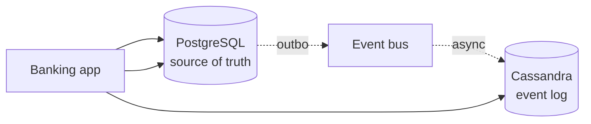
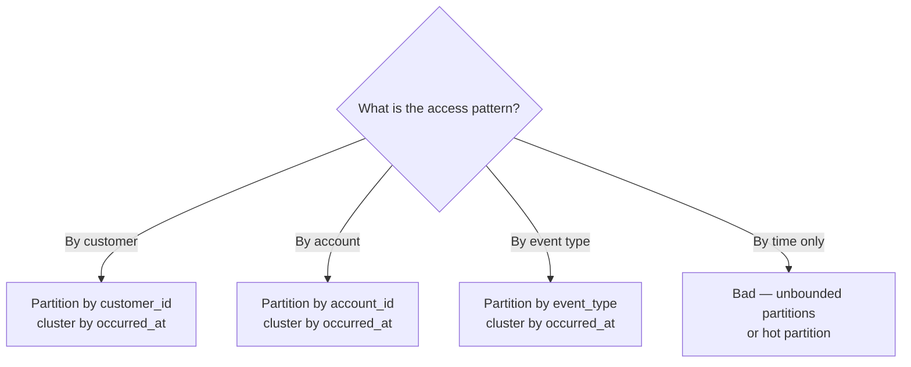

# Wide-Column Stores

> A wide-column store is a sorted, partitioned, sparse table. It looks like a relational table that has been physically sliced by partition key and re-sorted within each partition by clustering columns. It exists for one workload: *massive write throughput on time-ordered data*.

## What you already know

From [[00-When-Relational-Strains]]: NoSQL families give up different guarantees. Wide-column gives up strong consistency and joins for *massive write scale*. From [[04-Partitioning-And-Sharding]]: partitioning splits a table by a key; sharding splits it across databases. Wide-column stores do both, internally, by design. From [[00-ACID]]: strong consistency requires coordination, and coordination is slow under partition (see [[00-CAP-PACELC]]). Wide-column stores are usually AP — they prefer availability and tunable eventual consistency.

## Why this layer exists

Some workloads write far more than they read, write across many partitions, and need linear write scalability that a single relational database cannot deliver:

- **Time-series** — metrics, sensor data, market ticks. Millions of writes per second; reads are by time range and tag.
- **Event logs** — application events, audit logs, IoT telemetry. Append-only; queries are by source + time range.
- **Write-heavy user activity** — feed writes, message bus storage. Reads are by user + time.
- **Geo-distributed data** — each region's data should be readable locally with low latency.

For these, the relational model's per-row ACID guarantee is overkill — the workload does not need transactions across rows. What it needs is:

- *Linear write scalability* — adding a node increases throughput proportionally.
- *Tunable consistency* — strong when needed, eventual when speed matters.
- *Partitioned by access pattern* — queries always hit one partition.
- *No cross-partition coordination* — so writes don't block on each other.

Wide-column stores were invented to deliver exactly this. They are the answer to "what if every row is its own partition, and writes never coordinate across partitions?"

## What is genuinely new here

> **A wide-column store is a distributed, partitioned, sorted table. The partition key distributes writes; the clustering columns order reads. The trade-off: no cross-partition transactions, no ad-hoc joins, tunable consistency instead of strong.**

The model is closest to a relational table — but the *physical layout* is the design, not the logical schema.

## Concepts

### The model

A wide-column row has:

- **Partition key** — determines which node stores the row. All rows with the same partition key live on the same node.
- **Clustering columns** — sort rows within a partition. Used for range scans.
- **Regular columns** — the data. Sparse: a row can have any subset of columns.

In Cassandra's CQL:

```sql
CREATE TABLE ledger_events (
    account_id      BIGINT,           -- partition key
    occurred_at     TIMESTAMPTZ,      -- clustering column
    event_id        UUID,             -- clustering column (tiebreaker)
    amount          DECIMAL(18,2),
    description     TEXT,
    counterparty    TEXT,
    PRIMARY KEY ((account_id), occurred_at, event_id)
) WITH CLUSTERING ORDER BY (occurred_at DESC, event_id ASC);
```

The `PRIMARY KEY ((account_id), occurred_at, event_id)` syntax separates partition key (`account_id`, in double parens) from clustering columns (`occurred_at`, `event_id`).

### How data is laid out

```
Node 1: account_id hash 0..999
  Partition for account 42:
    row: (occurred_at=2024-01-15T10:30, event_id=uuid1, amount=-100, ...)
    row: (occurred_at=2024-01-15T09:00, event_id=uuid2, amount=+500, ...)
    row: (occurred_at=2024-01-14T18:00, event_id=uuid3, amount=-50,  ...)
  Partition for account 73: ...

Node 2: account_id hash 1000..1999
  ...
```

A query `WHERE account_id = 42 AND occurred_at > '2024-01-15T00:00'` hits one node, one partition, and reads a contiguous slice — fast.

A query `WHERE occurred_at > '2024-01-15T00:00'` (no partition key) hits *every node, every partition* — a "full cluster scan." This is the anti-pattern. Wide-column stores *require* the partition key in every query.

### Tunable consistency

Each read/write specifies a consistency level:

| Level | Meaning | Cost |
|---|---|---|
| `ONE` | Wait for one replica to acknowledge | Fastest; may read stale data |
| `QUORUM` | Wait for a majority of replicas | Slower; reads see acknowledged writes |
| `LOCAL_QUORUM` | Quorum in the local datacenter only | Low latency within a region |
| `ALL` | Wait for all replicas | Slowest; fails if any replica is down |

For financial data: writes at `QUORUM`, reads at `QUORUM` — strong consistency (R + W > N) without paying for `ALL`.

For metrics ingestion: writes at `ONE`, reads at `ONE` — maximum throughput, accepts staleness.

This is the *tunable* part: you pick the consistency per operation, not per database.

### Replication

Each partition is replicated to N nodes (replication factor). Replication is asynchronous — a write is acknowledged as soon as the consistency level is met. The remaining replicas are eventually updated.

This means: under a network partition, the cluster stays available (AP) but may serve stale reads from out-of-date replicas. Last-writer-wins resolves conflicts when the partition heals (see [[04-Eventual-Consistency]]).

### When it fits

| Pattern | Why wide-column is right |
|---|---|
| **Time-series** | Writes are append-only; queries are by partition + time range |
| **Event log** | Same shape — partition by source, cluster by time |
| **IoT telemetry** | Many devices, each writing frequently; query by device + time |
| **User activity feed** | Partition by user, cluster by time |
| **Geo-distributed data** | Local DC reads; eventual consistency across DCs |

### When it fails

| Pattern | Why wide-column is wrong |
|---|---|
| **Strongly consistent transactions** | No multi-row transactions; only "lightweight transactions" (Paxos-based, slow) |
| **Ad-hoc queries** | Must include partition key; otherwise full cluster scan |
| **Joins** | Not supported; you denormalize or do it in application |
| **Relational integrity** | No foreign keys; the application enforces |
| **Variable access patterns** | Schema is designed for the queries you have — adding a new query pattern often requires a new table (materialized view) |

## Banking application

The Banking system (see [[00-Banking-Case-Study]]) has one workload that fits wide-column perfectly: the **event log**.

Every state change — transfer, KYC decision, login, fraud flag, notification — produces an event. The event log:

- **Write pattern**: append-only, high rate (10,000 events/sec at peak).
- **Read pattern**: "give me all events for customer X in the last 7 days" — partition by customer, range by time.
- **Retention**: 7 years for regulatory compliance.
- **Consistency**: writes at `LOCAL_QUORUM` (durable in the local DC), reads at `LOCAL_ONE` (fast, slight staleness acceptable for analytics).

Cassandra schema:

```sql
CREATE TABLE customer_events (
    customer_id   BIGINT,
    occurred_at   TIMESTAMPTZ,
    event_id      UUID,
    event_type    TEXT,
    payload       TEXT,           -- JSON
    actor         TEXT,
    PRIMARY KEY ((customer_id), occurred_at, event_id)
) WITH CLUSTERING ORDER BY (occurred_at DESC, event_id ASC)
  AND compaction = {'class': 'TimeWindowCompactionStrategy',
                    'compaction_window_unit': 'DAYS',
                    'compaction_window_size': '1'};
```

The TimeWindowCompactionStrategy is optimized for time-series: it groups data into time windows, so old data is compacted once and stays cold — minimizing read amplification on the hot current data.

A query for "all TRANSFER events for customer 123 in the last 7 days":

```sql
SELECT * FROM customer_events
WHERE customer_id = 123
  AND occurred_at > toTimestamp(now() - interval '7 days')
  AND event_type = 'TRANSFER';
```

This hits one partition (the one holding customer 123's events), one node, one contiguous slice. Fast even with billions of total events.

### What stays in PostgreSQL

- The current balance. Strongly consistent, multi-row transactional — needs ACID.
- The transfer itself (two ledger entries, balance updates, in one transaction). Needs ACID.
- The customer and account records. Need foreign keys, joins.

The event log is a *projection* of what happened in PostgreSQL — populated via an outbox (see [[04-Domain-Events]]). It is eventually consistent with PostgreSQL by a few hundred milliseconds.

### Architecture



PostgreSQL writes a transaction (the transfer, the balance updates) *and* an outbox row, atomically. A separate process reads the outbox and publishes to the bus, which writes to Cassandra. The application reads from PostgreSQL for live state, from Cassandra for historical events.

## Code / diagrams

### Writing events to Cassandra (Java + DataStax driver)

```java
@Component
public class EventLogRepository {

    private final CqlSession session;

    public void append(CustomerEvent event) {
        PreparedStatement ps = session.prepare("""
            INSERT INTO customer_events
              (customer_id, occurred_at, event_id, event_type, payload, actor)
            VALUES (?, ?, ?, ?, ?, ?)
            """);
        session.execute(ps.bind()
            .setLong(0, event.customerId())
            .setInstant(1, event.at())
            .setUuid(2, event.eventId())
            .setString(3, event.type())
            .setString(4, event.payloadJson())
            .setString(5, event.actor())
            .setConsistencyLevel(ConsistencyLevel.LOCAL_QUORUM));
    }

    public List<CustomerEvent> recentEvents(long customerId, Duration window) {
        SimpleStatement s = SimpleStatement.builder("""
            SELECT * FROM customer_events
             WHERE customer_id = ?
               AND occurred_at > ?
            """)
            .addPositionalValue(customerId)
            .addPositionalValue(Instant.now().minus(window))
            .setConsistencyLevel(ConsistencyLevel.LOCAL_ONE)
            .setPageSize(500)
            .build();
        return session.execute(s).all().stream()
            .map(EventLogRepository::map)
            .toList();
    }
}
```

### Partition design — the most important decision



The partition key is the design — pick wrong, and either the partitions are unbounded (one customer with millions of events = slow queries) or hot (one event type with all events = overloaded node).

### Consistency level matrix

| Operation | Banking choice | Why |
|---|---|---|
| Event log write | `LOCAL_QUORUM` | Durable in DC; survives a single replica failure |
| Event log read | `LOCAL_ONE` | Fast; staleness acceptable for analytics |
| Counter (e.g., total events) | `QUORUM` | Counters are tricky; use sparingly |
| Lightweight transaction (e.g., dedup) | `SERIAL` | Paxos-based; only when truly needed |

## What can go wrong

- **Hot partitions.** A single customer generating 30% of events overloads one node. Use *composite partition keys* (e.g., `(customer_id, week)` to spread a heavy customer across partitions).
- **Unbounded partitions.** A customer with billions of events has one enormous partition — slow to scan, hard to compact. Bucket by time within the partition key.
- **Full cluster scans.** A query without the partition key hits every node. Detect and forbid these in the data access layer.
- **Counter inconsistency.** Cassandra counters are *eventually consistent* and can drift. Don't use them for financial totals; use them for approximate analytics.
- **Tombstones.** Deletes write a "tombstone" marker; until compaction removes them, reads must skip tombstoned data. Heavy delete workloads slow reads dramatically.
- **Schema migration pain.** Adding columns is easy; changing types or removing columns is hard. Plan for backward-compatible schema evolution.
- **Reads amplification from compaction.** During compaction, reads must merge multiple SSTables. Schedule compaction for low-traffic windows.
- **Operational complexity.** A Cassandra cluster is not a single database — it's a distributed system with its own repair, compaction, and gossip protocols. Operators must understand them.
- **Inconsistent secondary indexes.** Cassandra secondary indexes are *not* like relational indexes — they are local to each node, slow, and inconsistent. Avoid them; design tables for your queries instead (materialized views).

## Trade-offs

- **Write scale vs query flexibility.** Wide-column scales writes by requiring the partition key in every query.
- **Tunable consistency vs simplicity.** You pick the consistency per operation; the cost is having to reason about it.
- **Eventual consistency vs strong.** Writes are durable after `QUORUM`, but reads from out-of-date replicas are stale.
- **Denormalization vs storage.** Each query pattern often needs its own table (materialized view); the same data is stored multiple times.
- **Operational complexity vs scale.** A Cassandra cluster is more complex to operate than a PostgreSQL instance. The scale must be worth it.
- **Multi-region replication vs consistency.** Multi-region writes are eventually consistent; conflict resolution is last-writer-wins (or custom).

## Forward links

- [[00-When-Relational-Strains]] — when wide-column fits and when it doesn't.
- [[03-Caching]] — wide-column stores are not caches, but they often back dashboards that cache.
- [[04-Partitioning-And-Sharding]] — wide-column stores partition internally by design.
- [[05-Banking-NoSQL-Choice]] — Cassandra is the Banking event log store.
- [[00-CAP-PACELC]] — Cassandra is AP/EL.
- [[04-Eventual-Consistency]] — tunable consistency means eventual by default.
- [[02-Replication]] — Cassandra's replication is asynchronous and gossip-based.
- [[03-Sharding-Revisited]] — Cassandra shards internally; the application doesn't see it.
- [[08-Trade-offs-Everywhere]] — wide-column trades query flexibility for write scale.
