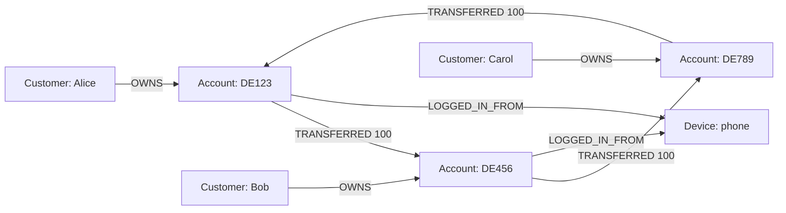
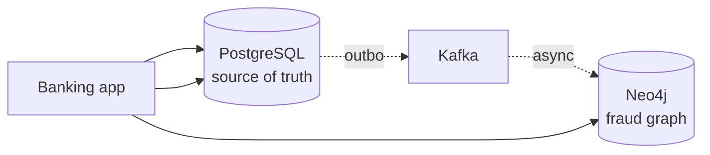
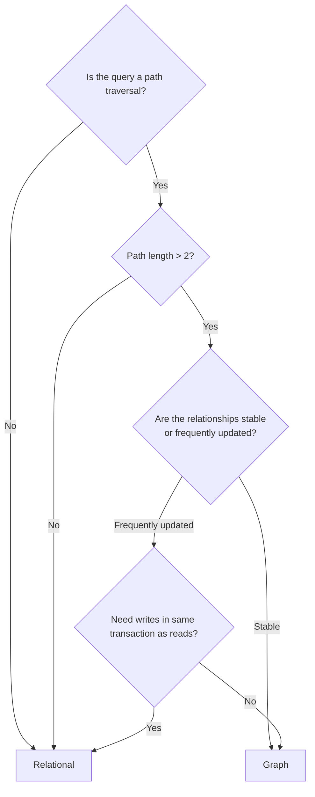

# Graph Stores

> A graph store models data as nodes and edges — and the edges are first-class. When the *relationships* are the data (not just the things that connect data), a graph store is the right answer, and a relational database is structurally the wrong one.

## What you already know

From [[00-When-Relational-Strains]]: NoSQL families give up different guarantees. Graph stores give up *write throughput and simple access* for *relationship queries*. From [[03-Dependency-As-Root-Concept]]: a dependency is "a change in one place can force a change in another." In a graph, dependencies *are* the edges — the model makes them first-class. From [[04-Abstraction-and-Models]]: a graph is an abstraction that forgets "things have attributes"; it remembers "things are connected." From [[05-Join-Algorithms]]: SQL joins build relationships on the fly; graph stores pre-materialize them.

## Why this layer exists

In a relational database, relationships are *implicit* — they exist as foreign keys, but you have to *compute* them at query time with joins. Each join is one hop. A query that traverses three hops (e.g., "find friends of friends of friends who bought this product") is three joins. Four hops, four joins. Five hops, five joins — and the planner gives up, the query times out, and you write application code.

In a graph store, relationships are *explicit and pre-materialized*. A hop is a pointer dereference, not a join. Traversing from a node to its neighbors is O(degree), not O(table size). Five hops is five pointer dereferences — microseconds, not seconds.

This layer exists because some questions are *fundamentally graph questions*:

- "Find rings of accounts that transfer to each other within 7 days." (fraud)
- "Find friends of friends who work at this company." (social network)
- "What products did customers who bought this also buy?" (recommendation)
- "What services depend on this service?" (impact analysis)
- "Who has access to this resource, through what path?" (security)

Each of these is a *path query*. In SQL, each is a multi-join that grows with path length. In a graph, each is a single traversal.

## What is genuinely new here

> **A graph store makes edges first-class. The cost is write throughput (each edge is an indexed pointer that must be maintained); the benefit is O(degree) traversals instead of O(table) joins.**

The relational model treats relationships as joins computed at read time. The graph model treats them as data stored at write time. That is the entire difference — and it changes which queries are feasible.

## Concepts

### The model

- **Node** (or vertex) — an entity. Has a label (e.g., `:Customer`, `:Account`) and properties.
- **Edge** (or relationship) — a connection between two nodes. Has a type (e.g., `:OWNS`, `:TRANSFERRED`), a direction, and properties.
- **Property** — a key-value pair on a node or edge (e.g., `{amount: 100, at: 2024-01-15}`).



This tiny graph represents three customers, three accounts, three transfers forming a ring, and a shared device. In SQL, finding the ring is a three-way self-join; finding the shared device is a four-hop traversal. In a graph, both are single queries.

### Query languages

| Language | Used by | Style |
|---|---|---|
| **Cypher** | Neo4j | Pattern-matching, declarative, ASCII-art-like |
| **Gremlin** | Amazon Neptune, JanusGraph | Traversal-based, imperative |
| **SPARQL** | RDF stores, semantic web | Triple-based, query-by-pattern |
| **GQL** | ISO standard (2024) | The evolving standard, Cypher-like |

Cypher example — find 3-cycles of transfers within 7 days:

```cypher
MATCH (a:Account)-[t1:TRANSFERRED]->(b:Account)-[t2:TRANSFERRED]->(c:Account)-[t3:TRANSFERRED]->(a)
WHERE t1.at >= datetime('2024-01-01')
  AND duration.between(t1.at, t3.at) <= duration('P7D')
RETURN DISTINCT a
```

The pattern `(a)-[t1]->(b)-[t2]->(c)-[t3]->(a)` is *literally* the cycle. Cypher's syntax mirrors the visual graph; this is its power.

### Indexes in a graph store

Graph stores index nodes by label + property (e.g., `:Account(iban)`), so the starting point of a traversal is a fast lookup. From there, traversal follows edges in memory — no index lookup per hop.

The implication: graph queries are fast *when you start from a specific node*. A query "find all cycles anywhere in the graph" is slow — there is no specific starting node. The pattern is the same as wide-column: name your starting point.

### When it fits

| Pattern | Why graph is right |
|---|---|
| **Fraud detection** (rings, clusters) | Cycles and clusters are path queries |
| **Recommendation** (customers-who-bought-also-bought) | Multi-hop traversal with ranking |
| **Social network** (friends-of, influence) | Relationships are the product |
| **Master data management** | Reconciling entities across systems — "is this the same customer?" |
| **Impact analysis** (dependency graphs) | "What depends on this?" |
| **Authorization** (ACL inheritance) | "Can this user access this resource, through what path?" |
| **Network topology** | Routing, reachability |

### When it fails

| Pattern | Why graph is wrong |
|---|---|
| **High-volume transactional** | Each edge is an indexed pointer; high write rate is slow |
| **Simple key-value access** | Graph's overhead is wasted; use KV |
| **Tabular reporting** | Aggregations are not graph's strength |
| **Bulk scans** | "All transactions in the last hour" is a tabular query, not a graph query |
| **Strong consistency requirements** | Most graph stores are single-node or have weaker distributed stories |

## Banking application

The Banking system (see [[00-Banking-Case-Study]]) uses Neo4j for **fraud detection**.

The graph contains:

- `:Customer` nodes (id, name, KYC status)
- `:Account` nodes (id, iban, type)
- `:Device` nodes (fingerprint, first_seen)
- `:IPAddress` nodes
- `:OWNS` edges (customer → account)
- `:TRANSFERRED` edges (account → account, with amount + timestamp)
- `:LOGGED_IN_FROM` edges (account → device, account → IP)

### Fraud query 1: 3-cycles within 7 days

A classic money-laundering pattern: A → B → C → A within a week, washing the money back to the origin.

```cypher
MATCH (a:Account)-[t1:TRANSFERRED]->(b:Account)-[t2:TRANSFERRED]->(c:Account)-[t3:TRANSFERRED]->(a)
WHERE t1.amount > 1000
  AND t2.amount > 1000
  AND t3.amount > 1000
  AND t1.at >= datetime() - duration('P30D')
  AND duration.between(t1.at, t3.at) <= duration('P7D')
RETURN a, b, c, t1, t2, t3
LIMIT 50;
```

### Fraud query 2: shared device across "unrelated" customers

Two customers who claim to be unrelated but log in from the same device — a strong fraud signal.

```cypher
MATCH (c1:Customer)-[:OWNS]->(a1:Account)-[:LOGGED_IN_FROM]->(d:Device)<-[:LOGGED_IN_FROM]-(a2:Account)<-[:OWNS]-(c2:Customer)
WHERE c1 <> c2
  AND NOT (c1)-[:RELATED_TO]-(c2)
RETURN c1, c2, d
LIMIT 100;
```

### Fraud query 3: fan-out then fan-in

A pattern where one account sends money to many accounts, which all send to a single account — a "funnel."

```cypher
MATCH (source:Account)-[t1:TRANSFERRED]->(mid:Account)-[t2:TRANSFERRED]->(sink:Account)
WHERE t1.at >= datetime() - duration('P7D')
  AND t2.at >= t1.at
WITH source, sink, collect(mid) AS mids, count(*) AS cnt
WHERE cnt >= 5
RETURN source, sink, cnt, mids
ORDER BY cnt DESC;
```

These queries are *natural* in Cypher and *impossible* in SQL at any reasonable scale (see [[05-Banking-Performance-Tuning]] Query 3 for the SQL attempt that timed out at 90 seconds).

### How the graph stays in sync

PostgreSQL is the source of truth. The graph is a projection. The transfer flow writes:

1. To PostgreSQL (the ledger entry, the balance updates) — in one transaction.
2. An outbox row, also in the same transaction.
3. A separate process reads the outbox, publishes an event, and a consumer updates Neo4j.

```java
@Component
public class FraudGraphProjector {

    private final Driver neo4j;  // Neo4j Java driver

    @KafkaListener(topics = "transfer-completed")
    public void onTransfer(TransferCompletedEvent event) {
        try (Session session = neo4j.session()) {
            session.run("""
                MERGE (a:Account {id: $from})
                MERGE (b:Account {id: $to})
                CREATE (a)-[:TRANSFERRED {amount: $amount, at: datetime($at), transferId: $tid}]->(b)
                """,
                Map.of(
                    "from", event.fromAccountId(),
                    "to", event.toAccountId(),
                    "amount", event.amount().doubleValue(),
                    "at", event.at().toString(),
                    "tid", event.transferId()
                ));
        }
    }
}
```

The graph is eventually consistent with PostgreSQL — a transfer is in PostgreSQL before it is in Neo4j, with a lag of typically under one second. Fraud queries run on the graph; if they miss a transfer that just happened, the next run will catch it. This is acceptable for fraud *detection* (which is asynchronous anyway); it would not be acceptable for fraud *prevention* (which would need to block the transfer).

## Code / diagrams

### The graph in the Banking architecture



### Graph vs relational — a query comparison

The same query, two stores:

```sql
-- SQL: find 3-cycles. Three self-joins. Times out at 90s on 30M rows.
SELECT t1.from_account
FROM transfers t1
JOIN transfers t2 ON t1.to_account = t2.from_account
JOIN transfers t3 ON t2.to_account = t3.from_account AND t3.to_account = t1.from_account
WHERE t1.at > NOW() - INTERVAL '30 day'
  AND t3.at - t1.at < INTERVAL '7 day';
```

```cypher
// Cypher: same query, single traversal. ~200ms.
MATCH (a)-[t1:TRANSFERRED]->(b)-[t2:TRANSFERRED]->(c)-[t3:TRANSFERRED]->(a)
WHERE t1.at >= datetime() - duration('P30D')
  AND duration.between(t1.at, t3.at) <= duration('P7D')
RETURN a;
```

The difference: SQL computes the joins at query time; Cypher follows pre-stored edges.

### When to use which



## What can go wrong

- **Write throughput.** Each edge is an indexed pointer. Inserting a transfer writes two ledger rows (relational) *and* an edge (graph) — three writes. At 10k transfers/sec, the graph store is the bottleneck. Batch writes where possible.
- **Graph size growth.** The graph grows with every transfer. After 5 years, the graph has billions of edges. Compaction, indexing, and query performance all suffer. Periodically *prune* old edges (move them to cold storage).
- **Sync drift.** The graph lags PostgreSQL by some seconds. A fraud query may miss a recent transfer. Decide explicitly whether that gap is acceptable (it usually is — fraud is run in batches).
- **Loss of transactional integrity.** The transfer and the edge are not in the same transaction. If the edge-write fails, the graph is out of sync. The outbox + retry pattern is the cure (see [[04-Domain-Events]]).
- **Supernodes.** A node with millions of edges (e.g., a popular product, a major customer) makes every traversal through it slow. Partition supernodes or limit traversal depth.
- **Cypher/Gremlin learning curve.** Graph query languages are not SQL. Teams need training; queries need review.
- **Operational complexity.** Neo4j is a separate datastore with its own backup, recovery, monitoring, and tuning. Adding it to the stack is real work.
- **"Let's put everything in the graph."** Resist. Graph stores are for graph queries. Storing customer records, balances, and transactions in the graph because "the graph is cool" produces a slow, hard-to-operate system. The graph is a *projection* of the relational source of truth — not a replacement.

## Trade-offs

- **Read speed vs write cost.** Graph stores make reads fast by pre-materializing edges; the cost is paid at write time.
- **Path traversal vs tabular reporting.** Graph is excellent for the former, mediocre for the latter.
- **Single-node vs distributed.** Neo4j's causal cluster is single-region; Neptune and JanusGraph are distributed but more complex.
- **Strong vs eventual consistency.** Most graph stores used as projections are eventually consistent with the source of truth.
- **Operational complexity vs query power.** A graph store is a real new component. The query power must be worth the operational cost.
- **Reversibility.** Moving fraud detection from SQL to a graph is a one-way door — once the graph is the source of fraud detection logic, going back is a multi-month migration.

## Forward links

- [[00-When-Relational-Strains]] — when graph fits and when it doesn't.
- [[05-Banking-NoSQL-Choice]] — Neo4j in the Banking polyglot architecture.
- [[05-Banking-Performance-Tuning]] — Query 3, the SQL fraud query that timed out.
- [[03-Dependency-As-Root-Concept]] — in a graph, edges *are* dependencies, made first-class.
- [[04-Domain-Events]] — how the graph stays in sync with PostgreSQL.
- [[04-Eventual-Consistency]] — the graph is eventually consistent with the source.
- [[05-Join-Algorithms]] — SQL joins computed at read time vs graph edges stored at write time.
- [[08-Trade-offs-Everywhere]] — the graph trade is "write cost for read speed," made explicit.
