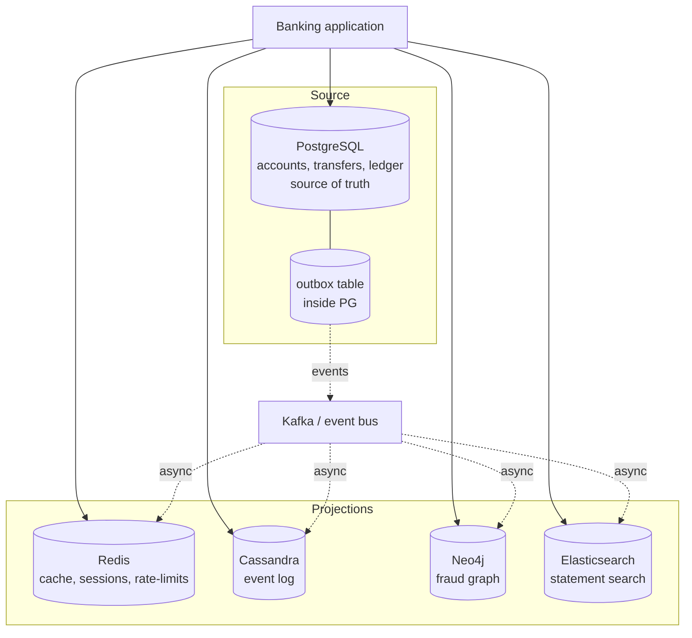
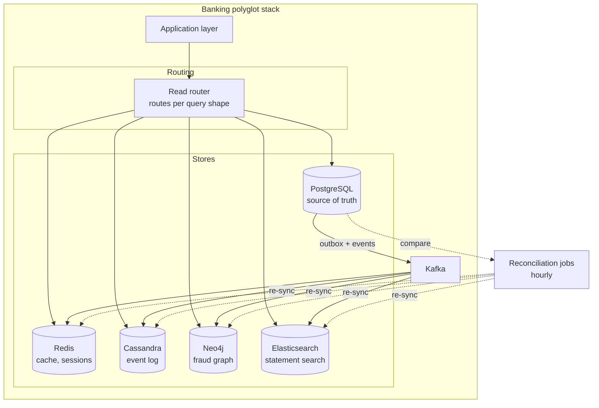

# Banking NoSQL Choice — Polyglot Persistence

> One problem, five datastores, one architecture. Each store is chosen for the question it answers best. The art is not picking a database — it is picking the *boundary* between databases.

## What you already know

From [[00-When-Relational-Strains]]: NoSQL gives up something for something else, and the four families trade different things. From [[01-Document-Stores]] through [[04-Graph-Stores]]: each family fits a different access pattern. From [[03-Dependency-As-Root-Concept]]: dependencies should point toward stability; the source of truth is the most stable thing in the system. From [[04-Domain-Events]]: events are how secondary stores stay in sync with the source. From [[08-Trade-offs-Everywhere]]: every architectural choice is a trade-off; the cost of polyglot is operational complexity.

## Why this layer exists

The Banking system (see [[00-Banking-Case-Study]]) is a single business problem — but it is *not* a single access-pattern problem. Different subsystems have different shapes:

- The **core ledger** needs ACID transactions and joins. Relational.
- The **event log** needs massive write throughput and time-range queries. Wide-column.
- The **customer session and cache** need fast known-key access. Key-value.
- The **fraud graph** needs multi-hop traversals. Graph.
- The **statement search** needs full-text ranking. Search engine.
- The **audit log** needs schema flexibility for varied event shapes. Document.

A single database cannot be best at all of these. A single database *can* do all of them — PostgreSQL has JSONB, full-text search, and can be made to do graph queries with recursive CTEs — but it will be mediocre at the edges, and the edges are exactly where the workload is heaviest.

Polyglot persistence is the architecture that says: *one source of truth, many read models, each chosen for its question.* This note is the design of that architecture for Banking.

## What is genuinely new here

> **Polyglot persistence is CQRS at the datastore level. The source of truth is one store; the read models are many. The cost is operational complexity and eventual consistency at the boundaries; the benefit is each subsystem running at its own optimal shape.**

The hard part is not picking the stores — it is *drawing the boundaries*. Get the boundaries right, and the system is robust. Get them wrong, and the system is a tangle of point-to-point sync jobs that drift.

## Banking application

### The five stores and their roles

| Store | Role | Banking subsystem | Why this store |
|---|---|---|---|
| **PostgreSQL** | Source of truth | accounts, transfers, ledger, balances, KYC | ACID, joins, foreign keys, strong consistency |
| **Cassandra** | Event log projection | customer_events, audit_log | Massive write scale, time-range queries |
| **Redis** | Cache + ephemeral state | sessions, rate-limits, customer summary cache | Sub-ms known-key access |
| **Neo4j** | Graph projection | fraud graph (accounts, devices, transfers) | Multi-hop traversal queries |
| **Elasticsearch** | Search projection | statement full-text search | Ranked full-text, fuzzy matching |

### The boundary rule

The most important rule in this architecture:

> **PostgreSQL is the source of truth. Every other store is a projection. Writes go to PostgreSQL first; projections are populated asynchronously from events.**

This means:

- If a projection fails (Neo4j is down), the system continues — fraud detection is degraded, but transfers still work.
- If a projection is lost (Redis is flushed), it can be rebuilt from PostgreSQL. The cache is, by definition, recreatable.
- The system is never in a state where a write to a projection succeeded but the source of truth did not — because the projection is populated *from* the source.

The exception is Cassandra's event log, which is also a *durable* record (for compliance). The event log is not a cache — it's a long-term archive. But it is still a *projection* of the events emitted by PostgreSQL; the source of truth for "did this transfer happen" is PostgreSQL, not Cassandra.

### The architecture



### The write path — one transaction, one event

When a transfer happens:

```java
@Service
public class TransferService {

    @Transactional
    public TransferResult transfer(TransferRequest req) {
        // 1. The core transaction — all in PostgreSQL, all ACID
        Account from = accounts.lockById(req.fromId());  // SELECT FOR UPDATE
        Account to   = accounts.lockById(req.toId());
        from.debit(req.amount());
        to.credit(req.amount());
        LedgerEntry e1 = ledger.append(from.id(), -req.amount(), ...);
        LedgerEntry e2 = ledger.append(to.id(), +req.amount(), ...);
        accounts.save(from);
        accounts.save(to);

        // 2. The outbox — same transaction. Not yet published.
        outbox.append(new TransferCompleted(e1, e2, req.idempotencyKey()));

        // 3. Return to caller. The transaction commits.
        return TransferResult.success(e1, e2);
    }
}

// Separate process: reads outbox, publishes to Kafka, marks outbox row as published.
// Kafka consumers update Redis, Cassandra, Neo4j, Elasticsearch.
```

The transaction is *one* unit: the transfer and the outbox row commit together. If the transaction rolls back, no event is published. If the transaction commits, the event *will* eventually be published — the outbox guarantees it (see [[04-Domain-Events]]).

### The read path — each query hits the right store

| Query | Store | Why |
|---|---|---|
| "What is the balance on account 123?" | PostgreSQL | Strong consistency required |
| "Show me Alice's recent activity widget" | Redis (cache) | Hot read, slight staleness OK |
| "Find 3-cycles in the last 30 days" | Neo4j | Graph traversal |
| "Search statements containing 'mortgage'" | Elasticsearch | Full-text ranked search |
| "All customer_events for customer 123 in last 7 days" | Cassandra | Time-range, write-heavy |
| "Did this transfer commit?" | PostgreSQL | Source of truth |
| "Is this customer logged in?" | Redis (session) | Ephemeral, hot |

Each query goes to the store designed for its shape. The application knows the routing — there is no transparent "federated query" layer (those exist but are slow and complex; explicit routing is faster and clearer).

### The sync model — eventual consistency at the boundaries

```mermaid
sequenceDiagram
    participant TS as TransferService
    participant PG as PostgreSQL
    participant OB as Outbox
    participant K as Kafka
    participant NEO as Neo4j
    participant CASS as Cassandra
    participant ES as Elasticsearch

    TS->>PG: BEGIN TXN
    TS->>PG: INSERT ledger_entries ...
    TS->>PG: UPDATE accounts SET balance ...
    TS->>OB: INSERT outbox(event)
    PG-->>TS: COMMIT
    Note over PG,OB: Atomic. Source of truth updated.

    par Async projections
        OB->>K: publish(event)
        K->>NEO: edge insert
        K->>CASS: event log append
        K->>ES: statement index update
    end
    Note over NEO,CASS,ES: Eventually consistent.<br/>Lag: ~200ms-2s.
```

The lag is small (typically under a second) but not zero. The application must tolerate it:

- A fraud query may miss a transfer that just happened. Acceptable — fraud runs in batches; the next batch will catch it.
- A statement search may not find a transfer that just happened. Acceptable — customers refresh.
- A balance read goes to PostgreSQL, *not* to the projections. The balance is *not* eventually consistent — it is the source of truth.

The rule: **strong consistency for money; eventual consistency for everything else.**

### The fallback rule

Every projection has a fallback:

- **Redis down** → cache misses; reads go to PostgreSQL. Slower, but functional.
- **Cassandra down** → event log queries fail; the audit dashboard is degraded. Transfers still work.
- **Neo4j down** → fraud detection is paused; transfers proceed without fraud check (or are held for manual review).
- **Elasticsearch down** → statement search returns "search temporarily unavailable"; customers can still see their recent statements directly from PostgreSQL.

The fallback is *designed in*, not added later. Each projection is "nice to have"; the source of truth (PostgreSQL) is "must have."

## Code / diagrams

### The read-side routing layer

```java
@Component
public class BankingReadRouter {

    private final AccountRepository pgAccounts;
    private final CustomerSummaryCache redisCache;
    private final EventLogRepository cassandraLog;
    private final FraudGraphRepository neo4jGraph;
    private final StatementSearchRepository esSearch;

    // Strong consistency — money
    public BigDecimal currentBalance(long accountId) {
        return pgAccounts.findBalance(accountId);  // PostgreSQL, always
    }

    // Cache — fast, slightly stale
    public CustomerSummary customerSummary(long customerId) {
        return redisCache.get(customerId)
            .orElseGet(() -> {
                CustomerSummary s = pgAccounts.loadSummary(customerId);
                redisCache.put(customerId, s);
                return s;
            });
    }

    // Graph — multi-hop
    public List<FraudAlert> findRings(Duration window) {
        return neo4jGraph.findThreeCycles(window);
    }

    // Search — full-text
    public List<Statement> searchStatements(String query, long customerId) {
        return esSearch.search(query, customerId);
    }

    // Wide-column — time-range
    public List<CustomerEvent> recentEvents(long customerId, Duration window) {
        return cassandraLog.findByCustomer(customerId, window);
    }
}
```

### Reconciliation — detecting drift

A periodic job reconciles projections against the source of truth:

```java
@Scheduled(cron = "0 0 * * * *")  // hourly
public void reconcileFraudGraph() {
    // Count transfers in PostgreSQL for the last hour
    long pgCount = pg.transfersCountLastHour();
    // Count edges added to Neo4j in the last hour
    long neoCount = neo4j.edgesAddedLastHour();
    if (pgCount != neoCount) {
        // Drift detected — trigger a re-sync from the outbox
        log.warn("Drift: PG={} Neo4j={}", pgCount, neoCount);
        resyncService.replayOutbox(lastHour);
    }
}
```

Drift will happen — events fail, consumers crash, network blips. The system must *detect* and *recover*. Without reconciliation, drift accumulates silently until someone notices the fraud dashboard is wrong.

### The full polyglot architecture diagram



## What can go wrong

- **Boundary confusion.** A developer writes a transfer to Neo4j directly "because the graph needs to know immediately." Now there are two sources of truth; they will disagree. The boundary rule is *non-negotiable*: writes go to PostgreSQL; projections are populated by events.
- **Projection lag.** A customer makes a transfer, then immediately searches for it. The search index hasn't updated yet; the customer thinks the transfer failed. Cure: read-after-write from PostgreSQL for the customer's own recent activity; use projections only for older data.
- **Drift accumulating.** Events fail silently; projections fall behind. Without reconciliation, drift is invisible until it breaks something. Run reconciliation hourly; alert on drift > threshold.
- **Operational sprawl.** Five datastores = five backups, five monitoring dashboards, five on-call runbooks. Hire for this; don't pretend it's one system.
- **Schema evolution across stores.** A schema change in PostgreSQL requires updating every projection's consumer. Version the events (`TransferCompletedV2`); consumers handle both versions until migration is complete.
- **"Let's add another store."** Resist. Each new store is a new boundary, a new sync job, a new failure mode. The five-store architecture above is already at the edge of operational complexity. Add a sixth only with strong justification.
- **Cross-store transactions.** A request that updates PostgreSQL and Cassandra in the same logical operation cannot be atomic. Use the outbox; accept eventual consistency. If you need atomicity, both writes belong in the same store — and that store is PostgreSQL.
- **Vendor lock-in.** Each NoSQL store has its own query language. Switching is expensive. Mitigate by keeping the projection logic in application code (not in stored procedures); the store is interchangeable if the projection code is.
- **Failure cascade.** If the event bus (Kafka) is down, the outbox grows unbounded. The application continues to work (PostgreSQL is fine), but projections fall further behind. Have a recovery plan: pause writes, drain the outbox, resume.

## Trade-offs

- **Operational complexity vs per-subsystem optimality.** One store is simpler to operate; five stores are each optimal for their workload. The trade is fundamental — you cannot have both.
- **Strong consistency vs scale.** PostgreSQL (strong) cannot scale to Cassandra's write rate; Cassandra cannot offer PostgreSQL's consistency. The boundary is the trade.
- **Read latency vs write complexity.** Projections make reads fast; they make writes more complex (the outbox, the consumers, the reconciliation). The trade is symmetric.
- **Single region vs multi-region.** A multi-region polyglot is *much* harder than a single-region one. Each store has its own multi-region story (Postgres replication, Cassandra multi-DC, Redis cluster, Neo4j causal cluster, ES cross-cluster replication). Start single-region; go multi-region only when latency demands it.
- **Reversibility.** Adding a projection is reversible (drop it, rebuild from source). Removing PostgreSQL is not. The source of truth is the one-way door; the projections are two-way.

## Forward links

- [[00-When-Relational-Strains]] — the decision framework for picking a store.
- [[01-Document-Stores]] through [[04-Graph-Stores]] — the families, in depth.
- [[05-Banking-Performance-Tuning]] — how the polyglot was reached by measurement.
- [[05-Banking-Distributed-Design]] — the distributed view of this architecture.
- [[04-Domain-Events]] — the mechanism that keeps projections in sync.
- [[04-Enterprise-Patterns]] — CQRS is the architectural pattern this implements.
- [[00-ACID]] — the guarantee the source of truth upholds.
- [[04-Eventual-Consistency]] — the guarantee the projections offer.
- [[03-Dependency-As-Root-Concept]] — projections depend on the source; never the reverse.
- [[06-Coupling-and-Cohesion]] — each store is a cohesive bounded context.
- [[08-Trade-offs-Everywhere]] — every line in the architecture is a trade-off.
