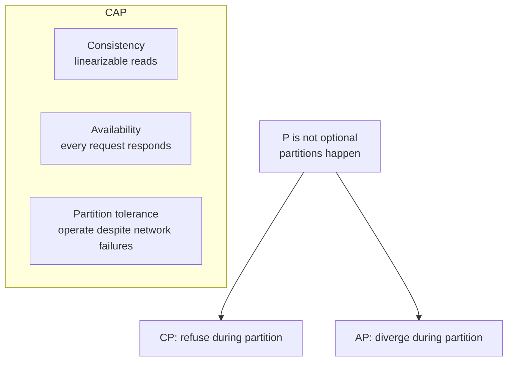
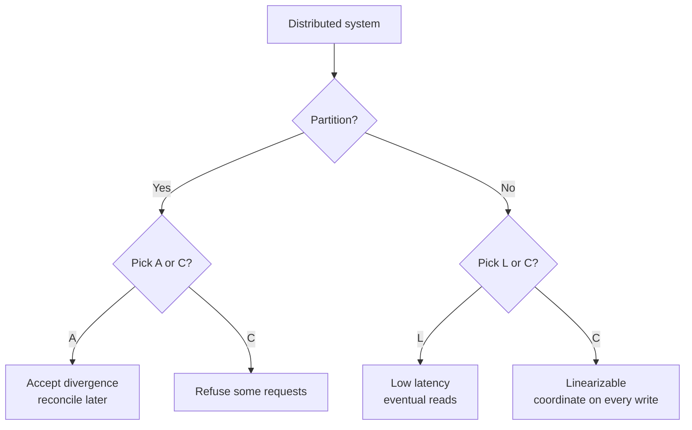
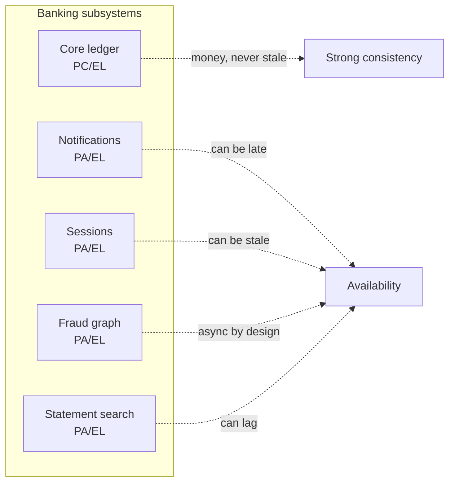

# CAP and PACELC

> A distributed system cannot be simultaneously consistent, available, and partition-tolerant. Since partitions happen, you must pick: consistency or availability. PACELC adds: even when there is no partition, you must still pick — latency or consistency.

## What you already know

From [[00-ACID]]: a single-node database can be strongly consistent because there is one source of truth. From [[02-Replication]]: a distributed database replicates data across nodes; replication introduces the question — when is a write "done"? From [[08-Trade-offs-Everywhere]]: every architectural decision is a trade-off; the worst trade-off is the one you make without realizing it. From [[00-When-Relational-Strains]]: NoSQL stores often relax consistency to gain availability or scale.

## Why this layer exists

Once your data lives on more than one node, a new failure mode appears: the network between the nodes can fail. The nodes are still up — they can serve requests — but they cannot talk to each other. This is a *partition*, and it forces a choice:

- If both sides continue to serve requests, they may *diverge* — different clients will see different data, and the divergence must be reconciled later. (You picked availability over consistency.)
- If only one side serves requests, the other side must refuse. Some clients cannot access the system at all. (You picked consistency over availability.)

There is no third option. You cannot have both — the nodes cannot talk to coordinate, so they cannot both serve and stay consistent. This is the **CAP theorem**.

CAP is famous, but it is incomplete: it only addresses the *partition* case. Most of the time, there is no partition. What do you trade then? The **PACELC** theorem (Abadi, 2010) extends CAP: *if there is a partition (P), pick availability (A) or consistency (C); else (E), pick latency (L) or consistency (C).*

This layer exists because every distributed system — including the Banking polyglot from [[05-Banking-NoSQL-Choice]] — has a CAP/PACELC position. The position is a *trade-off*, and it must be made explicitly, per subsystem.

## What is genuinely new here

> **CAP is a forced choice during a partition. PACELC says you also choose during normal operation. Every distributed system has a position on both axes; most teams have not written theirs down.**

The act of writing the position down is the value. A system whose PACELC position is implicit will behave in surprising ways under load or partition; a system whose position is explicit behaves in *expected* ways, even when those ways are bad.

## Banking application

The Banking system (see [[00-Banking-Case-Study]]) has multiple subsystems, each with its own PACELC position:

| Subsystem | PACELC position | Why |
|---|---|---|
| Core ledger (PostgreSQL primary) | **PC/EL** | Consistency is non-negotiable; latency is accepted |
| Notification log (eventually-consistent) | **PA/EL** | Availability first; notifications can be slightly late |
| Customer session (Redis) | **PA/EL** | Availability first; a stale session is tolerable |
| Fraud graph (Neo4j) | **PA/EL** | Availability first; fraud detection is asynchronous |
| Statement search (Elasticsearch) | **PA/EL** | Availability first; search lag is tolerable |

The boundary is explicit: **strong consistency for money; availability for everything else.** This is the rule that drives the whole architecture in [[05-Banking-Distributed-Design]].

## Concepts

### CAP theorem (Brewer, 2000; Gilbert-Lynch proof, 2002)

Brewer's conjecture, formalized by Gilbert and Lynch:

> In the presence of a network partition, a distributed system cannot simultaneously provide consistency and availability.

The three properties:

- **Consistency** (C): every read sees the latest write, or an error. (This is *linearizability* — strong consistency.)
- **Availability** (A): every request receives a non-error response (not necessarily the latest data).
- **Partition tolerance** (P): the system continues to operate despite the network dropping messages between nodes.

Since partitions *happen* in any real network, P is not optional — you must tolerate it. So the real choice is **CP** (consistency + partition tolerance, sacrifice availability) or **AP** (availability + partition tolerance, sacrifice consistency).

### The clarification

CAP is widely misunderstood. Two important clarifications:

1. **"Pick two of three" is misleading.** You don't get to pick P or not — partitions happen. You only really pick CP or AP.
2. **The choice is *only during a partition*.** When there is no partition, you can have both C and A. CAP says nothing about normal operation — that is what PACELC adds.

### PACELC (Abadi, 2010)

> **If there is a partition (P), the system chooses between availability (A) and consistency (C). Else (E), it chooses between latency (L) and consistency (C).**

Pronounced "pack-elk." Written as `PA/EL` or `PC/EC` etc.

The four common positions:

| Position | During partition | Without partition | Example |
|---|---|---|---|
| **PC/EC** | Consistency | Consistency | Spanner, VoltDB (strong-consistency systems) |
| **PC/EL** | Consistency | Latency | PostgreSQL with sync replica (default RDBMS HA) |
| **PA/EL** | Availability | Latency | Cassandra, DynamoDB (default) |
| **PA/EC** | Availability | Consistency | Rare — only when latency is not a concern but availability is |

Most systems are **PA/EL** or **PC/EL**. The rare ones are **PC/EC** (strong-consistency distributed databases — they pay high latency always) and **PA/EC** (unusual — basically never used because if you can afford consistency without partition, you usually want it during partition too).

### Where common systems fall

| System | PACELC | Notes |
|---|---|---|
| **PostgreSQL (single)** | N/A | Not distributed; always consistent |
| **PostgreSQL + sync replica** | PC/EL | Commits wait for replica; refuses writes if replica is down (CP); low latency otherwise |
| **PostgreSQL + async replica** | PC/EL* | Primary is consistent; *reads from replica* are eventually consistent (AP for reads) |
| **MongoDB** (default) | PC/EL | Single primary; writes refused if primary down |
| **Cassandra** (default) | PA/EL | Eventual consistency; writes always accepted |
| **Cassandra** (QUORUM) | PC/EL* | Strong if R + W > N; can lose availability under partition |
| **Redis Cluster** | PA/EL | Partition-tolerant; minority partition refuses writes to *its* keys |
| **DynamoDB** (default) | PA/EL | Eventual consistency by default |
| **DynamoDB** (strong reads) | PC/EL | Strong consistency for reads, but only from one region |
| **Spanner** | PC/EC | Globally strongly consistent; pays latency for TrueTime |
| **etcd / Consul** | PC/EC | Raft-based; CP always |
| **Neo4j causal cluster** | PC/EL | Writes to leader; reads can be stale from followers |

The asterisks indicate that the position depends on configuration — Cassandra with `QUORUM` is stronger than Cassandra with `ONE`. PACELC is a property of *the configured system*, not just the product.

### The "C" in CAP vs the "C" in ACID

These are *not* the same:

- **ACID consistency** means *the database's invariants hold* after a transaction (no negative balances, no broken foreign keys).
- **CAP consistency** means *linearizability* — every read sees the latest write, system-wide.

A system can be ACID (transactional invariants hold) without being CAP-consistent (different replicas may show different states briefly). Conversely, a system can be CAP-consistent (linearizable) without being ACID (no transactional invariants). Don't conflate them.

## Code / diagrams

### The CAP triangle (with the caveat)



### The PACELC decision tree



### Banking subsystem positions on PACELC



### PostgreSQL synchronous replication — PC/EL in action

```sql
--postgresql.conf on primary:
synchronous_standby_names = 'FIRST 1 (standby1)'
-- A COMMIT does not return until at least one standby has flushed the WAL.
-- This is PC: if the standby is unreachable, the primary refuses commits
-- (sacrificing availability) rather than risk losing data on failover.
```

```sql
-- For an async standby:
synchronous_standby_names = ''
-- A COMMIT returns as soon as the primary has flushed. The standby catches up
-- asynchronously. This is closer to PA: a failover may lose the last few commits
-- (sacrificing consistency) rather than block writes.
```

## What can go wrong

- **Misunderstanding "C" as ACID.** ACID and CAP consistency are different. A system can be ACID-transactional and CAP-available.
- **Treating PACELC as fixed.** Most systems can be configured for either position. PostgreSQL with sync replica is PC; without, it's effectively PA for failover. The configuration is the decision.
- **Assuming the choice is global.** Different subsystems in the same application can have different positions. Banking does this — strong for money, eventual for notifications.
- **Forgetting the latency trade-off.** Even with no partition, strong consistency costs latency. A globally-linearizable system (Spanner) pays ~100ms per write for TrueTime coordination; an eventually-consistent system (Cassandra) pays ~5ms.
- **Ignoring the failure modes of your choice.** A CP system will refuse writes under partition — make sure the application handles "write refused" gracefully. An AP system will diverge — make sure the application handles conflict resolution.
- **"We'll just use quorum."** Quorum (R + W > N) gives strong consistency *if* the replicas are honest and the clocks are correct. Under Byzantine failures or clock skew, even quorum is not enough.
- **Read-your-writes violations.** A client writes to the primary, then reads from a replica that hasn't caught up. The client sees their write as missing. Use read-your-writes consistency (sticky reads, session tokens) for the rare case where this matters.
- **Assuming partitions are rare.** They are not rare; they are common. Networks fail, switches reboot, DNS hiccups, cloud providers have incidents. Design for partition as the *normal* failure mode.

## Trade-offs

- **Consistency vs availability.** The CAP choice. For money: consistency. For notifications: availability.
- **Latency vs consistency.** The EL/EC choice. Strong consistency costs latency; the cost is paid on every write.
- **Global vs single-region.** A globally-strongly-consistent system (Spanner) pays ~100ms latency for cross-region coordination. A globally-available system (Cassandra multi-DC) accepts eventual consistency.
- **Configuration complexity vs simplicity.** Tunable-consistency systems (Cassandra) are flexible; the cost is reasoning about consistency per operation. Simple systems (PostgreSQL sync replica) are easier to reason about; the cost is less flexibility.
- **Reversibility.** Going from PC to PA is easy (turn off sync replication). Going from PA to PC is hard — the system has been accepting divergent writes, and reconciling them is a project.

## Forward links

- [[01-Consensus-Raft-Paxos]] — how CP systems actually agree.
- [[02-Replication]] — synchronous vs async replication is the EL/EC choice.
- [[03-Sharding-Revisited]] — sharding adds partition risk; the system needs a CAP position.
- [[04-Eventual-Consistency]] — the AP choice, in depth.
- [[05-Banking-Distributed-Design]] — the full distributed architecture with PACELC positions.
- [[00-ACID]] — the consistency guarantee of the single-node source of truth.
- [[00-When-Relational-Strains]] — NoSQL families occupy different PACELC positions.
- [[05-Banking-NoSQL-Choice]] — each store's PACELC position drives the polyglot architecture.
- [[08-Trade-offs-Everywhere]] — CAP/PACELC is the canonical distributed-systems trade-off.
