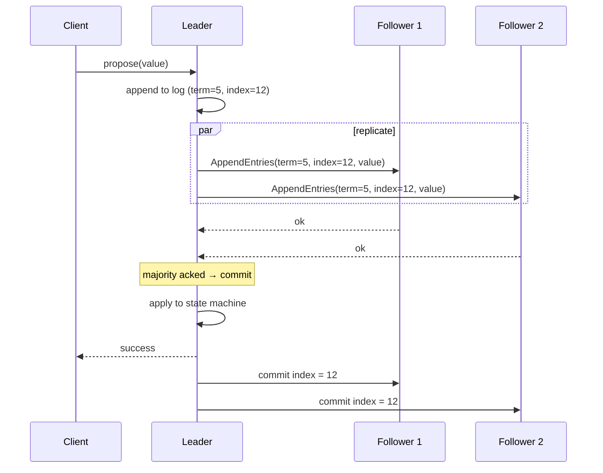
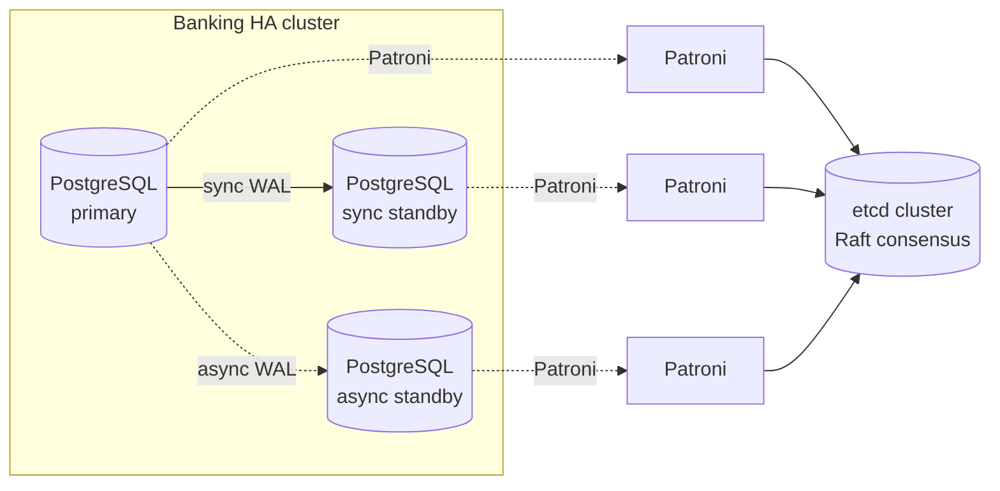
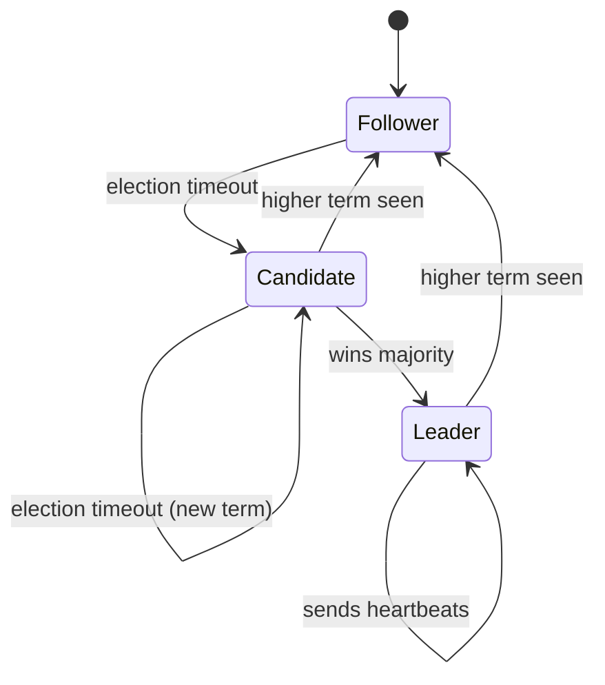

# Consensus — Raft and Paxos

> Consensus is the problem of getting independent nodes to *agree* on a single value. It is the foundation of every strongly-consistent distributed system. Paxos solved it in 1989; Raft made it understandable in 2014.

## What you already know

From [[00-CAP-PACELC]]: a CP system must *refuse* some requests during a partition to stay consistent. Consensus is the mechanism that decides *which* requests to refuse and *which* writes count as committed. From [[00-ACID]]: a transaction commits when the WAL is flushed to disk. In a distributed system, the WAL is *replicated* — and "flushed" means "flushed on a majority of nodes." From [[02-Replication]]: synchronous replication makes the primary wait for the replica; consensus is what makes "wait for the replica" rigorous.

## Why this layer exists

A single-node database has a simple rule for commit: the write is committed when the WAL is on disk. Crash? Replay the WAL. The disk is the source of truth.

A distributed database cannot use that rule. The "disk" is now spread across multiple nodes, connected by a network that can fail. If the primary commits when its local disk is flushed, a failover may *lose* the commit if the primary crashes before replicating. If the primary waits for *all* replicas, a single slow replica blocks every write. If the primary waits for a *majority*, the system can tolerate minority failures — but now the primary and the majority must *agree* on what counts as committed.

That agreement is consensus.

> **Consensus is the problem of getting multiple nodes to agree on a single value, despite failures and network partitions.**

In databases, "the value" is usually: *which entry is at position N in the replicated log?* Once the nodes agree on the log, they agree on the state. The state machine replication (SMR) pattern: every node applies the same commands in the same order, so every node reaches the same state.

This layer exists because every strongly-consistent distributed database — every CP system in CAP terms — runs a consensus algorithm under the hood. PostgreSQL's not-yet-built native HA consensus uses Raft (in pgvector-style extensions). etcd, Consul, ZooKeeper, Spanner, CockroachDB, TiDB, YugabyteDB — all run Paxos or Raft.

## What is genuinely new here

> **Consensus is the algorithm that lets a distributed system agree on a single order of operations. It is the difference between "we hope the replicas agree" and "we can prove the replicas agree."**

The two algorithms to know:

- **Paxos** (Lamport, 1989) — the classic; correct; famously hard to understand.
- **Raft** (Ongaro, 2014) — designed for understandability; algorithmically equivalent to Paxos for the common case.

Both achieve the same property: a majority of nodes agrees on a value, and that agreement is durable across failures.

## Concepts

### The consensus problem

Formally: a set of nodes must agree on a single value, given:

- Some nodes may crash (fail-stop).
- The network may delay, drop, or reorder messages.
- No Byzantine (malicious) behavior — nodes are honest, just unreliable.

The required properties:

- **Agreement**: no two nodes decide different values.
- **Validity**: the decided value was proposed by some node (not arbitrary).
- **Termination**: eventually, non-faulty nodes decide.

### Paxos (Lamport)

The classic algorithm. Three roles:

- **Proposers** — propose values.
- **Acceptors** — vote to accept proposals; form the quorum.
- **Learners** — learn the decided value.

The algorithm operates in two phases:

1. **Phase 1 (Prepare/Promise)**: a proposer picks a ballot number N and sends `Prepare(N)` to a majority of acceptors. Acceptors respond with `Promise(N, last_accepted_value)` — they promise not to accept proposals with ballot < N, and they tell the proposer what (if anything) they've already accepted.
2. **Phase 2 (Accept/Accepted)**: the proposer picks a value — *the highest-numbered previously-accepted value it learned about*, or its own value if none — and sends `Accept(N, value)` to a majority. Acceptors accept if N is still the highest they've promised; they send `Accepted(N, value)` to learners.

The key invariant: once a majority has accepted a value, any future proposal must include that value. This guarantees agreement.

Paxos is correct but notorious for being hard to understand, hard to implement, and hard to extend (Multi-Paxos for log replication is even more complex). Most production systems use *variants* — Multi-Paxos, Fast Paxos, EPaxos — that have diverged from the original.

### Raft (Ongaro)

Raft was designed explicitly for understandability. It decomposes consensus into three sub-problems:

1. **Leader election** — one node is elected leader; the leader manages the log.
2. **Log replication** — the leader appends entries and replicates them to followers.
3. **Safety** — the rules that guarantee a replicated log is consistent.

#### Leader election

- Nodes are in one of three states: **follower**, **candidate**, **leader**.
- A node starts as follower. If it doesn't hear from a leader within an election timeout, it becomes candidate, increments its term, votes for itself, and asks other nodes for votes.
- If a candidate receives a majority of votes for its term, it becomes leader.
- The leader sends periodic heartbeats to maintain authority.

Terms are monotonic; each term has at most one leader. This prevents "split brain" — two leaders in different terms cannot both have a majority for the same term.

#### Log replication

- The leader receives client commands, appends them to its log, and replicates them to followers.
- An entry is **committed** when it's replicated to a majority; the leader then applies it to its state machine and notifies followers.
- The leader's log is the source of truth; followers replicate the leader's log.



#### Safety

The Raft safety rules guarantee:

- **Election Safety**: at most one leader per term.
- **Leader Append-Only**: a leader never overwrites or deletes entries in its log.
- **Log Matching**: if two logs contain an entry with the same index and term, the logs are identical up to that point.
- **Leader Completeness**: if a log entry is committed in a given term, that entry is present in the logs of every leader for all higher terms.
- **State Machine Safety**: if a node has applied a log entry at index N, no other node will ever apply a different entry at index N.

These rules together guarantee that the state machine is replicated identically across all nodes.

### The role of consensus in databases

Consensus is used for:

- **Log replication** — every write goes through the consensus protocol, ensuring all replicas have the same log. (etcd, CockroachDB, TiDB, Spanner.)
- **Leader election** — when the primary fails, the cluster elects a new primary via consensus. (PostgreSQL Patroni, MongoDB replica sets.)
- **Configuration changes** — adding or removing a node from the cluster is itself a consensus decision. (So the cluster never has two different views of its membership.)
- **Distributed locks** — a lock is a consensus on "who holds this resource." (etcd, Consul, ZooKeeper.)

### Banking: what consensus means

In the Banking system (see [[00-Banking-Case-Study]]), consensus is how the cluster agrees:

> **"Which transaction committed last?"**

If the primary fails, the cluster must elect a new primary — and the new primary must know exactly which transactions were committed, so it does not double-spend or lose a commit. That is the question consensus answers.

PostgreSQL's synchronous replication is a *limited* form of consensus: the primary waits for the standby to flush, which ensures the standby has the data. But PostgreSQL does not have built-in leader election — that's what tools like Patroni provide, by running Raft (via etcd) to elect the new primary.

## Banking application

### The HA PostgreSQL cluster



Patroni runs on each PostgreSQL node. The Patroni instances use etcd (which runs Raft) to:

- Elect the primary.
- Detect primary failure (via heartbeats).
- Promote a standby to primary on failure.
- Update the cluster config so clients know the new primary.

When PG1 fails:

1. Patroni on PG2 and PG3 detect that PG1 missed its heartbeat.
2. One of them (say PG2) starts an election by proposing itself as the new leader for term N+1 in etcd.
3. etcd runs Raft: a majority of etcd nodes must agree to the new leader.
4. If PG2 wins, Patroni promotes PG2 to primary. PG2 was the synchronous standby, so it has all committed data.
5. The connection pooler (pgbouncer) is notified to route to PG2.

This is consensus in action: the etcd cluster agreed on "PG2 is the new primary," and that agreement is the basis for the failover.

### Why synchronous replication is required

If PG1 was using *asynchronous* replication to PG2, then on failover, PG2 might be missing the last few transactions that PG1 acknowledged to clients. Those clients would see their writes "lost" — a consistency violation.

Synchronous replication ensures PG2 has the data before PG1 acknowledges. Combined with Patroni/etcd consensus for failover, the system guarantees:

> **A committed transaction is never lost in a failover.**

This is the PC position from [[00-CAP-PACELC]]: during the failover partition, the system refuses writes (unavailable briefly) rather than risk inconsistency.

## Code / diagrams

### Raft state machine



### Raft vs Paxos — at a glance

| Aspect | Paxos | Raft |
|---|---|---|
| **Year** | 1989 | 2014 |
| **Goal** | Correctness | Understandability |
| **Roles** | Proposer, Acceptor, Learner | Leader, Follower, Candidate |
| **Leader** | Not required (but Multi-Paxos uses one) | Required; central to the algorithm |
| **Log** | Not part of the core (Multi-Paxos adds it) | First-class; log replication is core |
| **Membership change** | Hard | Built-in (joint consensus) |
| **Implementations** | Chubby, Spanner, Cassandra lightweight txns | etcd, Consul, CockroachDB, TiDB, Patroni |

### The consensus guarantee, formally

> If a value V is *chosen* by the cluster (a majority accepted it), then any future *learned* value is also V.

This is the safety property. Combined with liveness (a non-faulty majority eventually decides), it gives the system its consistency guarantee.

### Patroni config (simplified)

```yaml
# patroni.yml on each PostgreSQL node
scope: banking
name: pg1

restapi:
  listen: 0.0.0.0:8008

etcd:
  hosts: etcd1:2379,etcd2:2379,etcd3:2379

postgresql:
  listen: 0.0.0.0:5432
  data_dir: /var/lib/postgresql/data
  authentication:
    replication:
      username: replicator
    superuser:
      username: postgres
  parameters:
    wal_level: replica
    max_wal_senders: 10
    synchronous_commit: on
    synchronous_standby_names: 'FIRST 1 (pg2)'

# Synchronous replication ensures commits are durable on the standby.
# etcd + Patroni provide leader election via Raft consensus.
```

## What can go wrong

- **Split brain.** Two nodes both think they are the leader. Raft prevents this via terms — two leaders in different terms cannot both have a majority. But if your consensus implementation is buggy (or your quorum configuration is wrong), split brain is catastrophic.
- **Quorum loss.** If a majority of nodes are down, the cluster cannot elect a leader and cannot accept writes. This is *correct* (CP), but operationally painful. Plan for it: how do you recover if you've lost majority?
- **Network partitions.** A partition isolating the leader from a majority triggers a new election. The old leader, if it can still see some nodes, may try to commit writes that will be rolled back when the partition heals. Raft prevents this via term checks; older implementations had bugs.
- **Slow disks.** Consensus requires persisting the log to disk before responding. A slow disk on a node slows the whole cluster, because the leader waits for the majority's ack.
- **Clock skew.** Raft uses terms, not timestamps, so it tolerates clock skew. But some systems (Spanner's TrueTime) use timestamps for ordering, and clock skew breaks them.
- **Operational complexity.** A consensus-based cluster is harder to operate than a single database. Membership changes, log compaction, snapshotting, recovery from quorum loss — all require runbooks.
- **Performance overhead.** Every write now requires a round-trip to a majority. For a 3-node cluster, that's 2 round-trips (leader + 1 follower); for a 5-node, 3. Latency roughly doubles vs single-node.
- **Liveness vs safety trade-offs.** Raft favors safety — if a majority is unavailable, the cluster stops. AP systems (Cassandra) favor liveness — they keep going, but may diverge. Choose per subsystem (see [[00-CAP-PACELC]]).

## Trade-offs

- **Strong consistency vs availability.** Consensus gives strong consistency at the cost of availability under partition (CP).
- **Latency vs safety.** Every write requires majority ack; this is slower than single-node commits. The cost is paid on every write.
- **Quorum size vs fault tolerance.** A 3-node cluster tolerates 1 failure; a 5-node tolerates 2. Larger quorum = more fault tolerance = more latency.
- **Understandability vs minimalism.** Raft is easier to implement correctly; Paxos is more general. Most new systems pick Raft.
- **Single-region vs multi-region.** Multi-region consensus pays cross-region latency (~50-100ms per write). Spanner pays this for global consistency; CockroachDB lets you choose per table.

## Forward links

- [[00-CAP-PACELC]] — consensus is the CP mechanism.
- [[02-Replication]] — consensus replicates the log.
- [[03-Sharding-Revisited]] — each shard may have its own consensus group.
- [[05-Banking-Distributed-Design]] — how Patroni/etcd fit in the Banking architecture.
- [[07-Distributed-Transactions]] — 2PC is a related but different problem (cross-shard, not within-shard).
- [[00-ACID]] — consensus is what makes ACID possible in a distributed database.
- [[00-WAL-Logging]] — the WAL is the unit consensus replicates.
- [[03-Backup-And-Recovery]] — consensus-based failover is a recovery mechanism.
- [[08-Trade-offs-Everywhere]] — consensus is the canonical "strong consistency at the cost of availability and latency" trade.
