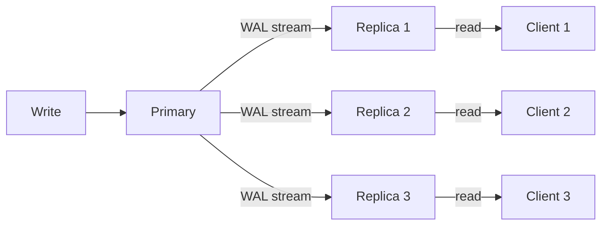
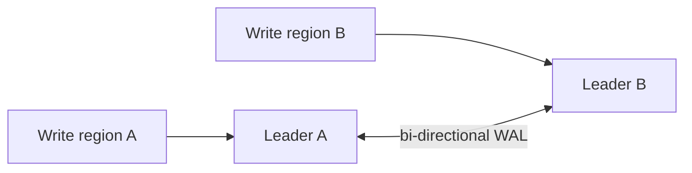
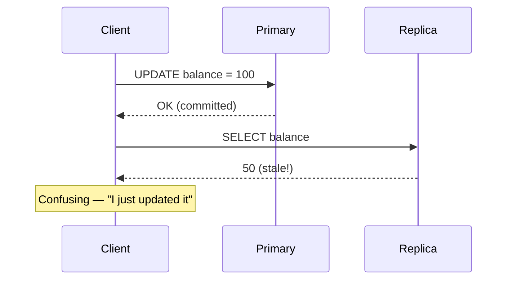
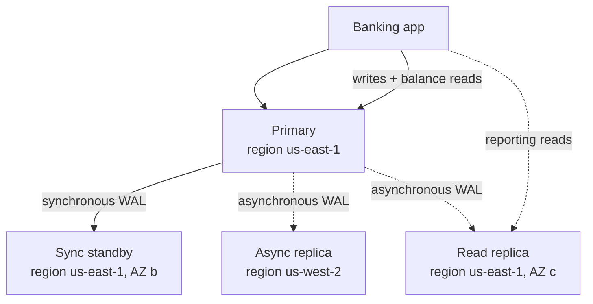

# Replication

> Replication is keeping copies of the same data on multiple nodes. It is the foundation of availability (a replica can serve when the primary fails), read scale (replicas can serve reads), and disaster recovery (a remote replica survives a region failure). It is also the source of the hardest problems in distributed systems: lag, split brain, and stale reads.

## What you already know

From [[00-ACID]]: a single-node database commits a transaction when the WAL is flushed. From [[01-Consensus-Raft-Paxos]]: in a distributed system, "commit" means "the WAL is flushed on a majority." From [[00-CAP-PACELC]]: synchronous replication is PC (consistent); asynchronous replication is closer to PA (available). From [[03-Backup-And-Recovery]]: a backup is a point-in-time copy; a replica is a continuously-updated copy.

## Why this layer exists

A single database is a single point of failure. If the machine dies, the system is down. If the data center loses power, the system is down. If a backhoe cuts the fiber, the system is unreachable. For any system that needs to survive these failures — which is every production system — the data must exist in more than one place.

Replication is how that happens. The primary accepts writes; the replicas follow. When the primary fails, a replica takes over. When read load grows, replicas serve reads. When a region fails, a remote replica keeps the system alive.

But replication introduces a new question: *when is a write "done"?*

- If "done" means "the primary has it," a failover may lose data the primary acknowledged (asynchronous replication — fast, risky).
- If "done" means "a majority of replicas have it," the primary must wait (synchronous replication — slow, safe).
- If "done" means "at least one replica has it," the primary waits briefly (semi-synchronous — middle ground).

Each choice is a trade-off. This layer exists to make those trade-offs explicit, because every replicated system has made them — implicitly or explicitly.

## What is genuinely new here

> **Replication is the mechanism that turns "the data is safe on one node" into "the data is safe on multiple nodes." The cost is the question of when a write is committed — and that choice is the CAP/PACELC position of the system.**

The key concepts:

- **Synchronous** vs **asynchronous** vs **semi-synchronous** — the commit semantics.
- **Primary-replica** (master-slave) vs **multi-leader** (master-master) — the write topology.
- **Replication lag** — the unavoidable gap between primary and replica.
- **Read-your-writes** consistency — the property that prevents "I just wrote it, but I can't see it."

## Concepts

### Synchronous vs asynchronous vs semi-synchronous

| Mode | Primary commits when... | Failure risk | Latency |
|---|---|---|---|
| **Synchronous** | At least N replicas have flushed the WAL | Zero data loss on failover (within N) | Higher (waits for replicas) |
| **Asynchronous** | The primary has flushed its own WAL | May lose last few commits on failover | Lower (no wait) |
| **Semi-synchronous** | At least one replica has acked (with timeout fallback) | Usually zero loss; may degrade to async on slow replica | Medium |

In PostgreSQL:

```sql
-- synchronous_commit = on (default): primary flushes WAL before COMMIT returns.
-- For sync replication, also configure:
synchronous_standby_names = 'FIRST 1 (standby1)'
-- Now COMMIT waits until at least standby1 has flushed the WAL.

-- For async replication:
synchronous_standby_names = ''
-- COMMIT returns as soon as the primary's WAL is flushed.
```

### Primary-replica (master-slave)

The classic model:

- One primary accepts writes.
- One or more replicas follow the primary's WAL.
- Reads can go to the primary or to replicas.
- If the primary fails, a replica is promoted.



Pros: simple; strong consistency on the primary; reads scale with replicas.
Cons: writes don't scale (only one primary); failover requires consensus (see [[01-Consensus-Raft-Paxos]]).

### Multi-leader (master-master)

Multiple nodes accept writes, and replicate to each other.



Pros: writes scale; multi-region write availability.
Cons: conflict resolution (two leaders update the same row); weaker consistency; complex.

Multi-leader is rare in relational databases (PostgreSQL BDR is the main exception). It's more common in NoSQL (CouchDB, DynamoDB, Cassandra multi-DC).

### Replication lag

The time between a commit on the primary and the same commit being visible on a replica. Lag is unavoidable — the replica must receive, apply, and make visible the change. Typical lag:

- Synchronous replica: zero (by definition — commit waits for it).
- Asynchronous local replica: milliseconds to seconds.
- Asynchronous remote replica: seconds to minutes (network-bound).
- Cross-region replica: seconds to minutes.

Lag matters because reads from replicas are *stale*. A read from a replica may return data that the primary has already updated.

### Read-your-writes consistency

The property: *if a client writes X, then reads, the read returns X (or a later value).*

Without read-your-writes:



The client sees their own write as missing. This is the most common user-visible bug in replicated systems.

Cures:

- **Sticky reads**: route the client's reads to the primary (or to the replica that has its write). Requires a session affinity layer.
- **Read-the-primary-after-write**: after a write, the client reads from the primary for some window (e.g., 5 seconds), then can fall back to replicas.
- **Session tokens**: the client gets a token representing its latest write; the replica refuses reads until it has the token's LSN. (Cassandra, DynamoDB, MongoDB all support this.)

### Replication as recovery

Replication is the cheapest form of disaster recovery. A remote replica survives a region failure; restoring from backup takes hours; promoting a remote replica takes seconds.

But replication is *not* a backup:

- Replication does not protect against `DROP TABLE users;` — the replica drops it too.
- Replication does not protect against a corrupting migration — the replica applies it too.
- Replication does not protect against ransomware — the replica is encrypted too.

A real disaster recovery strategy has *both* replication (for fast failover) and backups (for point-in-time recovery). See [[03-Backup-And-Recovery]].

## Banking application

The Banking system (see [[00-Banking-Case-Study]]) uses a layered replication strategy:



The design:

- **Synchronous standby in a different AZ** (us-east-1b). Commits wait for this standby. If the primary's AZ fails, the standby is promoted — zero data loss, RPO = 0.
- **Asynchronous replica in a different region** (us-west-2). Commits do not wait for this replica. If the entire us-east-1 region fails, the system can fail over to us-west-2 — but the last few commits may be lost. RPO > 0 (typically < 1 minute).
- **Read replica in a third AZ** (us-east-1c). Reporting queries go here; balance queries go to the primary (read-your-writes).

### The trade-offs, made explicit

| Property | Local sync standby | Remote async replica | Read replica |
|---|---|---|---|
| Commit latency | +5-10ms (WAL flush wait) | None | None |
| Failover data loss | None (RPO=0) | Up to ~1 minute (RPO>0) | None (it has the same data as primary, eventually) |
| Survives AZ failure | Yes | Yes | Yes (but it's read-only) |
| Survives region failure | No | Yes | No |
| Serves reads | No (kept in sync, not for reads) | Yes (but stale) | Yes (slightly stale) |
| Survives primary failure | Yes (promote) | Yes (promote, with data loss) | No (read-only, needs promotion) |

### Why not synchronous to the remote region?

Synchronous cross-region replication means every commit waits for cross-region network round-trip (~50-100ms). For the Banking transfer flow, that means every transfer takes 100ms longer — unacceptable for the customer experience.

The trade-off is explicit:

- **Local sync standby**: zero data loss, low latency. Survives AZ failure.
- **Remote async replica**: small data loss risk, low latency. Survives region failure.

The bank accepts the small RPO risk for region failure because:

1. Region failure is rarer than AZ failure.
2. The lost data (last few seconds of transactions) can be reconstructed from the event log (Cassandra) and from downstream systems.
3. The alternative — 100ms latency on every write — is operationally unacceptable.

This is a deliberate trade-off, written down.

## Code / diagrams

### Configuring PostgreSQL replication

```ini
# postgresql.conf (primary)
wal_level = replica
max_wal_senders = 10
synchronous_commit = on
synchronous_standby_names = 'FIRST 1 (sync_standby)'
# The primary will wait for at least 'sync_standby' to flush WAL before
# acknowledging COMMIT. If sync_standby is unreachable, writes block
# (PC behavior) — see [[00-CAP-PACELC]].
```

```ini
# postgresql.conf (sync_standby)
hot_standby = on
primary_conninfo = 'host=primary_host port=5432 user=replicator'
# The standby connects to the primary and receives WAL.
```

### Routing reads correctly

```java
@Component
public class ReadRouter {

    private final DataSource primaryDs;
    private final DataSource replicaDs;

    // Strong consistency — money
    public BigDecimal currentBalance(long accountId) {
        // Always read from primary — read-your-writes for balances.
        return jdbc(primaryDs).queryForObject(
            "SELECT current_balance FROM accounts WHERE id = ?",
            BigDecimal.class, accountId);
    }

    // Eventually consistent — reports
    public MonthlyReport monthlyReport(long customerId, YearMonth month) {
        // Read from replica — staleness acceptable for reports.
        return jdbc(replicaDs).queryForObject(
            "SELECT * FROM monthly_report_view WHERE customer_id = ? AND month = ?",
            (rs, n) -> map(rs), customerId, month.toString());
    }
}
```

### Replication lag monitoring

```sql
-- On the primary: how far behind is each replica?
SELECT application_name,
       pg_wal_lsn_diff(pg_current_wal_lsn(), replay_lsn) AS lag_bytes,
       replay_lag  -- interval
FROM pg_stat_replication;

-- On a replica: how far behind am I?
SELECT now() - pg_last_xact_replay_timestamp() AS lag_interval;
```

Alert if lag exceeds the SLO (e.g., 5 seconds). A replica that's falling behind is a failover risk.

## What can go wrong

- **Split brain.** Two nodes both think they're the primary. Network partition + buggy failover logic = both accept writes; reconciliation is catastrophic. Consensus (see [[01-Consensus-Raft-Paxos]]) prevents this.
- **Replication lag grows unbounded.** A slow replica falls further behind under load. Eventually it's so far behind that promoting it would lose hours of data. Monitor lag; alert on it; investigate the cause (disk I/O, network, long-running queries on the replica).
- **Read-your-writes violations.** A client writes to the primary, then reads from a lagging replica, and sees their write as missing. Use sticky reads or read-from-primary-after-write.
- **Long-running queries on the replica.** A long `SELECT` on the replica holds back the WAL apply (in some DBs), increasing lag for everyone.
- **Failover fails.** The standby is too far behind, the promotion script has a bug, the DNS update doesn't propagate. Test failover regularly — untested failover is not failover.
- **Failover succeeds but breaks the app.** Connection strings are stale; the app is still trying to write to the old primary (now read-only). Use a connection pooler with HA awareness (pgbouncer with Patroni).
- **Loss of sync replication.** If the sync standby goes down, the primary either blocks writes (PC, available=0) or falls back to async (PC→PA switch). Decide which explicitly; configure the fallback.
- **Conflicts in multi-leader.** Two leaders update the same row; which wins? Last-writer-wins is the default, but it can lose data. Application-level conflict resolution is complex and error-prone.
- **Replication is not backup.** A `DROP TABLE` propagates to replicas. Have backups *in addition* to replicas.
- **Network as a bottleneck.** Synchronous replication doubles the network traffic; cross-region replication saturates links. Size the network for replication traffic.

## Trade-offs

- **Consistency vs latency.** Synchronous replication adds latency; async risks data loss. The Banking compromise: sync locally, async remotely.
- **Availability vs consistency.** Sync replication can block writes if the standby is down (CP). Async keeps writes flowing but may diverge (AP).
- **Read scale vs read-your-writes.** Reading from replicas scales reads but risks stale reads. The compromise: read money from primary, read reports from replicas.
- **Single-region vs multi-region.** Single-region is simpler; multi-region survives region failure but adds cross-region latency (for sync) or eventual consistency (for async).
- **Cost vs resilience.** A standby in another region costs money (compute, storage, network). For most systems, the cost is worth it; for some, it isn't. Make the trade explicitly.
- **Multi-leader vs primary-replica.** Multi-leader scales writes and survives partition, but conflicts are painful. Most systems choose primary-replica and accept the write-scaling limit.

## Forward links

- [[00-CAP-PACELC]] — replication mode is the C/A choice.
- [[01-Consensus-Raft-Paxos]] — consensus elects the new primary after failure.
- [[03-Sharding-Revisited]] — each shard has its own replicas.
- [[04-Eventual-Consistency]] — async replication produces eventual consistency.
- [[05-Banking-Distributed-Design]] — the full Banking replication architecture.
- [[00-ACID]] — replication extends ACID durability across nodes.
- [[00-WAL-Logging]] — the WAL is what replication streams.
- [[03-Backup-And-Recovery]] — replication is the cheapest DR, but not a backup.
- [[04-Banking-Recovery-Scenario]] — how replication participates in recovery.
- [[08-Trade-offs-Everywhere]] — every replication mode is a trade-off.
