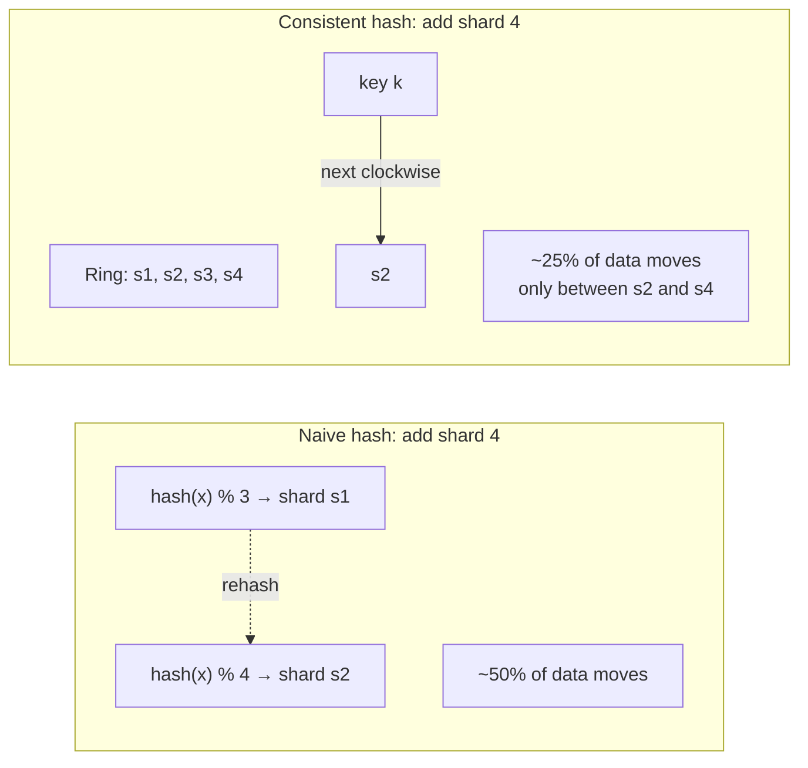
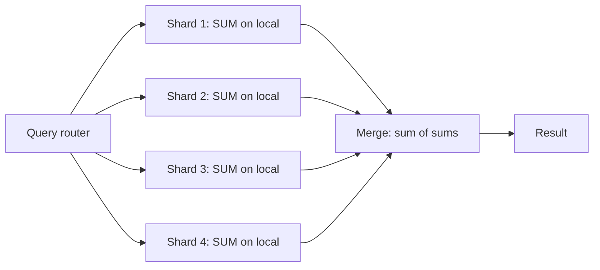
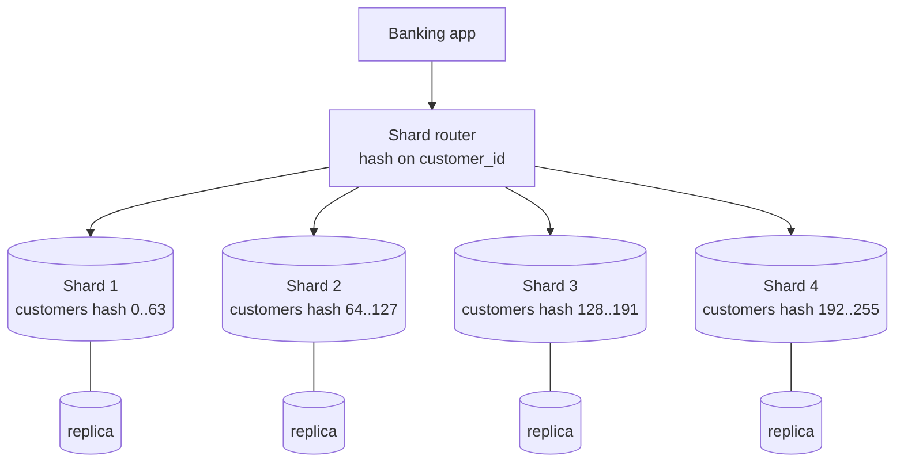

# Sharding Revisited

> Sharding, in depth. [[04-Partitioning-And-Sharding]] introduced it; this note takes it apart. Sharding is the irreversible decision to split your data across multiple databases — and the architectural patterns that make it bearable.

## What you already know

From [[04-Partitioning-And-Sharding]]: partitioning splits a table inside one database; sharding splits the data across multiple databases. From [[03-Dependency-As-Root-Concept]]: a dependency that crosses a shard boundary is fundamentally more expensive than one that doesn't. From [[00-CAP-PACELC]]: a sharded cluster has a CAP position per shard and at the cluster level. From [[01-Consensus-Raft-Paxos]]: cross-shard transactions require distributed consensus, which is slow. From [[08-Trade-offs-Everywhere]]: sharding is a one-way door — once data is distributed, returning to a single database is a multi-year project.

## Why this layer exists

[[04-Partitioning-And-Sharding]] gave the *introduction*: what sharding is, when to shard, the strategies. This note goes deeper, because sharding is not just a database feature — it is an *architectural decision* that shapes the application code, the operational complexity, and the system's failure modes for years.

Once you shard:

- Cross-shard transactions become a real problem (2PC, sagas).
- Cross-shard joins become forbidden (denormalize or do them in the app).
- Cross-shard aggregations become fan-out + merge.
- Schema migrations must hit every shard, in order.
- Adding a shard requires re-hashing and moving data.
- The application must know the shard key — or use middleware that does.

These are not edge cases. They are the daily reality of a sharded system. This layer exists to make that reality explicit, so that when you shard, you shard with eyes open.

## What is genuinely new here

> **Sharding is not a database optimization. It is an architectural commitment. The decision to shard is the decision to live with cross-shard complexity forever — and to design every query, every transaction, and every migration around it.**

The single most important rule, restated:

> **Shard only when you must, and shard along the access pattern.**

"Must" means: you have exhausted vertical scaling (bigger machine), read replicas (read scale), and partitioning (single-DB storage scale), and you are still hitting a write-throughput or storage ceiling.

## Concepts

### Sharding strategies — in depth

| Strategy | How it works | Pros | Cons |
|---|---|---|---|
| **Range-based** | Shards by a contiguous range (A-M on shard 1, N-Z on shard 2) | Range queries hit one shard | Hot shards (popular ranges) |
| **Hash-based** | `hash(key) % N` | Even distribution | Range queries fan out; rebalancing moves ~half the data |
| **Consistent hashing** | `hash(key)` on a ring; each node owns a range of the ring | Adding a shard moves only a fraction of data | Range queries still fan out |
| **Directory-based** | A lookup table maps each key to a shard | Flexible; supports any distribution | Lookup table is a bottleneck; must itself be highly available |
| **Geo-based** | Each region's data in its region's shards | Low latency, data residency | Cross-region queries are slow; conflict resolution needed |

### Consistent hashing — the cure for rebalancing pain

With naive hash sharding (`hash(key) % N`), adding a new shard (N+1) re-hashes every key — half the data moves. This is unacceptable at scale.

Consistent hashing places both nodes and keys on a ring. A key is owned by the next node clockwise. Adding a node splits one range into two — only the keys in that range move. The amount of data moved is `1/N`, not `1/2`.



Cassandra, DynamoDB, Riak, and Redis Cluster all use consistent hashing. CockroachDB and Vitess use variants of range-based sharding with automatic splitting.

### The cross-shard problems

#### Cross-shard transactions

A transfer from account A (shard 1) to account B (shard 2) requires atomicity across two databases. Three options:

1. **Two-phase commit (2PC)** — a coordinator asks both shards to prepare, then to commit. Slow, blocking, fragile (coordinator failure is bad). See [[08-Two-Phase-Commit]].
2. **Saga pattern** — split the transfer into two local transactions: debit A on shard 1, credit B on shard 2, with a compensating transaction (reverse debit) if the credit fails. Eventual consistency; complex.
3. **Co-locate related data** — design the shard key so both accounts live on the same shard (e.g., shard by `customer_id` if both accounts belong to the same customer). Then the transfer is a single-shard transaction.

Option 3 is by far the best — when it works. The skill of sharding is choosing a key that makes most transactions single-shard.

#### Cross-shard joins

Most sharded systems forbid them. The cure is denormalization: copy the joined columns into the same shard as the primary key.

Example: instead of joining `accounts` to `customers` to get the customer name, store `customer_name` on `accounts`. Updates to the name are propagated via events (see [[04-Domain-Events]]).

#### Cross-shard aggregations

`SELECT SUM(amount) FROM ledger_entries WHERE occurred_at > ...` becomes:



The router fans out, each shard computes locally, the router merges. This is *scatter-gather* — doable but slow (limited by the slowest shard).

### Architectural patterns

| Pattern | What it is | Examples |
|---|---|---|
| **Application-level sharding** | The application routes each query to the right shard | Custom; most flexible; most work |
| **Middleware / proxy** | A layer routes queries; the application talks to one logical DB | Vitess (MySQL), Citus (PostgreSQL), Cassandra's internal sharding |
| **Database-native** | The database shards itself | MongoDB sharded clusters, CockroachDB, Spanner, Cassandra |

Application-level sharding gives the most control but is the most work. Middleware reduces work but adds a new component. Database-native is the easiest to use but locks you into the database's sharding model.

### Vitess and Citus — the PostgreSQL/MySQL sharding layer

**Vitess** shards MySQL. Originally built at YouTube, now a CNCF project. The application talks to VTGate (a proxy) as if it were a single MySQL; VTGate routes queries to the right shard (or shards, for scatter-gather). Vitess handles cross-shard transactions, schema migrations, and resharding.

**Citus** shards PostgreSQL. Acquired by Microsoft, available as a PostgreSQL extension. The application talks to the Citus coordinator node as if it were a single PostgreSQL; Citus routes queries to worker nodes. Cross-shard queries are supported but slower than single-shard.

Both let you start with a single database and shard later — but the rewrite to be "shard-aware" is significant.

## Banking application

The Banking system (see [[00-Banking-Case-Study]]) shards `accounts` and `ledger_entries` by `customer_id` when the customer base grows beyond 50M. The shard key is `customer_id` because:

- 95% of queries are `WHERE customer_id = ?` — single-shard.
- Transfers between two accounts of the *same* customer are single-shard.
- Transfers between accounts of *different* customers are cross-shard — the saga pattern handles them.

### Single-shard transfer (same customer)

```java
@Transactional
public void transferInternal(TransferRequest req) {
    // Both accounts belong to the same customer → same shard → one transaction.
    Account from = accounts.findById(req.fromId());
    Account to   = accounts.findById(req.toId());
    assert from.customerId().equals(to.customerId());
    from.debit(req.amount());
    to.credit(req.amount());
    ledger.append(from.id(), -req.amount(), ...);
    ledger.append(to.id(), +req.amount(), ...);
    accounts.save(from);
    accounts.save(to);
}
```

### Cross-shard transfer (different customers) — the saga

```mermaid
sequenceDiagram
    participant TS as TransferService
    participant S1 as Shard 1 (from)
    participant S2 as Shard 2 (to)
    participant BUS as Event bus

    TS->>S1: BEGIN; debit A; insert ledger(-amt); insert outbox(event); COMMIT
    S1-->>TS: success (debit committed)
    TS->>BUS: publish DebitCompleted
    BUS->>S2: consume DebitCompleted
    S2->>S2: BEGIN; credit B; insert ledger(+amt); insert outbox(event); COMMIT
    S2-->>BUS: publish CreditCompleted
    BUS->>TS: consume CreditCompleted
    TS->>TS: mark transfer as COMPLETED

    Note over TS,S2: If S2 fails:CreditFailed → compensating transaction<br/>on S1: reverse the debit, mark transfer as REVERSED.
```

The saga:

1. Debit the source account, atomically with an outbox event.
2. Publish the event.
3. The consumer credits the destination account, atomically with another outbox event.
4. If the credit fails (e.g., destination is frozen), publish a `CreditFailed` event.
5. The `CreditFailed` consumer runs a *compensating transaction* on the source: reverse the debit, mark the transfer as REVERSED.

The transfer is eventually consistent — there is a window where the money is debited but not yet credited. The customer sees the transfer as PENDING during this window. This is the cost of cross-shard: no atomic transaction, only saga + compensation.

### The router

```java
@Component
public class ShardedAccountRepository {

    private final Map<Integer, DataSource> shards;  // shardId → DataSource

    public Account findById(long accountId) {
        int shardId = shardOf(accountId);
        return jdbc(shards.get(shardId)).queryForObject(
            "SELECT * FROM accounts WHERE id = ?",
            Account.class, accountId);
    }

    private int shardOf(long accountId) {
        // Consistent hashing — or a directory lookup
        return consistentHash.hash(accountId) & 0xFF;  // shard 0..255
    }
}
```

The router knows the shard key and routes accordingly. For `customer_id`-based sharding, the router would shard on `customer_id`, and all queries would include `WHERE customer_id = ?`.

### Why not 2PC for cross-shard transfers?

2PC would give atomicity — both shards commit or both roll back. But:

- 2PC is slow — every cross-shard transaction takes 100ms+.
- 2PC is fragile — a coordinator failure blocks both shards.
- 2PC is blocking — both shards hold locks during the prepare phase.

For a bank processing 10k transfers/sec, even 1% being cross-shard means 100 2PC transactions/sec — a significant load. The saga is faster and scales better, at the cost of eventual consistency.

The trade-off is explicit: 2PC for atomicity when low volume; saga for throughput when high volume.

## Code / diagrams

### The sharded architecture



Each shard is itself a primary + replica pair (see [[02-Replication]]). The router knows the shard map; the application code is unaware.

### The resharding process

When a shard grows too large, split it:

1. Provision a new shard.
2. Update the shard map: half the hash range now points to the new shard.
3. Backfill: copy the affected rows from the old shard to the new.
4. Cut over: route reads + writes to the new shard.
5. Delete the copied rows from the old shard.

With consistent hashing, this moves ~`1/N` of the data. With naive hashing, ~`1/2`. Use consistent hashing.

## What can go wrong

- **Wrong shard key.** Sharding by `account_id` when queries are by `customer_id` fans out every query. The system is slower than the unsharded version.
- **Hot shard.** One customer (a major corporation) generates 30% of the traffic. Their shard melts. Split them out as a dedicated shard.
- **Cross-shard transactions.** Once you need them, you need 2PC or sagas. Both are complex.
- **Rebalancing pain.** Adding a shard moves data. With naive hashing, ~half. Plan for rebalancing from day one (use consistent hashing).
- **Global uniqueness lost.** A `UNIQUE` constraint cannot span shards. Use a globally-unique ID generator (Snowflake, ULID).
- **Schema migrations across shards.** Run the migration on each shard, in order. A migration that fails on shard 3 leaves the system inconsistent. Use a migration tool that wraps all shards.
- **Scatter-gather latency.** A cross-shard `SUM` is limited by the slowest shard. One slow shard slows every scatter-gather query.
- **Operational complexity.** N shards = N databases to monitor, back up, and recover. Each shard's replica is another database. The operational surface grows linearly.
- **Reversibility.** Going from sharded back to single-database is a multi-year project. Treat sharding as a one-way door.
- **"Sharded too early."** Many systems shard before they need to. The complexity is paid up-front; the benefit may never materialize. Shard only when vertical scaling, read replicas, and partitioning are exhausted.

## Trade-offs

- **Write scalability vs query flexibility.** Sharding scales writes by requiring the shard key in every query.
- **Single-shard vs cross-shard.** Single-shard transactions are fast and atomic; cross-shard require sagas or 2PC.
- **Even distribution vs range queries.** Hash sharding distributes evenly but breaks range queries; range sharding supports range queries but risks hot shards.
- **Application complexity vs middleware.** Application-level sharding is flexible but a lot of work; middleware reduces work but adds a component.
- **Reversibility.** Sharding is largely irreversible. Don't do it lightly.
- **Cost vs scale.** A sharded cluster costs more (more nodes, more replicas) but scales beyond a single database.

## Forward links

- [[04-Partitioning-And-Sharding]] — the introduction; this is the depth.
- [[00-CAP-PACELC]] — each shard has its own CAP position.
- [[01-Consensus-Raft-Paxos]] — per-shard consensus.
- [[02-Replication]] — each shard's primary-replica setup.
- [[04-Eventual-Consistency]] — cross-shard sagas are eventually consistent.
- [[05-Banking-Distributed-Design]] — the full sharded Banking architecture.
- [[07-Distributed-Transactions]] — 2PC vs saga in depth.
- [[08-Two-Phase-Commit]] — the strong-consistency cross-shard option.
- [[03-Dependency-As-Root-Concept]] — a cross-shard dependency is the most expensive kind.
- [[00-Banking-Case-Study]] — the transfer flow may cross shards.
- [[08-Trade-offs-Everywhere]] — sharding is the canonical irreversible trade.
