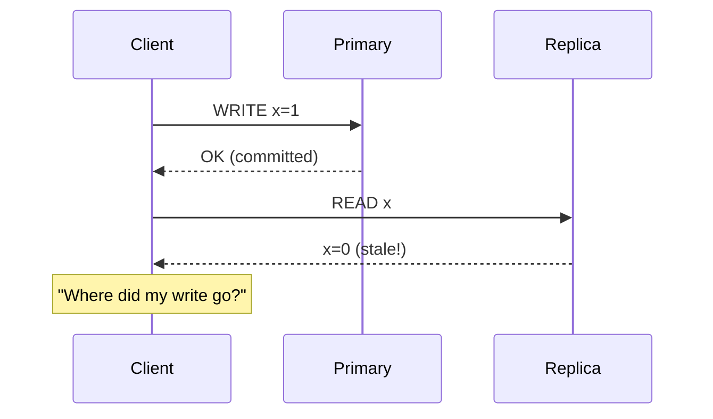
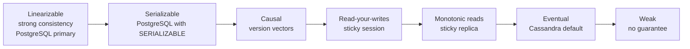
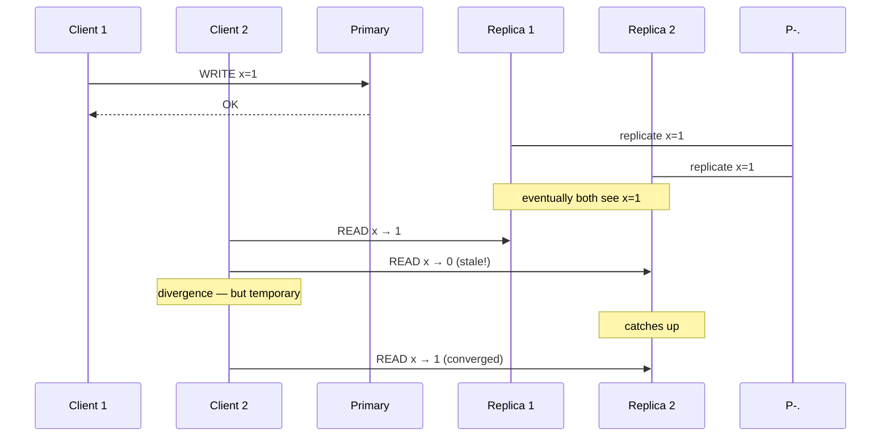

# Eventual Consistency

> Eventual consistency is the promise that, given enough time and no new writes, all replicas will converge to the same value. It is the relaxed consistency model that lets distributed systems scale — and the source of every "I see different data on different nodes" bug.

## What you already know

From [[00-ACID]]: a single-node database is strongly consistent — every read sees the latest committed write. From [[02-Replication]]: a replicated database has *lag* — the replica is behind the primary by some amount of time. From [[00-CAP-PACELC]]: AP systems choose availability over consistency during a partition; they accept that replicas may diverge. From [[03-Caching]]: a cache is, by definition, eventually consistent with its source — the cache is updated independently, and there's a window of staleness.

## Why this layer exists

Strong consistency is expensive. It requires coordination — every write must be acknowledged by a quorum, every read must check the latest version. At global scale, that coordination is slow (cross-region round-trips) and fragile (any partition blocks progress).

Many workloads do not need strong consistency:

- A social media feed: if you see a like 2 seconds after it was clicked, you don't notice.
- A search index: if a new document is searchable a minute after upload, that's fine.
- A dashboard: if the numbers are 5 minutes old, the dashboard is still useful.
- A notification log: if the email is sent a second late, no one cares.

For these, strong consistency is *wasted cost*. The system pays for coordination it doesn't need.

Eventual consistency is the relaxed model: replicas may diverge temporarily, but they will *converge* — given enough time and no new writes, all replicas will reach the same state. The trade is explicit: scalability and availability in exchange for temporary divergence.

This layer exists because every distributed system makes this trade somewhere. The question is not "should we be eventually consistent?" but "where should we be eventually consistent, and where must we be strong?"

## What is genuinely new here

> **Eventual consistency is not a single property; it is a family of relaxed guarantees. The variants — read-your-writes, monotonic reads, monotonic writes, causal consistency — are the dials you tune per subsystem.**

The rule for Banking:

> **Strong consistency for money; eventual consistency for everything else.**

The balance is never eventually consistent — money cannot be approximated. The notification log, the search index, the dashboard — all eventually consistent.

## Concepts

### The base guarantee

> **Eventual consistency**: if no new updates are made to a value, eventually all reads will return the last written value.

Two parts:

1. *Eventually* — there is no bound on the convergence time, but it's finite in practice (usually seconds).
2. *Converge* — replicas stop diverging and reach agreement.

This is weak. It says nothing about *when*, and nothing about what reads see *during* convergence.

### The variants — stronger than "just eventual"

To make eventual consistency useful, we add stronger guarantees:

| Variant | Guarantee | How it's achieved |
|---|---|---|
| **Read-your-writes** | A client's reads always reflect their own writes | Sticky sessions; session tokens |
| **Monotonic reads** | A client never sees data go backward in time | Route a session's reads to one replica |
| **Monotonic writes** | A client's writes are applied in the order they were issued | Write to the same primary; sequence numbers |
| **Causal consistency** | Causally-related operations are seen in order | Version vectors; lamport clocks |
| **Strong eventual consistency** | Replicas converge to the same state *eventually*, with no conflicts | CRDTs (conflict-free replicated data types) |

These are *independent* — you can have read-your-writes without monotonic reads, etc. Most systems offer some combination.

### Read-your-writes

The most user-visible property. Without it, a client writes X, then reads, and sees the old value — confusing.



Cures:

- **Sticky reads**: route the client's reads to the primary (or to the replica that has its write).
- **Session tokens**: the client gets a token after writing; the replica refuses to serve reads until it has the token's LSN. (Cassandra, DynamoDB, MongoDB support this.)
- **Read-from-primary-after-write**: the client reads from the primary for a short window (5 seconds) after writing, then can fall back to replicas.

### Monotonic reads

A client reads x=5, then reads x=3. Time went backward — confusing.

Cure: route the client's reads to *one* replica (sticky session). If that replica falls behind, the client sees stale data — but at least it sees *monotonically advancing* stale data.

### Causal consistency

If operation A causally precedes B (B read A's result, or B was sent by the same client after A), then every replica must see A before B.

Cures:

- **Version vectors**: each write carries a vector of [node, counter] pairs; reads see only writes whose vectors are "covered."
- **Lamport clocks**: a single counter per node, with logical ordering.

Causal consistency is the strongest variant that doesn't require coordination. Stronger than causal (e.g., linearizability) requires consensus.

### Conflict resolution

When two replicas accept concurrent writes to the same key, they diverge. Reconciliation requires a rule:

| Strategy | How it works | When it fits |
|---|---|---|
| **Last-writer-wins (LWW)** | The write with the latest timestamp wins | When timestamps are reliable (clock sync) and any lost write is acceptable |
| **Application-specific** | The application merges (e.g., union of sets) | When the data is a set or counter |
| **CRDT** | The data type is designed to merge without conflict | Counters, sets, maps; growing data |
| **Version vectors + manual** | The system detects the conflict; a human or code resolves | When conflicts are rare and the data is important |

LWW is the default in most AP systems (Cassandra, DynamoDB). It can silently lose data — if two clients write concurrently, one write disappears. For money, this is unacceptable; for a "like" counter, it's fine.

### CRDTs (Conflict-free Replicated Data Types)

A CRDT is a data type whose merge operation is *associative, commutative, and idempotent* — meaning any two replicas that have seen the same set of updates (in any order) will converge to the same state, regardless of order.

Examples:

- **G-Counter** (grow-only counter) — each replica maintains its own counter; merge is element-wise max.
- **PN-Counter** (positive-negative counter) — two G-Counters, one for increments, one for decrements; supports decrement.
- **G-Set** — add-only set; merge is union.
- **OR-Set** (observed-remove set) — adds carry a unique tag; removes only remove observed tags; supports add + remove without conflict.

CRDTs make strong eventual consistency possible — convergence is guaranteed, with no conflicts. The cost: the data type must be designed for it, and the storage overhead can be significant.

### When eventual is right (and wrong)

| Right | Wrong |
|---|---|
| Social media feeds | Financial balances |
| Search indexes | Inventory counts |
| Analytics dashboards | Account status (active/frozen) |
| Notification logs | Order state (paid/shipped) |
| Caches (almost always) | Authorization decisions |
| Recommendation features | Audit logs (must be precise, but see [[01-Document-Stores]]) |

The test: *if a stale read produces a wrong decision that costs money or trust, strong consistency is required.*

## Banking application

The Banking system (see [[00-Banking-Case-Study]]) draws the boundary explicitly:

| Subsystem | Consistency | Why |
|---|---|---|
| Account balance | Strong (PostgreSQL primary) | Money must be exact |
| Transfer state (COMMITTED, REVERSED) | Strong | Money must be exact |
| Ledger entries | Strong (source of truth) | Auditability |
| Customer session | Eventual (Redis) | A stale session is tolerable |
| Recent-transfers cache | Eventual (Redis) | "Recent" implies approximate |
| Notification log | Eventual (Cassandra) | Notifications can be late |
| Fraud graph | Eventual (Neo4j) | Fraud detection is asynchronous |
| Statement search index | Eventual (Elasticsearch) | Search lag is tolerable |
| Dashboard daily balances | Eventual (materialized view) | Dashboard is by definition approximate |

### The boundary in code

```java
// STRONG — money. Always reads from PostgreSQL primary.
@Transactional
public BigDecimal currentBalance(long accountId) {
    return accounts.findBalance(accountId);
}

// EVENTUAL — recent activity. Reads from Redis cache.
public List<Transfer> recentTransfers(long customerId) {
    String key = "recent:" + customerId;
    String cached = redis.get(key);
    if (cached != null) return parse(cached);
    // Cache miss — fall through to PostgreSQL (the source of truth).
    List<Transfer> fresh = transfers.findRecent(customerId, 5);
    redis.set(key, toJson(fresh), Duration.ofSeconds(30));
    return fresh;
}

// EVENTUAL — fraud. Reads from Neo4j.
public List<FraudAlert> findRings(Duration window) {
    return neo4j.findThreeCycles(window);
    // Note: the graph lags PostgreSQL by ~1 second. A transfer that just
    // happened may not appear. The fraud batch runs every 5 minutes, so
    // this lag is acceptable.
}
```

### The read-your-writes fix

When a customer makes a transfer, they expect to see it immediately in their transaction list. But the list might come from a cache (eventual). The fix:

```java
public List<Transfer> transfersForCustomer(long customerId, long lastSeenTransferId) {
    // If the customer just made a transfer, read from primary (source of truth).
    if (lastSeenTransferId == customerLastWriteId(customerId)) {
        return transfers.findByCustomer(customerId, 5);
    }
    // Otherwise, read from cache (eventual).
    return recentTransfersCache.get(customerId);
}
```

Or, simpler: after a write, route reads to the primary for a short window (e.g., 5 seconds). After that, fall back to the cache.

## Code / diagrams

### The consistency spectrum



### The convergence of replicas



### A CRDT: G-Counter

```java
// Each replica maintains its own counter; merge is element-wise max.
public final class GCounter {
    private final Map<String, Long> counts = new ConcurrentHashMap<>();

    public void increment(String replicaId) {
        counts.merge(replicaId, 1L, Long::sum);
    }

    public long value() {
        return counts.values().stream().mapToLong(Long::longValue).sum();
    }

    // Merge: take the max of each replica's count.
    public void merge(GCounter other) {
        other.counts.forEach((id, c) ->
            counts.merge(id, c, Math::max));
    }
}
```

Two replicas increment independently; on merge, each takes the max — guaranteed convergence, no conflicts.

## What can go wrong

- **Stale reads used for decisions.** A dashboard balance used to authorize a transfer is a bug. The staleness contract must be enforced by the application, not assumed.
- **Lost updates with LWW.** Two clients update the same key concurrently; one update is silently dropped. For money, this is unacceptable.
- **Read-your-writes violations.** A client writes, then reads from a lagging replica, and sees their write as missing. Use sticky reads or session tokens.
- **Monotonic reads violations.** A client reads from one replica (sees x=5), then another (sees x=3). Time went backward. Use sticky sessions.
- **Unbounded convergence.** "Eventually" can be a long time if the network is bad. Monitor replica lag; alert if it exceeds the SLO.
- **Conflict resolution bugs.** LWW based on wall-clock timestamps breaks if clocks are skewed. Use logical clocks (Lamport, vector clocks) where possible.
- **Eventually consistent *and* lost.** If a replica fails permanently before converging, and the primary also fails, the data is lost. Replication + eventual consistency is not a backup.
- **"It's just eventual" as an excuse.** Eventual consistency is a *deliberate trade*, not a license for sloppy semantics. The variants (RYW, monotonic, causal) exist for a reason — use the strongest one your workload needs.
- **CRDT misuse.** CRDTs only work for data types designed for them. A "balance" is not a CRDT — losing an update is not OK.

## Trade-offs

- **Availability vs consistency.** Eventual consistency gives availability under partition (AP); strong gives consistency (CP). The choice is per-subsystem.
- **Latency vs consistency.** Eventual reads are fast (any replica); strong reads are slow (must check the latest).
- **Simplicity vs correctness.** Strong consistency is simpler to reason about; eventual requires thinking about variants, conflicts, and convergence.
- **CRDTs vs application-level merge.** CRDTs are automatic but limit the data model; application-level merge is flexible but error-prone.
- **Strong eventual vs causal vs linearizable.** Each step up costs latency. Pick the weakest that meets the requirement.

## Forward links

- [[00-CAP-PACELC]] — eventual consistency is the AP choice.
- [[02-Replication]] — async replication produces eventual consistency.
- [[05-Banking-Distributed-Design]] — the consistency boundaries in the Banking architecture.
- [[05-Banking-NoSQL-Choice]] — each NoSQL store has a consistency position.
- [[00-ACID]] — the strong consistency guarantee, contrasted.
- [[00-When-Relational-Strains]] — NoSQL's relaxed consistency is the trade.
- [[03-Caching]] — every cache is eventually consistent.
- [[07-Distributed-Transactions]] — 2PC for strong; sagas for eventual.
- [[04-Domain-Events]] — events are eventually consistent by nature.
- [[08-Trade-offs-Everywhere]] — eventual vs strong is the canonical distributed trade.
