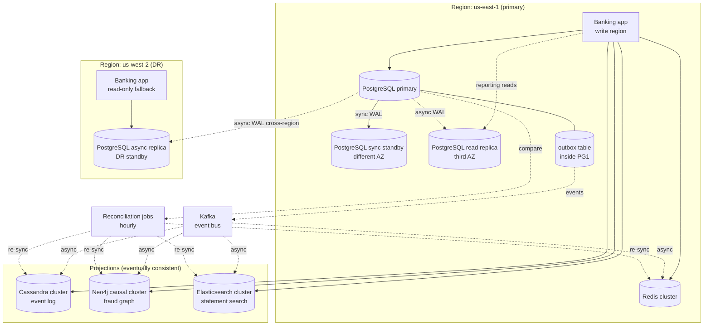
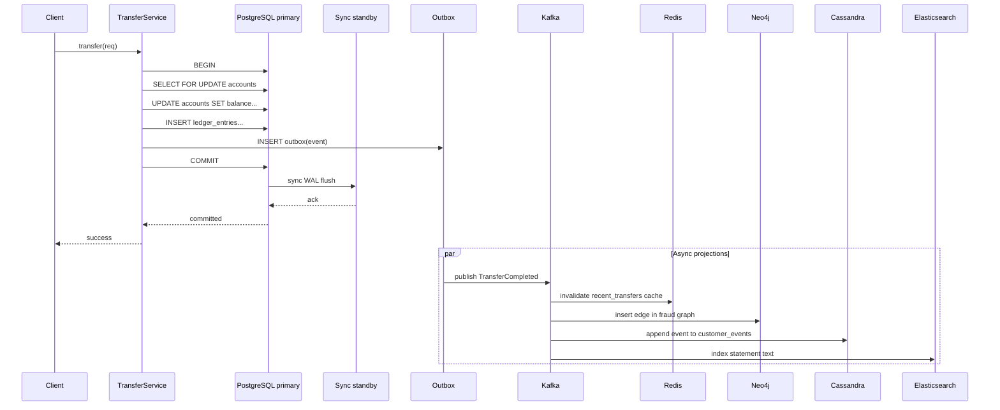
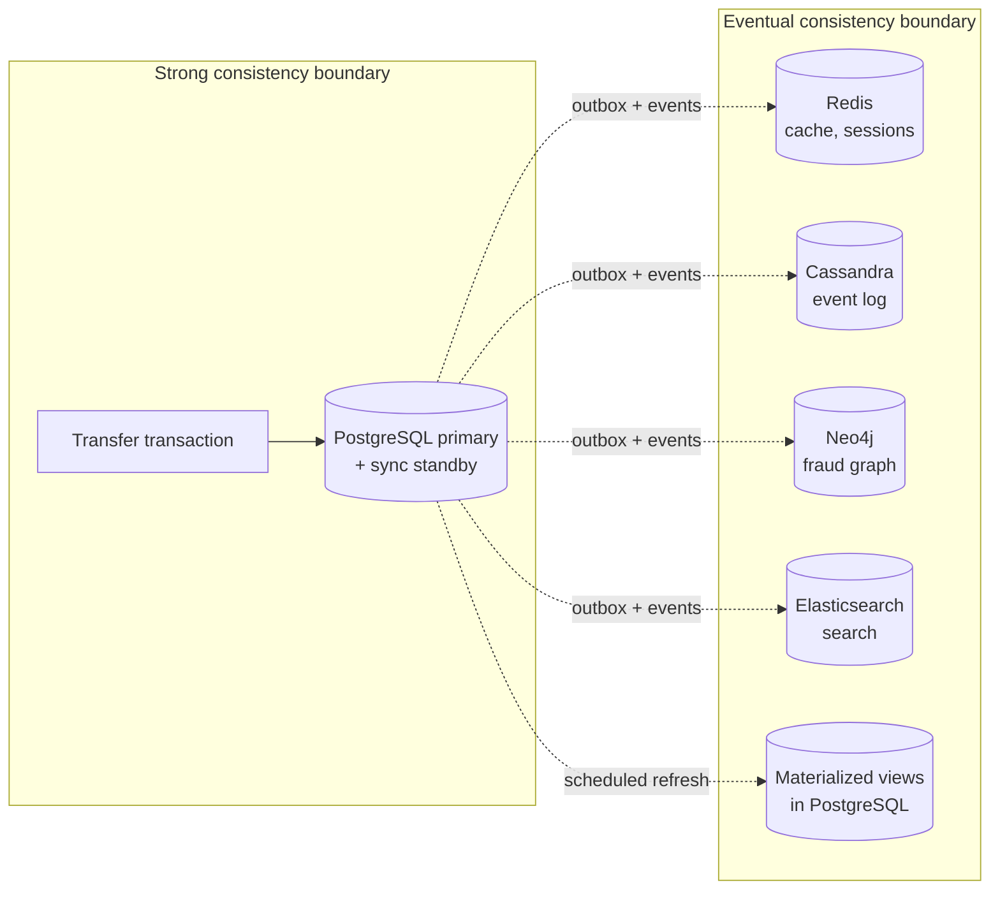
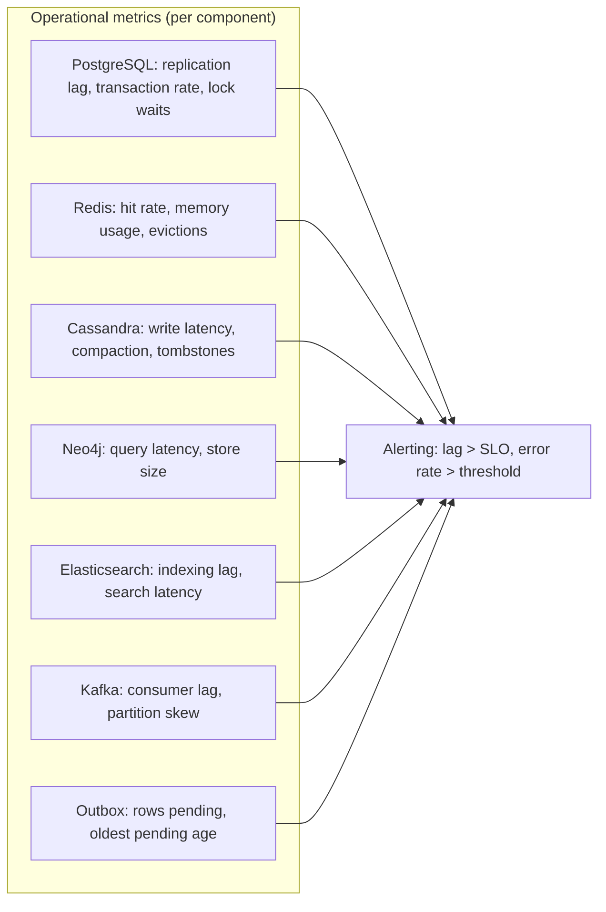

# Banking Distributed Design — End to End

> The Banking system, distributed. One primary cluster, multiple read replicas, an event log, a cache, a search index, a fraud graph — all kept in sync by events, all with explicit consistency boundaries, all designed to survive the failure of any one component.

## What you already know

From [[00-CAP-PACELC]]: every distributed subsystem has a position on consistency vs availability vs latency. From [[01-Consensus-Raft-Paxos]]: the primary cluster uses Raft-based consensus (via Patroni + etcd) for failover. From [[02-Replication]]: synchronous local replication for RPO=0, asynchronous cross-region for disaster recovery. From [[03-Sharding-Revisited]]: when the customer base exceeds 50M, `accounts` and `ledger_entries` are sharded by `customer_id`. From [[04-Eventual-Consistency]]: strong for money, eventual for everything else. From [[05-Banking-NoSQL-Choice]]: the polyglot persistence layer with PostgreSQL, Cassandra, Redis, Neo4j, Elasticsearch.

## Why this layer exists

The previous five notes built the *concepts*: CAP, consensus, replication, sharding, eventual consistency. This note assembles them into one architecture for the Banking system (see [[00-Banking-Case-Study]]). The architecture is not a single database — it is a *system of systems*, each with a role, each with a failure mode, each with a consistency contract.

The skill of distributed design is not "use all the things." It is:

1. Pick the *minimum* set of components that meets the requirements.
2. Draw the *boundaries* between them — what is strong, what is eventual, what is cached, what is computed.
3. Define the *failure scenarios* — what happens when each component fails, and how the system degrades.
4. Define the *operational model* — who monitors what, who on-calls what, how incidents are handled.

This note is that architecture, written down.

## What is genuinely new here

> **Distributed design is the art of drawing boundaries. The hard part is not the components — it is deciding where strong consistency ends and eventual consistency begins, where the source of truth ends and projections begin, where the synchronous path ends and the async path begins.**

The Banking architecture draws those boundaries explicitly:

- **Strong consistency boundary**: the core ledger (PostgreSQL primary + sync standby). Money is never eventually consistent.
- **Eventual consistency boundary**: notifications, search index, fraud graph, dashboard. Each is a projection of the source of truth, with a defined lag.
- **Cache boundary**: customer summary, sessions, rate limits. Each is recreatable from the source.
- **Disaster recovery boundary**: cross-region async replica. Survives region failure; small RPO accepted.

## Banking application

### The full architecture



### Component roles

| Component | Role | PACELC position | Failure mode |
|---|---|---|---|
| PostgreSQL primary | Source of truth | PC/EL | Fails over to sync standby |
| Sync standby (same region, different AZ) | Zero-data-loss failover | PC/EL | Promoted on primary failure |
| Read replica (third AZ) | Reporting reads | PA/EL (for reads) | Reporting degrades; app reads from primary |
| Async replica (cross-region) | Disaster recovery | PA/EL | Promoted on region failure; small RPO |
| Redis cluster | Cache, sessions, rate-limits | PA/EL | Cache misses; reads fall back to PostgreSQL |
| Cassandra cluster | Event log, audit log | PA/EL | Event log queries fail; dashboard degrades |
| Neo4j causal cluster | Fraud graph | PC/EL (writes) / PA/EL (reads) | Fraud detection pauses; transfers proceed |
| Elasticsearch cluster | Statement search | PA/EL | Search returns "temporarily unavailable" |
| Kafka | Event bus | PA/EL (with ISR sync) | Projections fall behind; outbox grows |
| Patroni + etcd | Leader election | PC/EC (Raft) | Cluster cannot elect a leader; writes block |

### The write path — one transaction, multiple eventual updates

When a customer initiates a transfer:



The transaction is atomic: the transfer and the outbox row commit together. The projections are eventual: they update via the bus, with a typical lag of 200ms-2s.

### The read path — routing by query shape

| Query | Route | Consistency | Latency |
|---|---|---|---|
| "Balance for account 123" | PostgreSQL primary | Strong | ~5ms |
| "Statement for January 2024" | PostgreSQL primary (or sync replica) | Strong | ~10ms |
| "Recent activity widget" | Redis cache | Eventual (30s lag) | ~1ms |
| "Search statements containing 'mortgage'" | Elasticsearch | Eventual (~1s lag) | ~50ms |
| "Find fraud rings in the last 7 days" | Neo4j | Eventual (~1s lag) | ~200ms |
| "Customer events for last 30 days" | Cassandra | Eventual (~1s lag) | ~10ms |
| "Monthly report" | Materialized view | Eventual (24h lag) | ~5ms |
| "Is session abc valid?" | Redis | Eventual | ~1ms |

The application's `ReadRouter` (see [[05-Banking-NoSQL-Choice]]) makes these decisions explicit. There is no transparent federation — each query goes to the right store, by name.

## The failure scenarios

### Scenario 1: Primary failure (AZ-level)

The primary's AZ loses power.

1. Patroni detects the primary missed its heartbeat (within ~10s).
2. etcd (Raft) elects the sync standby as the new primary.
3. The connection pooler (pgbouncer) is notified; it routes new connections to the new primary.
4. The sync standby has all committed data (it was synchronous). RPO = 0.
5. The application continues. The customer sees a brief error on in-flight requests, then succeeds on retry.

**Downtime**: ~10-30 seconds. **Data loss**: 0.

### Scenario 2: Region failure

The entire us-east-1 region is down.

1. Patroni in us-west-2 detects that the primary region is unreachable.
2. Operators (or automation) decide to fail over to the DR replica.
3. The DR replica is promoted. The DNS is updated to route traffic to us-west-2.
4. The DR replica was asynchronous — the last few transactions (up to ~1 minute) may be lost.
5. Reconciliation jobs identify the gap and reconcile from the event log (Cassandra has the events, even if the primary's last commits are lost).

**Downtime**: ~5-30 minutes (DNS propagation, operator decision, promotion). **Data loss**: up to ~1 minute (RPO).

This is a deliberate trade-off: cross-region synchronous replication would add ~100ms to every write, which is operationally unacceptable. The bank accepts the small RPO for the rare region-failure case.

### Scenario 3: Network partition (split brain)

The network between the primary and the sync standby fails.

1. The primary cannot reach the sync standby. Synchronous commits block (PC behavior — writes refuse).
2. Patroni detects the partition. The sync standby (still reachable from etcd) tries to elect itself.
3. etcd (Raft) elects the sync standby as the new primary. The old primary is told to demote.
4. There is a brief window where both think they're primary — but only one has the etcd lease. The old primary refuses writes (Patroni demotes it).

**Downtime**: ~10-30 seconds. **Data loss**: 0 (sync replication ensures the standby had all committed data).

### Scenario 4: Kafka failure

The event bus is down.

1. The outbox table grows (events are not being published).
2. The application continues to work — transfers still commit, balance reads still work.
3. Projections fall behind: fraud detection misses recent transfers, search index doesn't have new statements, recent-transfers cache is stale.
4. When Kafka recovers, the outbox publisher drains the backlog. Projections catch up.

**Customer impact**: dashboards and search are stale; transfers work. **Recovery**: automatic, when Kafka is back.

### Scenario 5: Neo4j failure

The fraud graph is down.

1. Fraud queries fail. The application can either:
   - Hold transfers for manual review (slower but safe), or
   - Allow transfers without fraud check (faster but riskier), depending on policy.
2. The graph's data is preserved in PostgreSQL + Cassandra. When Neo4j recovers, it can be rebuilt from the event log.

**Customer impact**: fraud detection is degraded or paused. **Recovery**: rebuild Neo4j from the event log, or restore from backup.

### Scenario 6: Redis failure

The cache cluster is down.

1. Cache misses — every cached read falls through to PostgreSQL.
2. PostgreSQL load spikes (it's now serving reads the cache was handling).
3. Latency increases; throughput may drop.
4. When Redis recovers, the cache warms up over a few minutes.

**Customer impact**: slower responses. **Recovery**: automatic, cache warms.

### Scenario 7: Replica lag grows

The async replica falls behind.

1. Reporting queries (which read from the replica) return stale data.
2. The lag monitor alerts when lag exceeds the SLO (5s).
3. Investigation: slow disk on the replica, long-running query, network issue.
4. Fix: kill the long-running query, restart the replica, or provision more IOPS.

**Customer impact**: stale reports. **Recovery**: lag returns to normal after the cause is fixed.

## Code / diagrams

### The consistency boundary diagram



Money never crosses the strong boundary. Projections cross it, with a defined lag.

### The DR failover runbook (simplified)

```text
Trigger: us-east-1 region unreachable for > 5 minutes.

1. Confirm region failure (cloud status page, multiple AZs down).
2. Verify us-west-2 DR replica is up and has acceptable lag (< 1 minute).
3. Stop application writes in us-east-1 (cordoned).
4. Promote us-west-2 DR replica to primary:
   - pg_ctl promote on the DR node
   - Update DNS to route traffic to us-west-2
   - Update connection pooler config
5. Verify application health in us-west-2.
6. Resume write traffic.
7. When us-east-1 recovers: rebuild it as a replica of us-west-2 (reverse the
   replication direction). Do NOT auto-fail back — the original primary may
   have committed transactions that the DR replica didn't receive; those
   must be reconciled from the event log before us-east-1 rejoins.
8. Post-incident: reconcile every projection against the source of truth.
   Re-run reconciliation jobs for Cassandra, Neo4j, Elasticsearch, Redis.

Estimated downtime: 15-30 minutes.
Estimated data loss: 0-60 seconds of transactions (RPO).
```

### The operational dashboard



Each component has its own metrics; each metric has an SLO; each SLO has an alert. The outbox pending count is the most important alert — if it's growing, the projections are falling behind, and the system is in trouble even if the customer doesn't see it yet.

## What can go wrong

- **Boundary confusion.** A developer writes a transfer to Neo4j directly, or reads balance from a replica. The boundaries are enforced by the `ReadRouter` and the `TransferService` — but only if developers respect them. Code review must check.
- **Cascade failure.** Kafka fails → outbox grows → PostgreSQL disk fills → PostgreSQL fails. Each component must have its own protection (the outbox has a TTL on old rows; PostgreSQL has disk alerts).
- **DR failover fails.** The DR replica is too far behind, the DNS doesn't propagate, the application has stale connection strings. Test DR failover *regularly* — at least quarterly. Untested DR is not DR.
- **Reconciliation drift accumulates.** Events fail silently; projections fall behind. Without hourly reconciliation, drift is invisible. Run reconciliation; alert on drift > threshold.
- **Operator error.** Promoting the wrong replica, dropping the wrong table, misconfiguring the shard map. The cure is automation — fewer manual steps in failover, more scripts with peer review.
- **Cross-component latency.** A transfer is committed in PostgreSQL in 5ms, but the customer sees it in the dashboard only after 2 seconds (cache TTL). The customer thinks the transfer is slow. Tune the cache TTL or read-after-write strategy.
- **Operational complexity.** Five datastores + Kafka + Patroni + etcd = many things to monitor, many things that can fail, many runbooks to write. Hire for this; budget for it.
- **Cost.** A multi-region, polyglot, replicated, consensus-based architecture is expensive — compute, storage, network, and people. The Banking system needs it; most systems do not. Don't build this for a system with 10,000 users.
- **"Let's add multi-region."** Multi-region adds another order of magnitude of complexity. Start single-region; go multi-region only when latency or compliance demands it.
- **Forgetting the source of truth.** When a projection fails, the system must fall back to the source. When the source fails, the system must fail over to a replica. The relationships must be documented — or operators will not know what to do at 3am.

## Trade-offs

- **Strong vs eventual consistency (per subsystem).** Money is strong; everything else is eventual. The boundary is the most important decision in the architecture.
- **Latency vs resilience.** Synchronous replication adds latency; cross-region async risks data loss. The bank accepts both — sync locally, async remotely.
- **Complexity vs availability.** Each additional component adds a failure mode *and* an availability story. The five-store polyglot is more available than a single store — if operated correctly.
- **Cost vs scale.** A polyglot distributed system costs more than a single database. The scale must justify it.
- **Automation vs human judgment.** DR failover can be automated (Patroni, etcd) or manual (operator decides). Auto-failover is faster but can be wrong (false positives); manual is slower but safer. Pick per criticality.
- **Single-region vs multi-region.** Single-region is simpler; multi-region survives region failure but is significantly more complex. Start single-region.
- **Reversibility.** Adding a projection is reversible (drop it). Adding a region is a major project. Removing the source of truth is impossible. The architecture has one-way doors — know which is which.

## Forward links

- [[00-CAP-PACELC]] — the consistency positions of each component.
- [[01-Consensus-Raft-Paxos]] — Patroni/etcd for leader election.
- [[02-Replication]] — the layered replication strategy.
- [[03-Sharding-Revisited]] — sharding `accounts` by `customer_id`.
- [[04-Eventual-Consistency]] — the projections and their consistency contracts.
- [[05-Banking-NoSQL-Choice]] — the polyglot persistence layer.
- [[05-Banking-Performance-Tuning]] — the optimizations that produced this shape.
- [[00-ACID]] — the strong consistency guarantee of the core.
- [[07-Distributed-Transactions]] — saga vs 2PC for cross-shard transfers.
- [[03-Backup-And-Recovery]] — replication + backups, not just replication.
- [[04-Banking-Recovery-Scenario]] — the recovery scenarios in detail.
- [[04-Domain-Events]] — the outbox pattern that keeps projections in sync.
- [[00-Banking-Case-Study]] — the invariants every component preserves.
- [[08-Trade-offs-Everywhere]] — every line in this architecture is a trade-off, made explicit.
