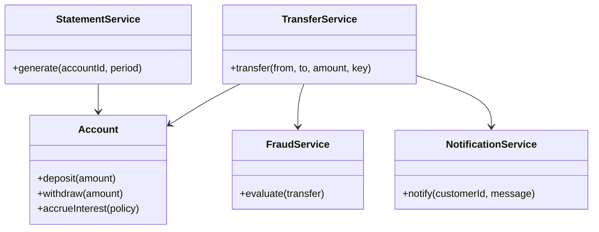
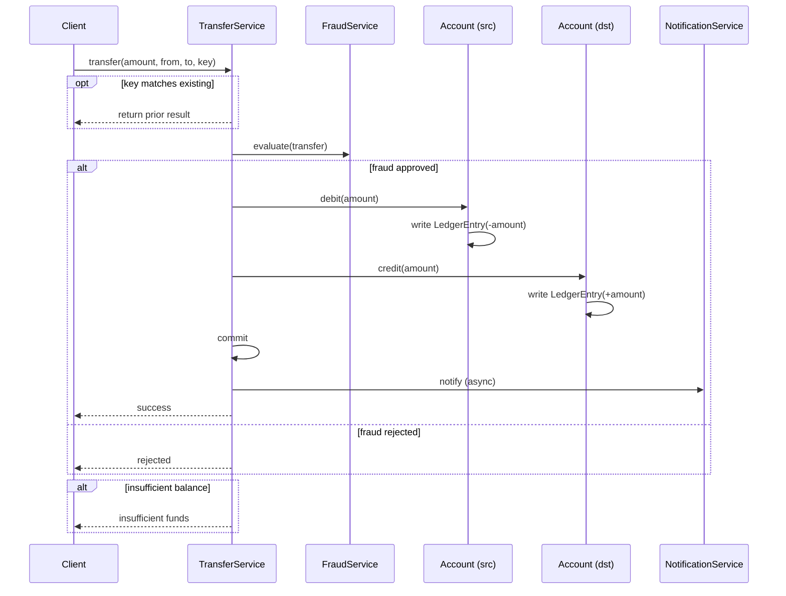
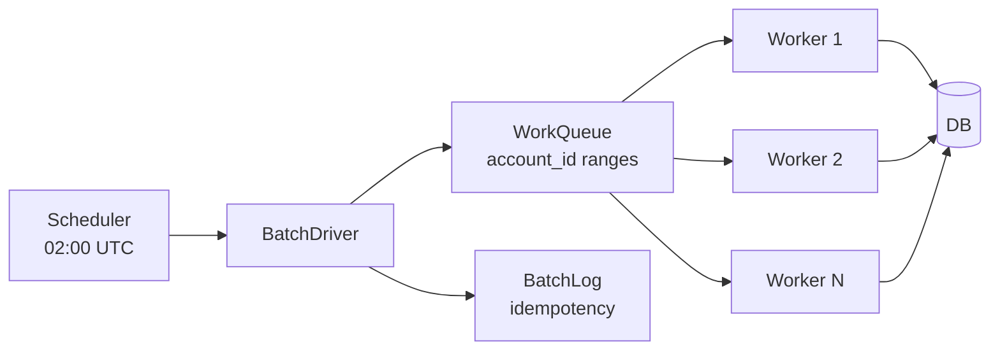

# OOP + LLD Exercises

> Exercises for the design half of the vault: OOP, SOLID, patterns, UML, LLD, architecture.

## How to use this file

See [[00-Exercise-Index]] for the workflow. Attempt each problem before reading hints or solutions.

---

## Exercise 1 — Refactor the God Object

**Problem.** The following `BankingService` class violates Single Responsibility. Identify the responsibilities it is mixing, split it into cohesive classes, and draw a class diagram of the result.

```java
public class BankingService {
    public void openAccount(String customerId, String type) { /* ... */ }
    public void closeAccount(String accountId) { /* ... */ }
    public void transfer(String from, String to, BigDecimal amount) { /* ... */ }
    public void deposit(String accountId, BigDecimal amount) { /* ... */ }
    public void withdraw(String accountId, BigDecimal amount) { /* ... */ }
    public Statement generateStatement(String accountId, Period period) { /* ... */ }
    public void accrueInterest(String accountId) { /* ... */ }
    public FraudScore evaluateFraud(Transfer transfer) { /* ... */ }
    public void sendNotification(String customerId, String message) { /* ... */ }
    public byte[] exportAuditLog(LocalDate from, LocalDate to) { /* ... */ }
}
```

**Hints.**
- Group methods by the invariant they protect.
- Some methods belong to entities (Account), some to services (TransferService), some to infrastructure (AuditLogExporter).
- Cross-link [[01-SRP]], [[02-Aggregates]], [[05-Anemic-vs-Rich-Models]].

**Solution.** The class mixes at least six responsibilities: account lifecycle (open/close), money movement (transfer/deposit/withdraw), reporting (statement), periodic computation (interest), risk evaluation (fraud), and infrastructure (notification, audit). A clean split:

```
Account                // entity, owns balance invariant
  open(), close(), freeze()
  deposit(amount), withdraw(amount)
  accrueInterest(policy)

TransferService        // service, orchestrates transfers
  transfer(from, to, amount, idempotencyKey)

StatementService       // service, generates statements
  generate(accountId, period)

FraudService           // service, bounded context
  evaluate(transfer)

NotificationService    // infrastructure
  notify(customerId, message)

AuditLogExporter       // infrastructure
  export(from, to)
```

Each class has one responsibility. The class diagram:



**What this teaches.** [[01-SRP]] is not about method count; it is about invariant ownership. The original class protected at least six invariants; the refactored version protects one per class.

---

## Exercise 2 — Apply OCP to Interest Policies

**Problem.** The following code violates Open/Closed: every time the bank introduces a new account type, the `computeInterest` method must be modified.

```java
public BigDecimal computeInterest(Account account) {
    if (account instanceof SavingsAccount) {
        return account.getBalance().multiply(SAVINGS_RATE);
    } else if (account instanceof CheckingAccount) {
        return BigDecimal.ZERO;  // checking earns no interest
    } else if (account instanceof MoneyMarketAccount) {
        // New account type — modify this method
        return account.getBalance().multiply(MONEY_MARKET_RATE);
    }
    throw new IllegalArgumentException();
}
```

Refactor so that adding a new account type requires *no change* to existing code. Use the Strategy pattern. Show the class diagram and the Java code.

**Hints.**
- The interest rule belongs to the account type, not to a central calculator.
- Define an `InterestPolicy` interface with one method.
- Each account type holds a reference to its policy.
- Cross-link [[02-OCP]], [[04-Polymorphism]], [[05-Composition-Over-Inheritance]].

**Solution.**

```java
public interface InterestPolicy {
    BigDecimal compute(Account account);
}

public final class SavingsInterestPolicy implements InterestPolicy {
    private final BigDecimal rate;
    public SavingsInterestPolicy(BigDecimal rate) { this.rate = rate; }
    @Override public BigDecimal compute(Account account) {
        return account.getBalance().multiply(rate);
    }
}

public final class ZeroInterestPolicy implements InterestPolicy {
    public static final ZeroInterestPolicy INSTANCE = new ZeroInterestPolicy();
    @Override public BigDecimal compute(Account account) { return BigDecimal.ZERO; }
}

public final class MoneyMarketInterestPolicy implements InterestPolicy {
    private final BigDecimal baseRate;
    private final BigDecimal balanceTier;
    // ...
}

public abstract class Account {
    private final InterestPolicy interestPolicy;
    protected Account(InterestPolicy interestPolicy) { this.interestPolicy = interestPolicy; }
    public BigDecimal computeInterest() { return interestPolicy.compute(this); }
}
```

To add a new account type: create a new `InterestPolicy` implementation and pass it to the account constructor. No existing code changes. OCP satisfied.

**What this teaches.** [[02-OCP]] is achievable by *composition with polymorphism*: the varying behavior is pulled out into a strategy, and the stable code depends on the strategy interface.

---

## Exercise 3 — Find the LSP Violation

**Problem.** A junior developer on the Banking team wrote the following hierarchy. Identify the Liskov Substitution violation and explain why it is a problem.

```java
public class Account {
    public void withdraw(BigDecimal amount) {
        if (balance.compareTo(amount) < 0) throw new InsufficientFundsException();
        balance = balance.subtract(amount);
    }
}

public class SavingsAccount extends Account { /* inherits withdraw */ }

public class CheckingAccount extends Account {
    private BigDecimal overdraftLimit;
    @Override
    public void withdraw(BigDecimal amount) {
        // Allow withdrawal up to overdraft limit
        if (balance.add(overdraftLimit).compareTo(amount) < 0) throw new InsufficientFundsException();
        balance = balance.subtract(amount);
    }
}

public class FrozenAccount extends Account {
    @Override
    public void withdraw(BigDecimal amount) {
        throw new AccountFrozenException();  // Always throws
    }
}
```

**Hints.**
- LSP says: subtypes must be substitutable for their base types.
- "Substitutable" means: code that works on `Account` must work correctly on any subclass.
- Look at the contracts (preconditions, postconditions) of each subclass's `withdraw`.
- Cross-link [[03-LSP]].

**Solution.** Two violations:

1. **`CheckingAccount` weakens the postcondition.** The base class guarantees "after `withdraw`, balance ≥ 0." `CheckingAccount` allows balance < 0. Code that assumes `balance ≥ 0` (e.g., a reporting query) will break when given a `CheckingAccount`.

2. **`FrozenAccount` strengthens the precondition.** The base class accepts any `amount > 0` (subject to balance). `FrozenAccount` rejects all `amount`. Code that calls `account.withdraw(amount)` and expects either success or `InsufficientFundsException` will break when it gets `AccountFrozenException` instead.

The deeper problem: `FrozenAccount` is not a subtype of `Account` — it is an `Account` in a different *state*. The fix is to model account status as a state, not a subclass (see [[04-State-Diagrams]] and the State pattern in [[03-Behavioral-Patterns]]):

```java
public final class Account {
    private AccountStatus status;  // PENDING, ACTIVE, FROZEN, CLOSED
    public void withdraw(BigDecimal amount) {
        status.withdraw(this, amount);  // delegate to state
    }
}
```

`CheckingAccount` may still be a legitimate subtype if the contract explicitly allows overdraft — but the base class contract must declare this.

**What this teaches.** [[03-LSP]] is about *contracts*, not just method signatures. Subclasses can weaken preconditions and strengthen postconditions; they cannot do the reverse. Inheritance hierarchies must be designed around contracts, not around "is-a" intuition.

---

## Exercise 4 — Draw the Transfer Sequence Diagram

**Problem.** Draw a UML sequence diagram for the transfer use case from [[02-Use-Cases]], including:

- The main success scenario
- The "fraud rejected" extension (alt fragment)
- The "insufficient balance" extension (alt fragment)
- The "idempotency key matches" extension (opt fragment)

**Hints.**
- Use Mermaid `sequenceDiagram`.
- Participants: Client, TransferService, FraudService, Account (source), Account (dest), LedgerEntry, NotificationService.
- Cross-link [[02-Sequence-Diagrams]], [[02-Use-Cases]].

**Solution.**



**What this teaches.** [[02-Sequence-Diagrams]] are not decoration; they expose the *interaction structure* of the system. Drawing this diagram forces you to decide: who validates idempotency? who calls fraud? what happens on each failure path? These decisions are design decisions, even if they look like "just drawing."

---

## Exercise 5 — LLD the Daily Interest Batch

**Problem.** Apply the LLD method from [[00-LLD-Method]] to design a daily interest accrual batch for the Banking system.

**Requirements:**
- Runs once per day at 02:00 UTC.
- For each SavingsAccount, computes daily interest = balance × (rate / 365).
- Accumulates interest in an `accrued_interest` column on the account.
- On the first day of each month, credits the accumulated interest to the balance (as a ledger entry) and resets `accrued_interest` to 0.
- Must handle: 10M accounts, batch window of 4 hours, no impact on online traffic, idempotent (re-running for the same day produces the same result).

**Apply the method:**
1. State the problem.
2. Sketch a naive design.
3. Identify how it fails.
4. Enumerate the design forces.
5. Propose a better design.
6. Draw the architecture (component diagram).
7. Write the Java skeleton.
8. State the trade-offs.

**Hints.**
- Naive: `SELECT * FROM accounts WHERE type = 'SAVINGS'` then loop. Fails on scale (10M rows in one query) and impact (locks online traffic).
- Forces: throughput (10M / 4h = ~700/sec), isolation (no impact on online), idempotency (re-runnable), observability (how do we know it succeeded?).
- Better: batch in chunks, use a cursor or pagination, process in parallel workers, write a batch log for idempotency, run on a read replica for the balance reads if possible (or use snapshot isolation).
- Cross-link [[00-LLD-Method]], [[02-Aggregates]] (one aggregate per transaction), [[04-Partitioning-And-Sharding]] (partition by account id range), [[00-Query-Optimization-Strategy]].

**Solution sketch.**



```java
public class DailyInterestBatch {
    private final AccountRepository accounts;
    private final BatchLogRepository batchLog;
    private final ExecutorService workers;

    public void run(LocalDate date) {
        if (batchLog.exists(date)) {
            log.info("Batch already run for {}", date);
            return;
        }
        var ranges = accounts.partitionByAccountIdRange(numWorkers);
        var futures = ranges.stream()
            .map(range -> workers.submit(() -> processRange(range, date)))
            .toList();
        awaitAll(futures);
        batchLog.markCompleted(date);
    }

    private void processRange(IdRange range, LocalDate date) {
        try (var accounts = accounts.streamActiveSavingsAccounts(range)) {
            accounts.forEach(account -> {
                processOne(account, date);
            });
        }
    }

    @Transactional
    public void processOne(SavingsAccount account, LocalDate date) {
        if (batchLog.processed(account.id(), date)) return;  // idempotent
        var dailyInterest = account.balance().multiply(account.dailyRate());
        account.accrue(dailyInterest);
        if (date.getDayOfMonth() == 1) {
            account.creditAccruedInterest();  // creates ledger entry, resets accrued
        }
        batchLog.markProcessed(account.id(), date);
    }
}
```

**Trade-offs.**
- Chunked processing adds complexity (work queue, worker pool, failure recovery) but enables parallelism and re-runnability.
- Per-account idempotency log adds writes but makes the batch safe to retry.
- `@Transactional` per account (not per batch) keeps transactions short and avoids long locks.
- Running on a read replica for balance reads would reduce online impact, but writes still go to the primary — and the replica may lag. Use snapshot isolation on the primary if the batch window allows.

**What this teaches.** [[00-LLD-Method]] is not "draw classes first." It is "identify the forces, then design for them." The naive design fails because it ignores the forces (scale, isolation, idempotency); the better design succeeds because each force has a structural answer.

---

## Exercise 6 — Pick the Architecture

**Problem.** For each of the following systems, recommend an architecture (Layered / Hexagonal / Clean / Microservices) and justify:

1. A prototype banking app for a hackathon.
2. A production banking backend for a small credit union (10k customers).
3. A production banking backend for a global bank (50M customers, 20 countries).
4. An internal audit log viewer (read-only, low traffic).
5. A real-time fraud detection system (high throughput, low latency).

**Hints.**
- Match the architecture to the *forces*, not to "what's modern."
- Cross-link [[05-Architecture-Trade-offs]].

**Solution.**

| System | Recommendation | Why |
|---|---|---|
| Hackathon prototype | Layered monolith | Speed of development; no need for ports/adapters when there's nothing to swap |
| Small credit union | Hexagonal monolith | Domain isolation enables future swaps (DB, fraud provider); testing is easier; team is small enough to maintain one codebase |
| Global bank | Microservices per bounded context | Scale, team autonomy, regulatory boundaries per country, independent deployment |
| Audit log viewer | Layered monolith (or even simpler) | Read-only, low traffic, no complex domain — over-engineering with Clean Architecture would be wasteful |
| Real-time fraud | Microservice with event-driven ingestion | High throughput, low latency, decoupled from transaction path; can scale horizontally; failure does not block transfers |

**What this teaches.** [[05-Architecture-Trade-offs]] is not "microservices are better." It is "match the architecture to the forces." The right answer depends on scale, team structure, regulatory constraints, and change frequency — not on fashion.

---

## Exercise 7 — Anti-Pattern Hunt

**Problem.** Identify the anti-pattern(s) in each of the following code snippets. For each, name the anti-pattern, explain the symptom and cause, and propose a fix.

**Snippet A:**
```java
public class Account {
    public Long id;
    public String iban;
    public BigDecimal balance;
    public String status;
    // ... 47 public fields, no methods
}
public class AccountService {
    public void transfer(Account from, Account to, BigDecimal amount) {
        if (from.status.equals("ACTIVE") && from.balance.compareTo(amount) >= 0) {
            from.balance = from.balance.subtract(amount);
            to.balance = to.balance.add(amount);
        }
    }
}
```

**Snippet B:**
```java
public class TransferService {
    private static TransferService instance;
    public static TransferService getInstance() {
        if (instance == null) instance = new TransferService();
        return instance;
    }
    // ... 30 methods, all static, all calling each other
}
```

**Snippet C:**
```java
public BigDecimal getBalance(Long accountId) {
    if (accountId == null) return new BigDecimal("0");
    if (accountId == 0L) return new BigDecimal("0");  // 0 means "no account"
    var account = repo.findById(accountId);
    if (account == null) return new BigDecimal("0");
    if (account.balance == null) return new BigDecimal("0");
    return account.balance;
}
```

**Hints.**
- Cross-link [[05-Anti-Patterns]], [[05-Anemic-vs-Rich-Models]], [[01-SRP]].
- Each snippet violates multiple principles.

**Solution.**

**Snippet A:**
- **Anemic Domain Model** — `Account` is a data bag; all behavior is in `AccountService`. The balance invariant is unprotected.
- **God Object (mild)** — `AccountService.transfer` does too much (validates, mutates, persists).
- *Fix:* Move `withdraw`/`deposit` into `Account`; have `TransferService` call `from.withdraw(amount)` and `to.deposit(amount)`.

**Snippet B:**
- **Singleton abuse** — `TransferService` is a Singleton, which makes it a global variable. Untestable, hard to mock, hides dependencies.
- **God Object** — 30 static methods all calling each other is procedural code wearing a class costume.
- *Fix:* Make `TransferService` an instance class with injected dependencies. If you really need one instance per JVM, use a DI container to enforce it — not the Singleton pattern.

**Snippet C:**
- **Zero Means Null** — `accountId == 0L` is being used to mean "no account." This conflates a valid value (0) with absence. Future bug: an account legitimately gets id 0 (auto-increment resets), and the function returns 0 instead of the actual balance.
- **Magic Number** — `new BigDecimal("0")` repeated four times.
- **Null-Agony** — Multiple null checks; the function cannot decide whether null is valid input.
- *Fix:* Use `Optional<Account>`; return `Optional<BigDecimal>`; reject null at the API boundary; never use 0 to mean absence.

**What this teaches.** Anti-patterns are not aesthetic sins; they are accumulated violations of foundational principles. Snippet A violates SRP and encapsulation. Snippet B violates DIP (Singletons are concrete dependencies) and SRP. Snippet C violates the principle that absence should be modeled explicitly, not by overloading a value.

---

## What's next

- [[02-SQL-Normalization-Exercises]] — the data modeling half.
- [[03-Transactions-Concurrency-Exercises]] — the hard correctness problems.
- [[04-End-To-End-Capstone]] — put it all together.
