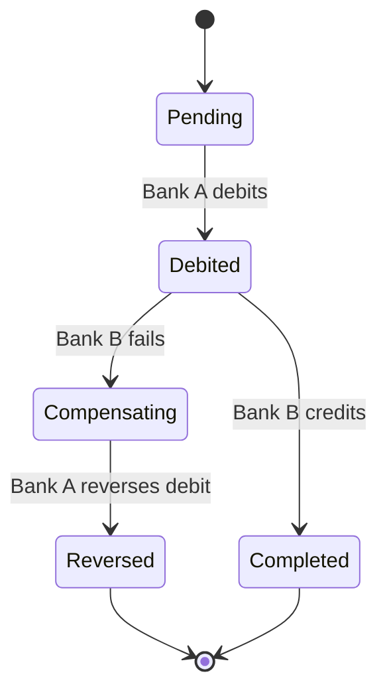

# Transactions + Concurrency Exercises

> Exercises for the correctness-under-failure half: transactions, isolation, MVCC, recovery, distributed systems.

## How to use this file

See [[00-Exercise-Index]] for the workflow. These are the hardest exercises in the vault. Attempt them carefully.

---

## Exercise 1 — Diagnose the Lost Update

**Problem.** Two customers, Alice and Bob, are co-owners of a joint account with balance $1000. At the same instant, Alice initiates a transfer of $800 out, and Bob initiates a transfer of $700 out. Both transfers should not succeed — only $1000 is available.

The application code is:

```java
@Transactional
public void transfer(Long fromId, Long toId, BigDecimal amount) {
    var from = accountRepo.findById(fromId).orElseThrow();
    if (from.getBalance().compareTo(amount) < 0) {
        throw new InsufficientFundsException();
    }
    var to = accountRepo.findById(toId).orElseThrow();
    from.setBalance(from.getBalance().subtract(amount));
    to.setBalance(to.getBalance().add(amount));
    accountRepo.save(from);
    accountRepo.save(to);
}
```

The isolation level is READ COMMITTED (PostgreSQL default). Both transfers succeed; the final balance is -$500.

Explain why both transfers succeeded. Fix the code in three different ways.

**Hints.**
- This is the classic lost update anomaly. Cross-link [[01-Concurrency-Anomalies]].
- The read-then-write pattern is vulnerable.
- Fix options: (1) row-level lock, (2) optimistic locking with `@Version`, (3) SERIALIZABLE isolation.
- Cross-link [[03-Two-Phase-Locking]], [[04-MVCC]], [[02-Isolation-Levels]].

**Solution.**

**Why it happened:** Both transactions read the balance ($1000) before either writes. Both check ($1000 >= $800, $1000 >= $700 — both pass). Both write ($1000 - $800 = $200, $1000 - $700 = $300). The second write overwrites the first; the final balance is whichever transaction committed last. The check used a stale read.

In READ COMMITTED, each statement sees a snapshot at statement start, but the read and the write are in *different* statements, so the write does not see what other transactions have written in the meantime.

**Fix 1 — Row-level lock (`SELECT ... FOR UPDATE`):**

```java
@Transactional
public void transfer(Long fromId, Long toId, BigDecimal amount) {
    var from = accountRepo.findByIdForUpdate(fromId).orElseThrow();  // SELECT ... FOR UPDATE
    if (from.getBalance().compareTo(amount) < 0) throw new InsufficientFundsException();
    var to = accountRepo.findByIdForUpdate(toId).orElseThrow();
    from.debit(amount);  // entity method, encapsulates the mutation
    to.credit(amount);
}
```

The `FOR UPDATE` locks the row; the second transaction blocks until the first commits. Then it re-reads the (now updated) balance and the check fails correctly. This is Two-Phase Locking in practice.

**Fix 2 — Optimistic locking with `@Version`:**

```java
@Entity
public class Account {
    @Id Long id;
    @Version Long version;  // JPA optimistic lock
    // ...
}

@Transactional
public void transfer(Long fromId, Long toId, BigDecimal amount) {
    var from = accountRepo.findById(fromId).orElseThrow();
    if (from.getBalance().compareTo(amount) < 0) throw new InsufficientFundsException();
    var to = accountRepo.findById(toId).orElseThrow();
    from.debit(amount);
    to.credit(amount);
    accountRepo.save(from);
    accountRepo.save(to);  // throws OptimisticLockException if version changed
}
```

When the second transaction tries to save, JPA checks the version: it has changed (the first transaction incremented it). The save fails with `OptimisticLockException`. The application catches it and retries (or returns an error).

**Fix 3 — SERIALIZABLE isolation:**

```java
@Transactional(isolation = Isolation.SERIALIZABLE)
public void transfer(Long fromId, Long toId, BigDecimal amount) {
    // same code as the original
}
```

PostgreSQL's SSI (Serializable Snapshot Isolation) detects the read-write conflict and aborts one of the transactions with `SQLSTATE 40001`. The application retries.

**Which to choose?**
- Fix 1 (locking): simple, predictable, but reduces concurrency (other transactions on the same account must wait).
- Fix 2 (optimistic): high concurrency, but requires retry logic and is wasteful under heavy contention.
- Fix 3 (SERIALIZABLE): cleanest code, but SSI has overhead and may abort more transactions than necessary.

For transfers (low contention per account, high stakes), Fix 1 is usually the right choice. For reporting workloads with occasional writes, Fix 2. For complex multi-table transactions where locks are hard to reason about, Fix 3.

**What this teaches.** [[01-Concurrency-Anomalies]] are not theoretical — they happen the moment two transactions touch the same row. The read-then-write pattern is the most common source of lost updates. The three fixes correspond to three different concurrency strategies (cross-link [[03-Two-Phase-Locking]], [[04-MVCC]], [[05-Serializability]]); choosing among them is a trade-off (cross-link [[08-Trade-offs-Everywhere]]).

---

## Exercise 2 — Predict the Anomaly

**Problem.** For each scenario, predict which anomaly can occur under READ COMMITTED, REPEATABLE READ (PostgreSQL's Snapshot Isolation), and SERIALIZABLE. Justify each.

**Scenario A:** T1 reads account balance. T2 updates account balance and commits. T1 reads account balance again.

**Scenario B:** T1 runs `SELECT COUNT(*) FROM ledger_entries WHERE account_id = 1`. T2 inserts a new ledger entry for account 1 and commits. T1 re-runs the same query.

**Scenario C:** T1 reads account balance. T2 reads the same account balance. Both T1 and T2 update the balance based on what they read, then both commit.

**Hints.**
- Cross-link [[02-Isolation-Levels]], [[01-Concurrency-Anomalies]].

**Solution.**

| Scenario | READ COMMITTED | REPEATABLE READ (PG) | SERIALIZABLE |
|---|---|---|---|
| A: re-read a row | Non-repeatable read (T1 sees different values) | No anomaly (T1 sees the snapshot) | No anomaly |
| B: re-run a query | Phantom read (T1 sees different count) | No anomaly (PG's RR prevents phantoms — stricter than the SQL standard) | No anomaly |
| C: read-modify-write | Lost update (both succeed, last write wins) | Lost update — *but PostgreSQL's RR detects this and aborts one with serialization failure* | No anomaly (SSI aborts one) |

**Key insight on Scenario C:** The SQL standard says REPEATABLE READ does *not* prevent lost updates. PostgreSQL's implementation (Snapshot Isolation) *does* prevent them — the first updater wins, and the second gets a serialization failure. This is a deviation from the standard that works in your favor. (Other databases — e.g., Oracle's RR — may behave differently; do not assume.)

**What this teaches.** [[02-Isolation-Levels]] in the SQL standard are a *minimum guarantee*; specific databases may offer more. Always check the database's actual implementation, not just the standard.

---

## Exercise 3 — Deadlock and How to Fix It

**Problem.** The following code occasionally throws `SQLException: deadlock detected`.

```java
@Transactional
public void transfer(Long fromId, Long toId, BigDecimal amount) {
    var from = accountRepo.findByIdForUpdate(fromId).orElseThrow();
    var to = accountRepo.findByIdForUpdate(toId).orElseThrow();
    from.debit(amount);
    to.credit(amount);
}
```

Explain the deadlock. Fix it without changing the isolation level.

**Hints.**
- Two transfers in opposite directions: A→B and B→A.
- Cross-link [[06-Deadlocks]], [[03-Two-Phase-Locking]].

**Solution.**

**The deadlock:** Transfer X locks account A, then tries to lock account B. Transfer Y locks account B, then tries to lock account A. Both wait for the other; deadlock.

```
Time  Transfer X                Transfer Y
 1    LOCK A
 2                              LOCK B
 3    wait for B                wait for A
 4    (deadlock detector fires, aborts one)
```

**Fix — Lock in a consistent order:**

```java
@Transactional
public void transfer(Long fromId, Long toId, BigDecimal amount) {
    // Always lock the lower ID first
    Long first = Math.min(fromId, toId);
    Long second = Math.max(fromId, toId);
    var firstAccount = accountRepo.findByIdForUpdate(first).orElseThrow();
    var secondAccount = accountRepo.findByIdForUpdate(second).orElseThrow();

    Account from = fromId.equals(first) ? firstAccount : secondAccount;
    Account to = toId.equals(first) ? firstAccount : secondAccount;

    from.debit(amount);
    to.credit(amount);
}
```

Now both Transfer X (A→B) and Transfer Y (B→A) lock accounts in the same order (A first, then B). No cycle, no deadlock.

**What this teaches.** [[06-Deadlocks]] are prevented by *lock ordering* — pick a canonical order for locks and always acquire them in that order. The Coffman condition broken here is "circular wait." This is a general technique: it applies to file locks, mutexes, and any resource acquisition.

---

## Exercise 4 — ARIES Recovery Trace

**Problem.** Trace the ARIES recovery (Analysis, Redo, Undo) for the following scenario:

**WAL log (in order):**
```
LSN  TID  Operation
1    T1   BEGIN
2    T1   UPDATE accounts(id=1) balance: 100 → 80
3    T2   BEGIN
4    T2   UPDATE accounts(id=2) balance: 200 → 250
5    T1   COMMIT
6    T2   UPDATE accounts(id=1) balance: 80 → 60
7    -- CRASH --
```

**On-disk state at crash:** Page for account 1 has balance 80 (LSN 2 was written, LSN 6 was not). Page for account 2 has balance 200 (LSN 4 was not flushed).

**Checkpoint at LSN 0:** no active transactions.

Walk through the three ARIES passes.

**Hints.**
- Analysis: rebuild the transaction table and dirty page table from the log.
- Redo: replay all updates from the earliest dirty page LSN.
- Undo: roll back uncommitted transactions (T2), in reverse order.
- Cross-link [[01-ARIES]], [[00-WAL-Logging]].

**Solution.**

**Analysis pass:**
- Scan from LSN 0.
- T1 BEGIN at LSN 1 → transaction table: {T1: status=active, lastLSN=1}.
- T1 UPDATE at LSN 2 → T1.lastLSN=2. Dirty page table: {account 1 page: recLSN=2}.
- T2 BEGIN at LSN 3 → transaction table: {T1: ..., T2: status=active, lastLSN=3}.
- T2 UPDATE at LSN 4 → T2.lastLSN=4. Dirty page table: {account 1: 2, account 2 page: 4}.
- T1 COMMIT at LSN 5 → T1.status=committed.
- T2 UPDATE at LSN 6 → T2.lastLSN=6. Dirty page table unchanged (account 1 already there).
- End of log. Transaction table: {T1: committed, T2: active}.

**Redo pass:**
- Redo from earliest recLSN in dirty page table = LSN 2.
- LSN 2: UPDATE account 1 to 80. Page LSN on disk is 2 (already applied). No-op.
- LSN 4: UPDATE account 2 to 250. Page LSN on disk is 0 (not applied). Apply: account 2 balance = 250.
- LSN 6: UPDATE account 1 to 60. Page LSN on disk is 2 < 6. Apply: account 1 balance = 60.
- End of redo. State: account 1 = 60, account 2 = 250.

**Undo pass:**
- Uncommitted transactions: T2 (active).
- Undo T2 in reverse order of its operations.
- LSN 6: undo UPDATE account 1 (60 → 80). Write CLR: "undo LSN 6, account 1 balance 60 → 80."
- LSN 4: undo UPDATE account 2 (250 → 200). Write CLR: "undo LSN 4, account 2 balance 250 → 200."
- T2 END (rolled back).
- State: account 1 = 80, account 2 = 200.
- T1 was committed; its updates persist (account 1 = 80 from LSN 2).

**Final state:** account 1 = 80 (T1's debit), account 2 = 200 (T2's update rolled back). Correct: T1 committed, T2 did not.

**What this teaches.** [[01-ARIES]] is the algorithm that makes databases durable. The three passes (Analysis → Redo → Undo) ensure that committed transactions survive and uncommitted ones are rolled back, even if the crash happened mid-write. The CLRs make undo idempotent — if recovery itself crashes, re-running recovery produces the same result.

---

## Exercise 5 — Design a Saga for Cross-Bank Transfer

**Problem.** Design a saga (cross-link [[07-Distributed-Transactions]]) for a transfer between Bank A and Bank B, where each bank has its own database and there is no shared transaction.

**Requirements:**
- Bank A debits the source account.
- Bank B credits the destination account.
- If Bank B cannot credit (account closed, frozen, etc.), Bank A must reverse the debit.
- The transfer must be idempotent.
- The transfer must be observable: a customer can query the status at any time.

**Hints.**
- Each step is a local transaction.
- Compensating transactions reverse prior steps.
- A coordinator (orchestrator) tracks state and decides next steps.
- Cross-link [[07-Distributed-Transactions]], [[04-Domain-Events]], [[04-Eventual-Consistency]].

**Solution.**



**Coordinator state machine:**

```java
public class CrossBankTransferSaga {
    public void handle(TransferInitiated event) {
        bankA.debit(event.fromAccount(), event.amount(), event.transferId());
        // emits DebitCompleted or DebitFailed
    }

    public void handle(DebitCompleted event) {
        bankB.credit(event.toAccount(), event.amount(), event.transferId());
        // emits CreditCompleted or CreditFailed
    }

    public void handle(CreditCompleted event) {
        sagaStore.markCompleted(event.transferId());
        notifyCustomer(event.transferId(), "Transfer completed");
    }

    public void handle(CreditFailed event) {
        bankA.reverseDebit(event.fromAccount(), event.amount(), event.transferId());
        sagaStore.markReversed(event.transferId(), event.reason());
        notifyCustomer(event.transferId(), "Transfer failed: " + event.reason());
    }

    public void handle(DebitFailed event) {
        sagaStore.markFailed(event.transferId(), event.reason());
        notifyCustomer(event.transferId(), "Transfer failed: " + event.reason());
    }
}
```

**Idempotency:** Each step uses the `transferId` as an idempotency key. If Bank A's debit call times out and is retried, the second call sees the idempotency key and returns the prior result. The same for Bank B's credit and Bank A's reverse.

**Observability:** The `sagaStore` records the saga state (`Pending`, `Debited`, `Completed`, `Compensating`, `Reversed`, `Failed`). A customer query reads from this store; it never queries Bank A or Bank B directly.

**Failure modes:**
- Bank A's debit succeeds but the saga coordinator crashes before recording it. On restart, the coordinator sees the saga is `Pending` but Bank A reports the debit is done. The coordinator reconciles and advances to `Debited`.
- Bank B's credit succeeds but the response is lost. The saga retries the credit; Bank B's idempotency check returns the prior result. The coordinator advances.
- Bank A's reverse fails (transient). The saga retries with exponential backoff. If it fails persistently, an alert fires; manual intervention required (this is the "trap" of the saga pattern — there is no automatic way out of a stuck compensation).

**Trade-offs vs 2PC:**
- Saga: no global lock, no blocking, eventual consistency. But the intermediate state (debit done, credit pending) is visible to the customer and to the bank's reports.
- 2PC: atomic, no intermediate state visible. But blocking under coordinator failure, and high latency.

For cross-bank transfers, saga is the standard choice — the latency and availability cost of 2PC is too high for inter-bank traffic.

**What this teaches.** [[07-Distributed-Transactions]] trade atomicity for availability. The saga pattern is the standard way to coordinate work across databases without a global transaction. The cost is eventual consistency and the need for compensating transactions.

---

## Exercise 6 — Choose the Replication Strategy

**Problem.** For each of the following Banking subsystems, choose a replication strategy (synchronous, asynchronous, semi-synchronous, none) and justify:

1. The core ledger (accounts, ledger_entries, transfers).
2. The customer notification log (emails sent, delivery status).
3. The fraud detection feature store (aggregated customer behavior).
4. The statement archive (read-only historical statements).
5. The rate-limit counter (per-customer request count, last 60 seconds).

**Hints.**
- The axis: how stale can a read be? How much latency can a write tolerate?
- Cross-link [[02-Replication]], [[00-CAP-PACELC]], [[04-Eventual-Consistency]].

**Solution.**

| Subsystem | Strategy | Why |
|---|---|---|
| Core ledger | Synchronous to a local standby; async to a remote standby | Money cannot be lost (RPO = 0 locally). A region failure may lose the last few milliseconds (RPO > 0 remotely) but that is acceptable for disaster recovery. |
| Notification log | Asynchronous | Notifications are not money; a few seconds of lag is fine. The log is append-only and idempotent (re-sending is safe). |
| Fraud feature store | Asynchronous, eventually consistent | The feature store is a derived projection; staleness of a few minutes is fine. Synchronous replication would slow down fraud evaluation, which is on the transfer path. |
| Statement archive | Asynchronous, possibly read-only replicas | The archive is read-only; lag is invisible to customers (they read statements from the primary or a near-real-time replica). |
| Rate-limit counter | None (in-memory only, e.g., Redis) | The counter is ephemeral and rebuildable. Replicating it would add latency without value; if a node is lost, the counter restarts. |

**What this teaches.** [[02-Replication]] strategy follows the consistency requirement of the subsystem. Money demands synchronous replication; notifications tolerate async; ephemeral state does not need replication at all. There is no single answer — the strategy is per-subsystem, per-invariant.

---

## What's next

- [[04-End-To-End-Capstone]] — put it all together.
- [[01-OOP-LLD-Exercises]] and [[02-SQL-Normalization-Exercises]] — the other halves.
