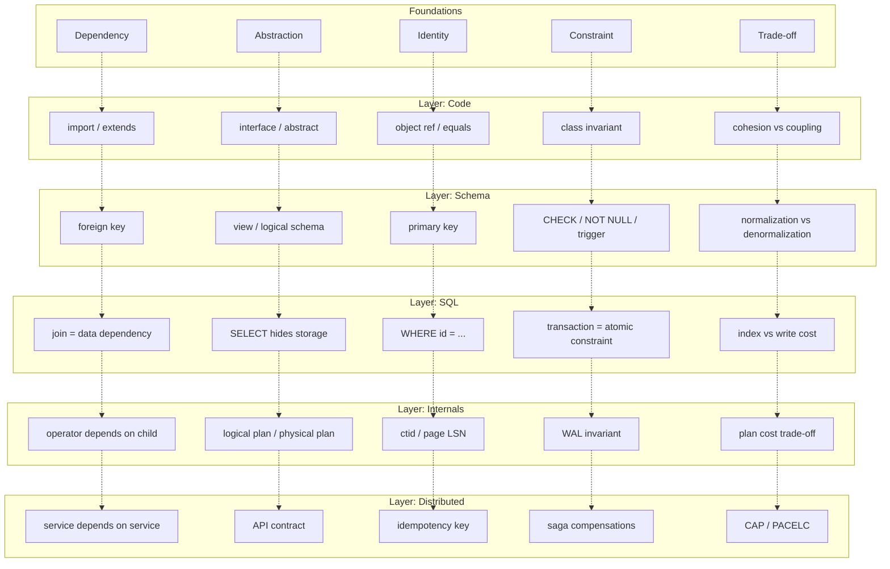

# Cross-Reference Map

> The single most important index in the vault. Shows how the **five forces** (dependency, abstraction, identity, constraint, trade-off) reappear at every layer of the continuous chain, wearing different vocabulary.

## How to use this map

This is the *unification table*. When you encounter a concept in any chapter, look it up here to see the *same force* expressed at every other layer. This is the mechanism that makes the vault "fast without being shallow": you learn the force once, then recognize it everywhere.

## The five forces

| Force | Definition |
|---|---|
| **Dependency** | A change in A can force a change in B |
| **Abstraction** | Selective forgetting for a purpose |
| **Identity** | "Is this the same X?" across time and transformations |
| **Constraint** | An invariant the system enforces |
| **Trade-off** | Every decision has a cost; make it explicit |

Source: [[01-Unified-Mental-Model]].

## Force 1 — Dependency

> "A change in A can force a change in B." Source: [[03-Dependency-As-Root-Concept]].

| Layer | Vocabulary | Banking example |
|---|---|---|
| Code | `import`, `requires` | `TransferService` imports `Account` |
| OOP | A holds a reference to B | `Account` holds `List<LedgerEntry>` |
| UML | `A --> B` (dependency arrow) | `TransferService --> FraudService` |
| SOLID | DIP — invert dependencies toward abstractions | Domain depends on `AccountRepository` interface, not on `JdbcAccountRepository` |
| Package | A imports from package B | `com.bank.transfers` depends on `com.bank.accounts` |
| Schema | Table A has a FK to B | `transfers.source_account_id → accounts.id` |
| SQL | `JOIN` A and B | `SELECT * FROM transfers t JOIN accounts a ON t.source_account_id = a.id` |
| Query plan | Hash join depends on building the hash first | The probe side cannot start until the build side is materialized |
| Distributed | Service A calls service B | `TransferService` calls `FraudService` |
| Replication | Replica depends on primary's WAL stream | Standby replays primary's WAL |

**The two operations**: reduce (fewer dependencies) and invert (change the direction to favor stability). Every design rule is one of these two applied at a specific layer.

## Force 2 — Abstraction

> "Selective forgetting for a purpose." Source: [[04-Abstraction-and-Models]].

| Layer | Vocabulary | Banking example |
|---|---|---|
| Code | Interface | `AccountRepository` interface — hides whether it's JDBC, JPA, or in-memory |
| Code | Abstract class | `Account` abstract class — partial implementation shared by subtypes |
| UML | Class diagram | Hides method bodies; preserves structure |
| Schema | View | `account_balances` view — hides whether balance is computed or stored |
| Schema | Logical schema | Hides physical layout; preserves tables, columns, constraints |
| SQL | `SELECT` | Hides how rows are stored; preserves what rows satisfy a predicate |
| Query plan | Logical plan | Hides physical operators; preserves relational algebra |
| Query plan | Physical plan | Hides buffer pool / disk; preserves operator tree |
| OS | File | Hides disk blocks; preserves a named byte stream |
| OS | Process | Hides CPU registers; preserves an executable program |

**The rule**: every abstraction exists to reduce or invert a dependency. If an abstraction does neither, it is decoration.

## Force 3 — Identity

> "Is this the same X?" across time and transformations. Source: [[05-Identity-State-Lifecycle]].

| Layer | Vocabulary | Banking example |
|---|---|---|
| Code (object) | Object reference (`==`) | Two `Account` objects in memory are different references even with same data |
| Code (logical) | `equals()` / `hashCode()` | Two `Account` objects are equal if `iban` matches |
| Domain | Entity identity | `Account` is an entity; identity is its `id` or `iban` |
| Domain | Value object (no identity) | `Money` is a value object; two `Money(100, USD)` are interchangeable |
| Schema | Primary key | `accounts.id BIGSERIAL PRIMARY KEY` |
| Schema | Natural key (unique) | `accounts.iban TEXT UNIQUE NOT NULL` |
| Schema | Surrogate key | `id BIGSERIAL` — meaningless, stable |
| Schema | Foreign key | `ledger_entries.account_id REFERENCES accounts(id)` |
| SQL | `WHERE id = $1` | Point lookup by primary key |
| ORM | Identity Map (session) | Hibernate returns the same object for the same PK within a session |
| Distributed | Idempotency key | `transfers.idempotency_key UNIQUE` — same key = same result |

**The conflict**: object identity is fast but ephemeral; logical identity is meaningful but mutable; surrogate identity is stable but meaningless. The right choice depends on the layer.

## Force 4 — Constraint

> "An invariant the system enforces." Source: [[01-Requirements]], [[02-Encapsulation]], [[02-Domain-Check-Constraints]].

| Layer | Vocabulary | Banking example |
|---|---|---|
| Requirements | Invariant | "Balance == sum(ledger_entries)" |
| Code (object) | Class invariant | `Account.balance >= -overdraftLimit` checked in `debit()` |
| Code (method) | Pre/post-condition | `withdraw(amount)`: pre = `amount > 0`; post = `balance >= -overdraftLimit` |
| Code (type) | Type system | `Money` type prevents mixing USD and EUR |
| Domain | Aggregate boundary | Account + LedgerEntry form one consistency boundary |
| Schema | `NOT NULL` | `accounts.iban NOT NULL` |
| Schema | `CHECK` | `CHECK (balance >= -COALESCE(overdraft_limit, 0))` |
| Schema | `UNIQUE` | `accounts.iban UNIQUE` |
| Schema | FK | `ledger_entries.account_id REFERENCES accounts(id)` |
| Schema | Trigger | `BEFORE INSERT ON ledger_entries` blocking closed accounts |
| SQL | Transaction (atomicity) | The transfer debits and credits atomically |
| Database | Isolation level | SERIALIZABLE prevents write skew |
| Distributed | Saga compensations | Reverse the debit if the credit fails |

**Defense in depth**: the same invariant is enforced in multiple layers, because each layer catches different failure modes (see [[03-Triggers-As-Constraints]]).

## Force 5 — Trade-off

> "No solutions, only trade-offs." Source: [[08-Trade-offs-Everywhere]].

| Axis | End A | End B | Banking choice |
|---|---|---|---|
| Coupling | Tight (fast, brittle) | Loose (flexible, slower) | Loose for cross-context, tight within an aggregate |
| Abstraction | Concrete (fast, rigid) | Abstract (flexible, indirect) | Abstract at domain boundaries, concrete in hot paths |
| Inheritance vs composition | Inheritance (compact, rigid) | Composition (verbose, flexible) | Composition (Strategy for interest, State for lifecycle) |
| Normalization | Fully normalized (slow reads) | Denormalized (fast reads, redundant) | Normalize source of truth, denormalize read models |
| Isolation | Serializable (correct, slow) | Read uncommitted (fast, wrong) | SERIALIZABLE for transfers; SNAPSHOT for statements |
| Indexing | No indexes (fast writes, slow reads) | Many indexes (slow writes, fast reads) | Index for known queries; never for imagined ones |
| Consistency | Strong (correct, slow) | Eventual (fast, stale) | Strong for money; eventual for notifications |
| Storage layout | Row store (OLTP) | Column store (OLAP) | Row store for OLTP; columnar replica for analytics |
| Replication | Synchronous (RPO=0, slow commits) | Asynchronous (RPO>0, fast commits) | Sync locally, async remotely |
| CAP | CP (consistency, unavailable under partition) | AP (available, inconsistent under partition) | CP for ledger; AP for notifications |
| Monolith vs microservices | Monolith (fast to build) | Microservices (independent deployment) | Start monolith; extract when forced |
| Sync vs async | Sync (simple, slow) | Async (fast, complex) | Sync for the transfer; async for the notification |

**The rule**: the midpoint is usually wrong. Pick an end deliberately, accept its cost knowingly.

## The five forces at each layer of the continuous chain

Each row is the *same force* at a different layer. Each column is the *same layer* expressing all five forces. The whole vault is this table, expanded.

## How to use this map when reading

When any chapter introduces a concept:

1. Identify which of the five forces it is about.
2. Look at the corresponding row above to see the *same force* at every other layer.
3. Notice that you have already learned the force — the chapter is just applying it at a new layer.

When any chapter makes a design decision:

1. Identify which axis the decision is on (the trade-off row).
2. Notice what is being given up.
3. Ask: is the trade-off deliberate, or implicit? (Implicit trade-offs are the dangerous ones — see [[08-Trade-offs-Everywhere]].)

## How to use this map when designing

When facing a new problem:

1. Walk the five forces: what are the dependencies? what needs abstracting? what is the identity model? what invariants hold? what trade-offs am I making?
2. For each force, ask: which layer enforces it? is that the right layer? is it enforced in more than one layer (defense in depth)?
3. For each trade-off: which end am I picking? why? what would change the answer?

If you can answer all five for a problem, you have a design. If you cannot, you have a gap.

## The single insight

> The five forces are not five ideas. They are five *names for the same idea*: software is about *constraining a model so it behaves correctly*, and every layer of the stack is a different vocabulary for doing so.

When this insight clicks, the vault becomes a single mental model rather than 147 separate notes. That is the goal.

## Cross-references

- [[Concept-Index]] — alphabetical index of all concepts.
- [[Pattern-Index]] — patterns by category.
- [[00-Map-of-Content]] — the master navigation.
- [[01-Unified-Mental-Model]] — the foundational argument.
