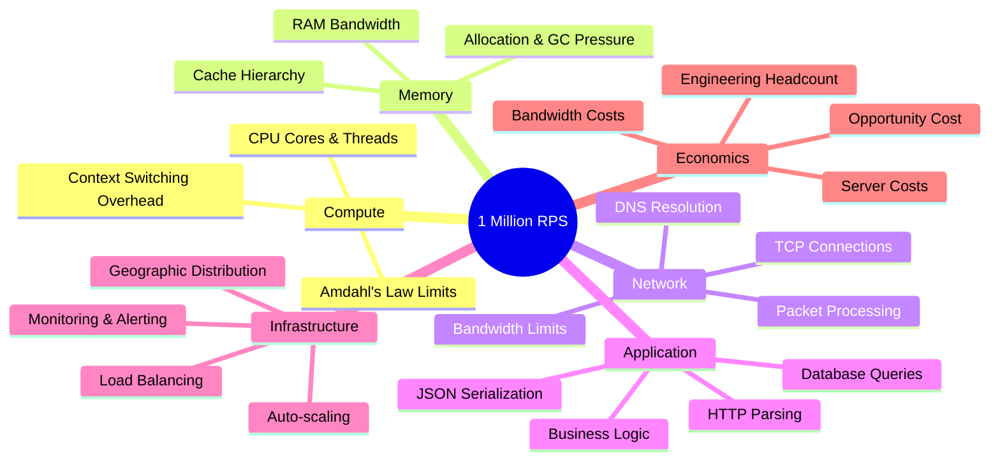

# What Does 1 Million Requests Per Second Mean?

#scaling/throughput #fundamentals/definitions #metrics/rps

## Defining "Request" at Every Level

The word "request" is deceptively simple. At each layer of the network stack, it takes on a different meaning. Understanding these layers is essential before we can meaningfully discuss what one million requests per second (1M RPS) truly represents.

At the **HTTP layer**, a request is a structured text message containing a method (GET, POST, etc.), a URI, headers, and an optional body. It is what an application developer typically thinks of when they say "request." An HTTP GET to `/api/users/123` is one request at this level.

At the **TCP layer**, that same HTTP request is broken into one or more **TCP segments**. Each segment carries a portion of the data, along with a sequence number, acknowledgement number, and flags. A single HTTP request might require multiple TCP segments to transmit fully, depending on its size and the Maximum Segment Size (MSS).

At the **IP layer**, each TCP segment is encapsulated into an **IP packet**, which adds source and destination IP addresses and a time-to-live (TTL) field. Routing decisions are made at this layer.

At the **data link layer**, each IP packet is placed into a **network frame** (e.g., an Ethernet frame), which includes MAC addresses for local delivery and a Frame Check Sequence (FCS) for error detection. The physical transmission of bits across a cable or wireless signal happens here.

So when we say "1 million requests per second," we are talking about 1 million HTTP-level application operations. But the underlying network hardware must process far more packets and frames—often 3-5x the number of application-level requests due to TCP overhead (handshakes, ACKs, retransmissions, and headers).

## Concrete Numbers: 1M RPS in Time

Let us convert 1M RPS into more intuitive timeframes:

| Timeframe       | Requests          |
|-----------------|-------------------|
| Per second      | 1,000,000         |
| Per minute      | 60,000,000        |
| Per hour        | 3,600,000,000     |
| Per day         | 86,400,000,000    |
| Per month (30d) | 2,592,000,000,000 |
| Per year        | ~31.5 trillion    |

**2.6 trillion requests per month.** That is the scale we are discussing. To put it differently: if a single request took 1 microsecond to process (an absurdly fast estimate), you would still need 1,000 CPU-seconds of compute time per second—or roughly 1,000 CPU cores running at 100% utilization just to handle the computation, not even counting I/O, networking, or serialization overhead.

## Comparison to Real-World Services

- **Google** processes approximately 8.5 billion searches per day, which translates to roughly **99,000 RPS** on average—well below 1M RPS for search alone, but their total API and ad-serving infrastructure likely exceeds it.
- **Netflix** serves over 250 million subscribers. At peak hours, they handle hundreds of thousands of concurrent streaming session initiations per second, with CDN requests numbering in the millions.
- **Uber** handles ride requests, real-time GPS location updates (every few seconds per active driver/rider), surge pricing recalculations, and ETA computations simultaneously. Their aggregate RPS across all microservices is well into the millions.

## Peak vs. Sustained Throughput

A critical distinction in high-scale engineering is between **peak** and **sustained** throughput:

- **Sustained throughput** is the average rate a system can maintain indefinitely. A system sustaining 1M RPS for 24 hours is fundamentally different from one that can handle 1M RPS for 5 minutes.
- **Peak throughput** is the maximum burst rate a system can absorb, often for short durations (seconds to minutes). Many systems can burst to 2-3x their sustained rate by leveraging connection pooling, request queuing, and buffer absorption.

Designing for peak throughput without considering sustained load leads to systems that crash under prolonged pressure. Designing only for sustained load without headroom for spikes leads to latency spikes and cascading failures during traffic surges.

## Why This Number Matters

1M RPS is not an arbitrary target. It represents a **qualitative threshold** in system design. Below ~100K RPS, many conventional architectures (monolithic apps, single databases, simple load balancing) work adequately. Above 1M RPS, you must fundamentally rethink:

- How you distribute state (see [[2.4 RAM vs Disk vs Network Speeds]])
- How you minimize per-request overhead (see [[3.1 TCP Connections]])
- How you measure and optimize [[2.2 Core Utilization]]
- How you handle [[3.4 HTTP Status Codes]] at scale

## Mind Map: What 1M RPS Involves

## Further Reading

- [[1.2 Real-World Examples at Million RPS Scale]] — concrete services operating at this scale
- [[1.3 The Engineering Mindset at Scale]] — the mental models needed
- [[1.4 Cost of Operating at Scale]] — what it costs to run at 1M RPS
- [[2.1 CPU Cores and Threads]] — the compute foundation