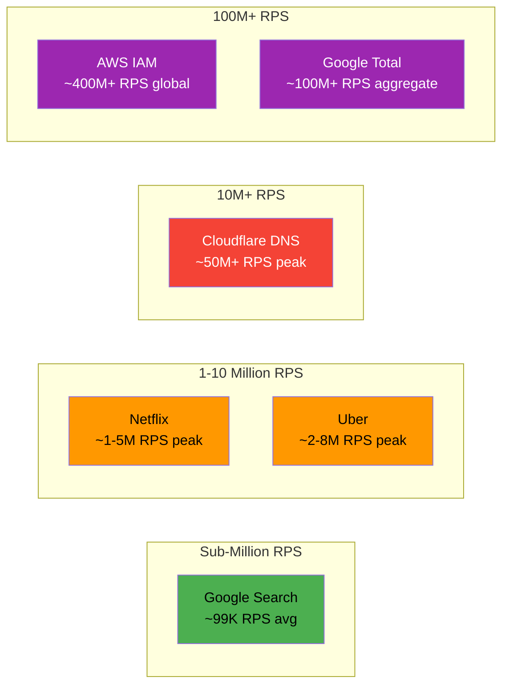

# Real-World Examples at Million RPS Scale

#scaling/real-world #case-studies #metrics/rps

## Why Study Real-World Examples?

Theoretical understanding of [[1.1 What Does 1 Million Requests Per Second Mean]] is important, but nothing grounds the discussion like examining the systems that actually operate at this magnitude. These services represent the frontier of distributed systems engineering, and each one teaches a different lesson about what it takes to handle massive throughput.

## AWS IAM: The Busiest Route on the Internet

AWS Identity and Access Management (IAM) is, by many accounts, **the single highest-throughput service route in the world**. Every single AWS API call—from launching an EC2 instance to reading an S3 object—must pass through IAM for authentication and authorization. With millions of AWS customers and trillions of API calls per month, IAM processes an estimated **400 million+ requests per second globally**.

Key lessons from AWS IAM:
- **Authentication is the universal bottleneck.** Every request to any AWS service requires an IAM check, making it the most critical path in the entire AWS infrastructure.
- **Global distribution is mandatory.** IAM is deployed in every AWS region, with data replicated and synchronized across them. A single data center could not handle this load.
- **Latency budgets are measured in microseconds.** At 400M+ RPS, even a 1ms increase in IAM latency would cascade into billions of wasted CPU-seconds across dependent services.

## Uber: Real-Time at Global Scale

Uber's architecture is fundamentally different from most web services because it is **stateful and real-time**. The system must track:

- **Ride requests**: Users requesting rides generate bursty, geographically localized traffic. A concert ending in a city can instantly spike requests by 10x.
- **Location updates**: Every active driver and rider sends GPS pings every 2-4 seconds. With millions of concurrent trips, this alone generates millions of RPS.
- **Surge pricing calculations**: Real-time supply-demand algorithms must recalculate pricing across thousands of geographic zones continuously.
- **ETAs and dispatching**: Matching riders to drivers involves complex optimization that must complete in under 500ms.

Uber's aggregate RPS across all microservices likely exceeds **several million per second** during peak hours. Their architecture relies on real-time streaming (Apache Kafka), geospatial indexing, and aggressive connection pooling.

## Netflix: Streaming at Scale

Netflix serves over **250 million subscribers** across 190+ countries. Their throughput challenges span multiple domains:

- **Streaming session starts**: When a user clicks "play," the system must authenticate, authorize content based on regional licensing, select an optimal CDN node, and initiate the stream. Peak evening hours generate hundreds of thousands of session starts per second.
- **Content recommendations**: The recommendation engine processes billions of viewing events to generate personalized suggestions in real-time.
- **CDN requests**: Netflix operates its own Content Delivery Network (Open Connect), serving petabytes of video data daily. While individual video chunks are delivered via HTTP, the aggregate request rate to CDN edge servers is enormous.

Netflix famously uses **chaos engineering** (the Simian Army) to ensure their systems remain resilient at this scale.

## Google: Search, Ads, and Beyond

Google's search engine processes approximately **8.5 billion searches per day**, which averages to about **99,000 RPS**. However, this is misleadingly low because:

- Each search query triggers dozens of backend microservice calls (index lookup, ad matching, spell correction, Knowledge Graph, etc.), multiplying the effective RPS by 50-100x.
- Google Ad platforms serve billions of ad impressions per day, each requiring real-time bidding (RTB) in under 100ms.
- YouTube, Google Maps, Gmail, and Google Cloud Platform each add millions more RPS.

Google's total aggregate RPS across all services almost certainly exceeds **100 million per second**.

## Cloudflare: Edge Computing at Planetary Scale

Cloudflare operates one of the world's largest edge networks, with **300+ data centers** across 100+ countries. Their scale is staggering:

- **DNS queries**: Cloudflare's DNS (1.1.1.1) handles trillions of queries per month, with peak rates exceeding **50 million DNS queries per second**.
- **Edge Workers**: Serverless functions executing at the edge for every request, adding compute overhead to what would otherwise be a simple proxy.
- **WAF inspections**: Every HTTP request passing through Cloudflare is inspected against thousands of security rules, requiring pattern matching at wire speed.

Cloudflare demonstrates that **edge distribution** is the only viable strategy for certain types of workloads at this scale.

## Comparative Diagram

## Common Patterns Across All Services

1. **Geographic distribution**: No single data center handles the full load. Traffic is distributed across multiple regions.
2. **Connection pooling and reuse**: TCP connections are long-lived and multiplexed (see [[3.1 TCP Connections]]).
3. **Caching at every layer**: From DNS caching to CDN edge caching to application-level caching.
4. **Asynchronous processing**: Not every request needs a synchronous response. Event-driven architectures (Kafka, event buses) decouple throughput-bound services.
5. **Observability**: At 1M+ RPS, you cannot debug with logs. You need metrics, traces, and statistical analysis.

## Further Reading

- [[1.1 What Does 1 Million Requests Per Second Mean]] — the foundational definition
- [[1.4 Cost of Operating at Scale]] — what it costs to build these systems
- [[3.1 TCP Connections]] — how connections underpin all of this
- [[3.2 HTTP Protocol]] — the protocol these services speak