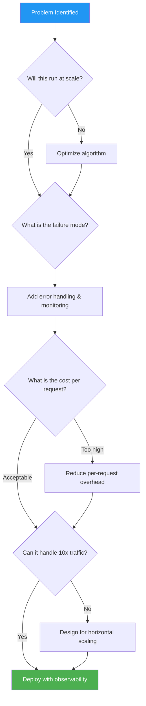

# The Engineering Mindset at Scale

#mindset/engineering #scaling/philosophy #fundamentals/thinking

## The Dangerous Comfort of "Works on My Machine"

At small scale, a piece of code that produces correct output is sufficient. A developer writes a function, tests it with a handful of inputs, confirms the output matches expectations, and ships it. This "code that just works" mentality is perfectly adequate when your system serves 100 users or even 10,000 users.

At 1 million requests per second, this mindset is **catastrophically dangerous**. The gap between "correct" and "efficient" becomes an abyss measured in server costs, latency percentiles, and user experience degradation. A function that runs in O(n²) time might handle 1,000 requests just fine but collapse under 1,000,000. The difference between O(n) and O(log n) is not academic—it is the difference between a system that costs $5,000/month and one that costs $500,000/month (see [[1.4 Cost of Operating at Scale]]).

## Big O Decisions That Cost Millions

Consider a simple example: looking up a user by ID. If you store users in an unsorted array, every lookup is O(n). With 10 million users, the average lookup examines 5 million entries. At 1M RPS, that is **5 trillion comparisons per second**.

Replace the array with a hash map (O(1) average) or a balanced binary search tree (O(log n)), and each lookup drops to 1-24 comparisons. The performance difference is not 2x or 10x—it is **orders of magnitude**.

At scale, algorithmic complexity is not an interview topic. It is a **financial decision**. Every unnecessary operation, every redundant memory allocation, every avoidable system call is multiplied by 86 billion (requests per day). A single micro-inefficiency that costs 1 microsecond per request adds up to **86,000 seconds of wasted CPU time per day**—over 23 hours of computation, burned every single day, on a single server.

## Probability at Scale: The Certainty of Rare Events

This is perhaps the most important conceptual shift when moving to high-scale systems. At normal scale, a 1-in-a-million event is effectively impossible. You might see it once in years of operation.

**At 1 million requests per second, a 1-in-a-million event happens every second.**

Let that sink in:

| Event Probability | Occurrences per second at 1M RPS | Occurrences per day |
|-------------------|-----------------------------------|---------------------|
| 1 in 1,000        | 1,000                             | 86,400,000          |
| 1 in 1,000,000    | 1                                 | 86,400              |
| 1 in 1,000,000,000| 0.001 (every ~16.7 minutes)       | 5,184               |

This has profound implications:
- **Error handling must be comprehensive**, not optimistic. You cannot assume "that error almost never happens."
- **Retry logic, circuit breakers, and fallbacks** are not nice-to-haves—they are architectural necessities.
- **Monitoring must detect statistical anomalies**, not just binary failures. A 0.001% error rate at 1M RPS means 10 errors per second, which is 864,000 errors per day.

## Programmer vs. Engineer: A Decision Process

The distinction between a programmer and an engineer is not about title or salary—it is about **how they approach problems**.

A **programmer** asks: "How do I make this work?"
An **engineer** asks: "How do I make this work efficiently, reliably, and cost-effectively at scale?"

The programmer implements the feature. The engineer asks:
1. **What happens when this runs 1 billion times?**
2. **What is the worst-case latency?** (Not the average—the p99 and p99.9.)
3. **What happens when the database is slow?** When the network drops? When memory is exhausted?
4. **How much does this cost per request?** (See [[1.4 Cost of Operating at Scale]].)
5. **How will we know it is failing?** (See [[2.2 Core Utilization]] for measurement techniques.)

## Why Mathematics Matters, Not Just Coding

Writing code is a translation exercise: you translate a solution (which you have already conceived) into a language a machine can execute. The hard part is **conceiving the correct solution**, and that requires mathematical thinking:

- **Queueing theory** to predict latency under load
- **Probability theory** to reason about failure rates and retry strategies
- **Linear algebra** for recommendation systems and ML inference
- **Information theory** for compression and encoding decisions
- **Graph theory** for network topology and data relationship modeling

An engineer who cannot reason mathematically about their system is flying blind. They might get lucky, but they cannot predict, and at scale, unpredictability is the enemy.

## The Cost of Mistakes

At 1M RPS, the blast radius of a mistake is enormous:

- A **memory leak** that leaks 1 byte per request will consume 1 GB of RAM per second. A server with 256 GB of RAM will be exhausted in under 5 minutes.
- A **synchronous blocking call** that takes 10ms instead of 1ms will reduce maximum throughput by 10x, turning a 1M RPS system into a 100K RPS system—potentially causing cascading failures across dependent services.
- A **missing index** on a database query that scans 100 million rows per request will saturate disk I/O within seconds.

These are not hypothetical scenarios. They are the daily reality of operating at scale, and they are why the engineering mindset is non-negotiable.

## Further Reading

- [[1.1 What Does 1 Million Requests Per Second Mean]] — the scale we are targeting
- [[1.4 Cost of Operating at Scale]] — financial implications of engineering decisions
- [[2.1 CPU Cores and Threads]] — the hardware that executes your decisions
- [[2.2 Core Utilization]] — measuring whether your code is efficient