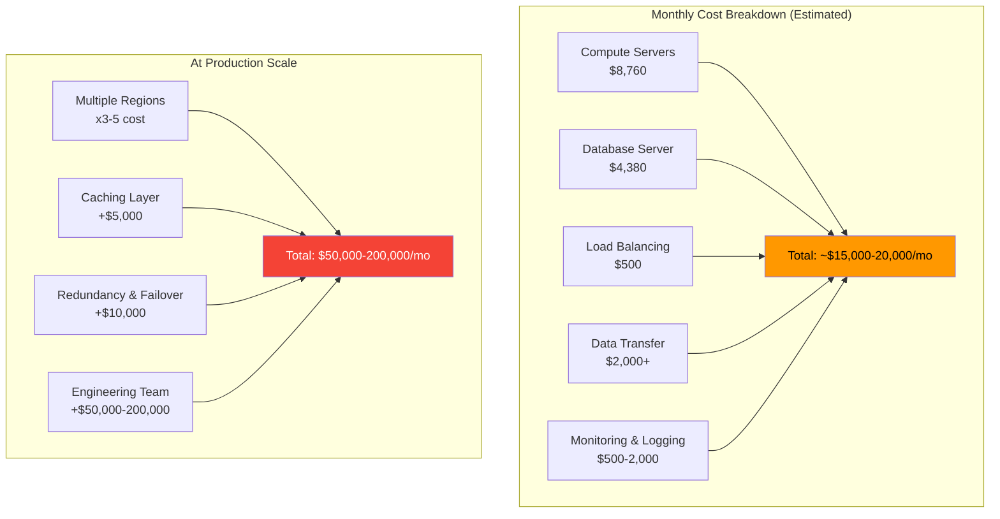

# Cost of Operating at Scale

#economics/cost #scaling/infrastructure #hardware/servers

## Why Cost Matters in High-Scale Engineering

Building a system that handles 1 million requests per second is an engineering achievement. **Running it profitably** is a business achievement. The difference between a well-architected system and a poorly architected one can be millions of dollars per month in infrastructure costs alone. Every architectural decision—from choice of language to database schema to caching strategy—has a direct, measurable impact on the bottom line.

As discussed in [[1.3 The Engineering Mindset at Scale]], an engineer must think in terms of cost per request, not just correctness. This note quantifies those costs.

## Server Hardware Costs

Let us examine the actual cost of the hardware required to approach 1M RPS. The following specifications are based on current AWS EC2 pricing for the instance types most relevant to high-throughput workloads:

### Compute: AWS C8i.32xlarge

| Specification | Value          |
|---------------|----------------|
| vCPUs         | 128            |
| Memory        | 256 GB         |
| Network       | 50 Gbps        |
| Cost/hour     | ~$6.00         |
| Cost/month    | ~$4,380        |
| Cost/year     | ~$52,560       |

This instance type provides 128 logical CPU cores (64 physical cores with hyperthreading), 256 GB of RAM, and a 50 Gbps network interface. It represents the high end of general-purpose compute available on AWS. The 50 Gbps network interface is critical—without sufficient bandwidth, the network itself becomes the bottleneck (see [[2.6 Network Cards and Bandwidth]] and [[3.6 Network Latency and Bandwidth]]).

### Database: AWS R5.16xlarge

| Specification | Value          |
|---------------|----------------|
| vCPUs         | 64             |
| Memory        | 256 GB         |
| Network       | 25 Gbps        |
| Storage       | EBS-optimized  |
| Cost/hour     | ~$6.00         |
| Cost/month    | ~$4,380        |
| Cost/year     | ~$52,560       |

Databases are often the most expensive component of a high-scale system because they require both high compute (for query processing) and high I/O (for data persistence). The R5 family is optimized for memory-intensive workloads, which is typical for database caching.

### Minimum Viable Setup

A bare minimum setup to begin experimenting with 1M RPS would include:

| Component    | Instance Type   | Count | Monthly Cost |
|--------------|-----------------|-------|--------------|
| Application  | C8i.32xlarge    | 2     | ~$8,760      |
| Database     | R5.16xlarge     | 1     | ~$4,380      |
| Load Balancer| ALB/NLB         | 1     | ~$50-500     |
| Data Transfer| 50 Gbps egress  | —     | ~$2,000+     |
| **Total**    |                 |       | **~$15,000-20,000/month** |

This is a **starting point**, not a production-ready configuration. A real 1M RPS production system would likely require:
- Multiple database replicas for read scaling
- Redis or Memcached caching layers
- Geographic distribution across multiple regions
- Dedicated monitoring and alerting infrastructure

A realistic production budget for a single-region 1M RPS service might be **$50,000-200,000/month** depending on data persistence requirements, caching strategy, and geographic distribution.

## Time-Based Cost Comparison

| Duration  | Cost (C8i.32xlarge) | Cost (R5.16xlarge) | Combined    |
|-----------|----------------------|----------------------|-------------|
| 1 hour    | $6.00                | $6.00                | $18.00      |
| 1 day     | $144                 | $144                 | $432        |
| 1 month   | $4,380               | $4,380               | $15,000+    |
| 1 year    | $52,560              | $52,560              | $180,000+   |

The per-hour cost seems modest at $18. But compound it over a year, and you are spending nearly $200,000. Now multiply that by 10 or 50 instances, and you understand why efficiency matters.

## API Pricing at Scale

If you are consuming third-party APIs at 1M RPS, the costs become astronomical:

| Service           | Cost per Request | Monthly Cost at 1M RPS |
|-------------------|------------------|------------------------|
| OpenWeather API   | ~$0.00015        | ~$3.88 billion*        |
| Typical REST API  | ~$0.0001         | ~$2.59 billion*        |
| Cloudflare Workers| ~$0.15/million   | ~$3.9 million          |

*Note: The OpenWeather and typical REST API figures assume per-request pricing at full 1M RPS sustained. These numbers illustrate why no one actually pays per-request at this scale—companies negotiate volume discounts, build internal systems, or use flat-rate pricing.

Cloudflare Workers is an interesting comparison because it charges per-request with a free tier of 100,000 requests/day. At 1M RPS, the Workers pricing model (pay-as-you-go beyond the free tier) costs approximately $3.9 million per month. This is cheaper than running your own infrastructure in some scenarios, but you lose control over the execution environment.

## The Economics of Global Distribution

Why do companies distribute their systems globally instead of building one supercomputer? The answer is a combination of:

1. **Latency**: A single data center in Virginia has ~250ms round-trip time to users in Tokyo. Three data centers (US, EU, Asia) reduce this to ~50ms for most global users.
2. **Bandwidth cost**: Cross-region data transfer on AWS costs $0.02/GB. At 1M RPS with 1KB responses, that is 1 TB/day or ~$20/day just in inter-region transfer. Multiply by many services, and it adds up.
3. **Regulatory compliance**: Data sovereignty laws (GDPR, etc.) may require data to remain in specific regions.
4. **Fault tolerance**: A single data center is a single point of failure. Geographic distribution provides resilience against regional outages.

## Cost Breakdown Diagram

## The Efficiency Multiplier

The most important insight about cost at scale is this: **a 10% improvement in per-request efficiency at 1M RPS saves approximately $1,500-2,000/month in a single-region setup, and potentially $10,000+/month in a multi-region production deployment.** This is why companies invest heavily in performance engineering, why they choose compiled languages over interpreted ones for critical paths, and why they obsess over [[2.2 Core Utilization]] and [[2.4 RAM vs Disk vs Network Speeds]].

Every microsecond you shave off a request at 1M RPS is 86,400 seconds of CPU time saved per day. That is real money.

## Further Reading

- [[1.3 The Engineering Mindset at Scale]] — why efficiency thinking matters
- [[2.1 CPU Cores and Threads]] — maximizing compute efficiency
- [[2.6 Network Cards and Bandwidth]] — understanding bandwidth costs
- [[3.6 Network Latency and Bandwidth]] — latency's impact on user experience