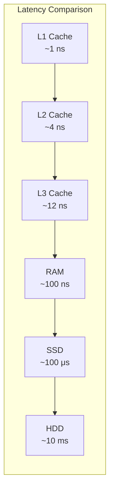
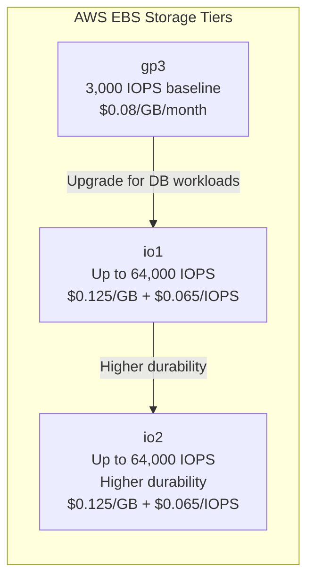
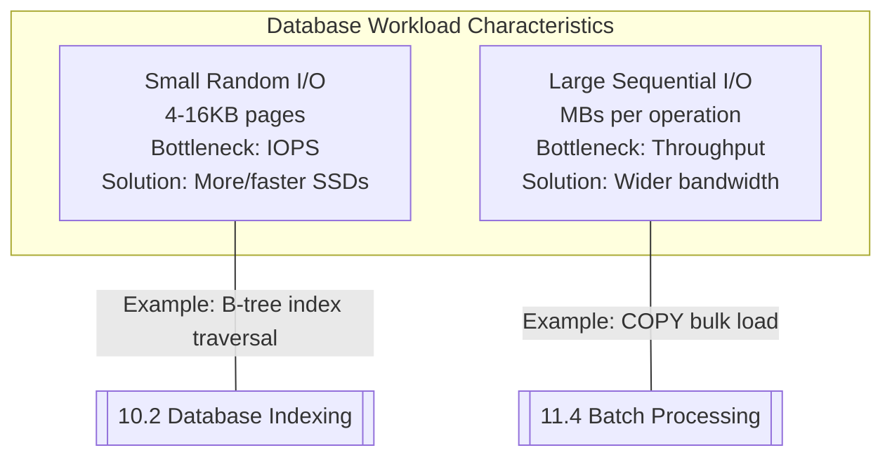

# IOPS (Input-Output Operations Per Second)

#performance/storage #database/performance #aws/storage #concepts/iops

> **Definition**: IOPS (Input-Output Operations Per Second) measures the number of discrete read or write operations a storage device can perform per second. It is the primary metric for storage performance in database workloads, where every query ultimately becomes disk I/O.

## Why IOPS Matters

In the storage hierarchy — CPU cache (L1/L2/L3), RAM, SSD, HDD, network storage — disk is the slowest component that databases regularly interact with. While a CPU can execute billions of instructions per second and RAM can be accessed in ~100 nanoseconds, a single disk I/O operation takes:

That's **100,000× slower** than RAM and **10,000,000× slower** than L1 cache. When a database query requires 100 disk I/O operations, the query takes at least 10ms (on SSD) regardless of how fast the CPU is. IOPS is the gatekeeper: no amount of CPU power or RAM can compensate for insufficient IOPS.

## IOPS by Storage Type

| Storage Type | Typical IOPS | Latency (avg read) | Cost/GB (approx.) |
|-------------|-------------|-------------------|-------------------|
| **HDD (7200 RPM)** | ~100-200 IOPS | 5-10 ms | $0.02-0.05 |
| **SATA SSD** | ~3,000-10,000 IOPS | 0.1-0.3 ms | $0.05-0.10 |
| **NVMe SSD** | ~100,000-500,000 IOPS | 0.01-0.03 ms | $0.10-0.20 |
| **RAM (reference)** | Millions | ~0.0001 ms | $5-20 |
| **AWS EBS gp3** | 3,000 baseline, burst to 16,000 | Varies | $0.08/GB |
| **AWS EBS io2** | Up to 64,000 provisioned | Varies | $0.125/GB + $0.065/IOPS |

The difference between HDD and NVMe is roughly **3 orders of magnitude**. This is why upgrading from HDD to SSD is the single most impactful storage optimization, and why cloud providers offer multiple storage tiers.

## Provisioned IOPS in AWS

On AWS, EBS (Elastic Block Store) volumes allow you to provision a specific number of IOPS. This is particularly important for databases because:

1. **Predictable performance**: Provisioned IOPS guarantees minimum performance regardless of what other tenants on the same physical hardware are doing.
2. **Database requirements**: [[9.3 PostgreSQL]] and other databases are IOPS-sensitive. A latency spike during a burst of writes can cause transaction timeouts, connection pileup, and cascading failures.

## The Video's IOPS Experiment

The 1M RPS benchmark demonstrates the IOPS-throughput relationship with two explicit data points:

| Configuration | Provisioned IOPS | Measured Writes/sec | Cost |
|--------------|-----------------|---------------------|------|
| Baseline | 3,000 IOPS | ~30,000 writes/sec | Base |
| Upgraded | 12,000 IOPS | ~66,000 writes/sec | +$1,000/month |

### The Diminishing Returns Problem

Notice that **quadrupling IOPS (4×) only doubled throughput (2.2×)**. This is a classic example of Amdahl's Law at the storage level. Why?

1. **Not all operations are I/O-bound**: Some work is CPU-bound (query parsing, planning, index traversal in memory). Increasing IOPS doesn't help with these.
2. **Connection overhead**: 1,280 connections (128 instances × 10) each require authentication, session management, and statement parsing. This CPU-bound overhead doesn't improve with more IOPS.
3. **Write-Ahead Logging overhead**: [[9.3 PostgreSQL]] writes to the WAL (journal) before writing to data files. Every write generates **at least two I/O operations** (WAL write + data write), halving the theoretical IOPS-to-writes ratio.
4. **OS page cache effects**: Some reads are served from the OS page cache (RAM), not from disk. These "free" IOPS mask the true disk bottleneck.

This diminishing returns curve is the fundamental argument for [[11.2 Read Replicas]], [[11.3 Sharding]], and [[11.5 Caching with Redis]] — if vertical scaling of a single database yields diminishing returns, you must scale horizontally.

## IOPS vs Throughput (MB/s)

IOPS and throughput measure different things:

- **IOPS**: Number of individual operations. Critical for database workloads with many small random reads/writes (e.g., index page lookups).
- **Throughput (MB/s)**: Total volume of data transferred. Critical for sequential workloads (e.g., full table scans, backups, bulk data loading via [[11.4 Batch Processing]]).

A 4KB random read and a 1MB sequential read both count as **one IOPS**, but the sequential read transfers 256× more data. This is why:
- Databases need high **IOPS** (many small, random page accesses)
- Backup systems need high **throughput** (large, sequential transfers)
- AWS EBS gp3 has separate limits for IOPS and throughput — you can be bottlenecked by either

## The Cost Dimension

The video explicitly calls out that increasing from 3,000 to 12,000 IOPS costs approximately **$1,000/month extra** on AWS. This illustrates a critical principle:

> **IOPS is one of the most expensive resources in cloud computing.**

At scale, the economics of IOPS often drive architectural decisions:
- Can we cache more in [[9.4 Redis]] to reduce database IOPS?
- Can we batch writes (see [[11.4 Batch Processing]]) to amortize IOPS cost?
- Can we use read replicas ([[11.2 Read Replicas]]) to offload read IOPS?
- Can we shard ([[11.3 Sharding]]) to distribute IOPS across multiple volumes?

Every IOPS you don't consume is money saved.

## Common Mistakes

- **Ignoring IOPS when selecting storage**: Choosing gp2/gp3 for a database workload and then wondering why queries are slow. Always provision appropriate IOPS for database volumes.
- **Measuring only throughput**: A storage device can have high MB/s throughput but poor IOPS (e.g., HDD with large sequential transfers). For databases, IOPS matters more.
- **Not monitoring IOPS utilization**: AWS CloudWatch, pg_stat_statements, and `iostat` can reveal whether you're hitting IOPS limits. See [[15.4 Disk I-O Bottlenecks]].
- **Over-provisioning IOPS**: At $0.065/IOPS/month on AWS, provisioning 64,000 IOPS "just in case" costs $4,160/month. Right-size based on monitoring.

## Further Reading

- [[9.3 PostgreSQL]] — how PostgreSQL generates I/O (WAL, data files, shared buffers)
- [[15.4 Disk I-O Bottlenecks]] — diagnosing disk I/O problems
- [[13.5 RDS and Aurora]] — how AWS RDS manages IOPS for you
- [[11.1 Vertical Scaling]] — IOPS upgrades as a scaling strategy