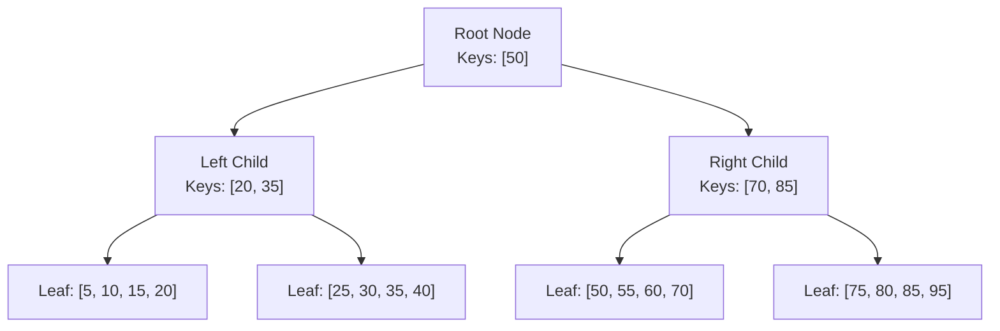

# Database Indexing

#database/indexing #database/performance #algorithms/trees #concepts/optimization

> **Definition**: A database index is a separate data structure that stores a sorted copy of one or more columns, enabling the database to locate rows without scanning the entire table. It trades additional storage space and write overhead for dramatically faster read performance.

## The Fundamental Trade-off

Indexes are the most important performance tool in any relational database, but they come with a cost:

| Operation | Without Index | With Index |
|-----------|--------------|------------|
| `SELECT` with WHERE | O(n) — full table scan | O(log n) — index lookup |
| `INSERT` | O(1) — append to table | O(log n) — update table + index |
| `UPDATE` indexed column | O(1) — modify row | O(log n) — update row + re-index |
| `DELETE` | O(1) — mark row dead | O(log n) — remove from index |
| Storage | Just the table | Table + index data structure |

Every index you add **slows down writes** and **increases storage**. The art of indexing is adding indexes that dramatically improve your most important queries while minimizing the write penalty.

## B-Tree Index: The Workhorse

The B-tree (Balanced Tree) is the default and most common index type in [[9.3 PostgreSQL]]. It maintains a sorted, self-balancing tree structure where every leaf node is at the same depth.



### How B-Tree Lookup Works

To find the row with `id = 60`:

1. Start at the root: 60 > 50, go right.
2. At the right child: 60 ≤ 70, go left.
3. At the leaf: found 60 → get the pointer to the actual row (CTID).

The number of steps is the **height of the tree**, which grows logarithmically with the number of rows. For a table with 1 billion rows:
- A B-tree of height 4 can index ~1 billion rows (with ~500 keys per node at 8KB page size)
- Lookup: **4 page reads** instead of scanning 1 billion rows

This is why B-tree lookups are **O(log n)** — see [[6.3 O(log n) Logarithmic Time]].

### Why "Balanced" Matters

A B-tree guarantees that all leaf nodes are at the same depth. Without balancing, the tree could degenerate into a linked list (O(n) lookup) in the worst case. PostgreSQL's B-tree implementation automatically rebalances on every insert and delete, maintaining the O(log n) guarantee.

## Primary Key Index

When you define a primary key, [[9.3 PostgreSQL]] automatically creates a unique B-tree index on that column (or columns). This index:

- Enforces uniqueness (no duplicate primary keys)
- Enforces NOT NULL (primary keys cannot be null)
- Is used for all lookups by primary key: `WHERE id = 42`
- Is the default clustering mechanism (rows are physically ordered by primary key on disk, though this can drift over time)

```sql
-- This automatically creates a B-tree index on the id column
CREATE TABLE users (
    id SERIAL PRIMARY KEY,
    name VARCHAR(255) NOT NULL,
    email VARCHAR(255) UNIQUE  -- also creates an index!
);
```

## Secondary Indexes

Secondary indexes are manually created on non-primary-key columns to speed up specific queries:

```sql
-- Speed up lookups by email
CREATE INDEX idx_users_email ON users (email);

-- Speed up queries filtering by status
CREATE INDEX idx_users_active ON users (active);

-- Speed up queries on created_at with ORDER BY
CREATE INDEX idx_users_created ON users (created_at DESC);
```

PostgreSQL allows you to create many indexes on a single table. Each index is a separate B-tree stored in its own set of disk pages.

## When Indexes HELP

Indexes accelerate reads in these scenarios:

1. **WHERE clause filtering**: `SELECT * FROM users WHERE email = 'alice@example.com'` — the index on `email` allows a direct lookup instead of scanning all rows.

2. **JOIN conditions**: `SELECT * FROM orders o JOIN users u ON o.user_id = u.id` — indexes on both `orders.user_id` and `users.id` make the join efficient.

3. **ORDER BY optimization**: `SELECT * FROM users ORDER BY created_at DESC LIMIT 10` — if there's an index on `created_at DESC`, PostgreSQL can read the first 10 entries from the index without sorting.

4. **MIN/MAX optimization**: `SELECT MAX(created_at) FROM users` — an index on `created_at` means PostgreSQL reads the last (or first) leaf page of the B-tree, which is O(1).

## When Indexes HURT

Every `INSERT`, `UPDATE` (on indexed columns), and `DELETE` must update all relevant indexes. For a table with 5 indexes, each INSERT writes to the table **plus 5 index structures** — 6 disk writes instead of 1.

At 1M RPS with a high write volume, excessive indexes can become the bottleneck. The 1M RPS benchmark's database table deliberately used a simple schema with minimal indexing to maximize write throughput.

## Composite Indexes and Column Order

A composite (multi-column) index can speed up queries that filter on multiple columns:

```sql
CREATE INDEX idx_orders_user_date ON orders (user_id, created_at DESC);
```

**Critical rule**: The column order in a composite index matters enormously. The index above can be used for:
- `WHERE user_id = 42` ✅ (uses the first column)
- `WHERE user_id = 42 AND created_at > '2024-01-01'` ✅ (uses both columns)
- `WHERE created_at > '2024-01-01'` ❌ (cannot skip the first column)

Think of a composite index like a phone book organized by (last_name, first_name). You can look up "Smith" efficiently. You can look up "Smith, John" efficiently. But you cannot look up all people named "John" efficiently — you'd have to scan every page.

## EXPLAIN ANALYZE: Seeing the Plan

`EXPLAIN ANALYZE` is your most important tool for understanding whether PostgreSQL is using your index:

```sql
EXPLAIN ANALYZE SELECT * FROM users WHERE email = 'alice@example.com';

-- If the index is used, you'll see:
-- Index Scan using idx_users_email on users (cost=0.29..8.31 rows=1 width=68) (actual time=0.032..0.033 rows=1 loops=1)

-- If the index is NOT used (Seq Scan):
-- Seq Scan on users (cost=0.00..15430.00 rows=1000000 width=68)
```

A **Sequential Scan** (Seq Scan) on a large table means PostgreSQL is reading every row. If you expected an index to be used but see a Seq Scan, check:
1. Does the index actually exist? (`\d tablename` in psql)
2. Is the query using the indexed column correctly? (e.g., no function wrapping the column: `WHERE LOWER(email) = ...` defeats a plain index)
3. Does the query planner estimate that a Seq Scan is faster? (On small tables, the planner correctly chooses Seq Scan because index lookup overhead isn't worth it)

## Common Mistakes

- **Adding indexes without measuring**: Use `EXPLAIN ANALYZE` before and after. Don't index columns that are never queried.
- **Indexing low-cardinality columns**: An index on a `BOOLEAN` column (true/false) is almost useless — it doesn't reduce the result set enough to justify the overhead.
- **Ignoring index maintenance**: Dead index entries accumulate over time. Run `REINDEX` periodically on heavily-written tables.
- **Over-indexing write-heavy tables**: In the 1M RPS benchmark, minimizing indexes was a deliberate choice to maximize write throughput.

## Further Reading

- [[6.3 O(log n) Logarithmic Time]] — the complexity theory behind B-tree performance
- [[10.3 SELECT with ORDER BY RANDOM]] — what happens when no suitable index exists
- [[10.4 COUNT Performance]] — why even index usage doesn't help with COUNT(*)
- [[11.4 Batch Processing]] — reducing the impact of index overhead on bulk writes