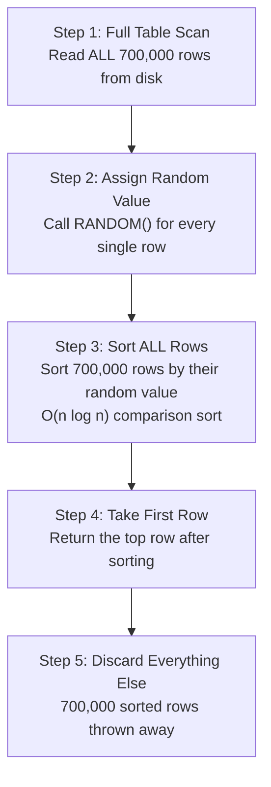

# SELECT with ORDER BY RANDOM

#database/anti-patterns #database/performance #algorithms/sorting #concepts/complexity

> **Definition**: `SELECT ... ORDER BY RANDOM() LIMIT 1` is a SQL query that attempts to retrieve a single random row from a table. Despite its apparent simplicity, it is one of the most performance-destructive query patterns in PostgreSQL, exhibiting O(n log n) time complexity and causing catastrophic slowdowns at scale.

## The Problem

Consider this innocent-looking query:

```sql
SELECT id, code FROM codes ORDER BY RANDOM() LIMIT 1;
```

At first glance, this seems straightforward: "give me one random row from the table." The reality is far more expensive. Here is what [[9.3 PostgreSQL]] actually does to execute this query:



Five steps, and we only needed one row. The resource waste is staggering.

## Complexity Analysis

| Step | Complexity | At 700K rows | At 10M rows |
|------|-----------|-------------|-------------|
| Full table scan | O(n) | Read 700K rows | Read 10M rows |
| Random assignment | O(n) | 700K function calls | 10M function calls |
| Sorting | O(n log n) | 700K × ~20 = ~14M comparisons | 10M × ~23 = ~230M comparisons |
| **Total** | **O(n log n)** | **~43 seconds** | **Database effectively crashes** |

The video demonstrates this with shocking clarity: at 700,000 records, this query takes **43 seconds**. At 10 million records, it doesn't just slow down — it effectively **crashes the database** by consuming all available CPU, memory, and I/O.

Why O(n log n) and not O(n)? Because sorting n elements with a comparison-based algorithm (PostgreSQL uses a variant of quicksort/mergesort) requires O(n log n) comparisons in the worst case. There is a mathematical proof that no comparison-based sort can do better. See [[6.6 Why Algorithms Matter at Scale]] for why this distinction matters.

## Why No Index Helps

You might think, "just add an index!" But no B-tree index ([[10.2 Database Indexing]]) can help here because:

1. The `RANDOM()` value is computed at query time — it doesn't exist in any index.
2. Even if you could pre-compute random values, they would change on every query (that's the point of random).
3. The query planner has no way to use an index to satisfy `ORDER BY <computed_expression>`.

This is fundamentally an algorithmic problem, not an indexing problem.

## Alternative Approaches

### Alternative 1: Pre-generate Random IDs in Application

```javascript
// Application code
const maxId = await getMaxIdFromDatabase(); // O(1) with index on id
const randomId = Math.floor(Math.random() * maxId) + 1;
const row = await db.query('SELECT id, code FROM codes WHERE id = $1', [randomId]); // O(log n)
```

This reduces the query from **O(n log n)** to **O(log n)** — millions of times faster. The trade-off: if there are gaps in the ID sequence (deleted rows), the random ID might not exist. Handle this by retrying with a new random ID or using the next available ID.

### Alternative 2: MAX(id) + Random Number (Video's v3)

This is the approach the video uses to fix the problem:

```sql
-- Step 1: Get the maximum ID (O(1) with primary key index)
SELECT MAX(id) FROM codes;

-- Step 2: Generate a random number in the application
-- randomId = Math.floor(Math.random() * maxId) + 1

-- Step 3: Look up that specific row (O(log n) with primary key index)
SELECT id, code FROM codes WHERE id = $1;
```

**Result**: The query that took 43 seconds now completes in under **1 millisecond**. This is the power of understanding algorithms and data structures — see [[6.2 O(n) Linear Time]] and [[6.3 O(log n) Logarithmic Time]].

### Alternative 3: Maintain a Separate Random ID Index

If you need truly uniform random selection (without gaps), you can maintain a separate table or array of all IDs in random order:

```sql
-- One-time setup: create a table of all IDs in random order
CREATE TABLE random_ids AS
  SELECT id FROM codes ORDER BY RANDOM();

-- Query: pick a random offset
SELECT codes.id, codes.code
FROM codes
JOIN random_ids ON codes.id = random_ids.id
OFFSET floor(random() * (SELECT COUNT(*) FROM random_ids)) LIMIT 1;
```

This is O(1) for the query but requires maintaining the `random_ids` table.

### Alternative 4: TABLESAMPLE

PostgreSQL supports the `TABLESAMPLE` clause for approximate random selection:

```sql
SELECT id, code FROM codes TABLESAMPLE BERNOULLI(0.0001) LIMIT 1;
```

This scans a random subset of pages (BERNOULLI) or blocks (SYSTEM). It's fast (O(sample_size)) but provides only approximate randomness — not every row has exactly equal probability of selection.

## The Lesson: Algorithms Matter at Scale

This example is the single most vivid demonstration from the video of why algorithmic complexity matters. The same query, on the same data, with the same database:

- **Naive approach**: 43 seconds (O(n log n))
- **Algorithmically aware approach**: <1ms (O(log n))

That's a **43,000× speedup** from understanding what `ORDER BY RANDOM()` actually does and choosing a better algorithm. At 1M RPS, you cannot afford queries that scan entire tables. Every query must be O(log n) or better. This principle applies universally: whether you're working with databases, APIs, or application code, knowing the time complexity of your operations is the difference between a system that scales and one that collapses.

## Common Mistakes

- **Using ORDER BY RANDOM() in production**: Ever. For any reason. It is a development/testing convenience only.
- **Assuming the database will "figure it out"**: The query optimizer is smart, but it cannot fix a fundamentally O(n log n) algorithm.
- **Not testing with realistic data volumes**: The query might be "fast enough" with 1,000 rows but catastrophic at 700,000.

## Further Reading

- [[6.2 O(n) Linear Time]] — why scanning all rows is expensive
- [[6.6 Why Algorithms Matter at Scale]] — the broader lesson from this example
- [[10.2 Database Indexing]] — how to make queries fast with proper indexes
- [[10.4 COUNT Performance]] — another "simple" query that's surprisingly slow