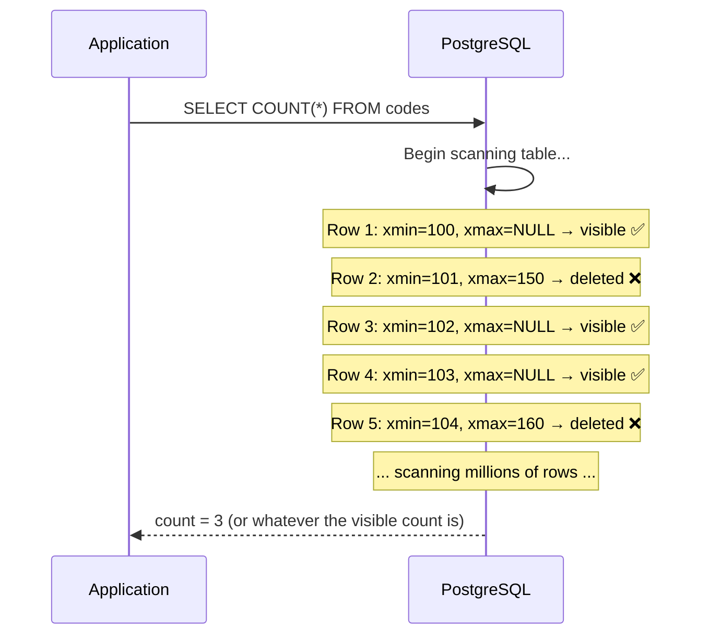

# COUNT Performance

#database/performance #database/anti-patterns #algorithms/linear #concepts/complexity

> **Definition**: `SELECT COUNT(*) FROM table` counts the total number of rows in a table. In [[9.3 PostgreSQL]], this is an O(n) operation that requires a full table scan, making it one of the most deceptively expensive "simple" queries in database workloads.

## The Problem

Consider this query:

```sql
SELECT COUNT(*) FROM codes;
```

How hard can it be to count rows? In a naïve implementation, you might expect the database to maintain a running count — incrementing a counter on every INSERT and decrementing on every DELETE. MySQL's MyISAM engine actually does this, returning `COUNT(*)` instantly. But PostgreSQL's MVCC architecture makes this impossible.

## Why PostgreSQL COUNT(*) is O(n)

[[9.3 PostgreSQL]] uses Multi-Version Concurrency Control (MVCC), where every row exists as a version with `xmin` (creation transaction) and `xmax` (deletion transaction) system columns. When a row is deleted, it isn't physically removed — a new version is created with the `xmax` set to the deleting transaction's ID. The `VACUUM` process eventually reclaims the space, but only after all concurrent transactions that might need to see the old version have completed.



PostgreSQL **must examine every row** to determine:

1. Is this row visible to my transaction's snapshot? (Check `xmin`/`xmax` against the active transaction list)
2. Is this row in a page that's visible to my snapshot?

There is no pre-computed count because the "correct" count depends on **which transaction is asking**. Transaction A, which started before some deletes, sees a different count than Transaction B, which started after them. A single cached count would be incorrect for at least one of them.

This is the fundamental trade-off of MVCC: **readers never block writers**, but `COUNT(*)` becomes O(n).

## Performance at Scale

| Row Count | Approximate COUNT(*) Time | Complexity |
|-----------|--------------------------|------------|
| 10,000 | <1 ms | O(n), but n is small |
| 100,000 | ~10 ms | O(n) — noticeable |
| 1,000,000 | ~100-500 ms | O(n) — slow for a web request |
| 10,000,000 | ~1-10 seconds | O(n) — unacceptable for real-time |
| 100,000,000 | ~10-100 seconds | O(n) — system-threatening |

At 10 million records (the scale of the 1M RPS benchmark's code generation), `COUNT(*)` can take several seconds. In the video, this query was part of the v2 approach that failed at scale — you cannot run an O(n) query per request when handling millions of requests.

## Why MySQL's COUNT(*) is "Faster" (But Not Really)

MySQL's InnoDB engine (the default since MySQL 5.5) also uses MVCC, so `COUNT(*)` is also O(n) in InnoDB. MySQL's MyISAM engine stores a row count in the table header (instant `COUNT(*)`), but MyISAM doesn't support transactions — there are no concurrent transactions with different visibility, so a single count is always correct.

PostgreSQL chose correctness over speed: the O(n) count is the price of MVCC's "readers never block writers" guarantee.

## Solutions

### Solution 1: Materialized View with Pre-computed Count

```sql
CREATE MATERIALIZED VIEW code_counts AS
  SELECT COUNT(*) as total FROM codes;

-- Refresh periodically (not on every request)
REFRESH MATERIALIZED VIEW code_counts;

-- Instant query
SELECT total FROM code_counts;
```

This trades accuracy for speed. The count is only as fresh as the last refresh. If you can tolerate stale counts (e.g., for a dashboard that updates every minute), this is an excellent solution.

### Solution 2: Trigger-Based Counter Table

```sql
CREATE TABLE code_count (count bigint NOT NULL DEFAULT 0);
INSERT INTO code_count (count) VALUES (0);

-- Trigger on INSERT
CREATE OR REPLACE FUNCTION increment_count()
RETURNS TRIGGER AS $$
BEGIN
  UPDATE code_count SET count = count + 1;
  RETURN NEW;
END;
$$ LANGUAGE plpgsql;

CREATE TRIGGER on_code_insert
  AFTER INSERT ON codes
  FOR EACH ROW EXECUTE FUNCTION increment_count();

-- Instant query (single row read)
SELECT count FROM code_count;
```

This maintains an always-up-to-date count. The trade-off: every INSERT now also performs an UPDATE on the counter table, adding write overhead. At extremely high write throughput, the counter table itself becomes a contention point (a single row being updated by thousands of concurrent transactions).

### Solution 3: Estimate with pg_class.reltuples

```sql
-- Fast estimate using the planner's statistics
SELECT reltuples::bigint AS estimated_count
FROM pg_class
WHERE relname = 'codes';
```

`pg_class.reltuples` stores the planner's estimate of row count, updated by `ANALYZE` (which runs automatically with `autovacuum`). This is O(1) and typically accurate within 1-10%, but it is an **estimate**, not an exact count.

### Solution 4: Separate Counting Service

For systems that need exact counts in real-time, you can maintain a separate in-memory counter (in [[9.4 Redis]]) that is incremented atomically on every write:

```
INCR code:count    -- O(1) in Redis
```

Periodically reconcile with the actual database count to correct for any discrepancies (e.g., from failed transactions).

## Connection to the 1M RPS Benchmark

In the video, the v2 approach used `COUNT(*)` to determine the total number of codes and then picked a random ID within that range. This approach failed at scale because:

1. `COUNT(*)` is O(n) — it takes seconds on a table with millions of rows
2. The random ID might point to a deleted row, requiring retries
3. Each retry requires another `COUNT(*)` or sequential scan

The v3 approach replaced `COUNT(*)` with `MAX(id)`, which uses the primary key index and is **O(log n)** — an instant operation. This is a direct application of [[6.3 O(log n) Logarithmic Time]].

## Common Mistakes

- **Using COUNT(*) in a hot path**: Never use `COUNT(*)` in a request-critical code path. Cache the count, estimate it, or use a counter table.
- **Assuming COUNT(*) is O(1)**: In PostgreSQL, it is not. This is a common misconception for developers coming from MyISAM MySQL.
- **COUNT(column) vs COUNT(*)**: `COUNT(column)` counts non-NULL values and may use a narrower index. `COUNT(*)` counts all rows regardless of NULL values.
- **Forgetting about MVCC**: The count you get depends on your transaction's visibility snapshot. Two concurrent transactions can see different counts — and both are correct.

## Further Reading

- [[6.5 Database Query Complexity]] — broader patterns of query performance
- [[9.3 PostgreSQL]] — MVCC architecture that causes the O(n) behavior
- [[10.3 SELECT with ORDER BY RANDOM]] — another "simple" query with catastrophic performance
- [[11.4 Batch Processing]] — reducing the frequency of expensive queries