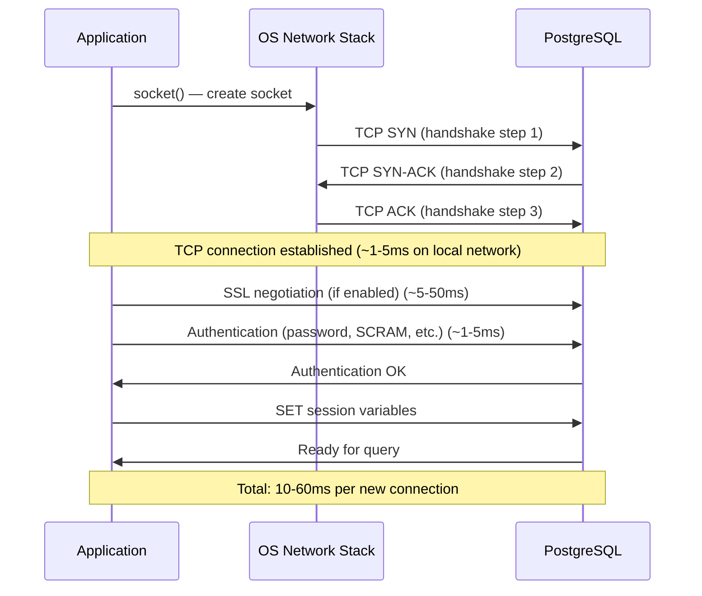
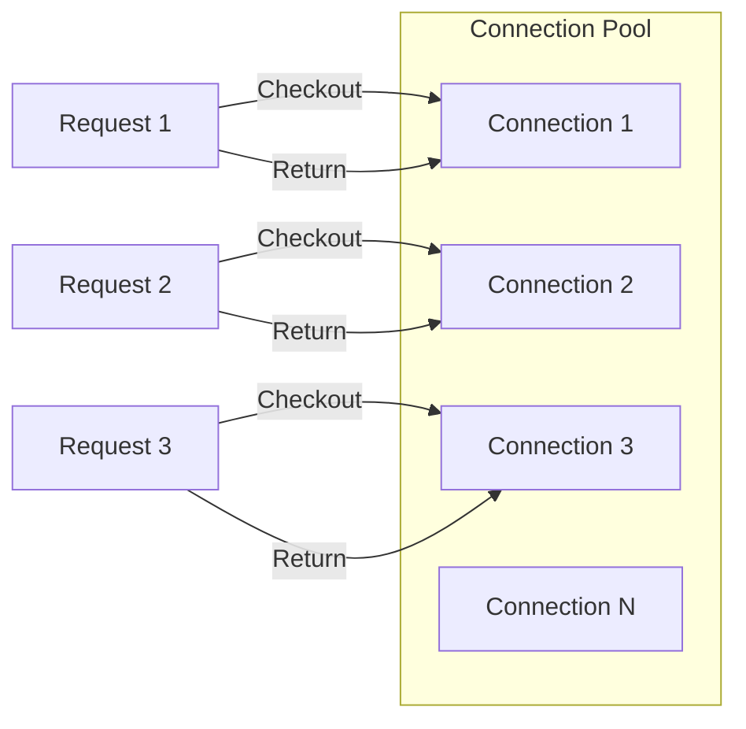
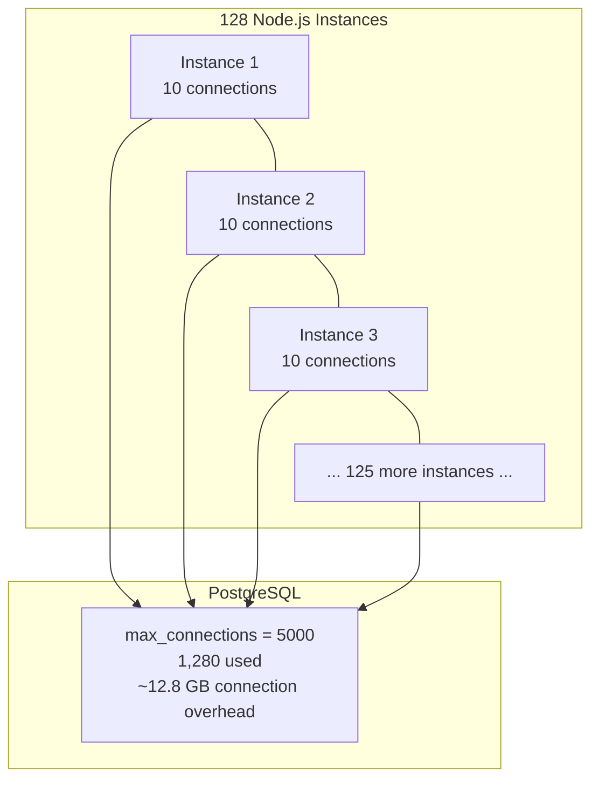

# Connection Pooling

#database/performance #networking/tcp #concurrency/connections #concepts/pooling

> **Definition**: Connection pooling is the practice of maintaining a reusable pool of pre-established database connections, allowing application code to "check out" a connection, use it, and "return" it — rather than creating and destroying a new TCP connection for every database operation.

## Why Creating Connections is Expensive

Establishing a new database connection is not a single operation. It involves a multi-step process:



Each new connection costs **10-60 milliseconds** of setup time. At 1M RPS, if each request created a new connection, you would spend 10,000-60,000 seconds just on connection setup — which is physically impossible since you only have 1 second. This is why connection pooling is not optional at high scale; it is a **mathematical necessity**.

## How Connection Pools Work



The pool maintains N pre-established connections. When an application needs a database connection:

1. **Checkout**: The pool assigns an idle connection to the request (instant — no TCP handshake)
2. **Use**: The application executes queries on this connection
3. **Return**: The application releases the connection back to the pool (it is not closed, just marked as idle)

If all N connections are busy and a new request arrives, the behavior depends on configuration:
- **Wait**: The request blocks until a connection becomes available (with optional timeout)
- **Fail immediately**: Return an error ("pool exhausted")
- **Grow**: Create a new connection (up to the maximum pool size)

## PostgreSQL Connection Model and Memory

[[9.3 PostgreSQL]] uses a **process-per-connection** architecture. Each client connection spawns a separate OS process (via `fork()`). Each PostgreSQL backend process consumes approximately **10MB of RAM** for:

- `work_mem` (default 4MB) — used for sorts, hashes, and other in-memory operations
- Stack space (~2MB)
- Shared memory access structures
- Communication buffers
- Process metadata

This means:

| Connections | Memory Overhead | Equivalent to |
|-------------|----------------|---------------|
| 100 (default max) | ~1 GB | One small VM |
| 1,000 | ~10 GB | One large VM |
| 5,000 (video config) | ~50 GB | One very large VM |
| 10,000 | ~100 GB | Multiple VMs |

## The Video's Connection Setup

The 1M RPS benchmark uses **128 Node.js instances**, each configured with **10 database connections**:

```
128 instances × 10 connections = 1,280 total connections to PostgreSQL
```

This is already 12.8× the default `max_connections` of 100. The PostgreSQL configuration had to be modified to set `max_connections = 5000` to accommodate this load. As noted in the video, 5,000 connections is "quite large" for a single PostgreSQL instance — it represents ~50GB of connection overhead alone, before any actual query processing.



## Connection Poolers: PgBouncer

For production deployments with many connections, an external connection pooler like **PgBouncer** is standard practice:

| Feature | Direct Connections | PgBouncer |
|---------|-------------------|-----------|
| Client connections | Limited by PostgreSQL max_connections | Up to 10,000+ |
| Server connections | 1:1 with clients | Multiplexed (e.g., 10,000 clients → 100 server connections) |
| Connection setup | Per-request (or per-instance) | Amortized across many requests |
| Memory overhead | 10MB × total connections | 10MB × server connections only |
| Transaction mode | N/A | Automatically starts/commits transactions per client request |

PgBouncer achieves **connection multiplexing**: it maintains a small pool of actual PostgreSQL connections (e.g., 100) and distributes requests from thousands of client connections across them. Since most web requests hold a connection only for the duration of a single query (a few milliseconds), 100 server connections can service thousands of concurrent clients.

## Built-in Pooling in Node.js

The `node-postgres` library (used in the 1M RPS benchmark) has a built-in connection pool with a default size of **10 connections** per pool instance:

```javascript
const { Pool } = require('pg');
const pool = new Pool({
  host: 'localhost',
  port: 5432,
  database: 'mydb',
  user: 'myuser',
  password: 'mypass',
  max: 10,           // Maximum connections in the pool
  idleTimeoutMillis: 30000,  // Close idle connections after 30s
  connectionTimeoutMillis: 2000,  // Timeout for getting a connection
});
```

The video's 128 instances × 10 pool size = 1,280 connections is the result of this default configuration multiplied across instances.

## Common Mistakes

- **Setting pool size too high**: More connections ≠ more throughput. Beyond a certain point, adding connections degrades performance due to context switching, lock contention, and memory pressure. The optimal pool size is often much smaller than people expect (e.g., 2× CPU cores per pool).
- **Not setting a connection timeout**: Without `connectionTimeoutMillis`, a request can block indefinitely waiting for a pool connection.
- **Leaking connections**: Forgetting to `release()` a checked-out connection back to the pool. The connection remains "in use" forever, eventually exhausting the pool.
- **Using one pool per request**: Creating a new `Pool` object per HTTP request defeats the purpose of pooling — each Pool creates its own connections.

## Further Reading

- [[9.3 PostgreSQL]] — PostgreSQL's process-per-connection architecture
- [[10.6 Maximum Connections]] — OS-level limits on total connections
- [[4.1 Processes and Threads]] — why context switching between many processes is expensive
- [[11.2 Read Replicas]] — another strategy for reducing per-database connection pressure