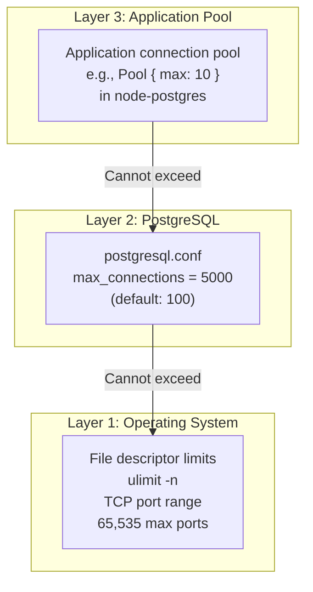
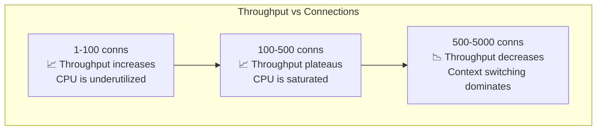
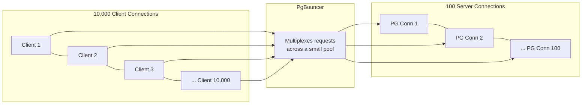

# Maximum Connections

#database/performance #networking/limits #operating-system/limits #concurrency/connections

> **Definition**: Maximum connections refers to the upper bound on the number of simultaneous client connections a database server can accept. This limit is determined by database configuration, operating system resource limits, and available hardware resources (primarily memory and CPU).

## The Three Layers of Connection Limits

There is no single "max connections" number. The actual limit is determined by the most restrictive of three layers:



### Layer 1: Operating System Limits

The OS imposes hard limits on the number of concurrent network connections:

**File descriptors**: Every TCP connection is represented by a file descriptor in the OS. The per-process limit is typically 1,024 by default on Linux:

```bash
$ ulimit -n
1024
```

For PostgreSQL with 5,000 connections, you must increase this:

```bash
# /etc/security/limits.conf
postgres soft nofile 65536
postgres hard nofile 65536

# /etc/sysctl.conf
fs.file-max = 2097152
```

**TCP port exhaustion**: Each TCP connection is identified by a 4-tuple: (source IP, source port, destination IP, destination port). A single server IP and port combination (e.g., `postgres-server:5432`) can accept connections from up to **65,535** unique source ports per client IP. With multiple client IPs (or multiple Node.js instances on different IPs), this limit is multiplied. However, in `TIME_WAIT` state (after connection close), ports are unavailable for 60 seconds by default, which can cause port exhaustion under rapid connection cycling.

**Memory**: Each TCP connection's kernel buffers consume ~50-100KB of kernel memory. At 10,000 connections, that's 0.5-1GB just for TCP buffers, before any application-level memory.

### Layer 2: PostgreSQL Configuration

PostgreSQL's `max_connections` setting is the database-level limit:

```sql
SHOW max_connections;  -- default: 100
-- In postgresql.conf:
max_connections = 5000  -- video's configuration
```

When a client attempts to connect and `max_connections` is already reached, PostgreSQL returns the error: `FATAL: sorry, too many clients already`.

As discussed in [[10.5 Connection Pooling]], each PostgreSQL connection consumes ~10MB of RAM (work_mem, process overhead, etc.). At 5,000 connections, that's ~50GB before any query processing. This is why the video notes that 5,000 connections is "quite large."

**The `superuser_reserved_connections` parameter** reserves a number of connections exclusively for superusers (default: 3). If a regular user causes a connection storm that exhausts `max_connections`, a superuser can still connect to diagnose and fix the problem. Always keep this reserve.

### Layer 3: Application Connection Pool

The application's connection pool (e.g., `node-postgres` Pool with `max: 10`) determines how many connections each application instance will open. The total number of PostgreSQL connections is:

```
total_connections = number_of_app_instances × pool_size_per_instance
```

In the video: `128 instances × 10 = 1,280 connections`.

## Why Too Many Connections Degrade Performance

It is a common misconception that more connections always mean more throughput. Beyond a certain point, adding connections actually **decreases** throughput:



**Why performance degrades**:

1. **CPU context switching**: PostgreSQL uses one OS process per connection. The Linux scheduler must time-slice between thousands of processes. Each context switch costs ~1-10μs. At 5,000 connections, the scheduler spends a significant fraction of CPU time just switching between processes.

2. **Lock contention**: More concurrent connections means more contention for shared resources: buffer pool locks, WAL locks, transaction ID allocation. Connections spend more time waiting for locks and less time doing useful work.

3. **Memory pressure**: 5,000 connections × 10MB = 50GB of connection overhead. This competes with `shared_buffers` and the OS page cache for physical RAM. Less RAM for caching means more disk I/O, which means slower queries.

4. **Cache thrashing**: With thousands of active queries, each accessing different data pages, the CPU's L1/L2/L3 caches are constantly being evicted and reloaded. Cache miss rates increase, degrading per-query performance.

## Connection Multiplexing with PgBouncer

The solution to "too many connections" is not more connections — it's fewer connections, shared intelligently. PgBouncer provides connection multiplexing:



PgBouncer terminates 10,000 client TCP connections and maintains only 100 connections to PostgreSQL. Since most web requests hold a database connection for only a few milliseconds (single query), these 100 connections can serve thousands of requests per second each. The key insight: **connection multiplexing works because web requests are short**. If each request held a connection for 30 seconds (e.g., a long-running analytical query), multiplexing would provide no benefit — you would need one server connection per active long query.

## At 1M RPS: Connection Pooling is Mandatory

At 1 million requests per second, if each request needed its own database connection, you would need 1 million concurrent connections. Even with PgBouncer, this would be challenging. The 1M RPS architecture addresses this through:

1. **Caching** ([[11.5 Caching with Redis]]): Most requests are served from Redis, never touching PostgreSQL
2. **Batch processing** ([[11.4 Batch Processing]]): Writes are accumulated and flushed in bulk, reducing the number of concurrent database operations
3. **Connection pooling** ([[10.5 Connection Pooling]]): The connections that do reach PostgreSQL are managed through pools, not created per-request

The combination means the actual number of PostgreSQL connections at any given moment is far lower than 1 million — perhaps a few hundred to a few thousand, depending on the caching hit rate and batch interval.

## Common Mistakes

- **Setting max_connections too high "just in case"**: Each connection costs ~10MB. 10,000 connections = 100GB. Right-size based on actual workload.
- **Ignoring OS limits**: Even if PostgreSQL allows 5,000 connections, the OS may reject connection attempts due to file descriptor limits.
- **Not monitoring connection usage**: Use `SELECT count(*) FROM pg_stat_activity` to see how many connections are active, idle, or waiting.
- **Using persistent connections without a pooler**: Long-lived connections that sit idle waste resources. Use PgBouncer in transaction mode to multiplex efficiently.

## Further Reading

- [[10.5 Connection Pooling]] — how to manage connections efficiently
- [[4.1 Processes and Threads]] — OS-level process management and context switching
- [[9.3 PostgreSQL]] — PostgreSQL's process-per-connection architecture
- [[11.5 Caching with Redis]] — reducing the number of database connections needed