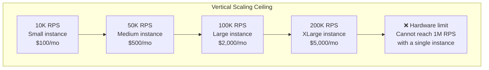

# Vertical Scaling

#scaling/vertical #database/scaling #infrastructure/cost #concepts/scaling

> **Definition**: Vertical scaling (also called "scaling up") is the practice of increasing the capacity of a single system by adding more resources — CPU cores, RAM, storage capacity, and IOPS — to the existing machine, as opposed to adding more machines (horizontal scaling).

## How Vertical Scaling Works

Vertical scaling means upgrading the hardware that runs your database server:

```mermaid
graph LR
    subgraph "Small Instance"
        CPU1["2 vCPU"]
        RAM1["8 GB RAM"]
        IOPS1["3,000 IOPS"]
        T1["~30K writes/sec"]
    end
    subgraph "Upgraded Instance"
        CPU2["16 vCPU"]
        RAM2["64 GB RAM"]
        IOPS2["12,000 IOPS"]
        T2["~66K writes/sec"]
    end
    Small Instance -->|"Upgrade (+$1,000/mo)"| Upgraded Instance
```

There are no code changes required. You increase the resources, and (up to a point) the system handles more load. This simplicity is vertical scaling's greatest strength and the reason it is usually the first scaling strategy attempted.

## The Video's Vertical Scaling Experiment

The 1M RPS benchmark provides a concrete, real-world demonstration of vertical scaling. The experiment:

| Configuration | IOPS | Measured Throughput | Cost Impact |
|--------------|------|---------------------|-------------|
| Baseline | 3,000 IOPS | ~30,000 writes/sec | Base cost |
| Upgraded | 12,000 IOPS (4×) | ~66,000 writes/sec (2.2×) | +$1,000/month |

### The Diminishing Returns

Quadrupling IOPS only doubled throughput. This is not a coincidence — it is a fundamental property of complex systems, governed by **Amdahl's Law**:

> If a fraction *f* of a system is improved by a speedup *s*, the overall speedup is limited by the non-improved fraction.

In this case, not all work is I/O-bound. Some fraction of each database operation involves:
- CPU work: query parsing, planning, index traversal in shared_buffers
- Network: receiving the query, sending the result
- Connection management: authentication, session state (see [[10.5 Connection Pooling]])
- WAL writes: each data write generates at least one WAL write (see [[9.3 PostgreSQL]])

If only 60% of each operation's time is I/O-bound, then even infinite IOPS would only provide a maximum 2.5× speedup. This is why the 4× IOPS increase yielded only 2.2× throughput improvement — the non-I/O work became the bottleneck.

## When Vertical Scaling Makes Sense

Vertical scaling is the **right first choice** for:

1. **Small to medium scale**: When your database handles 10-100K queries per second, a well-provisioned single instance (or primary + read replicas) is sufficient and simpler to operate.

2. **Quick relief**: When you need more capacity *today* and don't have time to redesign your architecture for horizontal scaling.

3. **Strong consistency requirements**: A single database instance trivially provides strong consistency (no distributed consensus needed). See the CAP theorem discussion in [[9.5 RDBMS vs NoSQL]].

4. **Simple operational model**: One server to monitor, backup, patch, and debug. No distributed systems complexity.

## The Limits of Vertical Scaling

### Hardware Ceilings

Every hardware category has a maximum:

| Resource | Typical Maximum | Constraint |
|----------|----------------|------------|
| CPU | 128-256 vCPU (cloud) / 2,048 cores (bare metal) | Cost, power, heat |
| RAM | 4-24 TB (cloud) / 8 TB+ (bare metal) | Cost, memory controller bandwidth |
| IOPS | 64,000-256,000 (cloud EBS) / millions (local NVMe) | Cost, queue depth limits |
| Storage | Petabytes | Backup/restore time, VACUUM time |

Even the most powerful single database instance **cannot handle 1 million writes per second**. The physics of disk I/O, network latency, and CPU scheduling prevent it. The video's best single-database result was ~66,000 writes/sec — 15× short of the target.

### Single Point of Failure

A single database instance is a single point of failure. If the hardware fails, your entire application goes down. High availability mitigations (automatic failover, hot standbys) add complexity and cost, but they still rely on a single active instance at any given time.

### Cost Scaling

Vertical scaling often follows a **super-linear cost curve**. Doubling CPU from 16 to 32 cores might cost 3-4× (not 2×) because:
- Cloud providers charge a premium for large instance sizes
- Larger instances require more reserved capacity
- At some point, you must move from cloud VMs to bare metal (higher operational cost)

The video's +$1,000/month for 2.2× throughput is a concrete example. To reach 1M RPS through vertical scaling alone, you would need ~15× more throughput — potentially costing tens of thousands of dollars per month for a single database instance, and even then, the hardware may not exist to support it.



## Vertical Scaling vs Other Strategies

| Strategy | Scales Writes? | Scales Reads? | Complexity | Cost Efficiency |
|----------|---------------|---------------|------------|-----------------|
| [[11.1 Vertical Scaling]] (this note) | Yes (limited) | Yes (limited) | Low | Poor at high scale |
| [[11.2 Read Replicas]] | No | Yes | Medium | Good for read-heavy |
| [[11.3 Sharding]] | Yes | Yes | High | Best for write-heavy |
| [[11.4 Batch Processing]] | Effectively yes | N/A | Medium | Excellent |
| [[11.5 Caching with Redis]] | N/A | Effectively yes | Low | Excellent |

The 1M RPS benchmark uses a **combination** of all these strategies. Vertical scaling provides the base capacity. Read replicas and caching reduce the load on the primary. Batch processing and sharding distribute write load.

## Common Mistakes

- **Vertical scaling as the only strategy**: It works initially, but you'll hit diminishing returns and hardware limits. Plan for horizontal strategies early.
- **Ignoring the cost curve**: That extra $1,000/month compounds. At scale, the cost of over-provisioned vertical scaling can exceed the cost of engineering horizontal scaling.
- **Upgrading without measuring**: Use [[10.1 IOPS (Input-Output Operations Per Second)]] metrics and query profiling to identify the actual bottleneck before spending money on upgrades.

## Further Reading

- [[10.1 IOPS (Input-Output Operations Per Second)]] — the storage dimension of vertical scaling
- [[11.2 Read Replicas]] — the next step after vertical scaling for read-heavy workloads
- [[11.3 Sharding]] — the ultimate solution for write scaling
- [[13.5 RDS and Aurora]] — AWS's approach to making vertical scaling easier