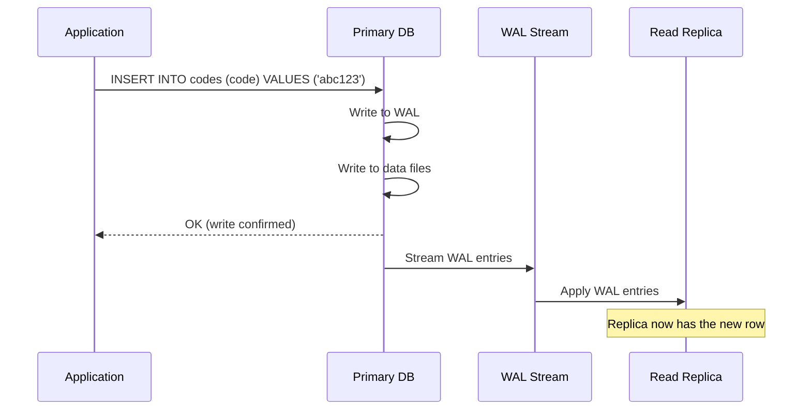
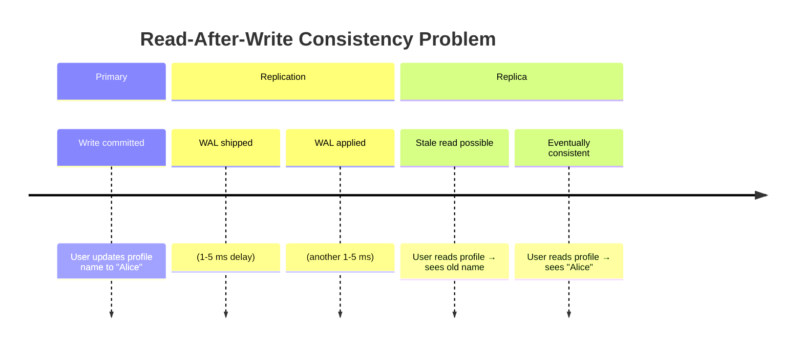
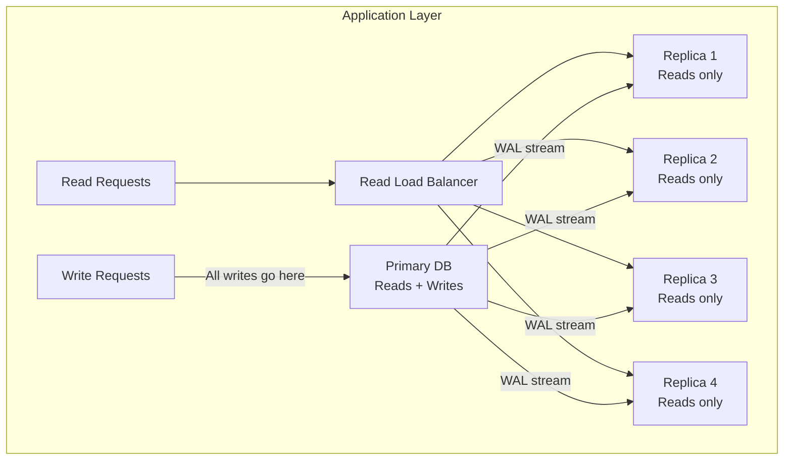

# Read Replicas

#scaling/horizontal #database/replication #database/performance #concepts/replication

> **Definition**: Read replicas are one or more copies of a primary (master) database that stay synchronized through replication and serve read-only queries, effectively multiplying read capacity without duplicating write capacity.

## How Replication Works

PostgreSQL uses **streaming replication**, which works by continuously shipping the Write-Ahead Log (WAL) from the primary to replicas:



The WAL (Write-Ahead Log) is [[9.3 PostgreSQL]]'s journal of all data modifications. Every INSERT, UPDATE, and DELETE is first written to the WAL before being applied to the actual data files (this is the "D" in ACID — Durability). Replication works by sending these WAL entries to replicas, which replay them to reconstruct the same data.

### Replication Modes

| Mode | Description | Latency | Data Loss Risk | Complexity |
|------|-------------|---------|----------------|------------|
| **Asynchronous** | Primary sends WAL, doesn't wait for replica | Minimal (ms) | Possible (replica may lag) | Low |
| **Synchronous** | Primary waits for at least one replica to confirm | Higher (replica RTT) | None (if replica confirms) | Medium |
| **Semi-synchronous** | Primary waits with timeout | Moderate | Small window | Medium |

Most production deployments use asynchronous replication for performance, with synchronous replication configured for critical data (e.g., financial transactions).

## Read-After-Write Consistency

A critical consideration with read replicas is **replication lag**: the delay between a write being committed on the primary and being visible on the replica. This lag creates a **consistency window**:



If a user updates their profile and is immediately redirected to a page that reads from a replica, they may see stale data. Solutions:

1. **Sticky sessions**: Route the same user's reads to the primary for a short time after a write.
2. **Read-your-writes consistency**: Track the user's last write timestamp and route to the primary if a read occurs before replication catches up.
3. **Accept eventual consistency**: For many use cases (social media feeds, analytics dashboards), a 10-100ms lag is acceptable.

## Scaling Reads with Replicas

The primary benefit of read replicas is multiplying read capacity:

```
Total read capacity = primary_read_capacity + (N × replica_read_capacity)
```

With 1 primary and 4 replicas, you theoretically get 5× the read throughput. In practice, the scaling factor is slightly less because:

- The primary also handles all writes (reducing its read-serving capacity)
- Network bandwidth between application and replicas is finite
- Connection management overhead on each replica (see [[10.5 Connection Pooling]])



## What Read Replicas DON'T Solve

**Read replicas do not scale writes.** All INSERT, UPDATE, and DELETE operations must go through the primary. If your bottleneck is write throughput (as it was in the 1M RPS benchmark), adding read replicas provides zero benefit for the bottleneck.

```
Write bottleneck: 35,000 writes/sec
Adding 10 read replicas: still 35,000 writes/sec
Read throughput: increased from 35K to 350K+ reads/sec (if read-heavy)
```

This is the fundamental reason why [[11.3 Sharding]] exists — when you need to scale writes beyond what a single primary can handle, you must partition your data across multiple primaries.

## PostgreSQL Streaming Replication Setup

A simplified configuration for setting up streaming replication:

**On the primary** (`postgresql.conf`):
```
wal_level = replica              # Include enough info for replication
max_wal_senders = 10             # Maximum replication connections
wal_keep_size = 1GB              # Keep WAL for replicas to catch up
```

**On the primary** (`pg_hba.conf`):
```
# Allow replication connections from replica
host replication replicator 10.0.0.0/24 md5
```

**On the replica** (`postgresql.conf`):
```
primary_conninfo = 'host=primary.example.com port=5432 user=replicator'
hot_standby = on                 # Allow read queries on replica
```

## Read Replicas in the 1M RPS Architecture

In the 1M RPS benchmark, the workload is primarily **write-heavy** (generating and storing codes). Read replicas help in the verification/read phase, but they cannot solve the fundamental write throughput problem. The video's approach combines read replicas with [[11.4 Batch Processing]] and [[11.5 Caching with Redis]] to handle the complete read+write workload.

## Common Mistakes

- **Expecting replicas to scale writes**: They don't. All writes go to the primary. Period.
- **Ignoring replication lag**: Monitoring `pg_stat_replication` is essential. A lagging replica serving stale data can cause user-visible bugs.
- **Not load-balancing reads**: If all reads go to one replica while others sit idle, you gain nothing. Use a proper read load balancer (PgBouncer, HAProxy, or application-level routing).
- **Running reporting queries on replicas without monitoring**: A heavy analytical query can slow down a replica, increasing replication lag and affecting all reads routed to that replica.

## Further Reading

- [[11.2 Read Replicas]] (this note) → [[11.3 Sharding]] — when replicas aren't enough, shard
- [[9.3 PostgreSQL]] — WAL and MVCC, the foundations of replication
- [[11.1 Vertical Scaling]] — the alternative (upgrade the primary's hardware)
- [[10.5 Connection Pooling]] — managing connections across primary and replicas