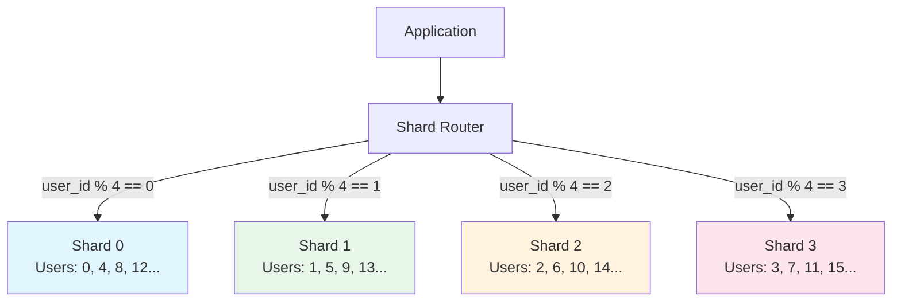

# Sharding

#scaling/horizontal #database/distributed #architecture/patterns #concepts/partitioning

> **Definition**: Sharding (horizontal partitioning) is the practice of distributing rows of a database table across multiple independent database instances (shards), each running on its own server. Each shard holds a subset of the total data, and the application (or a middleware layer) routes queries to the correct shard.

## Why Sharding Exists

Read replicas ([[11.2 Read Replicas]]) multiply read capacity but cannot scale writes — all writes still go to a single primary. Vertical scaling ([[11.1 Vertical Scaling]]) upgrades a single machine but hits hardware and cost limits. Sharding is the **only technique that scales write throughput** by distributing writes across multiple database instances.



With 4 shards, each handling ~250K writes/sec, you achieve a combined **1 million writes/sec** — the target of the benchmark. This is why sharding is considered the "nuclear option" for write scaling.

## Shard Key Selection

The shard key is the column (or set of columns) used to determine which shard a row belongs to. It is the single most important decision in a sharded architecture because it cannot be easily changed later.

### Desirable properties of a good shard key:

1. **High cardinality**: Many distinct values. A `BOOLEAN` shard key gives you only 2 shards — useless. A `user_id` (millions of distinct values) allows thousands of shards.

2. **Even distribution**: Values should be uniformly distributed across the key's range. If 80% of your traffic comes from users in one country and you shard by country, one shard gets 80% of the load — a **hot spot**.

3. **Query alignment**: Most queries should filter by the shard key so they can be routed to a single shard (avoiding cross-shard queries).

4. **Growth compatibility**: The key should allow adding more shards in the future without re-sharding all data.

### Common shard keys by use case:

| Use Case | Shard Key | Rationale |
|----------|-----------|-----------|
| User-facing app | `user_id` | Most queries are "show me this user's data" |
| E-commerce | `merchant_id` | Each merchant's data is independent |
| Messaging | `conversation_id` | Messages belong to a specific conversation |
| IoT/telemetry | `device_id` | Each device's data is independent |
| Multi-tenant SaaS | `tenant_id` | Data isolation per customer |

## Sharding Strategies

### Hash-Based Sharding

Apply a hash function to the shard key and use the result to determine the shard:

```
shard_number = hash(shard_key) % number_of_shards
```


**Pros**: Even distribution (hash functions produce uniform output), simple to implement, no hot spots from key ordering.

**Cons**: Cannot do range queries efficiently (e.g., "all users with id between 100 and 200" may span all shards). Resharding requires rehashing all data.

### Range-Based Sharding

Divide the shard key's value range into contiguous ranges:

```
Shard 0: user_id 1-1,000,000
Shard 1: user_id 1,000,001-2,000,000
Shard 2: user_id 2,000,001-3,000,000
```

**Pros**: Range queries go to a single shard (or a known subset). Intuitive — you can look at a user_id and know which shard it's on.

**Cons**: Hot spots — if newer user_ids are more active, the "highest" shard gets disproportionately more traffic.

### Directory-Based Sharding

Use a lookup table (directory service) that maps each shard key to its shard:

```
user_id: 42 → shard_2
user_id: 43 → shard_0
user_id: 44 → shard_2
```

**Pros**: Maximum flexibility — you can move individual rows between shards without rehashing. Handles hot spots by rebalancing.

**Cons**: The directory itself becomes a system to scale and maintain. Every query requires a directory lookup (adding latency).

## Cross-Shard Queries: The Hard Problem

The biggest challenge with sharding is queries that need data from multiple shards:

```sql
-- If user_id is the shard key, this query is easy (single shard):
SELECT * FROM orders WHERE user_id = 42;

-- This query requires hitting EVERY shard:
SELECT COUNT(*) FROM orders WHERE order_date > '2024-01-01';
```

Cross-shard queries require:
1. **Fan-out**: Send the query to all shards
2. **Gather**: Collect results from all shards
3. **Merge**: Combine, sort, aggregate, or paginate the results

This is slow (latency is the maximum across all shards, not the average) and complex. Sharding works best when your access patterns are **shard-key-aligned** — most queries naturally filter by the shard key and hit a single shard.

## Real-World Examples

### Instagram

Instagram shards by `user_id`. Each user's data (photos, followers, feed) lives on a specific shard. When you view a user's profile, the query goes to one shard. When you scroll your feed, the pre-computed feed is stored with your user_id, so it's also a single-shard read.

### Uber

Uber shards by `city_id` or `driver_id`, depending on the service. Trip data is sharded by trip_id (hash). This allows regional data isolation and compliance with data residency requirements (e.g., EU data stays on EU shards).

## Challenges

1. **Resharding**: When you need more shards (e.g., from 4 to 8), you must move data between shards. This is an offline or near-offline operation that can take hours for large datasets. Tools like Vitess (YouTube's sharding middleware) and Citus (PostgreSQL extension) help automate this.

2. **Hot spots**: A viral user, a popular product, or a trending topic can overload a single shard. Mitigations: virtual buckets (map multiple virtual shards to physical shards, rebalance by remapping), directory-based routing, or splitting hot shards further.

3. **Distributed transactions**: A transaction that modifies data on two different shards cannot use PostgreSQL's built-in ACID guarantees. You need distributed transaction protocols (two-phase commit, Saga pattern) — which are slower, more complex, and have weaker consistency guarantees.

4. **Operational complexity**: You now have N database instances to monitor, backup, patch, upgrade, and debug. Each shard needs its own connection pool, replication setup, and failover configuration. The operational overhead scales linearly with the number of shards.

## Why Sharding is Often the Only Way to Scale Writes

At the 1M RPS level, no single database instance — regardless of hardware — can handle 1 million writes per second. [[11.1 Vertical Scaling]] tops out at ~66K writes/sec (as shown in the video). [[11.2 Read Replicas]] don't help with writes. [[11.4 Batch Processing]] reduces the write frequency but doesn't change the per-batch write capacity. Sharding is the technique that directly addresses the write throughput ceiling by multiplying it across instances.

## Common Mistakes

- **Sharding too early**: Sharding adds enormous complexity. Use [[11.1 Vertical Scaling]] and [[11.2 Read Replicas]] first. Shard only when you've exhausted other options.
- **Choosing the wrong shard key**: A poor shard key creates hot spots and makes most queries cross-shard. This mistake is extremely expensive to fix (requires full re-shard).
- **Ignoring cross-shard query complexity**: Design your schema so that 95%+ of queries are single-shard. If most queries fan out to all shards, sharding provides no benefit.
- **Not planning for resharding**: Your data will grow. Choose a strategy (virtual buckets, consistent hashing) that allows adding shards without moving all data.

## Further Reading

- [[11.2 Read Replicas]] — scales reads, not writes (the predecessor to sharding)
- [[11.1 Vertical Scaling]] — upgrade before you shard
- [[9.5 RDBMS vs NoSQL]] — some NoSQL databases (Cassandra, DynamoDB) have built-in sharding
- [[10.5 Connection Pooling]] — connection management across multiple shards