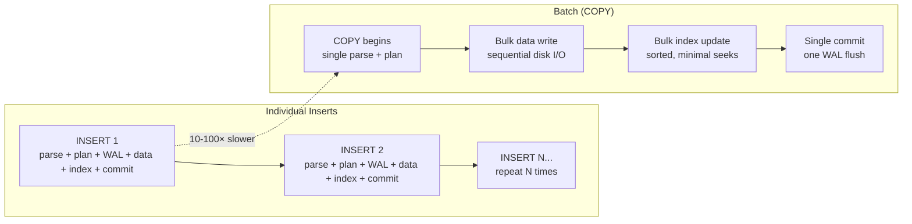

# Batch Processing

#database/optimization #performance/writes #architecture/patterns #concepts/batching

> **Definition**: Batch processing is the technique of accumulating multiple data modifications and applying them to the database in a single bulk operation, rather than executing individual INSERT, UPDATE, or DELETE statements one at a time. It trades immediate data visibility for dramatically higher throughput.

## Why Individual Writes Are Slow at Scale

Consider writing 10,000 rows to [[9.3 PostgreSQL]] one at a time:

```sql
INSERT INTO codes (code) VALUES ('abc123');
INSERT INTO codes (code) VALUES ('def456');
INSERT INTO codes (code) VALUES ('ghi789');
-- ... 9,997 more individual INSERT statements
```

Each individual INSERT requires:

1. **Network round-trip**: Request from application to database, response back (~0.5ms on local network)
2. **Query parsing**: PostgreSQL parses the SQL text into an internal representation
3. **Query planning**: The planner generates an execution plan
4. **WAL write**: The change is written to the Write-Ahead Log for durability (disk I/O)
5. **Data file write**: The row is written to the table's data file (disk I/O)
6. **Index update**: All indexes on the table are updated (disk I/O per index — see [[10.2 Database Indexing]])
7. **Transaction commit**: Another WAL flush to guarantee durability

At 10,000 individual INSERTs, steps 1-3 alone consume ~5 seconds (10,000 × 0.5ms). At 1 million, that's 500 seconds — **8+ minutes** of overhead before any actual data is written. This is why the 1M RPS benchmark cannot write to the database on every request.

## How Batching Solves This

Batch processing consolidates N individual operations into a single bulk operation:

### Multi-Row INSERT

```sql
INSERT INTO codes (code) VALUES
  ('abc123'),
  ('def456'),
  ('ghi789'),
  ('jkl012'),
  ('mno345');
-- 5 rows in ONE statement = 1 parse, 1 plan, 1 commit
```

This reduces the per-row overhead from ~1ms to ~0.05ms — a **20× improvement** — because you pay the parsing, planning, and commit costs only once instead of 5 times.

### COPY Command (PostgreSQL Bulk Load)

The `COPY` command is PostgreSQL's fastest bulk loading mechanism:

```sql
COPY codes (code) FROM STDIN WITH CSV;
abc123
def456
ghi789
\.
```

`COPY` bypasses much of the normal query processing pipeline:
- No query parsing or planning per row
- Writes directly to the table's heap files in large, sequential blocks
- Updates indexes in bulk (sorted, minimizing random I/O)
- Single WAL record for large batches

Performance: `COPY` can load **millions of rows per minute**, compared to thousands per minute with individual INSERTs. The difference is typically **10-100×** depending on table structure, indexes, and hardware.



## The Video's Recommendation

The 1M RPS benchmark explicitly recommends: **don't write to the database on every request**. Instead, the architecture uses batch processing:

1. **Accumulate**: Incoming requests add data to an in-memory buffer (or [[9.4 Redis]])
2. **Batch**: Periodically (e.g., every 100ms or every 10,000 records), flush the buffer to PostgreSQL using a bulk INSERT or COPY
3. **Trade-off**: Data written to the buffer is not immediately visible in PostgreSQL. There is a window of 100ms-1s where data exists only in memory.

This transforms the write pattern from "1 million individual writes per second" to "100 batch writes per second, each containing 10,000 rows." The database now handles 100 bulk operations per second instead of 1,000,000 individual ones — well within the capabilities of even a modest PostgreSQL instance.

## The Eventual Consistency Trade-off

Batch processing introduces **eventual consistency**: data is eventually written to the database, but not immediately. The consistency window depends on the batch interval:

| Batch Interval | Max Data Delay | Throughput Impact |
|---------------|----------------|-------------------|
| 1 second | 1 second | High (large batches) |
| 100 ms | 100 ms | Very high (smaller but frequent batches) |
| 10 ms | 10 ms | Moderate |
| 1 ms | 1 ms | Low (approaches individual inserts) |

The right interval depends on your application's requirements:
- **Financial transactions**: Batch interval = 0 (individual inserts with ACID). You cannot "lose" a $10,000 transfer.
- **Analytics events**: Batch interval = 1-60 seconds. Losing a few seconds of analytics data during a crash is acceptable.
- **Code generation (benchmark)**: Batch interval = 100ms-1s. The generated codes are consumed later, not immediately.

## Related Patterns

### CQRS (Command Query Responsibility Segregation)

CQRS separates the write model from the read model. Writes go to a command store (optimized for fast writes, possibly using batch processing), and the read model is updated asynchronously (via events, message queues, or materialized views). This is the formalized version of what the 1M RPS benchmark does.

### Event Sourcing

Instead of storing the current state, store every state change as an event. Events can be batched and appended efficiently. The current state is reconstructed by replaying events. This is the foundation of systems like Kafka-based event pipelines.

### Write-Behind Caching

In [[11.5 Caching with Redis]], the write-behind pattern writes to Redis immediately (fast) and asynchronously flushes to PostgreSQL (slow) in batches. This gives the application the appearance of instant writes while benefiting from batch processing's throughput.

## Performance Comparison

| Method | 10,000 Rows | 1M Rows | Complexity |
|--------|-------------|---------|------------|
| Individual INSERTs | ~10 seconds | ~17 minutes | Simple |
| Multi-row INSERT (batches of 1000) | ~0.5 seconds | ~50 seconds | Medium |
| COPY command | ~0.1 seconds | ~10 seconds | Medium |
| COPY + DROP indexes + COPY + CREATE INDEX | ~0.05 seconds | ~5 seconds | Complex |

## Common Mistakes

- **Batching too aggressively**: Batches that are too large consume excessive memory and create long-running transactions that block VACUUM and other operations.
- **Not handling batch failures**: If a batch INSERT fails (e.g., constraint violation), you must handle the partial failure correctly — retry the entire batch or fall back to individual inserts for the failed batch.
- **Forgetting to flush on shutdown**: If your application crashes, data in the in-memory buffer is lost. Implement graceful shutdown that flushes the buffer, or use Redis (with AOF persistence) as the buffer.
- **Batching in a hot path with synchronous writes**: If you batch but still wait for the batch to complete before responding to the user, you've gained nothing in latency. Use async batching with write-behind caching.

## Further Reading

- [[11.5 Caching with Redis]] — write-behind caching pattern
- [[10.1 IOPS (Input-Output Operations Per Second)]] — batching reduces IOPS per row
- [[10.2 Database Indexing]] — why indexes make batching even more important (batch updates minimize index reorganization)
- [[9.3 PostgreSQL]] — COPY command and transaction management