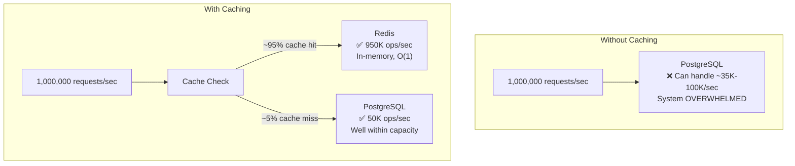
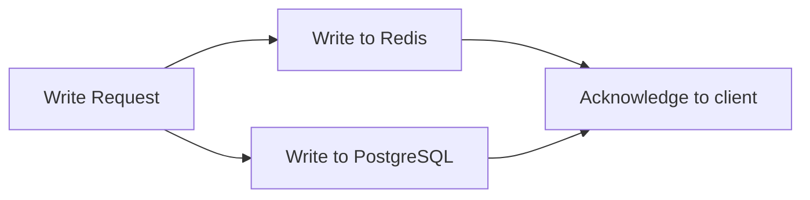

# Caching with Redis

#scaling/caching #database/redis #performance/reads #architecture/patterns

> **Definition**: Caching is the technique of storing frequently-accessed data in a fast-access storage layer (typically RAM) so that subsequent requests for the same data can be served without hitting the slower primary database. Redis is the dominant caching solution in modern web architectures due to its in-memory data structures, persistence options, and rich command set.

## Why Caching is Mandatory at 1M RPS

Let's establish the math. The video demonstrates that [[9.3 PostgreSQL]] can handle approximately **35,000 writes per second** and perhaps 50,000-100,000 simple reads per second on well-provisioned hardware. [[9.4 Redis]] can handle **millions of operations per second** on the same hardware. The gap between what PostgreSQL can do and what 1M RPS demands is bridged almost entirely by caching.



With a 95% cache hit ratio:
- Redis handles: 950,000 requests/sec (well within its capacity)
- PostgreSQL handles: 50,000 requests/sec (well within its capacity)
- **Total: 1,000,000 requests/sec — achievable**

Without caching, 100% of requests hit PostgreSQL, which cannot handle the load. Caching is not an optimization at 1M RPS — it is a **structural requirement**.

## Why Redis is the Go-To Cache

While you could theoretically cache in application memory (a JavaScript Map or Python dict), Redis provides critical features that in-process caches cannot:

| Feature | In-Process Cache | Redis |
|---------|-----------------|-------|
| Shared across instances | ❌ Each instance has its own cache | ✅ All instances share the same cache |
| Persistence | ❌ Lost on restart | ✅ RDB + AOF |
| LRU eviction | Manual implementation | ✅ Built-in |
| Data structures | Arrays/Maps only | ✅ Strings, hashes, lists, sets, sorted sets |
| Atomic operations | Limited | ✅ INCR, HINCRBY, ZINCRBY (atomic) |
| Memory efficiency | Varies | ✅ Optimized for specific data structures |
| Pub/Sub | ❌ | ✅ Cache invalidation across instances |

In a multi-instance deployment (128 Node.js instances in the benchmark), each instance would have a different in-process cache, leading to cache duplication and inconsistency. Redis serves as a **unified, shared cache layer** that all instances access.

## Cache Patterns

### Cache-Aside (Lazy Loading)

The most common caching pattern. The application is responsible for maintaining the cache:

```mermaid
flowchart TD
    A[Request arrives] --> B{Data in Redis?}
    B -- "Yes (cache hit)" --> C[Return data from Redis<br/>O(1) ~0.1ms]
    B -- "No (cache miss)" --> D[Query PostgreSQL<br/>O(log n) ~1-10ms]
    D --> E[Store result in Redis<br/>with TTL]
    E --> F[Return data]
```

```javascript
async function getCode(id) {
  // Try cache first
  let code = await redis.get(`code:${id}`);
  if (code) return code; // Cache hit — O(1)

  // Cache miss — query database
  const result = await pg.query('SELECT code FROM codes WHERE id = $1', [id]);
  code = result.rows[0].code;

  // Store in cache with TTL
  await redis.set(`code:${id}`, code, 'EX', 3600); // Expire in 1 hour
  return code;
}
```

**Pros**: Simple, only caches what's actually needed, handles cache failures gracefully.
**Cons**: First request for any item is slow (cache miss + DB query + cache write).

### Write-Through Cache

Writes go to both the cache and the database simultaneously:



**Pros**: Cache is always consistent with the database.
**Cons**: Every write is as slow as the database write (defeats the purpose of caching for writes).

### Write-Behind (Write-Back) Cache

Writes go to the cache immediately and are asynchronously flushed to the database in batches (see [[11.4 Batch Processing]]):

```mermaid
flowchart LR
    A[Write Request] --> B[Write to Redis<br/>Immediate, O(1)]
    B --> C[Acknowledge to client<br/>~0.1ms]
    B -->|Async batch| D[Flush to PostgreSQL<br/>Delayed, bulk]
```

**Pros**: Extremely fast writes (Redis speed). Database handles bulk writes efficiently.
**Cons**: Data loss window (if Redis crashes before flushing). Eventual consistency — data in Redis may not yet be in PostgreSQL.

This is the pattern most aligned with the 1M RPS benchmark's architecture.

## Cache Invalidation

> "There are only two hard things in Computer Science: cache invalidation and naming things." — Phil Karlton

Cache invalidation — ensuring the cache reflects the current state of the database — is notoriously difficult:

### Time-To-Live (TTL)

The simplest approach: set an expiration time on cached data. After the TTL expires, the next request triggers a cache miss and refreshes from the database.

```javascript
await redis.set('user:42:profile', JSON.stringify(profile), 'EX', 300); // 5 minutes
```

**Pros**: Zero application logic for invalidation. Self-healing.
**Cons**: Stale data within the TTL window. If you cache for 5 minutes, users may see 5-minute-old data.

### LRU (Least Recently Used) Eviction

When Redis reaches its memory limit (`maxmemory`), it automatically evicts the least recently used keys:

```
maxmemory 4gb
maxmemory-policy allkeys-lru
```

**Pros**: Automatic — no application logic needed. Keeps the most popular data in cache.
**Cons**: No control over *which* data is evicted. A cold-but-important key may be evicted before a hot-but-unimportant key.

### Manual Invalidation

When data changes, explicitly delete or update the cache:

```javascript
async function updateProfile(userId, newData) {
  await pg.query('UPDATE users SET ... WHERE id = $1', [userId]);
  await redis.del(`user:${userId}:profile`); // Invalidate
}
```

**Pros**: Immediate consistency — the next read will get fresh data.
**Cons**: Easy to forget. If you update the database in 5 places but only invalidate the cache in 4, you have stale data.

## Cache Hit Ratio

The cache hit ratio is the percentage of requests served from the cache:

```
cache_hit_ratio = cache_hits / (cache_hits + cache_misses)
```

| Hit Ratio | DB Load | Typical Use Case |
|-----------|---------|-----------------|
| 90% | 10% of requests hit DB | Good for most web apps |
| 95% | 5% of requests hit DB | Target for 1M RPS |
| 99% | 1% of requests hit DB | Aggressive caching, longer TTLs |
| 99.9% | 0.1% of requests hit DB | Near-perfect, few cacheable items |

At 1M RPS with a 95% hit ratio, PostgreSQL handles 50,000 requests/sec — within the demonstrated capacity of ~35K-66K writes/sec with appropriate [[10.1 IOPS (Input-Output Operations Per Second)]] and [[11.4 Batch Processing]].

## Redis in the 1M RPS Architecture

The benchmark uses Redis as a multi-purpose component:

1. **Cache layer**: Store recently generated codes, serving reads at O(1) speed
2. **Write buffer**: Accumulate writes before batch-flushing to PostgreSQL (write-behind pattern)
3. **Rate limiting**: Track request counts per client/IP using `INCR` + `EXPIRE`
4. **Session storage**: Store user session data with TTL

This multi-role usage is why Redis is described in the video as "essential at high scale" — it is not just a cache, but a critical infrastructure component that enables the entire 1M RPS architecture.

## Common Mistakes

- **Not setting TTL**: Cached data without TTL lives forever. When the underlying data changes, stale data persists indefinitely. Always set a TTL, even if it's long (24 hours).
- **Caching everything**: Cache only data that is read frequently and changes infrequently. Caching rapidly-changing data creates constant cache invalidation overhead.
- **Ignoring cache stampede**: When a popular cache key expires, thousands of simultaneous requests all hit the database (cache stampede). Mitigate with mutex locks, early expiration, or probabilistic early refresh.
- **Not monitoring cache metrics**: Track hit ratio, memory usage, eviction rate, and latency. A dropping hit ratio is an early warning sign of capacity problems.
- **Using Redis as the sole data store**: Redis is not ACID-compliant like [[9.3 PostgreSQL]]. Always use it as a cache/buffer with PostgreSQL as the durable source of truth.

## Further Reading

- [[9.4 Redis]] — Redis fundamentals, data structures, and architecture
- [[6.4 O(1) Constant Time]] — why Redis operations are so fast
- [[11.4 Batch Processing]] — the write-behind pattern that complements caching
- [[10.1 IOPS (Input-Output Operations Per Second)]] — caching reduces IOPS demand on the database