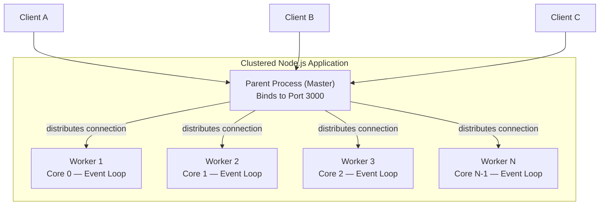

# Process Clustering

#scaling/clustering #nodejs/cluster #concurrency/multi-process

> **Definition**: Process clustering is the technique of running multiple instances (processes) of the same application simultaneously, distributing incoming network connections across them to maximize CPU utilization and overall throughput.

## The Single-Process Bottleneck

Node.js is fundamentally a single-threaded runtime. Its architecture centers on one [[7.2 The Event Loop|event loop]] per process, which handles all I/O operations asynchronously using non-blocking system calls. This design yields excellent I/O throughput for a single thread but creates a hard ceiling: a single Node.js process can only ever use **one CPU core** at a time. On a modern server with 128 cores, this means ~99% of available compute capacity sits idle.

This is not a "flaw" — it is a deliberate architectural trade-off. The single-threaded event loop eliminates the need for locks, mutexes, and other synchronization primitives that make concurrent programming error-prone. However, when your application is CPU-bound (heavy computation, JSON parsing, template rendering, encryption), that single core becomes a bottleneck long before the network or disk does.

## How Clustering Works

Clustering solves the multi-core utilization problem by running **N separate Node.js processes**, each with its own event loop, each bound to a different CPU core. The key insight is that the operating system's process scheduler naturally assigns different processes to different cores.



The parent (master) process binds to the network port and accepts all incoming TCP connections. It then hands each connection off to one of the child (worker) processes. From the client's perspective, they are talking to a single server on a single port. Internally, the work is distributed across all available cores.

## Node.js `cluster` Module

Node.js provides a built-in `cluster` module that implements this pattern:

```javascript
const cluster = require('cluster');
const numCPUs = require('os').cpus().length;

if (cluster.isPrimary) {
  // Master process: fork workers
  for (let i = 0; i < numCPUs; i++) {
    cluster.fork();
  }
  cluster.on('exit', (worker) => {
    console.log(`Worker ${worker.process.pid} died. Restarting...`);
    cluster.fork(); // Auto-restart crashed workers
  });
} else {
  // Worker process: start the server
  const http = require('http');
  http.createServer((req, res) => {
    res.end(`Handled by worker ${process.pid}\n`);
  }).listen(3000);
}
```

The `cluster.fork()` method creates a new child process that is a copy of the parent. Each worker independently calls `.listen(3000)`, but the master intercepts this and handles port sharing transparently.

## Real-World Scaling Results

The theoretical scaling model is simple: **N cores ≈ N× throughput**. In practice, results are always sub-linear due to overhead.

| Configuration | Measured Throughput | Scaling Factor |
|---|---|---|
| 1 instance (Mac Studio) | ~8,000 RPS | 1× (baseline) |
| 12 instances (Mac Studio) | ~42,000 RPS | 5.25× |
| 128 instances (C8i.32xlarge on AWS) | ~6,000,000 RPS | ~750× vs 1-core baseline |

The Mac Studio has 12 CPU cores, so the theoretical maximum would be 12× (96K RPS). The actual 5.25× improvement reveals significant overhead:

1. **Connection distribution overhead**: The parent process must accept and hand off every connection, adding latency.
2. **Shared port contention**: All workers compete for the same listening socket.
3. **Operating system scheduling**: The OS may not perfectly pin each worker to a dedicated core.
4. **Memory bus contention**: All cores share the same memory bus and L3 cache.
5. **Non-linear workload characteristics**: Some operations (e.g., [[9.3 PostgreSQL|database]] queries) introduce external bottlenecks that don't scale with CPU count.

## Common Mistakes

- **Clustering too early**: Don't cluster until profiling shows CPU is the bottleneck. For I/O-bound workloads, a single process may handle tens of thousands of RPS.
- **Forgetting shared state**: Each worker has its own memory space. In-memory caches (like `Map` or `Set`) are not shared between workers. Use [[4.1 Processes and Threads|inter-process communication]] (IPC) or an external store like Redis.
- **Ignoring graceful shutdown**: Workers must handle `SIGTERM` to close database connections and finish in-flight requests before exiting.

## Further Reading

- Node.js cluster module documentation
- [[12.4 Parent-Child Process Architecture]] — deeper look at the master-worker model
- [[12.5 Cluster Mode Scaling]] — determining optimal instance counts
- [[12.2 PM2 Process Manager]] — production-ready clustering without writing cluster code