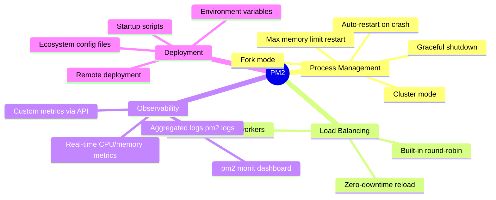

# PM2 Process Manager

#nodejs/pm2 #devops/process-management #scaling/clustering

> **Definition**: PM2 is a production-grade process manager for Node.js applications that provides built-in clustering, automatic restarts, load balancing, centralized logging, and runtime monitoring — all with zero code changes to your application.

## Why PM2 Exists

The [[12.1 Process Clustering|Node.js cluster module]] requires you to write explicit master/worker logic in your application code. You must handle `cluster.isPrimary` checks, implement worker restart logic, manage logging per worker, and wire up monitoring. This is boilerplate that every production Node.js application needs, and getting it wrong means silent failures in production.

PM2 abstracts all of this away. You run your application exactly as you would locally (`node server.js`), and PM2 handles everything else externally — clustering, restarts, log rotation, and monitoring. This separation of concerns means your application code stays clean while PM2 manages the operational lifecycle.

## Core Features



## How PM2 Clusters

PM2 provides two execution modes:

1. **Fork mode** (default): Each instance is an independent process. No port sharing. Useful for running different services or when you need each process on a different port.

2. **Cluster mode**: PM2 internally uses the Node.js `cluster` module. The master process accepts connections and distributes them to workers via round-robin. All workers share the same port. This is the mode used for scaling a single application.

To enable cluster mode, you set `exec_mode: 'cluster'` in your [[12.3 Ecosystem Configuration Files|ecosystem configuration file]] or pass the `-i` flag on the command line:

```bash
pm2 start server.js -i max    # Auto-detect CPU cores, cluster mode
pm2 start server.js -i 12     # Exactly 12 workers, cluster mode
pm2 start ecosystem.config.js # Configuration-driven (recommended)
```

## Key Commands

| Command | Purpose |
|---|---|
| `pm2 start ecosystem.config.js` | Start all apps defined in config |
| `pm2 monit` | Real-time terminal dashboard (CPU, RAM, logs) |
| `pm2 logs` | Stream aggregated logs from all processes |
| `pm2 list` | Show all managed processes and their status |
| `pm2 reload <app>` | Zero-downtime restart (graceful) |
| `pm2 restart <app>` | Hard restart (kills and restarts) |
| `pm2 stop <app>` | Stop without removing from process list |
| `pm2 delete <app>` | Remove from process list entirely |
| `pm2 startup` | Generate system startup script |
| `pm2 save` | Persist current process list |

## Why PM2 Was Used in the Video

The video chose PM2 for several pragmatic reasons:

1. **Zero code changes**: The application code didn't need any cluster-related logic. PM2 handled everything externally.
2. **Easy instance count adjustment**: Changing from 12 to 128 instances meant editing one number in the config file.
3. **Built-in monitoring**: `pm2 monit` provided immediate visibility into whether workers were healthy and distributing load.
4. **Production battle-tested**: PM2 is used by companies like Microsoft, Uber, and PayPal in production.

## PM2 vs Alternatives

| Tool | Type | Strengths | Weaknesses |
|---|---|---|---|
| **PM2** | Process manager | Simple setup, built-in clustering, zero code changes | Single-machine only, limited orchestration |
| **systemd** | Init system | Built into Linux, rock-solid, native service management | No built-in clustering, manual config |
| **Docker** | Containerization | Reproducible environments, easy horizontal scaling | Overhead (~1-2% per container), complexity |
| **Kubernetes** | Orchestration | Auto-scaling, self-healing, service discovery | Massive complexity, overkill for single-app scaling |

## Common Mistakes

- **Using `pm2 restart` instead of `pm2 reload`**: Restart kills all workers simultaneously, causing a brief downtime. Reload does a rolling restart.
- **Not running `pm2 save` and `pm2 startup`**: Without these, PM2 won't restart your processes after a server reboot.
- **Ignoring memory leaks**: PM2 can auto-restart workers that exceed a memory limit (`max_memory_restart`), but you should still fix the leak.

## Further Reading

- [[12.3 Ecosystem Configuration Files]] — PM2's declarative configuration format
- [[12.1 Process Clustering]] — the underlying concept PM2 abstracts
- [[12.5 Cluster Mode Scaling]] — how to determine the right number of instances