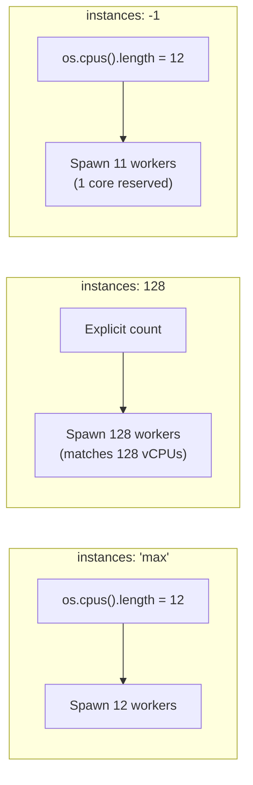

# Ecosystem Configuration Files

#nodejs/pm2 #devops/configuration #scaling/clustering

> **Definition**: `ecosystem.config.js` is PM2's declarative configuration file that defines how applications should be started, how many instances to run, which execution mode to use, and what environment variables to inject — all as code that can be version-controlled and reproduced.

## Why Configuration-as-Code

Running PM2 with CLI flags like `pm2 start server.js -i 128 --env production` works for quick tests but fails at production scale for several reasons:

1. **Reproducibility**: CLI commands are ephemeral. A new team member has no idea what flags were used. A config file is self-documenting.
2. **Version control**: Config files can be committed to Git, reviewed in pull requests, and rolled back.
3. **Multi-app orchestration**: A single `ecosystem.config.js` can define multiple applications with different settings.
4. **Environment management**: Different environments (development, staging, production) can be defined in one file.
5. **Deployment automation**: CI/CD pipelines can simply run `pm2 start ecosystem.config.js --env production`.

## File Structure

```javascript
module.exports = {
  apps: [
    {
      name: "api-server",                    // Process name in PM2
      script: "./src/server.js",              // Entry point
      instances: 128,                         // Number of worker processes
      exec_mode: "cluster",                   // Cluster mode (load balanced)
      max_memory_restart: "1G",              // Restart if memory exceeds 1GB
      env: {
        NODE_ENV: "development",
        PORT: 3000,
        DB_HOST: "localhost",
        DB_PASSWORD: "dev-password"
      },
      env_production: {
        NODE_ENV: "production",
        PORT: 3000,
        DB_HOST: "production-db.example.com",
        DB_PASSWORD: "prod-secure-password"
      },
      log_date_format: "YYYY-MM-DD HH:mm:ss",
      error_file: "./logs/error.log",
      out_file: "./logs/out.log",
      merge_logs: true,
      autorestart: true,
      watch: false,
      max_restarts: 10,
      min_uptime: "10s",
      listen_timeout: 3000,
      kill_timeout: 5000
    }
  ]
};
```

## Key Fields Explained

### `instances`

Controls how many worker processes PM2 spawns. Accepts three types of values:

- **Integer** (e.g., `128`): Spawn exactly that many workers. The video used `128` to match the 128 vCPUs of the [[13.3 Instance Types|C8i.32xlarge]] instance.
- **`'max'`**: Automatically detect the number of CPU cores via `os.cpus().length` and spawn one worker per core. Ideal when you want to "fill up" a single machine.
- **`-1`**: Spawn `total_cores - 1` workers, leaving one core free for the operating system and the PM2 master process.



### `exec_mode`

- **`'cluster'`**: Workers share the same network port. The PM2 master process acts as a [[14.1 What is Load Balancing|load balancer]], distributing incoming connections via round-robin. This is the mode for scaling a single application.
- **`'fork'`**: Each worker is an independent process with its own port. No load balancing. Used when running multiple different services or when you need process isolation.

### Environment Variables

The `env` object defines default environment variables. Additional objects like `env_production`, `env_staging` allow overriding variables per environment. You select the environment at runtime:

```bash
pm2 start ecosystem.config.js --env production
```

PM2 merges the base `env` with `env_production`, where production values take precedence. This is how the video injected different [[9.3 PostgreSQL|database]] connection strings for local development vs. AWS.

## How the Video Used This Configuration

The video's journey with `ecosystem.config.js` followed this pattern:

1. **Local development**: `instances: 'max'` (12 on Mac Studio) → achieved ~42K RPS.
2. **Cloud testing**: `instances: 128` (matching C8i.32xlarge's 128 vCPUs) → achieved ~6M RPS on simple routes.
3. **Database-bound workloads**: Even with 128 instances, the [[9.3 PostgreSQL|PostgreSQL]] connection pool became the bottleneck, demonstrating that clustering only helps when CPU is the limiting factor.

## Common Mistakes

- **Hardcoding secrets in the config file**: Always use environment variable injection or a secrets manager. Never commit passwords to Git.
- **Setting `instances` higher than CPU cores**: Creating 256 workers on a 128-core machine adds context-switching overhead with zero throughput benefit.
- **Forgetting `max_memory_restart`**: Without this, a memory leak will eventually crash your server without any recovery mechanism.
- **Using `watch: true` in production**: File watching adds overhead and can cause unexpected restarts. Only use it in development.

## Further Reading

- [[12.2 PM2 Process Manager]] — the tool that consumes this configuration
- [[12.5 Cluster Mode Scaling]] — how to choose the right `instances` value
- [[13.5 RDS and Aurora]] — how `env_production` pointed to the cloud database