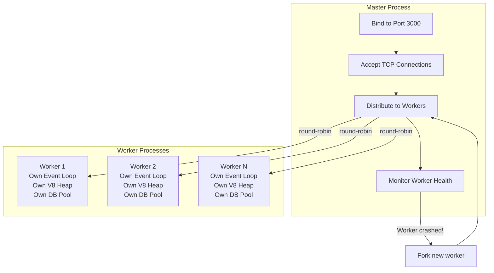

# Parent-Child Process Architecture

#os/processes #nodejs/cluster #architecture/master-worker

> **Definition**: The parent-child process architecture is a design pattern where a master (parent) process manages a pool of worker (child) processes. The parent handles administrative tasks — port binding, connection distribution, worker lifecycle — while workers handle application logic. This pattern is the foundation of [[12.1 Process Clustering|process clustering]] in Node.js.

## The Two Roles

### Parent (Master) Process

The parent process has a minimal but critical responsibility set. It **never** processes application requests. Its jobs are:

1. **Bind to the network port**: The parent calls `server.listen(port)` and holds the socket file descriptor.
2. **Accept incoming connections**: When a new TCP connection arrives, the parent's kernel delivers it to the listening socket.
3. **Distribute connections to workers**: The parent hands the accepted connection (or a notification about it) to a specific child worker.
4. **Monitor worker health**: If a child process exits (crash, OOM, unhandled exception), the parent detects this via the `exit` event.
5. **Respawn failed workers**: The parent forks a new child to replace any that died, maintaining the desired worker count.
6. **Handle graceful shutdown**: On `SIGTERM`, the parent signals all children to finish in-flight requests, waits, then exits.

### Child (Worker) Processes

Each worker is a full copy of the application. It has its own:

- **[[7.2 The Event Loop|Event loop]]**: Independent event-driven execution.
- **Memory space (V8 heap)**: Variables, caches, and state are **not shared** between workers.
- **Module instances**: `require()` calls are resolved independently per worker.
- **Database connection pools**: Each worker creates its own connections to [[9.3 PostgreSQL|PostgreSQL]] or other databases.

Workers do the actual work: parsing HTTP requests, executing business logic, querying databases, and sending responses.



## Connection Distribution Methods

### Round-Robin (Default)

On all platforms except Windows, Node.js uses **round-robin** distribution. The master process maintains a counter and sends each new connection to the next worker in sequence: worker 1, worker 2, ..., worker N, worker 1, worker 2, ...

This is implemented in user-space by the master process, not by the kernel. The master accepts the connection, then sends a message to the chosen worker with the connection's file descriptor using `child.send(handle)`.

### SO_REUSEPORT (Linux Kernel 3.9+)

An alternative approach is to set the `SO_REUSEPORT` socket option, which allows **multiple processes to bind to the same port independently**. The kernel itself distributes incoming connections across the listening processes. This eliminates the master-process bottleneck entirely.

In Node.js, you can enable this with:
```bash
UV_THREADPOOL_SIZE=128 node --experimental-cluster-net-udp server.js
```

Or in newer versions, the cluster module can be configured to use `SCHED_RR` (round-robin scheduling) or `SCHED_NONE` (OS-level distribution).

## Fault Tolerance

One of the most valuable properties of the parent-child architecture is **fault isolation**. If a worker process crashes due to:

- An unhandled exception (`TypeError: Cannot read property of undefined`)
- An out-of-memory error (V8 heap exceeds `--max-old-space-size`)
- A segmentation fault in a native C++ addon

...only that one worker dies. The other workers continue serving requests uninterrupted. The parent detects the crash via the `child.on('exit', ...)` event and forks a replacement. Total downtime is typically under 100 milliseconds.

## Shared State Challenges

Because each worker is a separate [[4.1 Processes and Threads|process]] with its own memory space, **in-memory state is not shared**. This catches many developers off guard:

```javascript
// This counter is LOCAL to each worker!
let requestCount = 0;

app.get('/', (req, res) => {
  requestCount++;
  res.json({ count: requestCount }); // Wrong! Each worker has its own count.
});
```

Solutions for shared state:
- **External store**: Use [[9.3 PostgreSQL|PostgreSQL]], Redis, or Memcached for shared counters, sessions, and caches.
- **Inter-Process Communication (IPC)**: Workers can send messages to the parent via `process.send()`, but this adds latency and complexity.
- **SharedArrayBuffer + Atomics**: Node.js supports shared memory between workers, but requires careful synchronization.

## Common Mistakes

- **Putting application logic in the master**: The master should be as thin as possible. Any CPU work in the master reduces connection-distribution throughput.
- **Not handling worker disconnections gracefully**: If a worker disconnects (not crashes), the master may not detect it without proper `disconnect` event handling.
- **Ignoring the `SIGHUP` signal**: Sending `SIGHUP` to the master should trigger a graceful reload, not a hard restart.

## Further Reading

- [[12.1 Process Clustering]] — the broader concept this architecture enables
- [[4.1 Processes and Threads]] — OS-level process fundamentals
- [[12.5 Cluster Mode Scaling]] — how many workers to spawn
- [[14.1 What is Load Balancing]] — the master acts as a local load balancer