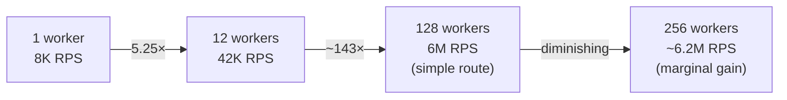

# Cluster Mode Scaling

#scaling/clustering #performance/benchmarks #capacity-planning

> **Definition**: Cluster mode scaling is the practice of determining and configuring the optimal number of worker processes to maximize application throughput on a given machine, understanding the point of diminishing returns where adding more workers provides negligible or negative performance gains.

## The Fundamental Tension

In theory, if one worker handles 8,000 RPS, then 128 workers should handle 1,024,000 RPS (128 × 8K). In practice, scaling is never linear. The relationship between instance count and throughput follows a **logarithmic curve** — rapid initial gains that flatten as overhead dominates.

## Video Results Summary

The video produced benchmark data across three hardware configurations:

### Local Development (Mac Studio, 12 cores)
| Workers | Throughput | Scaling Factor | Notes |
|---|---|---|---|
| 1 | ~8,000 RPS | 1× | Baseline |
| 12 | ~42,000 RPS | 5.25× | Well below 12× theoretical |

### Cloud — Simple Route (AWS C8i.32xlarge, 128 vCPUs)
| Workers | Throughput | Notes |
|---|---|---|
| 128 | ~6,000,000 RPS | CPU is the bottleneck |

### Cloud — Database Route (AWS C8i.32xlarge + db.r5.16xlarge)
| Workers | Throughput | Bottleneck |
|---|---|---|
| 128 | ~100,000–200,000 RPS | [[9.3 PostgreSQL|Database]] connection pool and query execution |

## Why Scaling Is Sub-Linear

Several factors prevent N workers from delivering N× throughput:

### 1. Master Process Overhead
The [[12.4 Parent-Child Process Architecture|parent process]] must accept every connection and distribute it. At millions of RPS, this single-threaded distributor becomes a bottleneck itself. Each connection handoff involves:
- `accept()` system call
- IPC message to the chosen worker
- Worker receives and processes the message

### 2. Context Switching
The operating system must periodically switch between 128+ running processes. Each context switch saves and restores CPU registers, flushes the TLB, and may evict cache lines. At high worker counts, the CPU spends a significant fraction of its time **managing processes** rather than doing useful work.

### 3. Memory Bandwidth Saturation
All 128 workers share the same memory bus and RAM. If each worker is allocating objects, parsing JSON, and building response buffers, the memory bandwidth becomes a shared bottleneck. Adding more workers beyond the memory bandwidth ceiling yields no improvement.

### 4. Lock Contention (Kernel Level)
Even though Node.js applications are single-threaded, the kernel's networking stack has locks — around the socket accept queue, the epoll instance, and the TCP reassembly buffers. With 128 processes all accepting and processing connections simultaneously, kernel lock contention increases.

### 5. Network Stack Saturation
A single machine has a finite network capacity. The [[13.3 Instance Types|C8i.32xlarge]] has 50 Gbps of network bandwidth. At some point, the network interface itself — not CPU — becomes the bottleneck.

## Determining the Optimal Instance Count

The heuristic progression:

1. **Start with `instances: 'max'`** (one per CPU core). This is the right default for most workloads.
2. **Benchmark incrementally**: Try 0.5×, 1×, 1.5×, 2× the core count. Measure throughput at each point.
3. **Look for the knee of the curve**: The point where adding more workers gives <5% improvement is your optimal count.
4. **Consider the workload type**:
   - **CPU-bound** (computation, encryption): More workers help, up to core count.
   - **I/O-bound** (database, API calls): Fewer workers may be optimal — each worker spends most of its time waiting, so CPU isn't the bottleneck.
   - **Memory-bound** (large in-memory caches): Workers compete for memory bandwidth; fewer may be better.

## When to Add Machines vs. More Instances

The decision follows a simple rule:

> **Add instances until the machine's resources (CPU, memory, network) are saturated. Then add machines.**

Signs you need more machines:
- CPU utilization per core is above 80% with the current worker count.
- Memory usage is near the machine's RAM limit.
- Network throughput is near the instance's bandwidth ceiling.
- Disk IOPS are saturated (relevant for [[10.1 IOPS|I/O-heavy]] workloads).

Adding a second machine and putting a [[14.1 What is Load Balancing|load balancer]] in front of both is the first step toward horizontal scaling — the architecture used by every large-scale system.

## Common Mistakes

- **Benchmarking with a single load generator**: A single machine running `wrk` or `hey` may itself become the bottleneck, giving false low numbers. Use distributed load testing (multiple generator machines).
- **Ignoring garbage collection pauses**: With many workers, each worker has a smaller heap, which means more frequent (but shorter) GC pauses. Measure P99 latency, not just throughput.
- **Not pinning CPU cores**: On Linux, you can use `taskset` or cgroups to pin each worker to a specific core, reducing context-switching overhead.

## Further Reading

- [[12.1 Process Clustering]] — the mechanism behind cluster mode
- [[14.1 What is Load Balancing]] — the next step: distributing across machines
- [[13.3 Instance Types]] — choosing the right machine for your workload