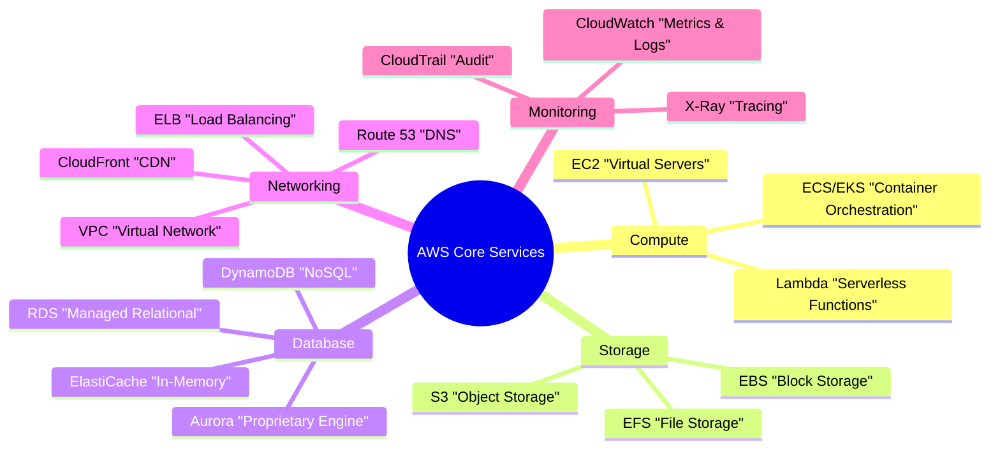
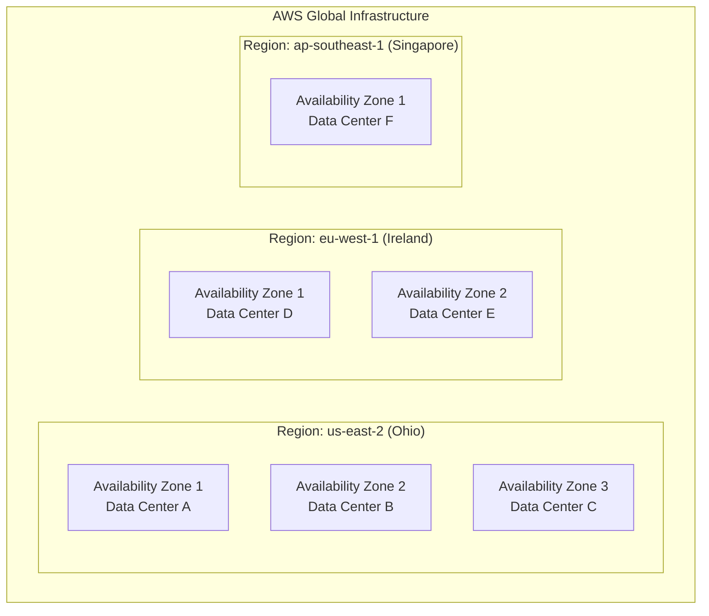

# Amazon Web Services (AWS)

#cloud/aws #cloud/fundamentals #infrastructure/platforms

> **Definition**: Amazon Web Services (AWS) is the world's largest cloud computing platform, offering over 200 fully featured services from data centers globally. It provides on-demand access to compute, storage, networking, databases, machine learning, and countless other infrastructure and application services, all billed on a pay-as-you-go basis.

## Why Cloud Computing Matters for High-Throughput Systems

Achieving [[12.1 Process Clustering|1 million requests per second]] on a laptop is impossible. Your local machine has limited CPU cores, limited RAM, limited network bandwidth, and limited disk IOPS. Cloud computing eliminates these physical constraints by giving you access to data center hardware that would be impractical to purchase and operate yourself.

The video's journey demonstrates this progression:
- **Mac Studio (local)**: 12 CPU cores → ~42K RPS maximum
- **AWS C8i.32xlarge (cloud)**: 128 vCPUs → ~6M RPS on simple routes

That 143× improvement comes not from code optimization but from accessing hardware that no individual would purchase for a single benchmark.

## Core AWS Services

### [[13.2 EC2 (Elastic Compute Cloud)|EC2]] (Elastic Compute Cloud)
Virtual servers with configurable CPU, RAM, storage, and networking. This is where the video ran the Node.js application. EC2 offers 600+ instance types optimized for different workloads — see [[13.3 Instance Types]].

### [[13.5 RDS and Aurora|RDS]] (Relational Database Service)
Managed PostgreSQL, MySQL, MariaDB, Oracle, and SQL Server. AWS handles backups, patching, replication, and failover. The video used a `db.r5.16xlarge` instance running PostgreSQL 15.

### S3 (Simple Storage Service)
Object storage with essentially unlimited capacity. Used for storing images, logs, backups, and static assets. Pricing starts at $0.023/GB/month.

### VPC (Virtual Private Cloud)
Your own isolated virtual network within AWS. You define subnets, route tables, internet gateways, and security rules. Every EC2 instance runs inside a VPC.

### CloudWatch
Monitoring and observability service. Collects metrics, logs, and events. Can trigger alarms (e.g., "CPU > 80% for 5 minutes → send alert").

## AWS Global Infrastructure

AWS operates in **33 geographic regions** worldwide as of 2024, with over 100 Availability Zones.

**Regions** are geographically separated areas (e.g., US East, EU West, Asia Pacific). Each region is completely independent — an outage in one region does not affect others.

**Availability Zones (AZs)** are isolated data centers within a region, connected by low-latency fiber links. Deploying across multiple AZs provides fault tolerance: if one data center has a fire or power failure, your application continues running in another AZ.

## AWS vs Competitors

| Feature | AWS | Google Cloud (GCP) | Microsoft Azure |
|---|---|---|---|
| Market share | ~32% | ~11% | ~23% |
| Services | 200+ | 100+ | 200+ |
| Compute flagship | EC2 | Compute Engine | Virtual Machines |
| Managed DB | RDS/Aurora | Cloud SQL | Azure SQL |
| Strengths | Broadest service catalog, largest ecosystem | Best ML/AI tools, competitive pricing | Enterprise integration, hybrid cloud |
| Weaknesses | Complex pricing, steep learning curve | Smaller market share, fewer regions | Less mature in some service areas |

## The AWS Free Tier

AWS offers a 12-month free tier that includes:
- 750 hours/month of t2.micro or t3.micro EC2 instances (1 vCPU, 1GB RAM)
- 5GB S3 storage
- 750 hours/month of RDS (db.t2.micro)
- 750 hours/month of CloudWatch

This is sufficient for development and small-scale testing but nowhere near sufficient for high-throughput benchmarking. The video's C8i.32xlarge at ~$6/hour costs roughly $4,380/month — well outside the free tier.

## Why the Video Chose AWS

1. **C8i.32xlarge availability**: 128 vCPUs and 50 Gbps networking are only available on cloud hardware.
2. **Pay-per-use**: The video only needed the instances for a few hours of benchmarking. Purchasing equivalent hardware would cost tens of thousands of dollars.
3. **Global reach**: For [[14.2 Geographic Distribution|geographic distribution]] testing, AWS has data centers on every continent.

## Further Reading

- [[13.2 EC2 (Elastic Compute Cloud)]] — the compute service used in the video
- [[13.3 Instance Types]] — choosing the right virtual hardware
- [[13.7 Cloud Cost Estimation]] — understanding AWS pricing