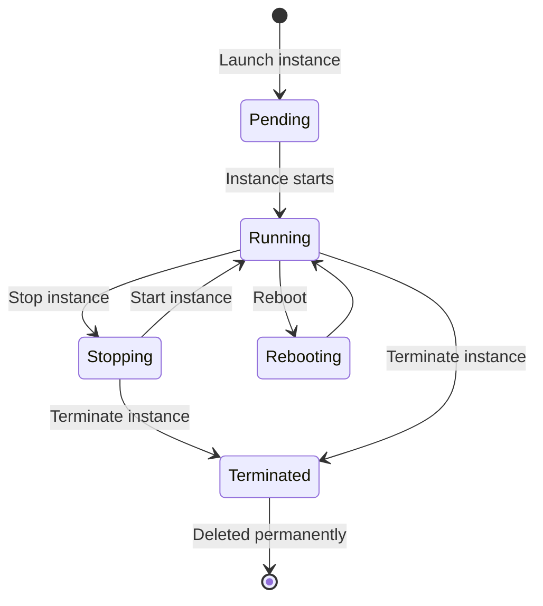

# EC2 (Elastic Compute Cloud)

#cloud/aws/ec2 #cloud/compute #infrastructure/servers

> **Definition**: Amazon EC2 (Elastic Compute Cloud) provides scalable virtual servers — called **instances** — in the AWS cloud. You can launch instances with precisely the CPU, memory, storage, and networking resources your application needs, paying only for what you use.

## Why EC2 Is Central

EC2 is arguably the most important service in AWS because it is the **foundation** upon which almost everything else is built. Your application code runs on EC2. Your [[13.5 RDS and Aurora|database]] queries are served by EC2 (RDS is managed EC2 under the hood). Your [[14.1 What is Load Balancing|load balancers]] and containers ultimately execute on EC2 or EC2-derived infrastructure.

Jeff Bezos famously called EC2 the service that "changed the way people think about compute." Before EC2, provisioning a server meant submitting a purchase order, waiting weeks for hardware delivery, racking it in a data center, and configuring it. With EC2, you can provision a 128-vCPU server in under 60 seconds via an API call.

## Instance Lifecycle



- **Pending**: AWS is provisioning the instance (allocating hardware, copying the [[13.4 AMIs|AMI]] to the host).
- **Running**: The instance is live and billing has started.
- **Stopping**: The instance is shut down (like powering off a physical server). You are **not billed** for compute while stopped, but you **are** billed for attached EBS storage.
- **Terminated**: The instance is permanently deleted. Its EBS volumes may or may not be deleted depending on configuration.

## Key Concepts

### Key Pairs

An SSH key pair provides secure access to your instance. You create a key pair in AWS (or upload your own public key), and AWS injects the public key into the instance's `~/.ssh/authorized_keys` file. You use the private key (`.pem` file) to SSH in:

```bash
ssh -i my-key-pair.pem ec2-user@ec2-54-123-45-67.compute-1.amazonaws.com
```

**Critical security note**: The private key is only downloadable **once** when you create the key pair. Lose it, and you cannot access your instance.

### [[13.6 Security Groups|Security Groups]]

A security group is a virtual firewall that controls inbound (ingress) and outbound (egress) traffic to your instance. Every instance must have at least one security group. Rules are stateful: if you allow inbound TCP on port 3000, the response traffic is automatically allowed outbound.

### AMIs (Amazon Machine Images)

An AMI is a template that defines the instance's operating system, pre-installed software, and configuration. See [[13.4 AMIs]] for details.

### EBS (Elastic Block Store)

EBS volumes are network-attached block storage devices that you mount to instances. They persist independently of the instance lifecycle — if you terminate an instance, its EBS volumes can survive (depending on the `DeleteOnTermination` flag). Performance is measured in [[10.1 IOPS|IOPS]] and throughput (MB/s).

## Instance Storage Options

| Storage Type | Persistent? | Performance | Use Case |
|---|---|---|---|
| **EBS (gp3)** | Yes (survives stop/terminate) | Up to 16,000 IOPS | Application data, databases, OS |
| **EBS (io2)** | Yes | Up to 256,000 IOPS | Mission-critical databases |
| **Instance Store** | No (lost on stop/terminate) | Very high, local SSD | Temporary data, caches, scratch space |

## Connecting the Pieces

The video's EC2 setup involved:

1. **Launch instance** from a custom [[13.4 AMIs|AMI]] (pre-installed Node.js, PM2)
2. **Attach EBS volume** (gp3, for the application code and logs)
3. **Configure security group** (all ports open — see [[13.6 Security Groups]] for why this is bad)
4. **SSH in** using the key pair
5. **Clone application code** from GitHub
6. **Start PM2** with `pm2 start ecosystem.config.js --env production`

## 600+ Instance Types

EC2 offers over 600 instance types, each optimized for different workloads. The C8i.32xlarge used in the video (128 vCPUs, 256GB RAM, 50Gbps network) is just one of hundreds. See [[13.3 Instance Types]] for the full breakdown.

## Common Mistakes

- **Not setting `DeleteOnTermination: false`** on EBS volumes: Terminating an instance deletes its root volume by default. Always set this to `false` for any volume containing important data.
- **Leaving instances running**: The most common AWS cost mistake. An idle C8i.32xlarge costs ~$6/hour = ~$4,380/month. Set up auto-stop schedules.
- **Using a single AZ**: Deploy instances across multiple AZs for fault tolerance. A single AZ outage can take down your entire application.
- **Hardcoding instance IPs**: EC2 instance IPs change on stop/start. Always use DNS names, Elastic IPs, or load balancers.

## Further Reading

- [[13.3 Instance Types]] — choosing the right instance for your workload
- [[13.4 AMIs]] — creating reusable instance templates
- [[13.6 Security Groups]] — securing your instances
- [[13.7 Cloud Cost Estimation]] — understanding EC2 pricing