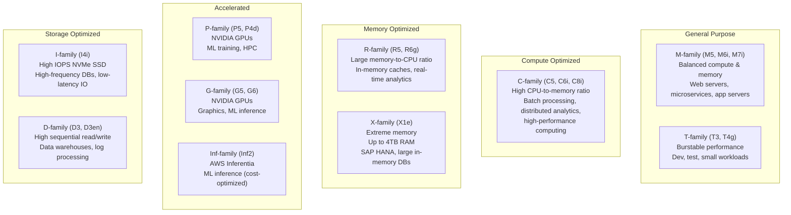

# Instance Types

#cloud/aws/ec2 #cloud/compute #performance/hardware

> **Definition**: EC2 instance types are categories of virtual servers, each with specific combinations of CPU, memory, storage, and networking capacity. AWS offers 600+ instance types organized into families, each optimized for different workload profiles.

## Naming Convention

Every instance type follows the format: **Family + Generation + Capabilities + Size**

```
C  8  i  .  32xlarge
│  │  │     │
│  │  │     └── Size: 32xlarge (128 vCPUs, 256GB RAM for C-family)
│  │  └── Capabilities: i = Intel, g = AMD, a = AWS Graviton (ARM)
│  └── Generation: 8th generation
└── Family: C = Compute-optimized
```

## Instance Family Hierarchy



## The C-Family: Compute-Optimized

The video chose the **C8i.32xlarge** — a compute-optimized instance from the 8th generation Intel family. This is the right choice for a high-RPS benchmark because:

- **128 vCPUs**: More parallel [[12.1 Process Clustering|worker processes]] = more concurrent request handling.
- **256 GB RAM**: Enough to run 128 Node.js workers, each with its own V8 heap.
- **50 Gbps network**: At 6M RPS with ~200-byte responses, that's ~12 Gbps of outbound traffic — well within the 50 Gbps ceiling.
- **Intel Xeon Scalable (Sapphire Rapids)**: 4th Gen Xeon with AVX-512, which accelerates some operations.

Key C-family sizes:

| Instance | vCPUs | RAM | Network | Price/hr (On-Demand) |
|---|---|---|---|---|
| c8i.large | 2 | 4 GB | Up to 12.5 Gbps | $0.17 |
| c8i.xlarge | 4 | 8 GB | Up to 12.5 Gbps | $0.34 |
| c8i.4xlarge | 16 | 32 GB | Up to 12.5 Gbps | $1.36 |
| c8i.8xlarge | 32 | 64 GB | Up to 12.5 Gbps | $2.72 |
| **c8i.32xlarge** | **128** | **256 GB** | **50 Gbps** | **~$6.00** |

## The R-Family: Memory-Optimized

Used for the [[13.5 RDS and Aurora|database]] instance in the video (db.r5.16xlarge). These have more memory per vCPU:

| Instance | vCPUs | RAM | Network | Use Case |
|---|---|---|---|---|
| r5.large | 2 | 16 GB | Up to 10 Gbps | Small DBs |
| r5.4xlarge | 16 | 128 GB | Up to 10 Gbps | Medium DBs |
| **r5.16xlarge** | **64** | **512 GB** | **25 Gbps** | **Large production DBs** |

## The T-Family: Burstable Performance

T-family instances provide a **baseline CPU performance** with the ability to **burst** above it using CPU credits. Think of it like a bank account: credits accumulate when CPU usage is below baseline and are spent when it bursts above.

- **t3.micro**: 2 vCPUs (baseline 10%), 1 GB RAM — free tier eligible
- **t3.small**: 2 vCPUs (baseline 20%), 2 GB RAM
- **t3.large**: 2 vCPUs (baseline 30%), 8 GB RAM

Once credits are exhausted, the instance is throttled to baseline performance. This makes T-instances unsuitable for consistent high-throughput workloads but perfect for dev/test environments.

## Network Performance Tiers

Network bandwidth scales with instance size and is one of the most critical factors for high-RPS workloads:

- **"Up to 10 Gbps"**: Small to medium instances. Sufficient for ~500K–1M RPS with small responses.
- **"12.5 Gbps"**: Medium-large instances (C8i.xlarge to c8i.8xlarge).
- **"25 Gbps"**: Large instances (R5.16xlarge, M6i.32xlarge).
- **"50 Gbps"**: Extra-large instances (C8i.32xlarge, C7i.48xlarge).
- **"100 Gbps"**: Metal and cluster instances.
- **"300 Gbps"**: HPC and specific networking-optimized instances (P5.48xlarge).

## vCPUs vs Physical Cores

A **vCPU** is not necessarily a physical CPU core. On most EC2 instances:
- 1 vCPU = 1 hyperthread (half a physical core) on Intel instances
- 1 vCPU = 1 physical core on AWS Graviton (ARM) instances

So the C8i.32xlarge with 128 vCPUs has **64 physical Intel cores**, each with 2 hyperthreads. This is why the video used 128 [[12.3 Ecosystem Configuration Files|PM2 worker instances]] — matching the vCPU count, not the physical core count. Whether matching vCPUs or physical cores is better depends on the workload; for I/O-bound workloads, matching vCPUs often works well because hyperthreads can handle I/O waits efficiently.

## Common Mistakes

- **Choosing a general-purpose instance for CPU-bound workloads**: An M6i.32xlarge costs the same as a C8i.32xlarge but has less compute power. Match the instance family to your workload.
- **Ignoring network bandwidth**: A 128-vCPU instance with only 10 Gbps networking will be network-bound, not CPU-bound.
- **Over-provisioning "just in case"**: A C8i.32xlarge costs ~$4,380/month. Start with smaller instances and scale up based on actual measurements.

## Further Reading

- [[13.2 EC2 (Elastic Compute Cloud)]] — the service that provides instances
- [[13.4 AMIs]] — how to template instances with your software
- [[12.5 Cluster Mode Scaling]] — how instance specs affect optimal worker count