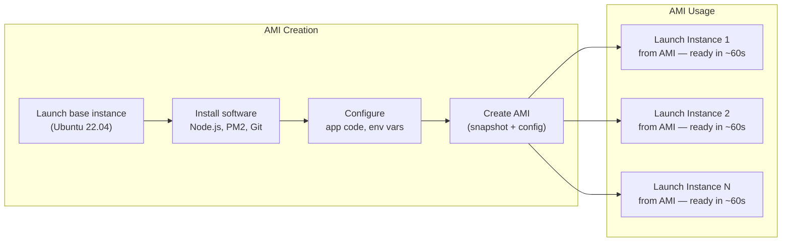

# AMIs (Amazon Machine Images)

#cloud/aws/ec2 #infrastructure/images #devops/automation

> **Definition**: An Amazon Machine Image (AMI) is a template that contains the software configuration (operating system, application server, and applications) required to launch an EC2 instance. Think of it as a "snapshot" of a perfectly configured server that you can replicate infinitely.

## The Problem AMIs Solve

Without AMIs, every time you launch a new EC2 instance you would need to:

1. Wait for the OS to boot
2. SSH into the instance
3. Run `apt update && apt upgrade`
4. Install Node.js: `curl -fsSL https://deb.nodesource.com/setup_20.x | sudo -E bash - && sudo apt install -y nodejs`
5. Install PM2 globally: `npm install -g pm2`
6. Clone your application repository: `git clone https://github.com/you/app.git`
7. Install dependencies: `cd app && npm install`
8. Configure environment variables
9. Set up log directories
10. Start the application with PM2

This process takes 20–30 minutes. If you need 10 instances, that's 5 hours of manual work. If one instance dies and needs replacement, you repeat the entire process under time pressure.

## How AMIs Work

An AMI is a **blueprint** for creating instances. When you launch an instance from an AMI, AWS:

1. Provisions a new virtual machine on a physical host
2. Creates an EBS volume from the AMI's root volume snapshot
3. Attaches the volume to the virtual machine
4. Boots the machine with the AMI's configuration

The result is an exact replica of the machine you originally created the AMI from — same OS, same installed packages, same files, same configurations.

## AMI Components

An AMI consists of three parts:

1. **Root volume snapshot**: An EBS snapshot of the instance's root filesystem. This contains the OS, installed software, and all files.
2. **Instance configuration**: The instance type family, default kernel, RAM disk, and block device mapping (what volumes to attach and where).
3. **Permissions**: Who can use the AMI (just your account, specific AWS accounts, or everyone).

## The Video's AMI Workflow

The video followed this exact pattern:

1. **Launched a base instance** from the official Ubuntu 22.04 AMI
2. **Installed dependencies**: Node.js 20, PM2, Git, and various build tools
3. **Cloned the application** from GitHub and ran `npm install`
4. **Verified everything worked** by starting PM2 and running a quick test
5. **Created a custom AMI** from the running instance (right-click → "Create Image")
6. **Launched new instances** from this custom AMI, each ready in ~60 seconds

The AMI creation process takes 5–15 minutes (AWS copies the root volume to a snapshot), but this is a one-time cost. After that, every new instance is ready almost instantly.

## Public vs Private vs Marketplace AMIs

| Type | Visibility | Examples |
|---|---|---|
| **Public** | Available to all AWS accounts | Official Ubuntu, Amazon Linux, Windows Server AMIs |
| **Private** | Available only to your AWS account | Custom AMIs created from your instances |
| **Marketplace** | Commercial products from software vendors | Pre-configured LAMP stacks, ERP software, ML environments |

## AMI Best Practices

1. **Use Packer or EC2 Image Builder**: Creating AMIs manually (as the video did) is fine for one-off benchmarks. For production, use HashiCorp Packer or AWS's own EC2 Image Builder to create AMIs as part of your CI/CD pipeline.

2. **Minimize AMI size**: Larger AMIs take longer to copy when launching instances. Remove build caches, temporary files, and unnecessary packages before creating the AMI.

3. **Version your AMIs**: Include a version number or timestamp in the AMI name (e.g., `app-server-v2.3-2024-01-15`). This makes rollbacks possible.

4. **Don't bake secrets into AMIs**: Environment variables with passwords should NOT be in the AMI. Use [[12.3 Ecosystem Configuration Files|PM2 environment variables]] or AWS Secrets Manager at instance launch time.

5. **Keep AMIs updated**: Security vulnerabilities are discovered regularly. Rebuild AMIs monthly with the latest OS patches.

## Common Mistakes

- **Baking application code into the AMI**: This couples your infrastructure image to a specific version of your code. Better to have the AMI contain only the runtime (Node.js, PM2), and pull code from Git at startup.
- **Not cleaning up old AMIs**: Each AMI's snapshot costs money in EBS storage. Delete AMIs you're no longer using.
- **Creating AMIs from running production instances**: The running instance's state (temporary files, in-flight requests) gets captured. Stop the instance first to ensure a clean snapshot.

## Further Reading

- [[13.2 EC2 (Elastic Compute Cloud)]] — the service that uses AMIs to launch instances
- [[12.2 PM2 Process Manager]] — what gets installed on the AMI in the video
- [[12.3 Ecosystem Configuration Files]] — configuration that sits on top of the AMI