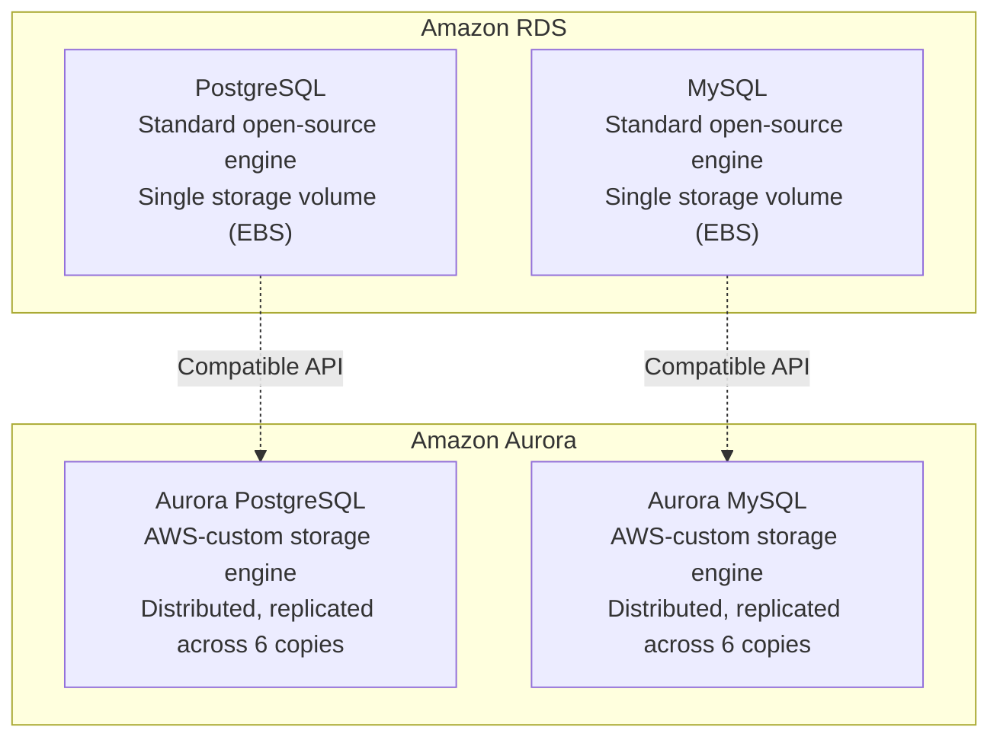

# RDS and Aurora

#cloud/aws/rds #cloud/databases #databases/postgresql

> **Definition**: Amazon RDS (Relational Database Service) is a managed database service that handles the operational complexity of running relational databases — provisioning, patching, backups, replication, and failover — so you can focus on your application. Amazon Aurora is AWS's proprietary database engine built on top of RDS, offering enhanced performance and availability.

## Why Managed Databases

Running [[9.3 PostgreSQL|PostgreSQL]] on a raw EC2 instance means you are responsible for:

- **Backups**: Configuring `pg_dump` cron jobs, testing restore procedures, managing retention.
- **Patching**: Applying security updates to PostgreSQL, the OS, and system libraries.
- **High availability**: Setting up streaming replication, configuring automatic failover with tools like Patroni.
- **Monitoring**: Setting up Prometheus exporters, Grafana dashboards, alerting on replication lag.
- **Storage management**: Pre-allocating disk space, monitoring disk usage, extending volumes.
- **Parameter tuning**: Adjusting `shared_buffers`, `work_mem`, `effective_cache_size`, `max_connections`.

RDS eliminates all of this. AWS handles backups (with point-in-time recovery to any second in the past 35 days), automated patching (with configurable maintenance windows), and Multi-AZ replication.

## RDS vs Aurora

### Aurora's Architecture

Aurora replaces the traditional monolithic storage volume with a **distributed, log-structured storage system** that replicates data across 6 copies in 3 Availability Zones. Key differences:

| Feature | RDS (PostgreSQL) | Aurora PostgreSQL |
|---|---|---|
| Storage | Single EBS volume (up to 64TB) | Distributed across 6 copies (up to 128TB) |
| Max IOPS | 80,000 (io2) | Can exceed 100,000 with higher write throughput |
| Failover | 60–120 seconds | Under 30 seconds (often <10s) |
| Replication | 1 async replica (Multi-AZ) | Up to 15 read replicas with sub-10ms lag |
| Backups | Full + incremental | Continuous backup (no performance impact) |
| Cost | Lower baseline | ~20% premium over RDS |

## The Video's Database Setup

The video used **RDS PostgreSQL 15** on a **db.r5.16xlarge** instance with the following configuration:

| Setting | Value | Rationale |
|---|---|---|
| Instance class | db.r5.16xlarge | 64 vCPUs, 512 GB RAM — matches the application tier's scale |
| Engine | PostgreSQL 15 | The application's chosen database |
| Storage type | gp3 (General Purpose SSD) | Cost-effective SSD storage |
| Storage size | 500 GB | Enough for test data |
| Provisioned IOPS | 3,000 | See [[10.1 IOPS]] for why this number |
| Deployment | Single AZ | For benchmarking; production would use Multi-AZ |

## Connection Pooling at Scale

A critical challenge in the video's architecture: **128 application workers, each needing database connections**.

If each worker creates 10 connections (a typical pool size), that's 1,280 connections to PostgreSQL. But PostgreSQL's `max_connections` defaults to 100, and each connection consumes ~10 MB of RAM (for work_mem and other buffers). 1,280 connections × 10 MB = 12.8 GB just for connection overhead.

Solutions:
1. **PgBouncer**: A connection pooler that sits between the application and PostgreSQL. 1,280 app connections → PgBouncer → 100 actual PostgreSQL connections. PgBouncer multiplexes connections efficiently.
2. **Smaller per-worker pools**: Configure each PM2 worker's pool to 5–10 connections.
3. **RDS Proxy**: AWS's managed connection pooler (similar to PgBouncer but fully managed).

## Storage: gp3 and IOPS

RDS storage uses [[10.1 IOPS|EBS volumes]], specifically gp3 (General Purpose SSD v3). Key specs:

- **Baseline performance**: 3,000 IOPS and 125 MB/s throughput included in the base price.
- **Additional IOPS**: Can be provisioned up to 16,000 IOPS at $0.065 per provisioned IOPS-month.
- **Burst capability**: Can burst to higher IOPS for short periods using an I/O credit system (similar to T-instance CPU credits).

The video configured 3,000 IOPS because the benchmark workload was primarily read-heavy with simple queries. For write-heavy workloads, you'd need significantly more IOPS.

## Common Mistakes

- **Using Single-AZ in production**: A single AZ outage takes down your database and your entire application. Always use Multi-AZ for production workloads.
- **Not enabling automated backups**: Without backups, a database corruption or accidental `DROP TABLE` is permanent and catastrophic.
- **Under-provisioning IOPS**: A db.r5.16xlarge can drive 10,000+ IOPS, but if your gp3 volume is limited to 3,000 IOPS, the storage — not the CPU — is your bottleneck. Always match storage IOPS to the instance's capability.
- **Ignoring connection limits**: More workers = more connections. Plan for connection pooling from the start.

## Further Reading

- [[9.3 PostgreSQL]] — the database engine underlying RDS PostgreSQL
- [[10.1 IOPS]] — understanding storage performance
- [[12.5 Cluster Mode Scaling]] — how 128 workers interact with the database