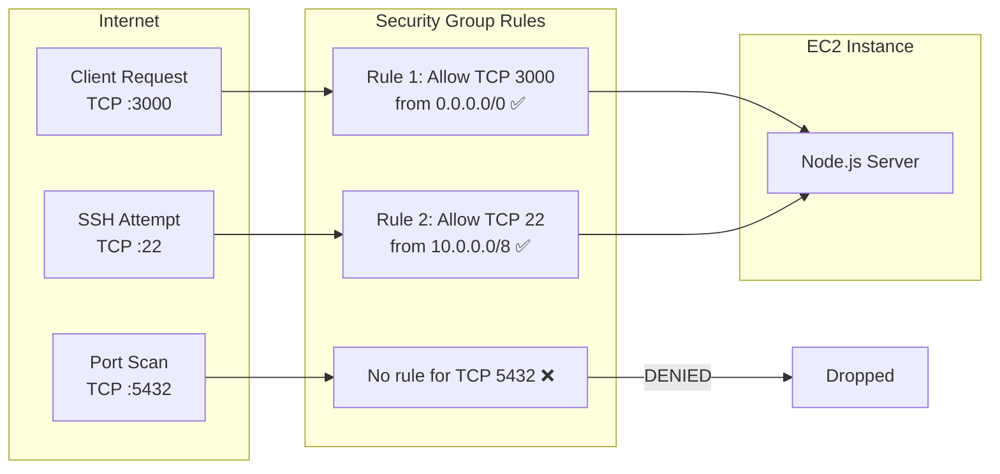

# Security Groups

#cloud/aws/networking #security/firewalls #cloud/ec2

> **Definition**: A security group is a virtual firewall that controls inbound (ingress) and outbound (egress) network traffic to and from an Amazon EC2 instance. Every instance must be associated with at least one security group, and security groups are **stateful** — responses to allowed inbound traffic are automatically allowed outbound.

## How Security Groups Work

Security groups operate at the **instance level** (technically, at the Elastic Network Interface level). They evaluate traffic rules whenever a packet attempts to enter or leave the instance.



## Rule Structure

Each rule has four components:

| Component | Description | Example |
|---|---|---|
| **Type** | Traffic category | HTTP, HTTPS, SSH, Custom TCP |
| **Protocol** | Network protocol | TCP, UDP, ICMP, All traffic |
| **Port range** | Source or destination port | 22, 3000, 443, 0-65535 |
| **Source (inbound) / Destination (outbound)** | Who can send / receive | IP address (54.123.45.67/32), CIDR block (10.0.0.0/8), security group ID (sg-0abc123) |

## Stateful Behavior

Security groups are **stateful**, meaning:
- If you allow inbound TCP on port 3000 from any IP (`0.0.0.0/0`), the **response** traffic on the ephemeral port is **automatically allowed outbound**, even if you don't have an explicit outbound rule for it.
- This is different from NACLs (Network Access Control Lists), which are stateless — see below.

## The Video's "Allow All" Configuration

The video configured a security group that allowed **all inbound traffic on all ports** from any source (`0.0.0.0/0`). This was done for testing convenience but is **catastrophically bad for production**:

```json
// What the video did (BAD for production):
{
  "InboundRules": [
    { "PortRange": "0-65535", "Protocol": "ALL", "Source": "0.0.0.0/0" }
  ]
}
```

What this exposes:
- **Port 22 (SSH)**: Anyone on the internet can attempt to brute-force your SSH password.
- **Port 5432 (PostgreSQL)**: Your database is directly accessible from the internet.
- **Port 27017 (MongoDB)**: If running, MongoDB would be exposed.
- **All other ports**: Any service listening on any port is publicly accessible.

### What the video should have done:

```json
// Production-recommended:
{
  "InboundRules": [
    { "Port": 22, "Protocol": "TCP", "Source": "10.0.0.0/8", "Description": "SSH from VPC only" },
    { "Port": 3000, "Protocol": "TCP", "Source": "sg-0loadbalancer", "Description": "App traffic from ALB only" }
  ],
  "OutboundRules": [
    { "Port": "0-65535", "Protocol": "ALL", "Destination": "0.0.0.0/0", "Description": "Allow all outbound" }
  ]
}
```

Key principles:
1. **Only the [[14.1 What is Load Balancing|load balancer]]** should send traffic to port 3000, not the internet directly.
2. **SSH should only be accessible** from your VPN or bastion host's IP, not from `0.0.0.0/0`.
3. **The database security group** should only accept connections from the application instance's security group, never from the internet.

## Security Groups vs NACLs

| Feature | Security Groups | NACLs |
|---|---|---|
| **Scope** | Instance (ENI) level | Subnet level |
| **Statefulness** | Stateful (responses auto-allowed) | Stateless (must allow both directions) |
| **Allow/Deny** | Allow rules only (everything not allowed is denied) | Both allow AND deny rules |
| **Rule evaluation** | All rules evaluated together | Rules evaluated in order (lowest number first) |
| **Best for** | Controlling what reaches your application | Subnet-level firewall, defense in depth |

In production, you use **both**: NACLs as a subnet-level safety net, and security groups for fine-grained instance-level control.

## Common Mistakes

- **Opening port 22 to 0.0.0.0/0**: This is the #1 cause of EC2 compromises. Automated bots scan the entire IPv4 space for open SSH ports and attempt brute-force attacks. Always restrict to your IP or VPN CIDR.
- **Confusing security groups with NACLs**: They serve different purposes and behave differently (stateful vs stateless). Understand both.
- **Not using security group references**: Instead of IP addresses, reference another security group as the source. This way, if the source instance's IP changes, the rule still works.
- **Too many rules**: Each rule is evaluated on every packet. Hundreds of rules add measurable latency at high throughput. Keep rules focused and minimal.

## Further Reading

- [[13.2 EC2 (Elastic Compute Cloud)]] — security groups are attached to EC2 instances
- [[13.1 Amazon Web Services (AWS)]] — VPC networking fundamentals
- [[14.1 What is Load Balancing]] — security groups should reference the load balancer's SG