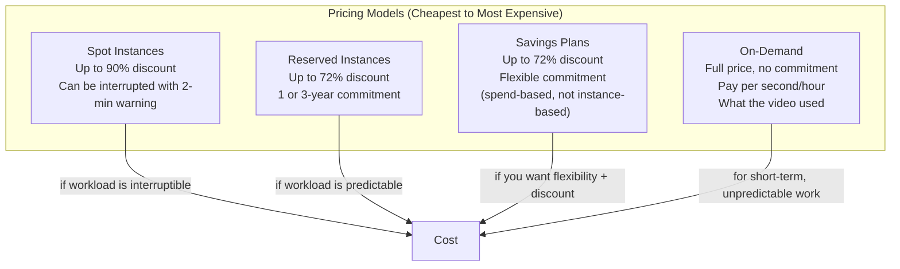

# Cloud Cost Estimation

#cloud/costs #cloud/aws #financial/planning

> **Definition**: Cloud cost estimation is the practice of predicting and managing the expenses associated with running workloads on cloud infrastructure. AWS charges per resource per unit of time, and without careful estimation and monitoring, costs can escalate rapidly — especially with high-performance instances.

## The Video's Cost Breakdown

The benchmarking infrastructure in the video consisted of:

| Resource | Instance Type | Hourly Cost | Monthly Cost (730 hrs) |
|---|---|---|---|
| Application Server 1 | C8i.32xlarge (128 vCPU, 256GB) | ~$6.00 | ~$4,380 |
| Application Server 2 | C8i.32xlarge (128 vCPU, 256GB) | ~$6.00 | ~$4,380 |
| Database Server | db.r5.16xlarge (64 vCPU, 512GB) | ~$12.00 | ~$8,760 |
| EBS Storage (3× 500GB gp3) | — | ~$0.38 total | ~$277 |
| Data Transfer | ~10TB/month @ $0.09/GB | — | ~$900 |
| **Total** | | **~$24.38/hr** | **~$17,697/mo** |

This is roughly **$20,000/month** for a 3-instance setup — comparable to a senior engineer's salary. This is why understanding cloud pricing is not optional but essential.

## AWS Pricing Models

### On-Demand Pricing

Pay exactly for what you use, with no upfront commitment. The video used this model because:
- The benchmark was a one-time experiment (a few hours)
- No predictable long-term usage pattern
- No commitment was justifiable

For short-term workloads, On-Demand is the correct choice. For production workloads running 24/7, it is the most expensive option.

### Reserved Instances (RIs)

Commit to using a specific instance type for 1 or 3 years in exchange for a significant discount:

| Commitment | Discount | Payment Options |
|---|---|---|
| 1 year | ~40% | All upfront, partial upfront, or no upfront |
| 3 years | ~60-72% | All upfront, partial upfront, or no upfront |

If the video's workload were permanent (running 24/7), a 3-year Reserved Instance on a C8i.32xlarge (~$6/hr on-demand) would cost roughly **$1.70/hr** — saving over $4/hour per instance, or **~$70,000 over 3 years** for two application servers.

The trade-off: if your requirements change (you need a different instance type, or you need fewer instances), you're still committed to paying for the reserved capacity (though RIs can be sold on the Reserved Instance Marketplace).

### Spot Instances

Spot Instances use AWS's unused EC2 capacity at up to 90% discount. The catch: AWS can terminate your Spot Instance with only 2 minutes' notice when the capacity is needed by an On-Demand customer.

For workloads that are:
- **Interruptible**: Batch processing, CI/CD builds, distributed computing
- **Fault-tolerant**: Can recover from sudden termination
- **Flexible in timing**: Can wait for capacity to become available

Spot Instances are the most cost-effective option. For a web server handling live traffic, Spot is risky — unless you architect for it (e.g., run a mix of On-Demand and Spot, or use ECS/EKS with Spot capacity providers).

### Savings Plans

A more flexible alternative to Reserved Instances. Instead of committing to a specific instance type, you commit to a **dollar amount of spend per hour** ($10/hr, $100/hr, etc.). As long as your actual usage falls under that commitment, you get the discount — regardless of which instance types, regions, or even services (EC2, Fargate, Lambda) you use.

## Data Transfer Costs (The Hidden Expense)

Data transfer is one of the most commonly overlooked costs. AWS charges for:

- **Data IN to AWS**: Free (in most cases)
- **Data OUT to the internet**: $0.09/GB (first 10TB/month in us-east-1)
- **Data BETWEEN AZs** (same region): $0.01/GB in each direction
- **Data BETWEEN regions**: $0.02–$0.12/GB depending on regions

At 6 million RPS with ~200-byte responses:
- 6,000,000 × 200 bytes = 1.2 GB/second = 4,320 GB/hour
- If all traffic goes to the internet: 4,320 × $0.09 = **$389/hour in data transfer alone**

This is why [[14.2 Geographic Distribution|geographic distribution]] and [[14.3 CDNs|CDNs]] matter — they reduce cross-region data transfer costs by serving users from the nearest edge.

## Cost Monitoring and Alerts

AWS provides several tools:
- **AWS Cost Explorer**: Visualize spending trends over time, forecast future costs, filter by service/region/tag.
- **AWS Budgets**: Set spending alerts (e.g., "alert me when monthly spend exceeds $1,000").
- **AWS Cost Anomaly Detection**: ML-powered detection of unusual spending patterns.

As the video noted: **"one simple mistake and you lost 50 bucks."** Forgetting to stop a C8i.32xlarge over a weekend costs $6 × 48 = $288. Forgetting for a month costs ~$4,380.

## Common Mistakes

- **Not setting up billing alerts**: You should receive an email when daily spend exceeds $10, $100, or whatever threshold is meaningful for you.
- **Leaving resources running**: The single biggest cost mistake. Use auto-stop schedules for non-production instances.
- **Over-provisioning "temporarily"**: A "temporary" large instance that runs for 3 months costs thousands. Always set a calendar reminder or use AWS Instance Scheduler.
- **Ignoring data transfer costs**: The compute cost is often a fraction of the total. Always model network costs.

## Further Reading

- [[13.3 Instance Types]] — pricing varies dramatically by instance type
- [[14.2 Geographic Distribution]] — how geographic distribution affects costs
- [[13.2 EC2 (Elastic Compute Cloud)]] — the primary cost driver in the video