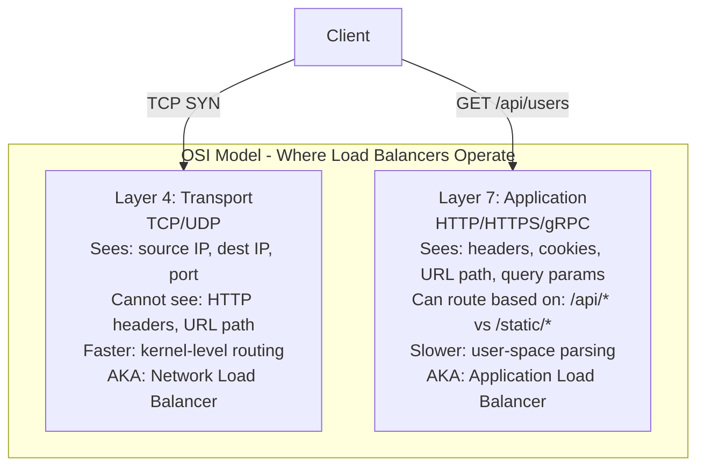

# What is Load Balancing

#networking/load-balancing #architecture/patterns #scaling/horizontal

> **Definition**: A load balancer is a network device or software service that distributes incoming network traffic across multiple backend servers. It acts as a single point of contact for clients while ensuring no single server is overwhelmed, providing both high availability and increased throughput.

## The Fundamental Problem

No single server can handle infinite traffic. Even the most powerful [[13.3 Instance Types|C8i.32xlarge]] with 128 vCPUs has a finite ceiling — the video measured ~6M RPS on simple routes, but real-world applications with database queries, authentication, and business logic will hit much lower limits.

When one server can't handle the load, you have two options:

1. **Vertical scaling (scale up)**: Get a bigger server. Eventually, you run out of bigger servers to buy.
2. **Horizontal scaling (scale out)**: Add more servers and distribute traffic across them. This is where load balancing comes in.

Load balancing is the **enabling technology** for horizontal scaling. Without it, you'd have to tell users to connect to `server1.example.com` or `server2.example.com` manually.

## Layer 4 vs Layer 7 Load Balancing

Load balancers operate at different layers of the OSI model, which determines what information they can use to make routing decisions.

### Layer 4 (Transport Layer)

Makes routing decisions based on IP addresses, ports, and protocol. It does **not** inspect the content of the request (no HTTP header parsing). The load balancer establishes a TCP connection to a backend server and forwards raw bytes bidirectionally.

- **Speed**: Extremely fast — decisions are made in the kernel's network stack.
- **Use case**: When you need maximum throughput and don't need content-based routing.
- **AWS service**: Network Load Balancer (NLB) — can handle millions of connections per second.

### Layer 7 (Application Layer)

Terminates the TCP connection, parses the HTTP request, and makes routing decisions based on URL path, headers, cookies, query parameters, and even request body content.

- **Speed**: Slower than L4 because of HTTP parsing overhead.
- **Use case**: When you need content-based routing (e.g., `/api/*` to API servers, `/images/*` to object storage).
- **AWS service**: Application Load Balancer (ALB).

## Distribution Algorithms

| Algorithm | How It Works | Best For |
|---|---|---|
| **Round-Robin** | Sequential: server 1, 2, 3, 1, 2, 3... | Servers with equal capacity |
| **Weighted Round-Robin** | Like round-robin but server 2 gets 2× the requests if it has 2× the capacity | Heterogeneous servers |
| **Least Connections** | Sends to the server with the fewest active connections | Variable request duration |
| **IP Hash** | Hash the client IP → always sends to same server | Session affinity needed |
| **Least Latency** | Measures response time, sends to fastest server | Real-time applications |

## Health Checks

A load balancer continuously monitors the health of backend servers:

1. **Periodic probing**: Every N seconds, the load balancer sends a health check request (e.g., `GET /health`) to each backend.
2. **Healthy/Unhealthy thresholds**: A server is marked unhealthy after N consecutive failures, and healthy after M consecutive successes.
3. **Traffic redirection**: Unhealthy servers are removed from the rotation. New connections are only sent to healthy servers.
4. **Connection draining**: When a server is being removed (e.g., for deployment), the load balancer stops sending new connections but allows existing ones to complete (graceful shutdown).

This is how [[12.2 PM2 Process Manager|PM2's cluster mode]] achieves fault tolerance — if a worker crashes, the [[12.4 Parent-Child Process Architecture|parent process]] effectively acts as a health-check-aware load balancer, routing around the dead worker.

## PM2 as a Local Load Balancer

PM2's cluster mode is, in essence, a **local load balancer**. The [[12.4 Parent-Child Process Architecture|parent process]] accepts connections on the shared port and distributes them to workers via round-robin. This is functionally equivalent to a Layer 4 load balancer, but:

- It only works **within a single machine**.
- It doesn't have health check configuration (workers that hang are not detected until they time out).
- It can't do Layer 7 routing.

For multi-machine setups, you need a real load balancer (ALB/NLB, Nginx, HAProxy, Envoy) in front of multiple PM2-managed machines.

## Common Mistakes

- **Not using a load balancer in production**: Directly exposing individual application servers to the internet means no health checking, no graceful removal, and no traffic distribution.
- **Using sticky sessions (IP hash) without necessity**: Session affinity limits your ability to add/remove servers dynamically. Use external session stores (Redis, database) instead.
- **Ignoring connection limits**: A load balancer itself has limits. AWS ALB supports up to 100,000 connections per target and 10,000 RPS per rule. Plan for this.

## Further Reading

- [[12.4 Parent-Child Process Architecture]] — PM2's internal load balancing
- [[14.2 Geographic Distribution]] — load balancing across geographic regions
- [[14.4 DNS-Based Routing]] — DNS as the first layer of load balancing
- [[12.5 Cluster Mode Scaling]] — when to add more machines (and need a real load balancer)